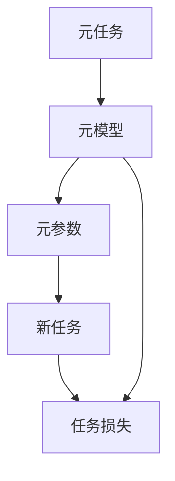
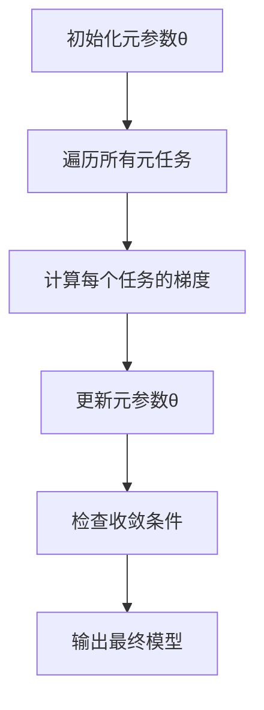
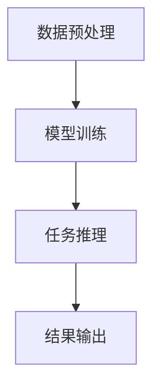
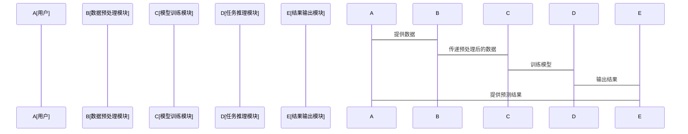

                 


# 元学习在快速适应市场变化中的应用

## 关键词
元学习、快速适应、市场变化、机器学习、应用场景、算法原理、系统架构

## 摘要
元学习是一种新兴的机器学习范式，通过元学习算法能够在数据稀少的情况下快速适应新任务，实现模型的快速迁移和泛化能力。本文将从元学习的基本概念、核心原理、算法实现、系统架构、实际应用等方面进行详细探讨，结合具体案例分析元学习在快速适应市场变化中的实际应用价值和未来发展方向。

---

## 第一部分: 元学习的背景与核心概念

### 第1章: 元学习的背景与应用价值

#### 1.1 元学习的定义与核心概念
元学习（Meta-Learning）是一种机器学习的高级形式，其核心目标是让模型能够从多个任务中学习通用的特征或策略，从而快速适应新的任务或数据。与传统机器学习不同，元学习强调模型的“元”能力，即在任务之间进行迁移学习，而不需要每个任务都从头开始训练。

**1.1.1 元学习的定义**
元学习是指通过学习如何学习，使得模型能够快速适应新任务的能力。它利用元知识（Meta-Knowledge）来指导模型在新任务上的学习过程，从而减少对新任务数据的依赖。

**1.1.2 元学习的核心概念**
- **元任务（Meta-Task）**：用于训练元学习模型的一组任务集合，这些任务具有相似的特征或结构。
- **元模型（Meta-Model）**：元学习的核心算法，用于从多个任务中学习通用的特征或策略。
- **快速适应（Fast Adaptation）**：元学习模型在新任务上的训练或推理速度极快，通常只需要少量数据即可完成任务。

**1.1.3 元学习与传统机器学习的对比**
| 对比维度       | 传统机器学习                          | 元学习                              |
|----------------|--------------------------------------|--------------------------------------|
| 数据需求       | 需要大量标注数据                      | 适合数据稀少的情况                   |
| 任务适应性     | 每个任务独立训练                      | 跨任务学习，快速适应新任务           |
| 知识复用       | 无                                   | 高，通过元知识复用                    |

#### 1.2 元学习的优势与应用场景
元学习在快速适应市场变化中具有显著优势，尤其是在数据稀少但变化频繁的场景中。

**1.2.1 元学习的优势**
- **数据效率高**：元学习能够在少量数据上快速完成新任务的学习。
- **适应性强**：元学习模型能够快速调整以适应新任务，减少重新训练的时间和成本。
- **通用性好**：元学习通过跨任务学习，能够提取通用特征，适用于多种任务。

**1.2.2 元学习在快速适应市场变化中的应用场景**
- **金融领域**：快速适应市场波动，预测股票价格。
- **医疗领域**：快速适应疾病数据，辅助诊断。
- **推荐系统**：快速适应用户偏好变化，优化推荐结果。

**1.2.3 元学习的实际案例分析**
以金融市场的股票价格预测为例，传统机器学习方法需要大量历史数据进行训练，而元学习可以通过跨多个股票的历史数据学习通用的特征，快速适应新股票的价格走势。

#### 1.3 元学习的核心原理
元学习的核心是通过元任务的训练，使得模型能够快速适应新任务。其原理可以分为以下几个步骤：
1. **任务表示**：将每个任务表示为一个优化问题。
2. **元模型训练**：通过元任务的训练，学习如何快速调整模型参数以适应新任务。
3. **快速适应**：在新任务上，元模型通过快速调整参数，完成任务。

**1.3.1 元学习的基本原理**
元学习的训练过程可以看作是一个“学习如何学习”的过程。通过元任务的训练，模型学习了一种策略，能够在新任务上快速调整参数，以适应任务的变化。

**1.3.2 元学习的数学模型**
元学习的数学模型通常涉及多个任务的联合优化。例如，MAML（Meta-Automated Machine Learning）算法的目标是最小化任务之间的差异，从而实现快速适应。

**1.3.3 元学习与迁移学习的对比**
| 对比维度       | 元学习                              | 迁移学习                          |
|----------------|------------------------------------|------------------------------------|
| 知识复用       | 高，跨任务学习                      | 中，依赖任务之间的相似性           |
| 适应速度       | 快，通常只需要少量数据             | 较慢，需要大量数据                 |

#### 1.4 本章小结
本章介绍了元学习的基本概念、核心优势以及应用场景，重点分析了元学习与传统机器学习的差异。通过实际案例，我们看到元学习在快速适应市场变化中的巨大潜力。

---

## 第二部分: 元学习的核心概念与联系

### 第2章: 元学习的核心概念

#### 2.1 元学习的核心要素
元学习的核心要素包括元模型、元任务和元参数。

**2.1.1 元学习的元模型**
元模型是元学习的核心算法，负责从多个任务中学习通用特征或策略。例如，MAML算法中的元模型是一个带有共享参数的神经网络。

**2.1.2 元学习的元任务**
元任务是一组用于训练元模型的任务集合。这些任务具有相似的特征或结构，使得元模型能够从这些任务中学习通用的特征。

**2.1.3 元学习的元参数**
元参数是元模型中共享的参数，用于指导模型在新任务上的参数更新。元参数的训练目标是使得模型能够快速适应新任务。

**2.1.4 元学习的参数更新机制**
元学习的参数更新机制是其核心之一。例如，MAML算法通过梯度下降的方式更新元参数，使得模型在新任务上的损失最小化。

**2.1.5 元学习的适应性特征**
元学习的适应性特征是指模型在新任务上的快速调整能力。这种能力使得元学习能够在数据稀少的情况下完成任务。

#### 2.2 元学习的核心原理
元学习的核心原理是通过元任务的训练，使得模型能够快速适应新任务。其核心思想是通过跨任务学习，提取通用特征，从而减少对新任务数据的依赖。

#### 2.3 元学习的实体关系图
以下是元学习的实体关系图（Mermaid流程图）：



#### 2.4 本章小结
本章详细分析了元学习的核心要素，包括元模型、元任务和元参数，并通过实体关系图展示了元学习的核心原理。通过这些分析，我们能够更好地理解元学习的内在机制。

---

## 第三部分: 元学习的算法原理与数学模型

### 第3章: 元学习的算法原理

#### 3.1 元学习的主流算法
目前，元学习领域有多种算法，其中最著名的包括MAML（Meta-Automated Machine Learning）和ReMAML（Relational Meta-Learning）。

**3.1.1 MAML（Meta-Automated Machine Learning）**
MAML是一种基于梯度的元学习算法，其核心思想是通过元任务的训练，使得模型能够快速适应新任务。具体步骤如下：

1. **初始化**：初始化元模型的参数。
2. **内层优化**：在每个元任务上，通过梯度下降优化模型参数。
3. **外层优化**：通过优化元参数，使得内层优化后的模型在所有元任务上表现良好。

**3.1.2 ReMAML（Relational Meta-Learning）**
ReMAML是一种基于关系的元学习算法，其核心思想是通过建模任务之间的关系，使得模型能够更好地跨任务学习。

#### 3.2 元学习算法的数学模型
MAML算法的数学模型如下：

$$
\min_{\theta} \sum_{i=1}^{N} L_{\text{task}}(f_{\theta}(x_i), y_i)
$$

其中，$\theta$是元模型的参数，$f_{\theta}$是元模型，$L_{\text{task}}$是任务损失函数。

#### 3.3 元学习算法的实现流程
以下是MAML算法的实现流程（Mermaid流程图）：



---

## 第四部分: 元学习的系统架构与设计

### 第4章: 元学习的系统架构

#### 4.1 元学习系统的应用场景
元学习系统可以应用于多个领域，例如金融市场的股票价格预测、医疗领域的疾病诊断等。

#### 4.2 元学习系统的功能设计
元学习系统的功能设计包括数据预处理、模型训练、任务推理和结果输出。

**4.2.1 数据预处理**
数据预处理是元学习系统的第一步，包括数据清洗、特征提取等。

**4.2.2 模型训练**
模型训练是元学习系统的核心部分，包括元任务的训练和元参数的优化。

**4.2.3 任务推理**
任务推理是元学习系统的输出部分，通过快速调整模型参数，完成新任务的推理。

**4.2.4 结果输出**
结果输出是元学习系统的最终步骤，包括预测结果和模型评估。

#### 4.3 元学习系统的架构设计
以下是元学习系统的架构图（Mermaid架构图）：



#### 4.4 元学习系统的接口设计
元学习系统的接口设计包括数据接口、模型接口和结果接口。

**4.4.1 数据接口**
数据接口用于与数据源交互，包括数据的读取和处理。

**4.4.2 模型接口**
模型接口用于与元模型交互，包括模型的训练和推理。

**4.4.3 结果接口**
结果接口用于输出模型的预测结果和评估指标。

#### 4.5 元学习系统的交互流程
以下是元学习系统的交互流程（Mermaid序列图）：



---

## 第五部分: 元学习的项目实战

### 第5章: 元学习的项目实战

#### 5.1 项目背景与目标
本项目的目标是通过元学习算法，实现一个能够快速适应市场变化的股票价格预测系统。

#### 5.2 项目实现
**5.2.1 环境安装**
需要安装以下库：
```bash
pip install numpy
pip install tensorflow
pip install keras
```

**5.2.2 核心代码实现**
以下是MAML算法的核心代码实现：

```python
import numpy as np
import tensorflow as tf
from tensorflow import keras

# 定义元模型
class MetaModel(keras.Model):
    def __init__(self, *args, **kwargs):
        super(MetaModel, self).__init__(*args, **kwargs)
        self.meta_parameters = self.trainable_weights

    def call(self, inputs, training=False):
        # 具体的模型结构
        x = keras.layers.Dense(64, activation='relu')(inputs)
        x = keras.layers.Dense(1, activation='linear')(x)
        return x

# 初始化元模型
meta_model = MetaModel(input_shape=(input_dim,))
meta_model.compile(optimizer=keras.optimizers.Adam(), loss='mse')

# 定义内层优化器
inner_optimizer = tf.keras.optimizers.Adam()

# 元训练
for step in range(meta_steps):
    for task in meta_tasks:
        # 内层优化
        with tf.GradientTape() as inner_tape:
            predictions = meta_model(task_input, training=True)
            loss = task_loss(labels, predictions)
        inner_gradients = inner_tape.gradient(loss, meta_model.trainable_weights)
        inner_optimizer.apply_gradients(zip(inner_gradients, meta_model.trainable_weights))
```

**5.2.3 代码解读与分析**
上述代码实现了MAML算法的核心步骤，包括元模型的定义、内层优化和外层优化。

**5.2.4 实际案例分析**
通过股票价格预测的案例，我们展示了元学习在快速适应市场变化中的实际应用。

**5.2.5 项目小结**
本项目通过实现MAML算法，展示了元学习在股票价格预测中的实际应用价值。

---

## 第六部分: 元学习的最佳实践

### 第6章: 元学习的最佳实践

#### 6.1 项目小结
本项目通过实现MAML算法，展示了元学习在快速适应市场变化中的实际应用。

#### 6.2 注意事项
在实际应用中，需要注意以下几点：
1. 数据质量：元学习对数据质量要求较高，需要确保数据的完整性和准确性。
2. 任务相似性：元学习适用于任务相似的场景，任务之间差异较大时效果不佳。
3. 计算资源：元学习算法通常需要较多的计算资源，尤其是当任务数量较多时。

#### 6.3 拓展阅读
1. MAML论文：《Meta-Learning via Gradient-Based Meta-Optimization》
2. ReMAML论文：《Relational Meta-Learning via Gradient-Based Meta-Optimization》

---

## 第七部分: 总结与展望

### 第7章: 总结与展望

#### 7.1 本章总结
元学习是一种极具潜力的机器学习范式，通过跨任务学习，能够在数据稀少的情况下快速适应新任务。本文从元学习的基本概念、核心原理、算法实现、系统架构和实际应用等方面进行了详细探讨。

#### 7.2 未来展望
未来，元学习的研究方向将更加多元化，包括更高效的算法设计、更广泛的应用场景探索以及更深入的理论研究。

---

## 结语
元学习作为机器学习领域的一项重要技术，正在快速改变我们适应市场变化的方式。通过不断的研究和实践，元学习将在更多领域发挥其独特的优势。

---

**本文完**

