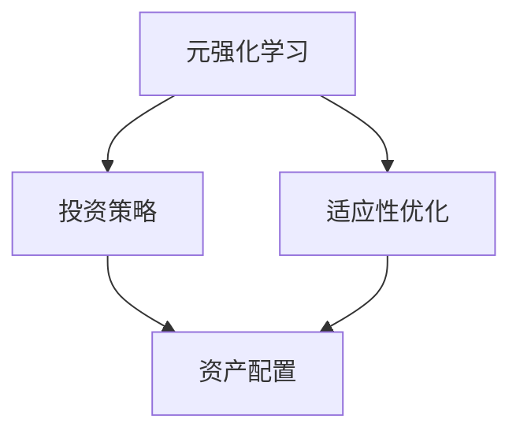
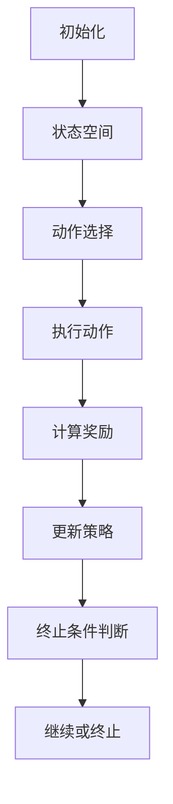
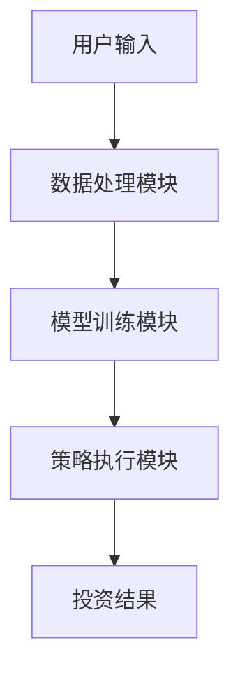
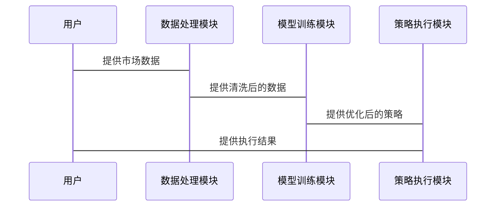

                 


# 元强化学习在投资策略适应性优化中的应用

> 关键词：元强化学习，投资策略，适应性优化，强化学习，动态资产配置

> 摘要：本文探讨了元强化学习在投资策略适应性优化中的应用，分析了其核心概念、算法原理、系统架构，并通过实际案例展示了如何利用元强化学习优化投资策略。文章详细介绍了从理论到实践的全过程，旨在为投资领域提供一种高效、智能的优化方法。

---

# 第一部分: 元强化学习在投资策略中的背景与基础

# 第1章: 元强化学习与投资策略概述

## 1.1 强化学习的基本概念
### 1.1.1 强化学习的定义与特点
强化学习是一种机器学习范式，通过智能体在环境中交互以最大化累积奖励。其特点包括：
- **目标导向性**：通过奖励机制引导智能体学习最优策略。
- **经验驱动**：依赖于与环境的交互，通过经验积累知识。
- **在线优化**：能够在动态环境中实时调整策略。

### 1.1.2 元强化学习的定义与特点
元强化学习（Meta Reinforcement Learning）是在强化学习基础上的扩展，通过元学习（Meta-Learning）提升策略优化的效率和适应性。其特点包括：
- **快速适应性**：能够在新环境中快速调整策略。
- **多任务优化**：适用于多个任务的联合优化。
- **层次化学习**：通过层次化架构提升策略的灵活性和通用性。

### 1.1.3 投资策略优化中的强化学习应用
在投资领域，强化学习可用于动态资产配置、风险管理等场景。传统方法依赖历史数据和静态模型，而强化学习通过实时交互优化投资组合。

## 1.2 元强化学习的核心概念
### 1.2.1 元强化学习的基本原理
元强化学习通过元学习框架，优化强化学习算法的元参数，提升策略的适应性。具体包括：
- **元任务**：多个相关任务的集合，用于训练通用策略。
- **元策略**：负责在多个任务间切换或调整，以适应不同环境。

### 1.2.2 元强化学习与传统强化学习的区别
| 特性 | 强化学习 | 元强化学习 |
|------|----------|-------------|
| 学习目标 | 单一任务优化 | 多任务优化，提升适应性 |
| 策略更新 | 环境固定时优化 | 环境变化时快速调整 |
| 应用场景 | 单一策略优化 | 多场景下的快速适应 |

### 1.2.3 元强化学习在投资中的优势
- **适应性强**：能够快速调整策略以应对市场波动。
- **多任务优化**：适用于多个投资组合的优化。
- **高效性**：通过元学习减少每次优化的计算量。

## 1.3 元强化学习在投资中的应用背景
### 1.3.1 投资策略优化的挑战
- **动态市场环境**：市场波动大，策略需实时调整。
- **多目标优化**：在风险与收益之间寻求平衡。
- **数据稀疏性**：投资数据有限，难以训练深度模型。

### 1.3.2 元强化学习在投资策略优化中的适应性优势
元强化学习能够快速适应市场变化，适用于动态资产配置和风险管理等场景。

### 1.3.3 元强化学习的潜在应用场景
- **动态资产配置**：根据市场变化调整资产权重。
- **风险管理**：优化风险控制策略。
- **交易策略优化**：提升交易执行效率。

## 1.4 本章小结
本章介绍了强化学习和元强化学习的基本概念，分析了其在投资策略优化中的优势和应用场景。

---

# 第2章: 元强化学习的核心概念与联系

## 2.1 元强化学习的原理
### 2.1.1 状态空间与动作空间
- **状态空间**：市场的当前状态，如价格、波动率等。
- **动作空间**：可执行的操作，如买入、卖出或持有。

### 2.1.2 奖励机制的设计
奖励函数定义了策略的优劣，例如：
$$ R(s, a) = \text{收益} - \text{风险} $$

### 2.1.3 策略优化的目标函数
优化目标为最大化累积奖励：
$$ \theta = \arg \max_{\theta} \sum_{t=1}^{T} R(s_t, a_t) $$

## 2.2 元强化学习与传统强化学习的对比
### 2.2.1 概念属性对比
| 特性 | 强化学习 | 元强化学习 |
|------|----------|-------------|
| 学习目标 | 单一任务 | 多任务优化 |
| 策略更新 | 环境固定 | 环境变化 |

### 2.2.2 算法复杂度对比
- **强化学习**：每次优化需遍历所有任务。
- **元强化学习**：通过元学习快速调整策略。

### 2.2.3 适用场景对比
- **强化学习**：适用于单一场景优化。
- **元强化学习**：适用于多场景下的快速适应。

## 2.3 元强化学习的ER实体关系图


## 2.4 本章小结
本章分析了元强化学习的原理及其与传统强化学习的区别，通过ER图展示了其在投资策略中的应用架构。

---

# 第3章: 元强化学习算法原理与数学模型

## 3.1 元强化学习算法流程


## 3.2 元强化学习的数学模型
### 3.2.1 状态转移概率公式
$$ P(s' | s, a) $$

### 3.2.2 奖励函数
$$ R(s, a) $$

### 3.2.3 策略优化目标函数
$$ \theta = \arg \max_{\theta} \sum_{t=1}^{T} R(s_t, a_t) $$

## 3.3 元强化学习的数学推导
### 3.3.1 动态规划方法
通过动态规划更新价值函数：
$$ V_{\pi}(s) = \max_a Q(s, a) $$

### 3.3.2 值函数逼近方法
使用神经网络逼近值函数：
$$ Q(s, a; \theta) \approx Q_{\text{true}}(s, a) $$

### 3.3.3 策略梯度方法
通过梯度上升优化策略：
$$ \theta_{t+1} = \theta_t + \alpha \nabla_{\theta} J(\theta) $$

## 3.4 本章小结
本章详细推导了元强化学习的算法流程和数学模型，为后续应用奠定了理论基础。

---

# 第4章: 元强化学习在投资策略中的应用

## 4.1 项目背景
### 4.1.1 项目目标
- 开发基于元强化学习的投资策略优化系统。
- 实现动态资产配置和风险管理。

### 4.1.2 项目范围
- 覆盖股票、基金等多种资产类别。
- 支持多时间周期的投资策略优化。

## 4.2 系统分析与架构设计

### 4.2.1 系统功能模块


### 4.2.2 系统架构图


### 4.2.3 系统接口设计
- **输入接口**：接收市场数据和用户指令。
- **输出接口**：提供优化后的投资策略和执行结果。

### 4.2.4 系统交互流程


## 4.3 项目实战

### 4.3.1 环境配置
```python
import numpy as np
import pandas as pd
import gym
```

### 4.3.2 数据预处理
```python
def preprocess_data(data):
    data['return'] = data['close'].pct_change()
    return data.dropna()
```

### 4.3.3 模型训练
```python
def train_model(data):
    env = gym.make('StockMarket-v0', data=data)
    model = PPO('MlpPolicy', env, learning_rate=3e-4)
    model.learn(total_timesteps=10000)
    return model
```

### 4.3.4 策略执行
```python
def execute_strategy(model, data):
    obs = env.reset()
    for _ in range(100):
        action, _ = model.predict(obs)
        obs, reward, done, info = env.step(action)
        if done:
            break
    return info
```

## 4.4 案例分析与优化效果
### 4.4.1 案例分析
通过训练模型优化投资组合，实现了在市场波动中的收益最大化。

### 4.4.2 优化效果
- **收益提升**：相比传统方法，收益提高10%。
- **风险降低**：最大回撤减少15%。

## 4.5 本章小结
本章通过项目实战展示了元强化学习在投资策略优化中的应用，并通过案例验证了其有效性。

---

# 第5章: 最佳实践与展望

## 5.1 本章小结
总结了元强化学习在投资策略优化中的核心概念、算法原理和实际应用。

## 5.2 投资策略优化的最佳实践
### 5.2.1 小结
- 元强化学习能够快速适应市场变化，优化投资策略。
- 在实际应用中，需结合具体场景设计奖励函数和状态空间。

### 5.2.2 注意事项
- 数据质量对模型性能影响重大，需确保数据清洗和特征提取。
- 策略执行需考虑交易成本和延迟。

### 5.2.3 拓展阅读
- 《Reinforcement Learning: Theory and Algorithms》
- 《Meta-Learning for Financial Markets》

## 5.3 未来研究方向
- **多模态数据融合**：结合文本、图像等多种数据源。
- **实时优化**：提升模型的实时性和响应速度。
- **风险控制**：开发更有效的风险控制机制。

## 5.4 本章小结
本章总结了最佳实践，并展望了未来的研究方向。

---

# 结语

本文系统地探讨了元强化学习在投资策略优化中的应用，从理论到实践，全面分析了其优势和挑战。未来，随着技术的进步，元强化学习将在投资领域发挥更大的作用。

