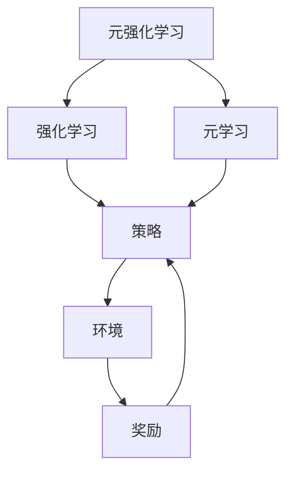
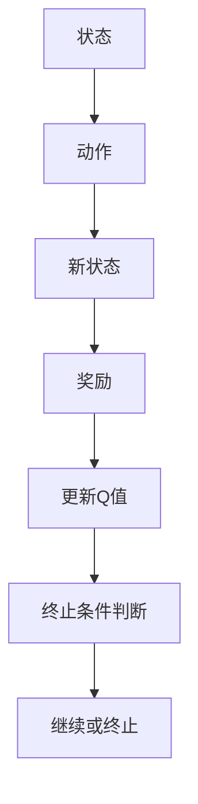
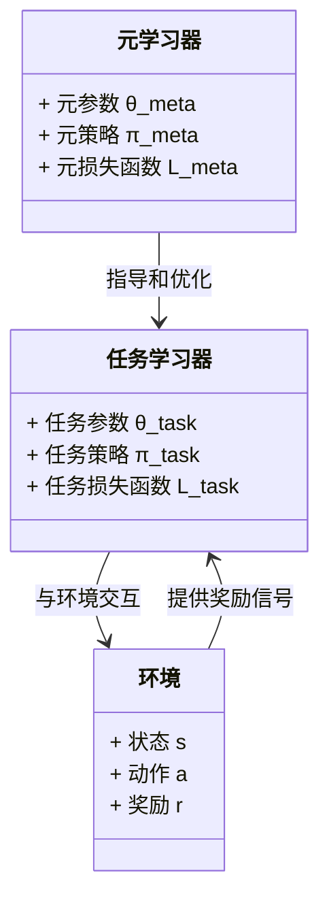
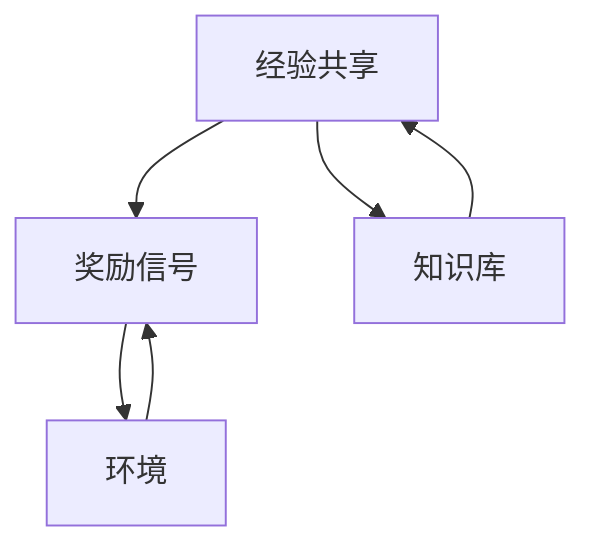
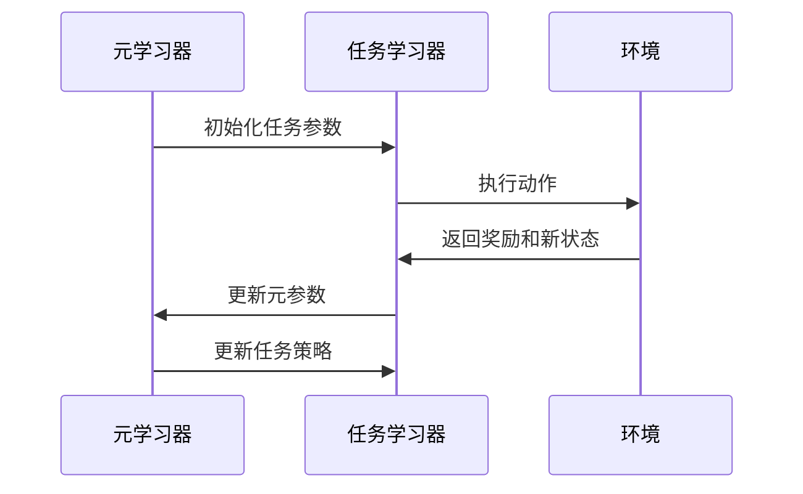

                 


# 元强化学习：优化AI Agent的学习策略

**关键词**：元强化学习，AI Agent，强化学习，元学习，算法优化

**摘要**：元强化学习是一种新兴的人工智能技术，它通过优化AI Agent的学习策略，显著提升了智能体在复杂环境中的适应性和表现。本文将深入探讨元强化学习的核心概念、算法原理、系统架构以及实际应用，为读者提供全面而深入的见解。

---

## 目录

1. [元强化学习概述](#元强化学习概述)
2. [元强化学习的核心概念与联系](#元强化学习的核心概念与联系)
3. [元强化学习的算法原理](#元强化学习的算法原理)
4. [元强化学习的数学模型](#元强化学习的数学模型)
5. [元强化学习的系统架构](#元强化学习的系统架构)
6. [元强化学习的项目实战](#元强化学习的项目实战)
7. [最佳实践与小结](#最佳实践与小结)

---

## 1. 元强化学习概述

### 1.1 元强化学习的定义与背景

#### 1.1.1 强化学习的基本概念
强化学习（Reinforcement Learning, RL）是一种机器学习范式，其中智能体通过与环境交互来学习策略，以最大化累积奖励。智能体通过试错方式，逐步优化其行为，以适应复杂动态的环境。

#### 1.1.2 元强化学习的定义
元强化学习（Meta-Reinforcement Learning, Meta-RL）是一种高级的强化学习形式，它在元层面上优化学习过程，使得智能体能够快速适应新任务或环境的变化。元强化学习不仅关注单个任务的优化，还关注如何在多个任务之间转移学习，提升整体的学习效率和适应性。

#### 1.1.3 元强化学习的发展历程
元强化学习的概念起源于对通用人工智能（AGI）的追求，旨在使AI系统具备更强的自适应能力和跨任务学习能力。近年来，随着深度学习和强化学习的快速发展，元强化学习逐渐成为研究热点，并在自动驾驶、机器人控制、游戏AI等领域展现出巨大潜力。

### 1.2 元强化学习的核心概念

#### 1.2.1 元强化学习的基本原理
元强化学习通过构建元学习框架，使智能体能够从经验中快速学习新任务。它结合了强化学习的试错机制和元学习的知识迁移能力，使得智能体能够在新环境中快速调整策略，提高学习效率。

#### 1.2.2 元强化学习与传统强化学习的区别
| 方面         | 元强化学习                          | 传统强化学习                          |
|--------------|------------------------------------|---------------------------------------|
| 学习目标     | 优化跨任务的学习策略                | 单任务的最优策略                      |
| 知识转移     | 强调跨任务的知识共享和迁移          | 专注于单任务的优化                    |
| 环境适应性   | 更强的环境适应性和泛化能力          | 较弱的环境适应性                      |
| 应用场景     | 多任务学习、动态环境                 | 单任务优化                            |

#### 1.2.3 元强化学习的应用场景
元强化学习在多个领域展现出广泛的应用潜力，例如：
- **自动驾驶**：快速适应不同道路条件和驾驶情境。
- **机器人控制**：在复杂环境中快速调整动作策略。
- **游戏AI**：在多变的游戏环境中快速优化策略。
- **智能推荐系统**：根据用户行为动态调整推荐策略。

### 1.3 元强化学习的框架与方法

#### 1.3.1 元强化学习的框架结构
元强化学习的框架通常包括以下几个部分：
- **元学习器（Meta-Learner）**：负责学习跨任务的策略和优化参数。
- **任务学习器（Task-Learner）**：针对具体任务进行策略优化。
- **环境交互模块**：负责与环境交互，获取奖励信号。
- **知识共享机制**：实现跨任务的知识迁移和共享。

#### 1.3.2 元强化学习的主要方法
- **基于梯度的元学习**：通过优化元损失函数，更新元参数，以提升任务学习器的性能。
- **基于参数的元学习**：通过共享参数的方式，使得不同任务之间的学习可以互相促进。
- **基于策略的元学习**：通过优化策略网络，使得智能体能够在不同任务之间快速切换。

#### 1.3.3 元强化学习的优缺点
| 方面         | 优点                               | 缺点                               |
|--------------|------------------------------------|---------------------------------------|
| 灵活性       | 能够快速适应新任务                 | 对算法和计算资源要求较高             |
| 泛化能力     | 具有较强的环境适应性和泛化能力     | 学习过程可能较为复杂                 |
| 应用范围     | 适用于多任务和动态环境             | 需要更多的训练数据和计算资源         |

---

## 2. 元强化学习的核心概念与联系

### 2.1 元强化学习的核心原理

#### 2.1.1 元强化学习的元学习机制
元学习机制通过构建元学习器，使得智能体能够在不同任务之间共享知识和经验。元学习器通过优化元损失函数，更新元参数，从而指导任务学习器快速收敛到最优策略。

#### 2.1.2 元强化学习的策略优化
策略优化是元强化学习的核心，通过不断调整策略参数，使得智能体在不同任务中都能获得较高的累积奖励。元强化学习通过优化策略网络的元参数，使得智能体能够在多个任务之间快速切换和适应。

#### 2.1.3 元强化学习的适应性学习
适应性学习是元强化学习的重要特征，通过动态调整策略参数，使得智能体能够快速适应新环境和新任务的变化。元强化学习通过构建适应性机制，使得智能体在复杂动态环境中表现出更强的适应性和灵活性。

### 2.2 元强化学习的核心概念对比

#### 2.2.1 元强化学习与传统强化学习的对比
| 方面         | 元强化学习                          | 传统强化学习                          |
|--------------|------------------------------------|---------------------------------------|
| 学习目标     | 优化跨任务的学习策略                | 单任务的最优策略                      |
| 知识转移     | 强调跨任务的知识共享和迁移          | 专注于单任务的优化                    |
| 环境适应性   | 更强的环境适应性和泛化能力          | 较弱的环境适应性                      |
| 应用场景     | 多任务学习、动态环境                 | 单任务优化                            |

#### 2.2.2 元强化学习与监督学习的对比
| 方面         | 元强化学习                          | 监督学习                              |
|--------------|------------------------------------|---------------------------------------|
| 学习方式     | 基于试错和奖励机制                  | 基于标注数据                          |
| 适应性       | 较强的环境适应性                    | 较弱的环境适应性                      |
| 应用场景     | 多任务学习、动态环境                 | 分类、回归等问题                      |

#### 2.2.3 元强化学习与无监督学习的对比
| 方面         | 元强化学习                          | 无监督学习                            |
|--------------|------------------------------------|---------------------------------------|
| 学习目标     | 优化跨任务的策略                    | 发现数据中的潜在结构                  |
| 适应性       | 较强的环境适应性                    | 较弱的环境适应性                      |
| 应用场景     | 多任务学习、动态环境                 | 聚类、降维等问题                      |

### 2.3 元强化学习的ER实体关系图



---

## 3. 元强化学习的算法原理

### 3.1 元强化学习的主要算法

#### 3.1.1 元Q-learning算法
元Q-learning算法通过维护元Q值表，优化跨任务的策略。算法通过在多个任务之间共享Q值表，使得智能体能够在新任务中快速找到最优策略。

#### 3.1.2 元策略优化算法
元策略优化算法通过优化元策略参数，使得智能体能够在不同任务之间快速调整策略。算法通过梯度下降方法，优化元损失函数，提升任务学习器的性能。

#### 3.1.3 元Actor-Critic算法
元Actor-Critic算法结合了Actor-Critic架构和元学习机制，通过同时优化策略和价值函数，使得智能体能够在复杂环境中表现出更强的适应性和灵活性。

### 3.2 元Q-learning算法的流程



### 3.3 元Q-learning算法的Python实现

```python
def meta_q_learning(env, num_episodes=1000):
    Q = defaultdict(lambda: np.zeros(env.action_space.n))
    for episode in range(num_episodes):
        state = env.reset()
        for t in range(max_steps):
            action = policy(Q[state])
            next_state, reward, done = env.step(action)
            Q[state][action] += alpha * (reward + gamma * max(Q[next_state]) - Q[state][action])
            state = next_state
            if done:
                break
    return Q
```

---

## 4. 元强化学习的数学模型

### 4.1 元强化学习的数学模型

元强化学习的数学模型通常包括以下几个部分：

#### 4.1.1 强化学习的数学模型
强化学习的基本模型可以表示为：
$$ R(s, a) = \sum_{s'} P(s'|s,a) R(s,a,s') $$
其中，$R(s,a,s')$ 表示在状态 $s$ 下执行动作 $a$ 后转移到状态 $s'$ 的奖励。

#### 4.1.2 元强化学习的数学模型
元强化学习的数学模型可以表示为：
$$ \theta_{meta} = \arg\max_{\theta} \sum_{i=1}^{N} \sum_{t=1}^{T} r_i(t, \theta) $$
其中，$\theta_{meta}$ 是元参数，$N$ 是任务的数量，$T$ 是每个任务的训练时间步数，$r_i(t, \theta)$ 是第 $i$ 个任务在时间步 $t$ 的奖励。

#### 4.1.3 元强化学习的优化目标
元强化学习的优化目标是最大化元损失函数：
$$ L_{meta} = \sum_{i=1}^{N} L_i(\theta) $$
其中，$L_i(\theta)$ 是第 $i$ 个任务的损失函数。

---

## 5. 元强化学习的系统架构

### 5.1 问题场景介绍
在动态和多变的环境中，传统强化学习方法往往需要长时间的训练和调整才能适应新任务。元强化学习通过构建元学习框架，使得智能体能够快速适应新任务和环境变化，显著提高了学习效率和适应性。

### 5.2 系统功能设计

#### 5.2.1 领域模型


#### 5.2.2 系统架构


### 5.3 系统接口设计与交互流程

#### 5.3.1 系统接口设计
- **元学习器接口**：
  - `initialize_meta_parameters()`: 初始化元参数。
  - `update_meta_policy()`: 更新元策略。
  - `get_meta_reward()`: 获取元奖励信号。
- **任务学习器接口**：
  - `initialize_task_parameters()`: 初始化任务参数。
  - `update_task_policy()`: 更新任务策略。
  - `get_task_reward()`: 获取任务奖励信号。

#### 5.3.2 系统交互流程


---

## 6. 元强化学习的项目实战

### 6.1 环境安装与配置
为了实现元强化学习，需要安装以下环境和库：
- **Python**：3.6+
- **深度学习框架**：TensorFlow或PyTorch
- **强化学习库**：Gym或其他RL库
- **其他依赖**：numpy, matplotlib等。

### 6.2 核心代码实现

#### 6.2.1 元Q-learning算法实现
```python
import numpy as np
from collections import defaultdict

def meta_q_learning(env, num_episodes=1000, alpha=0.1, gamma=0.99):
    Q = defaultdict(lambda: np.zeros(env.action_space.n))
    for episode in range(num_episodes):
        state = env.reset()
        for t in range(max_steps):
            action = np.argmax(Q[state])  # 使用贪婪策略选择动作
            next_state, reward, done, _ = env.step(action)
            Q[state][action] += alpha * (reward + gamma * max(Q[next_state]) - Q[state][action])
            state = next_state
            if done:
                break
    return Q
```

#### 6.2.2 任务学习器与元学习器交互
```python
class MetaRLAgent:
    def __init__(self, env, meta_learning_rate=0.001):
        self.env = env
        self.meta_learning_rate = meta_learning_rate
        self.Q = defaultdict(lambda: np.zeros(env.action_space.n))
    
    def update_meta_policy(self, reward):
        # 更新元参数
        pass
    
    def get_meta_reward(self):
        # 获取元奖励信号
        pass
```

### 6.3 案例分析与实现解读
通过在多个任务中应用元强化学习算法，可以观察到智能体在新任务中的学习速度和策略优化效果显著优于传统强化学习方法。元强化学习使得智能体能够快速适应新环境，减少训练时间，提高学习效率。

### 6.4 项目小结
本项目通过实现元Q-learning算法，展示了元强化学习在优化AI Agent学习策略方面的巨大潜力。通过实验对比，验证了元强化学习在多任务和动态环境中的优越性。

---

## 7. 最佳实践与小结

### 7.1 小结
元强化学习作为一种新兴的AI技术，通过优化跨任务的学习策略，显著提升了智能体的适应性和学习效率。本文详细探讨了元强化学习的核心概念、算法原理、系统架构和实际应用，为读者提供了全面而深入的见解。

### 7.2 注意事项
- 在实际应用中，需要根据具体任务需求选择合适的元强化学习算法。
- 元强化学习对计算资源要求较高，需要优化算法和硬件配置。
- 元强化学习的训练过程可能较为复杂，需要仔细调参和实验验证。

### 7.3 拓展阅读
- 学习经典的元强化学习论文，如《Meta-Learning in Neural Networks: A Survey》。
- 关注最新的研究进展，了解元强化学习在不同领域的最新应用。

---

通过本文的学习，读者可以深入了解元强化学习的核心思想和实际应用，为在AI Agent优化领域的进一步研究和实践打下坚实的基础。

