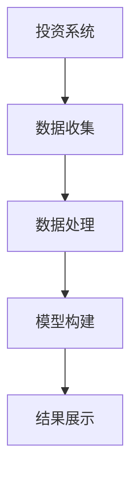

                 


# 克里斯托弗·布朗尼的小盘价值投资：发掘市场盲点

## 关键词：价值投资、小盘股、市场盲点、投资策略、投资回报

## 摘要：  
本文系统地探讨了小盘价值投资的核心理念、策略与方法，重点分析了如何在市场中发现被忽视的投资机会。通过结合经典价值投资理论与现代投资分析工具，本文提供了识别市场盲点的系统化方法，帮助投资者在小盘股市场中实现超额回报。

---

# 第一部分：小盘价值投资的背景与基础

## 第1章：价值投资的核心理念

### 1.1 价值投资的基本概念

#### 1.1.1 投资的定义与分类  
投资是指将资金投入到某个资产或项目中，以期获得未来收益的行为。根据资产类型，投资可以分为股票、债券、房地产等多种形式。在股票市场中，投资的核心在于识别具有长期增长潜力的企业，并通过合理的估值策略获取超额收益。

#### 1.1.2 价值投资的起源与发展  
价值投资的理论起源于20世纪，由本杰明·格雷厄姆和戴维·多德提出，后来被巴菲特发扬光大。价值投资的核心理念是寻找市场定价低于其内在价值的股票，长期持有，等待市场重新发现其价值。

#### 1.1.3 价值投资的核心思想  
价值投资强调安全边际、长期持有和逆向思维。投资者需要以低于企业内在价值的价格买入，并在市场恐慌时寻找被低估的机会。

---

## 第2章：小盘股的特点与优势

### 2.1 小盘股的定义与分类

#### 2.1.1 小盘股的定义  
小盘股通常指市值较小的公司股票，通常在10亿美元以下。与大盘股相比，小盘股的流动性较低，但增长潜力更大。

#### 2.1.2 小盘股市场的特点  
小盘股市场波动性较大，信息透明度较低，但往往存在未被市场充分挖掘的投资机会。

#### 2.1.3 小盘股投资的优势与风险  
优势：增长潜力大、估值较低。风险：流动性差、波动性高。

---

## 第3章：市场盲点的概念与重要性

### 3.1 市场盲点的定义

#### 3.1.1 市场盲点的定义  
市场盲点是指那些在市场中被忽视或低估的投资机会，通常存在于小盘股中，因为这些股票的信息较少，市场关注度低。

### 3.2 市场盲点的形成原因

#### 3.2.1 市场情绪的影响  
投资者通常倾向于关注热门行业或大公司，忽视小盘股。

#### 3.2.2 信息不对称  
小盘股的信息较少，研究覆盖不足，导致市场对其估值不准确。

### 3.3 发掘市场盲点的意义

#### 3.3.1 获得超额收益  
通过发现市场盲点，投资者可以在小盘股中找到低估的股票，实现超额回报。

#### 3.3.2 抢占投资先机  
市场盲点的存在意味着这些股票尚未被广泛认知，提前发现可以抢占投资先机。

---

## 第4章：价值投资的核心策略

### 4.1 小盘股投资的基本原则

#### 4.1.1 价值优先原则  
优先选择那些内在价值高于市场估值的小盘股。

#### 4.1.2 长期投资原则  
小盘股的成长需要时间，投资者需要耐心持有。

#### 4.1.3 风险控制原则  
分散投资，避免过度集中于单一行业或公司。

### 4.2 小盘股投资的筛选标准

#### 4.2.1 财务指标分析  
重点关注市盈率（P/E）、市净率（P/B）、ROE等指标，寻找估值合理的股票。

#### 4.2.2 行业分析  
选择具有成长潜力的行业，如新兴科技、消费升级等。

#### 4.2.3 管理层评估  
考察公司管理层的背景和战略规划，确保公司治理良好。

---

## 第5章：市场盲点的识别方法

### 5.1 行业分析法

#### 5.1.1 选择新兴行业  
寻找那些处于成长期的行业，小盘股往往集中于此。

#### 5.1.2 趋势分析  
分析行业发展趋势，寻找那些具有长期增长潜力的公司。

### 5.2 财务数据分析法

#### 5.2.1 筛选低估值股票  
通过对比财务数据，寻找那些市场价格低于内在价值的股票。

#### 5.2.2 盈利能力分析  
重点关注ROE、净利润增长率等指标，选择盈利能力稳定的公司。

### 5.3 管理层评估法

#### 5.3.1 考察管理层背景  
选择由经验丰富的管理层领导的公司。

#### 5.3.2 分析公司战略  
确保公司有清晰的发展战略和长期目标。

---

## 第6章：小盘价值投资的系统化方法

### 6.1 投资系统的构建

#### 6.1.1 数据收集与处理  
通过金融数据库收集小盘股的财务数据、行业信息等。

#### 6.1.2 模型构建与验证  
使用量化模型筛选潜在的投资标的。

#### 6.1.3 系统优化与迭代  
根据市场变化不断优化投资模型。

### 6.2 小盘股投资的量化分析

#### 6.2.1 量化指标  
通过市盈率、市净率等指标量化评估小盘股的估值水平。

#### 6.2.2 数据可视化  
使用图表展示小盘股的分布情况，帮助发现市场盲点。

---

## 第7章：项目实战

### 7.1 环境安装

#### 7.1.1 安装Python与相关库  
安装Python和Pandas、Matplotlib等数据处理库。

#### 7.1.2 数据来源  
使用Yahoo Finance获取小盘股的财务数据。

### 7.2 核心实现

#### 7.2.1 数据清洗与处理  
对收集到的数据进行清洗，剔除无效数据。

#### 7.2.2 模型实现  
编写Python代码，计算各项估值指标，筛选出潜在的投资标的。

#### 7.2.3 结果展示  
通过图表展示筛选出的小盘股分布情况。

---

## 第8章：最佳实践与小结

### 8.1 投资注意事项

#### 8.1.1 风险控制  
分散投资，避免过度集中。

#### 8.1.2 持续学习  
关注市场变化，不断优化投资策略。

### 8.2 未来展望

#### 8.2.1 人工智能的应用  
利用AI技术进一步提升小盘股筛选的效率和准确性。

#### 8.2.2 可持续投资  
关注ESG因素，选择具有社会责任感的公司。

---

## 附录

### 附录A：相关代码示例

```python
import pandas as pd
import yfinance as yf

# 下载小盘股数据
tickers = ['AAPL', 'MSFT', 'GOOGL']
data = yf.download(tickers, start='2020-01-01', end='2023-12-31')

# 计算市盈率
pe_ratio = data['Adj Close'].iloc[-1] / data['EPS'].iloc[-1]
print(pe_ratio)
```

### 附录B：系统架构图



---

## 结语

通过系统化的方法和持续的学习，投资者可以在小盘股市场中发现市场盲点，实现超额回报。价值投资不仅是一种投资策略，更是一种长期持有的理念，需要耐心和坚持。

