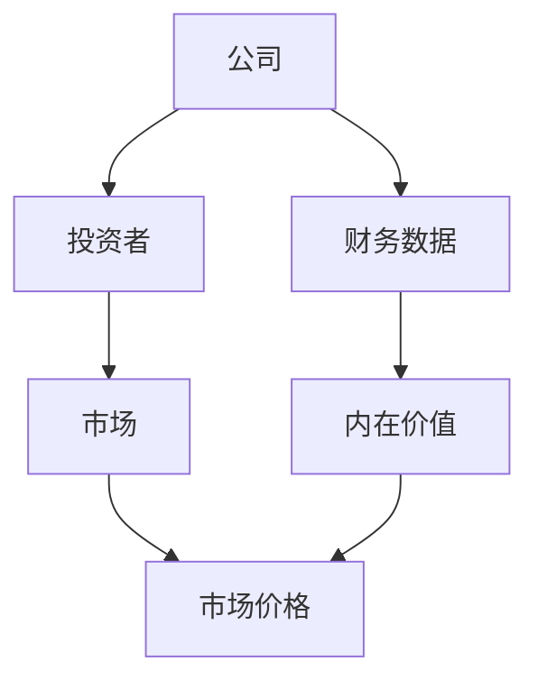
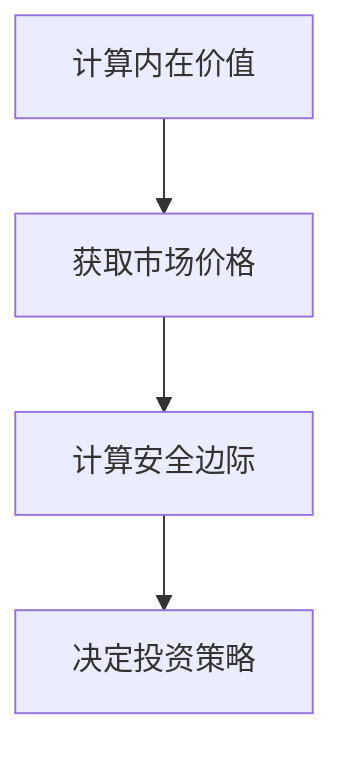
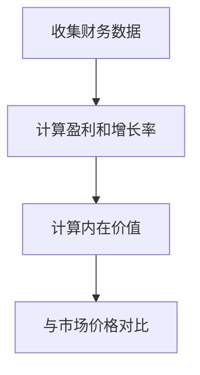
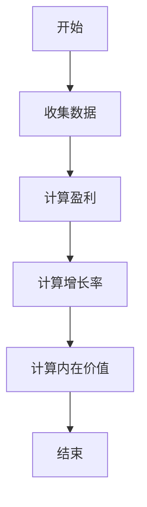
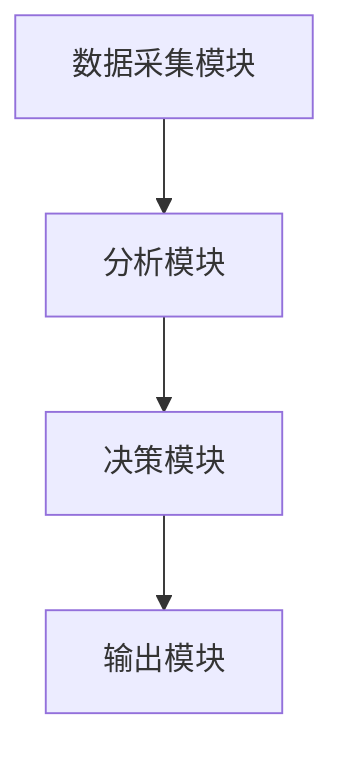
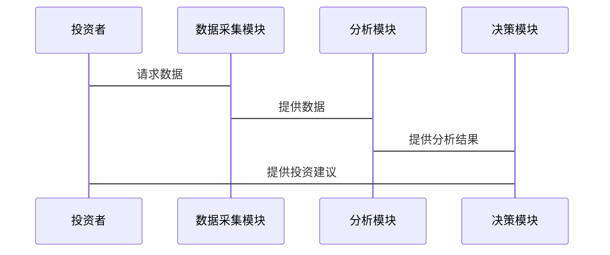

                 


# 克里斯托弗·布朗的深度价值投资方法

> 关键词：深度价值投资、基本面分析、内在价值、安全边际、投资策略、克里斯托弗·布朗

> 摘要：本文深入探讨了克里斯托弗·布朗的深度价值投资方法，从背景介绍、核心概念、算法原理到系统架构和项目实战，系统地分析了其在投资领域中的应用。通过详细阐述内在价值计算、安全边际应用等关键步骤，结合实际案例和系统设计，为读者提供了全面的理解和实践指南。

---

## 第一部分: 深度价值投资的背景与概述

### 第1章: 深度价值投资的核心概念

#### 1.1 深度价值投资的背景与问题背景

深度价值投资是一种以公司基本面分析为核心的投资策略，旨在通过识别市场中被低估的股票来实现长期收益。传统的投资方法往往依赖于市场趋势和技术分析，但在市场波动剧烈的情况下，这些方法可能无法有效捕捉潜在的投资机会。

**问题背景**  
在金融市场中，价格波动常常导致投资者难以准确判断股票的真正价值。传统方法往往忽视了公司内在价值的评估，容易受到市场情绪的影响。深度价值投资通过分析公司的财务状况、行业地位和未来前景，帮助投资者识别那些市场价格低于其真实价值的股票。

**问题解决**  
深度价值投资的核心在于通过基本面分析，计算股票的内在价值，并与市场价格进行对比。当市场价格显著低于内在价值时，投资者可以介入，等待市场回归理性，从而实现收益。

#### 1.2 深度价值投资的核心问题与解决方法

**问题描述**  
深度价值投资的主要目标是发现市场价格低于内在价值的股票。然而，这一过程中面临诸多挑战，如数据获取的复杂性、计算的准确性以及市场的不确定性。

**问题解决**  
通过系统的数据分析和严格的计算方法，深度价值投资者可以有效地识别低估股票。关键在于准确计算内在价值，并设定合理的安全边际，以降低投资风险。

**边界与外延**  
深度价值投资主要适用于那些具有稳定财务状况和明确未来增长潜力的公司。它并不适用于新兴行业或增长型企业，因为这些公司的内在价值难以准确评估。

#### 1.3 深度价值投资的概念结构与核心要素

**核心要素**  
- **公司基本面**：包括收入、利润、资产和负债等财务数据。
- **安全边际**：内在价值与市场价格之间的差异，用于降低投资风险。
- **市场情绪**：市场波动对股票价格的影响，帮助识别低估机会。

**概念属性对比表**

| **概念**       | **定义**                                                                 | **计算方法**                                                                 | **重要性**                     |
|----------------|--------------------------------------------------------------------------|------------------------------------------------------------------------------|--------------------------------|
| 内在价值       | 公司未来现金流的现值，反映其真实价值                                      | V = ∑(CF_t / (1 + r)^t)                                                       | 核心，决定投资价值              |
| 市场价格       | 当前股票的市场价格，受市场情绪和供需影响                                   | 通过股票交易所获取                                                          | 衡量市场低估或高估的依据        |
| 安全边际       | 内在价值与市场价格之间的差额                                              | 安全边际 = 内在价值 - 市场价格                                               | 减少投资风险的关键因素          |

**ER实体关系图**



---

## 第二部分: 深度价值投资的核心概念与联系

### 第2章: 深度价值投资的核心原理

#### 2.1 安全边际的计算与应用

**安全边际的定义与公式**  
安全边际是内在价值与市场价格之间的差额，用于衡量投资的安全性。公式为：

$$ \text{安全边际} = \text{内在价值} - \text{市场价格} $$

**安全边际的计算流程**



**案例分析**  
假设某公司的内在价值为100元，市场价格为80元，则安全边际为20元。投资者可以考虑介入，因为存在较大的安全空间。

#### 2.2 内在价值的计算方法

**内在价值的定义与公式**  
内在价值是公司未来现金流的现值，计算公式为：

$$ V = \frac{E}{g} $$

其中，E为公司盈利，g为增长率。

**内在价值的计算流程**



**数学模型与公式**

$$ V = \frac{E}{g} $$

例如，如果E = 100，g = 5，则V = 20。这意味着公司的内在价值为20单位，市场价格低于此值时值得投资。

---

## 第三部分: 深度价值投资的算法与数学模型

### 第3章: 深度价值投资的算法原理

#### 3.1 内在价值计算的算法



**代码实现**

```python
def calculate_intrinsic_value(profit, growth_rate):
    return profit / growth_rate

# 示例
profit = 100
growth_rate = 5
intrinsic_value = calculate_intrinsic_value(profit, growth_rate)
print(f"内在价值: {intrinsic_value}")
```

#### 3.2 安全边际计算的数学模型

$$ \text{安全边际} = \text{内在价值} - \text{市场价格} $$

**案例分析**  
假设内在价值为100，市场价格为80，则安全边际为20，表明存在较大的投资机会。

---

## 第四部分: 深度价值投资的系统分析与架构设计

### 第4章: 深度价值投资的系统架构

#### 4.1 系统功能设计

**领域模型**


#### 4.2 系统架构设计

**系统架构**



#### 4.3 系统接口设计

**接口设计**

- 数据采集模块接口：
  - 获取公司财务数据
  - 获取市场价格

- 分析模块接口：
  - 计算内在价值
  - 计算安全边际

- 决策模块接口：
  - 决定是否投资

#### 4.4 系统交互流程

**交互流程**



---

## 第五部分: 深度价值投资的项目实战

### 第5章: 深度价值投资的项目实战

#### 5.1 项目环境安装

- 安装Python和相关库：
  ```bash
  pip install numpy pandas matplotlib
  ```

#### 5.2 核心代码实现

```python
import pandas as pd
import numpy as np

def calculate_intrinsic_value(profits, growth_rate):
    return profits / growth_rate

# 示例数据
profits = [100, 150, 200]
growth_rate = 0.05

intrinsic_values = [calculate_intrinsic_value(p, growth_rate) for p in profits]
print("内在价值:", intrinsic_values)
```

#### 5.3 代码解读与分析

- 代码功能：
  - `calculate_intrinsic_value`函数计算单个公司的内在价值。
  - 使用循环计算多个公司的内在价值。

- 输出结果：
  - 内在价值列表，用于与市场价格对比，识别低估股票。

#### 5.4 实际案例分析

**案例分析**  
以某公司为例，分析其财务数据，计算内在价值，并与市场价格对比，判断是否存在低估机会。

#### 5.5 项目小结

- 项目目标：识别低估股票，制定投资策略。
- 实施步骤：数据采集、计算内在价值、分析安全边际、做出投资决策。

---

## 第六部分: 深度价值投资的最佳实践

### 第6章: 深度价值投资的最佳实践

#### 6.1 小结

- 深度价值投资通过基本面分析，识别低估股票。
- 内在价值计算和安全边际是关键步骤。
- 系统化的方法和工具能够提高投资效率。

#### 6.2 注意事项

- 避免情绪化决策，严格遵循数据分析。
- 分散投资，降低风险。
- 定期更新数据，适应市场变化。

#### 6.3 拓展阅读

- 建议阅读《价值投资实战策略》、《投资的智慧》等书籍，深入了解深度价值投资的策略和技巧。

---

## 结语

通过本文的详细讲解，读者可以系统地掌握克里斯托弗·布朗的深度价值投资方法，从理论到实践，逐步构建自己的投资策略。希望本文能为投资者提供有价值的指导，帮助他们在复杂的市场中找到成功的投资机会。

