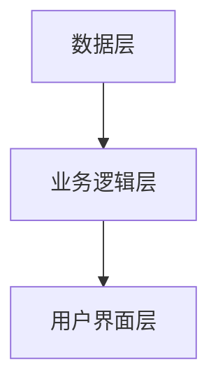
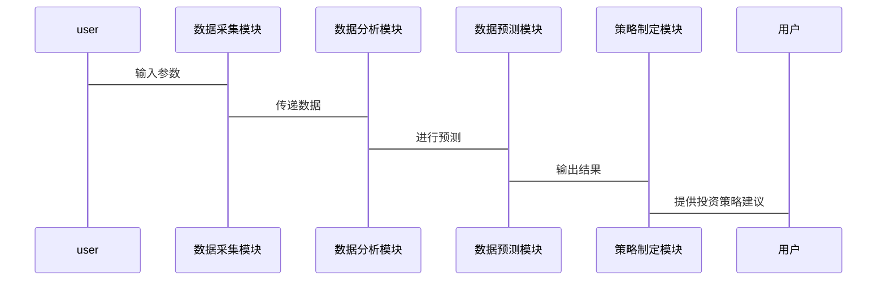

                 


# 全球化vs去全球化：投资策略的调整

---

## 关键词：全球化、去全球化、投资策略、资产配置、风险管理、经济趋势

---

## 摘要

全球化和去全球化是当前国际经济领域的重要趋势，对投资策略产生了深远影响。本文从全球化与去全球化的概念入手，分析它们对投资策略的具体影响，探讨如何根据这些趋势调整投资策略。文章结合实际案例，通过数学模型和系统架构设计，为投资者提供科学的决策支持。

---

# 第1章 全球化与去全球化的背景介绍

## 1.1 全球化的定义与特征

### 1.1.1 全球化的定义

全球化是指经济、文化、政治等领域的跨国界整合过程，表现为跨国公司、国际贸易、资本流动的增加，以及信息和通信技术的普及。全球化的核心是资源的优化配置和全球范围内的分工协作。

### 1.1.2 全球化的核心特征

- **经济一体化**：跨国公司和自由贸易的兴起，促进全球供应链的形成。
- **技术共享**：信息技术的发展使得知识和技术创新跨越国界。
- **文化融合**：全球化促进了跨文化交流，形成多元一体的文化格局。

### 1.1.3 全球化的历史演变

全球化经历了多个阶段，从早期的商品贸易到现代的数字经济。20世纪末互联网的普及加速了全球化的进程，推动了跨国资本流动和信息共享。

## 1.2 去全球化的定义与特征

### 1.2.1 去全球化的定义

去全球化是指全球化进程的逆转，表现为贸易保护主义抬头、供应链本地化、以及各国加强内部监管。去全球化的主要原因是地缘政治冲突、经济不平等加剧以及对供应链安全性的担忧。

### 1.2.2 去全球化的核心特征

- **贸易壁垒增加**：各国通过关税和非关税壁垒限制进口。
- **供应链本地化**：企业将生产和供应环节迁移到本地或近邻国家。
- **经济政策转向内向型**：各国优先考虑国内就业和经济发展。

## 1.3 全球化与去全球化的相互关系

### 1.3.1 全球化与去全球化的对比分析

| 特征       | 全球化                        | 去全球化                    |
|------------|-------------------------------|-----------------------------|
| 贸易政策     | 自由贸易                      | 保护主义                    |
| 供应链      | 全球化                        | 本地化                      |
| 经济目标     | 资源优化配置                  | 内部优先                    |
| 技术共享     | 高度共享                     | 局部化                      |

### 1.3.2 全球化与去全球化的相互影响

全球化促进了跨国合作，但同时也加剧了经济不平等和依赖性，这为去全球化提供了动力。而去全球化则通过减少依赖性，增强各国的自主性，但可能导致效率降低和成本上升。

## 1.4 全球化与去全球化的投资影响

### 1.4.1 全球化对投资的影响

全球化促进了跨国投资，降低了投资成本，提高了投资回报。投资者可以通过全球化配置资产，分散风险，优化收益。

### 1.4.2 去全球化对投资的影响

去全球化可能导致投资成本上升，资产配置的灵活性降低，同时增加了地缘政治风险。投资者需要重新评估资产配置，考虑本地化投资。

### 1.4.3 全球化与去全球化对投资策略的综合影响

全球化与去全球化的双重影响使得投资策略需要更加灵活，既要考虑全球市场的机会，又要应对本地化风险。投资者需要在资产配置中平衡全球化和本地化因素。

## 1.5 本章小结

全球化和去全球化是当前投资环境的两大趋势，理解它们的定义、特征和相互关系对于制定投资策略至关重要。下一章将深入探讨全球化和去全球化的核心概念，分析它们对投资策略的具体影响。

---

# 第2章 全球化与去全球化的核心概念

## 2.1 全球化的核心概念

### 2.1.1 全球化的核心要素

全球化的核心要素包括跨国公司、国际贸易、资本流动、信息共享和技术合作。这些要素共同推动了全球经济的整合。

### 2.1.2 全球化的驱动因素

- **技术进步**：信息技术的发展促进了跨国交流。
- **政策支持**：自由贸易协定和国际组织的推动。
- **经济利益**：跨国公司通过全球化降低成本，提高效率。

### 2.1.3 全球化的实现路径

全球化通过贸易自由化、资本流动、技术转移和文化交流实现。企业通过跨国并购、合资企业等形式参与全球化。

## 2.2 去全球化的核心概念

### 2.2.1 去全球化的核心要素

去全球化的核心要素包括贸易保护主义、供应链本地化、内向型经济政策和技术壁垒。这些要素反映了对全球化依赖的减少。

### 2.2.2 去全球化的驱动因素

- **地缘政治冲突**：如中美贸易摩擦和新冠疫情。
- **经济安全**：各国为了保障供应链安全，减少对外依赖。
- **社会压力**：公众对全球化的负面影响的不满，如就业流失。

### 2.2.3 去全球化的实现路径

去全球化通过贸易壁垒、本地化生产、技术自主研发和政策监管实现。企业通过本地化生产和技术自主减少对全球供应链的依赖。

## 2.3 全球化与去全球化的关系分析

### 2.3.1 全球化与去全球化的相互影响

全球化促进了经济一体化，但也加剧了不平等和依赖性。而去全球化则通过减少依赖性，增强各国的自主性，但可能导致效率降低和成本上升。

### 2.3.2 全球化与去全球化的动态平衡

全球化和去全球化并非截然对立，而是相互影响，动态平衡。企业在制定投资策略时，需要在全球化和去全球化之间找到平衡点，既要利用全球化的机会，又要应对去全球化的挑战。

## 2.4 本章小结

全球化和去全球化是相互关联、相互影响的两个趋势。理解它们的核心概念和相互关系，有助于投资者制定科学的投资策略。下一章将分析全球化和去全球化对投资策略的具体影响，探讨如何调整投资策略以应对这两种趋势。

---

# 第3章 投资策略的调整

## 3.1 全球化对投资策略的影响

### 3.1.1 资产配置的全球化

全球化促进了资产配置的多元化，投资者可以通过投资全球市场分散风险，优化收益。例如，投资跨国公司股票和债券，可以降低单一市场风险。

### 3.1.2 风险管理

全球化降低了市场风险，但也增加了汇率风险和政治风险。投资者需要通过多元化投资和对冲工具管理风险。

### 3.1.3 机会与挑战

全球化带来了更多的投资机会，但也加剧了竞争和价格波动。投资者需要密切关注全球经济趋势，调整投资组合。

## 3.2 去全球化对投资策略的影响

### 3.2.1 本地化投资的重要性

去全球化推动了本地化投资，投资者需要增加对本地市场的关注，尤其是供应链本地化和内向型经济政策的影响。

### 3.2.2 供应链风险管理

去全球化可能导致供应链中断，投资者需要加强供应链管理，分散风险。例如，通过多元化供应商和本地化生产降低风险。

### 3.2.3 政策风险

去全球化可能导致更多的贸易壁垒和政策不确定性。投资者需要关注政策变化，调整投资策略。

## 3.3 投资策略的具体调整

### 3.3.1 资产配置的调整

投资者需要平衡全球化和本地化资产配置，既要利用全球化的机会，又要应对本地化风险。例如，增加对本地企业的投资，同时保持对全球市场的配置。

### 3.3.2 风险管理策略

投资者需要加强风险管理，包括分散投资、对冲工具和供应链管理。例如，通过金融衍生品对冲汇率风险，通过多元化供应商降低供应链中断风险。

### 3.3.3 长期投资与短期策略

全球化和去全球化是长期趋势，但短期政策变化也会对投资产生影响。投资者需要制定长期投资策略，同时关注短期政策变化，灵活调整投资组合。

## 3.4 本章小结

全球化和去全球化对投资策略有深远影响。投资者需要根据这两种趋势调整资产配置和风险管理策略，平衡全球化和本地化投资，应对政策变化和市场风险。

---

# 第4章 全球化与去全球化的算法原理

## 4.1 算法原理概述

全球化和去全球化的趋势可以通过算法进行预测和分析。本文将介绍时间序列分析和机器学习模型的应用，帮助投资者制定科学的投资策略。

## 4.2 时间序列分析

### 4.2.1 时间序列分析的基本概念

时间序列分析是一种统计方法，用于分析和预测数据随时间的变化趋势。本文将使用国际贸易数据和市场指数数据进行分析。

### 4.2.2 时间序列分析的应用

通过时间序列分析，可以预测全球化和去全球化的趋势，识别周期性波动，评估政策变化的影响。

## 4.3 机器学习模型

### 4.3.1 机器学习模型的基本概念

机器学习是一种人工智能技术，用于通过数据训练模型，预测未来趋势。本文将使用回归分析和分类模型进行预测。

### 4.3.2 机器学习模型的应用

通过机器学习模型，可以分析市场数据，识别全球化和去全球化的影响，优化投资策略。

## 4.4 算法实现

### 4.4.1 时间序列分析的实现

使用Python的pandas和numpy库进行数据处理，使用statsmodels库进行时间序列分析。

### 4.4.2 机器学习模型的实现

使用scikit-learn库进行回归分析，训练模型预测市场趋势。

## 4.5 本章小结

通过时间序列分析和机器学习模型，可以科学地预测全球化和去全球化的趋势，为投资者制定投资策略提供数据支持。

---

# 第5章 系统架构设计

## 5.1 系统功能设计

### 5.1.1 系统功能概述

系统功能包括数据采集、分析、预测和策略制定。通过系统功能设计，帮助投资者制定科学的投资策略。

### 5.1.2 系统功能模块

- 数据采集模块：收集全球市场数据和政策信息。
- 数据分析模块：进行时间序列分析和机器学习模型预测。
- 策略制定模块：根据分析结果制定投资策略。

## 5.2 系统架构设计

### 5.2.1 系统架构概述

系统架构采用分层设计，包括数据层、业务逻辑层和用户界面层。数据层负责数据存储和管理，业务逻辑层负责分析和预测，用户界面层提供用户交互。

### 5.2.2 系统架构图



## 5.3 系统接口设计

### 5.3.1 数据接口

系统需要与数据源接口对接，获取全球市场数据和政策信息。例如，通过API接口获取实时市场数据。

### 5.3.2 用户接口

用户界面设计直观，方便投资者输入参数和查看分析结果。例如，通过网页界面进行参数设置和结果查询。

## 5.4 系统交互流程

### 5.4.1 系统交互概述

系统交互流程包括数据采集、分析、预测和策略制定。用户输入参数，系统进行分析，输出投资策略建议。

### 5.4.2 系统交互流程图



## 5.5 本章小结

通过系统架构设计，可以实现全球化和去全球化的数据分析和预测，帮助投资者制定科学的投资策略。

---

# 第6章 项目实战

## 6.1 项目环境安装

### 6.1.1 安装Python环境

安装Python 3.8及以上版本，安装常用库，如pandas、numpy、statsmodels和scikit-learn。

### 6.1.2 数据源获取

通过API接口获取全球市场数据和政策信息，例如使用Yahoo Finance获取股票数据。

## 6.2 核心代码实现

### 6.2.1 时间序列分析代码

```python
import pandas as pd
import numpy as np
from statsmodels.tsa.arima.model import ARIMA
import matplotlib.pyplot as plt

# 加载数据
data = pd.read_csv('market_data.csv', index_col='date')

# 时间序列分析
model = ARIMA(data['price'], order=(5,1,0))
model_fit = model.fit()

# 预测未来价格
forecast = model_fit.forecast(steps=30)
```

### 6.2.2 机器学习模型代码

```python
from sklearn.linear_model import LinearRegression
from sklearn.metrics import mean_squared_error

# 加载数据
data = pd.read_csv('market_data.csv')

# 训练模型
model = LinearRegression()
model.fit(data[['feature1', 'feature2']], data['target'])

# 预测结果
predicted = model.predict(data[['feature1', 'feature2']])
print('均方误差:', mean_squared_error(data['target'], predicted))
```

## 6.3 实际案例分析

### 6.3.1 案例背景

假设投资者需要制定全球化和去全球化的投资策略，通过分析某跨国公司的股票数据，制定投资计划。

### 6.3.2 分析与解读

通过时间序列分析和机器学习模型预测市场趋势，识别全球化和去全球化的趋势，制定相应的投资策略。

## 6.4 项目总结

通过项目实战，投资者可以掌握全球化和去全球化对投资策略的具体影响，学习如何利用数据分析工具制定科学的投资计划。

## 6.5 本章小结

项目实战通过具体案例分析，帮助投资者理解全球化和去全球化对投资策略的影响，掌握数据分析工具的应用。

---

# 第7章 最佳实践与小结

## 7.1 最佳实践

### 7.1.1 投资策略的制定

投资者需要根据全球化和去全球化的趋势，灵活调整投资策略，平衡全球化和本地化资产配置。

### 7.1.2 风险管理

加强风险管理，使用对冲工具和多元化投资降低风险。例如，通过金融衍生品对冲汇率风险，通过多元化供应商降低供应链中断风险。

### 7.1.3 技术应用

利用数据分析工具和技术手段，科学预测市场趋势，制定投资策略。

## 7.2 小结

全球化和去全球化是当前投资环境的重要趋势，理解它们对投资策略的影响，制定科学的投资计划，对投资者来说至关重要。通过本文的分析和案例，投资者可以更好地应对全球化和去全球化的挑战和机会。

## 7.3 注意事项

### 7.3.1 数据的准确性

确保数据源的准确性和可靠性，避免因数据错误导致的投资决策失误。

### 7.3.2 模型的适用性

根据实际情况选择合适的模型和方法，避免盲目应用。

### 7.3.3 政策变化的敏感性

密切关注政策变化，及时调整投资策略，应对地缘政治风险。

## 7.4 拓展阅读

### 7.4.1 推荐书籍

- 《全球化与资本主义》
- 《去全球化：挑战与机遇》

### 7.4.2 相关研究

- 全球化与去全球化的经济学研究
- 投资策略的调整与风险管理

## 7.5 本章小结

通过本文的分析和建议，投资者可以更好地应对全球化和去全球化带来的挑战和机会，制定科学的投资策略。

---

# 结语

全球化和去全球化是当前投资环境的重要趋势，对投资策略的影响深远。通过本文的分析和案例，投资者可以更好地理解这些趋势，制定科学的投资计划。未来，随着经济形势的变化，投资策略也需要不断调整，以应对新的挑战和机会。

---

通过以上内容，文章详细分析了全球化和去全球化对投资策略的影响，结合理论分析和实战案例，为投资者提供了科学的决策支持。

