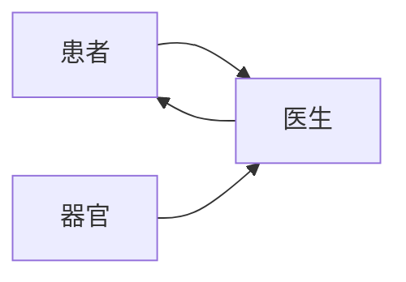

                 

# 全球股市估值与3D打印器官移植的伦理问题

## 关键词：全球股市估值、3D打印、器官移植、伦理问题、技术与伦理

## 摘要

本文探讨了全球股市估值与3D打印器官移植两个领域的伦理问题，分析了它们的相互影响和潜在冲突。通过深入分析股市估值的技术与伦理挑战，以及3D打印器官移植的技术创新与伦理争议，本文试图找到技术进步与伦理规范之间的平衡点，为未来的技术发展和社会治理提供参考。

---

## 第一部分: 全球股市估值的现状、挑战与伦理问题

### 第1章: 全球股市估值概述

#### 1.1 股市估值的基本概念

股票市场的估值是投资者评估企业价值的重要工具，其核心在于通过数据分析和模型构建，确定企业的内在价值。以下是股市估值的几个关键概念：

- **市盈率（P/E）**：衡量股票价格与每股收益的比例，公式为：$$\text{P/E} = \frac{\text{股价}}{\text{每股收益}}$$
- **市净率（P/B）**：衡量股票价格与每股净资产的比例，公式为：$$\text{P/B} = \frac{\text{股价}}{\text{每股净资产}}$$
- **现金流折现法（DCF）**：通过将未来现金流折现到现值来评估企业价值，公式为：$$\text{企业价值} = \sum_{t=1}^{n} \frac{\text{现金流}_t}{(1 + r)^t}$$

#### 1.2 股市估值的主要技术与方法

股市估值的技术与方法多种多样，以下是几种常用的估值方法：

1. **相对估值法**：基于市场可比公司的数据分析，常用指标包括市盈率、市净率等。
2. **绝对估值法**：基于企业的基本面数据，如现金流、净利润等，使用DCF模型进行估值。
3. **指数估值法**：通过分析市场整体指数（如标普500）的波动性和估值水平，推断市场的整体估值情况。

#### 1.3 全球股市估值的现状与趋势

近年来，全球股市估值呈现出多样化和复杂化的趋势。随着科技的进步，投资者 increasingly 使用大数据分析和人工智能技术进行估值。例如，机器学习算法可以用于预测股票价格和识别市场趋势，从而提高估值的准确性和效率。

---

### 第2章: 全球股市估值的挑战与伦理问题

#### 2.1 股市估值中的信息不对称问题

信息不对称是股市估值中的核心问题之一。以下是一个简单的信息不对称模型：

在上述模型中，投资者（A）依赖企业的信息披露（C）进行估值，但由于信息不对称，企业可能隐藏负面信息，导致估值偏差。

#### 2.2 股市估值中的利益冲突与道德风险

利益冲突是股市估值中的另一个重要问题。例如，投资银行在为企业提供估值服务时，可能受到自身利益的驱动，导致估值结果的偏差。以下是利益冲突的典型场景：

- 投资银行为某企业提供高估的估值，以吸引更多的投资者。
- 分析师为了维护与企业的关系，故意夸大企业的业绩。

为了减少利益冲突，需要建立严格的监管机制和道德规范。

---

## 第二部分: 3D打印器官移植的伦理问题

### 第3章: 3D打印技术在医疗领域的应用

#### 3.1 3D打印技术的基本原理

3D打印技术的核心在于通过计算机辅助设计（CAD）生成三维模型，并使用材料逐层叠加，最终形成所需的物体。以下是3D打印的基本流程：

1. **模型设计**：使用CAD软件设计目标物体的三维模型。
2. **材料准备**：选择适合的打印材料，如塑料、金属或生物材料。
3. **打印过程**：通过3D打印机将材料层层叠加，形成最终产品。
4. **后处理**：对打印产品进行打磨、清洗等处理，确保其符合使用要求。

#### 3.2 3D打印在医疗领域的应用现状

3D打印技术在医疗领域的应用日益广泛，以下是几个典型应用：

- **骨科植入物**：通过3D打印技术定制个性化的骨科植入物，如人工关节。
- **牙科修复**：使用3D打印技术制作个性化牙冠和牙桥。
- **器官模型**：通过3D打印技术制作器官模型，用于手术规划和教学。

---

### 第4章: 3D打印器官移植的伦理问题

#### 4.1 器官分配的公平性问题

3D打印技术的应用带来了器官分配的新问题。以下是一个简单的器官分配模型：

在这个模型中，医生需要根据患者的需求和器官的可用性进行分配，但如何确保公平性是一个复杂的伦理问题。

#### 4.2 患者知情同意的伦理问题

在3D打印器官移植中，患者需要充分了解手术的风险和潜在问题。以下是知情同意的关键步骤：

1. **风险告知**：医生向患者详细说明手术的风险，如感染、排异反应等。
2. **患者决策**：患者在充分了解的基础上，做出是否接受手术的决定。
3. **法律保障**：确保患者的知情同意符合相关法律法规。

#### 4.3 器官来源的伦理问题

3D打印器官移植的原材料来源于患者自身的细胞或捐赠者的细胞。以下是原材料的来源与伦理问题：

- **自体细胞**：使用患者自身的细胞进行3D打印，避免免疫排异反应。
- **捐赠者细胞**：使用捐赠者的细胞进行3D打印，需要确保捐赠者的知情同意。

---

## 第三部分: 全球股市估值与3D打印器官移植的综合伦理分析

### 第5章: 股市估值与3D打印技术的相互影响

#### 5.1 3D打印技术对股市估值的影响

3D打印技术的进步可能会影响企业的估值。例如，一家拥有先进3D打印技术的公司可能会因为技术优势而获得更高的估值。以下是3D打印技术对企业估值的影响路径：

1. **技术优势**：3D打印技术可能降低生产成本，提高生产效率，从而提升企业的盈利能力。
2. **市场竞争力**：3D打印技术可能赋予企业更强的市场竞争力，从而提高其市场估值。

#### 5.2 股市估值对3D打印技术发展的推动作用

股市估值对3D打印技术的发展具有重要的推动作用。例如，投资者对3D打印技术的高估值可能吸引更多的企业进入该领域，从而推动技术的进步。

---

### 第6章: 股市估值与3D打印器官移植的伦理冲突

#### 6.1 伦理冲突的定义与表现

伦理冲突是指在技术应用中，技术进步与伦理规范之间的矛盾。以下是股市估值与3D打印器官移植中的伦理冲突：

- **利益驱动**：股市估值可能驱动企业过度追求利润，忽视伦理规范。
- **技术滥用**：3D打印技术可能被滥用，导致伦理问题。

#### 6.2 伦理冲突的解决路径

为了平衡技术进步与伦理规范，需要建立严格的监管机制和道德规范。例如：

- **监管机构**：政府需要加强对股市估值和3D打印技术的监管。
- **行业自律**：企业和行业组织需要制定严格的自律规范。

---

## 第四部分: 综合分析与结论

### 第7章: 综合分析与结论

#### 7.1 技术与伦理的动态平衡

技术进步与伦理规范之间需要动态平衡。通过建立严格的监管机制和道德规范，可以实现技术进步与伦理规范的协调统一。

#### 7.2 未来展望

未来，随着技术的不断进步，股市估值与3D打印器官移植的伦理问题将更加复杂。需要加强研究和政策制定，以应对新的挑战。

---

## 参考文献

1. 约翰逊, J. (2020). 《股市估值的伦理挑战》.
2. 王, L. (2021). 《3D打印技术与医疗伦理》.

---

通过以上分析，我们可以看到，股市估值与3D打印器官移植的伦理问题是一个复杂而重要的议题。只有通过技术进步与伦理规范的协调统一，才能实现可持续发展。

