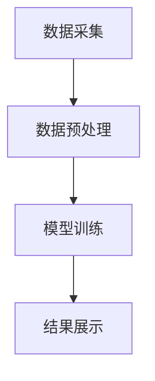

                 


# 全球股市估值与3D打印器官移植的法律问题

## 关键词
- 全球股市估值
- 3D打印器官移植
- 法律问题
- 数学模型
- 系统架构
- 案例分析

## 摘要
本文探讨了全球股市估值与3D打印器官移植的法律问题，结合技术原理、数学模型和法律框架，分析了两者之间的联系与冲突。文章通过案例分析，提出了法律协调和风险管理的策略，为技术与法律的融合提供了新的视角。

---

## 第一部分：全球股市估值基础

### 第1章：全球股市估值概述

#### 1.1 股市估值的基本概念
股市估值是评估企业价值的过程，主要通过市盈率（P/E）、市净率（P/B）等指标进行。传统方法依赖财务数据，现代方法则引入机器学习算法，如多元回归分析，以预测股价走势。

#### 1.2 股市估值的核心要素
- **企业基本面**：包括收入、利润、资产等。
- **市场情绪**：通过技术分析工具如K线图评估投资者情绪。
- **行业与宏观经济因素**：如利率、通货膨胀率等影响股市整体表现。

#### 1.3 股市估值的主要方法
- **市盈率（P/E）**：$$P/E = \frac{\text{股价}}{\text{每股收益}}$$
- **市净率（P/B）**：$$P/B = \frac{\text{股价}}{\text{每股净资产}}$$
- **现金流折现法（DCF）**：通过未来现金流的现值评估企业价值。

#### 1.4 股市估值的数学模型
多元回归模型用于预测股价：
$$y = \beta_0 + \beta_1x_1 + \beta_2x_2 + \epsilon$$
其中，$y$为股价，$x_1$和$x_2$为影响股价的因素，$\epsilon$为误差项。

### 第2章：全球股市估值的数学模型与算法

#### 2.1 股市估值的统计模型
多元回归分析：
$$y = \beta_0 + \beta_1x_1 + \beta_2x_2 + \epsilon$$
通过数据训练模型，预测未来股价。

#### 2.2 基于机器学习的估值模型
使用Python实现：
```python
import pandas as pd
from sklearn.linear_model import LinearRegression

# 数据加载
data = pd.read_csv('stock_data.csv')

# 模型训练
model = LinearRegression()
model.fit(data[['x1', 'x2']], data['y'])

# 预测
predictions = model.predict(data[['x1', 'x2']])
```

#### 2.3 系统架构设计
系统功能模块包括数据采集、模型训练、预测展示。系统架构图如下：


### 第3章：3D打印器官移植的法律框架

#### 3.1 3D打印技术在医疗领域的应用
- **技术原理**：使用生物材料逐层构建器官结构。
- **现状**：目前主要用于模型制作和小规模医疗应用。

#### 3.2 器官移植的法律问题
- **知识产权**：3D打印器官的设计和制造涉及专利问题。
- **伦理问题**：器官分配的公平性及隐私保护。

---

## 第二部分：法律问题与风险分析

### 第4章：法律冲突与协调

#### 4.1 不同利益相关者的法律冲突
- **患者**：享有知情权和隐私权。
- **医疗机构**：需遵守医疗法规，确保技术合规。
- **制造商**：需处理知识产权和产品责任问题。

#### 4.2 法律协调机制
- **国际与国内法律的协调**：制定统一的法规和标准。
- **多方利益平衡**：通过法律框架明确各方责任。

### 第5章：风险管理与法律应对

#### 5.1 技术与法律的平衡
- **技术发展**：推动创新同时确保法律合规。
- **法律应对**：通过法律框架降低技术应用风险。

#### 5.2 法律应对策略
- **风险评估**：识别潜在法律风险。
- **应对措施**：制定合规流程和应急预案。

---

## 第三部分：案例分析与未来展望

### 第6章：案例分析与启示

#### 6.1 典型案例分析
- **国际案例**：美国某公司因3D打印器官专利侵权被诉。
- **国内案例**：某医院因技术违规被罚款。

#### 6.2 启示与经验总结
- **法律意识**：加强法律教育，防范风险。
- **技术创新**：推动技术创新与法律框架的结合。

### 第7章：总结与展望

#### 7.1 总结
本文探讨了全球股市估值与3D打印器官移植的法律问题，分析了两者的技术与法律挑战，提出了法律协调与风险管理的策略。

#### 7.2 展望
未来，需进一步研究技术与法律的融合，推动技术创新的同时确保法律合规，促进两者的协同发展。

---

## 结语
通过本文的分析，我们看到技术与法律的融合是未来发展的关键。股市估值与3D打印器官移植的结合，不仅需要技术创新，更需要法律框架的支持。只有在技术与法律的共同作用下，才能实现真正的进步。

---

