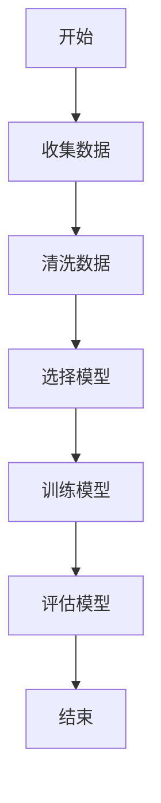

                 


# 全球股市估值与3D生物打印人造器官的伦理问题

## 关键词：
- 全球股市估值
- 3D生物打印
- 伦理问题
- 投资者决策
- 生命权

## 摘要：
本文探讨了全球股市估值与3D生物打印技术在人造器官制造中的伦理问题。首先，分析了股市估值的核心概念、数学模型及算法，随后深入探讨了3D生物打印技术的技术原理及其伦理挑战。最后，结合实际案例，分析了两者在伦理问题上的联系与差异，提出了平衡技术发展与伦理责任的解决方案。

---

# 第1章: 全球股市估值与3D生物打印概述

## 1.1 全球股市估值的基本概念
### 1.1.1 股市估值的定义与作用
股市估值是评估公司股票内在价值的过程，帮助投资者决定是否买入或卖出股票。通过分析财务指标和市场趋势，投资者可以做出更明智的投资决策。

### 1.1.2 3D生物打印技术的基本原理
3D生物打印技术利用生物材料，通过逐层构建的方式制造复杂结构，用于制造人造器官。该技术结合了生物工程和3D打印技术，具有高度的精确性和定制化能力。

### 1.1.3 两者的伦理问题背景
股市估值涉及投资者利益，可能存在利益冲突和信息不对称问题。3D生物打印技术则涉及生命伦理，如器官分配的公平性问题。

## 1.2 问题背景与描述
### 1.2.1 全球股市估值的现状与挑战
当前股市估值面临数据复杂性和模型准确性问题，投资者需应对市场波动和信息不透明的挑战。

### 1.2.2 3D生物打印技术的应用前景
3D生物打印技术在医疗领域潜力巨大，但其高昂成本和资源分配问题引发伦理争议。

### 1.2.3 伦理问题的边界与外延
股市估值的伦理问题主要涉及利益相关者的权益，而3D生物打印技术的伦理问题涉及生命伦理和人权。

## 1.3 核心概念与联系
### 1.3.1 核心概念的原理分析
股市估值基于财务数据和市场分析，而3D生物打印技术基于生物材料和3D打印技术。

### 1.3.2 核心概念的属性特征对比表格
| 特性      | 股市估值                  | 3D生物打印技术             |
|-----------|--------------------------|-----------------------------|
| 基础      | 财务数据与市场分析        | 生物材料与3D打印技术        |
| 应用领域    | 投资决策                  | 医疗与生物工程              |
| 伦理问题    | 利益冲突与信息不对称      | 生命伦理与资源分配          |

### 1.3.3 ER实体关系图架构的 Mermaid 流程图
```mermaid
erDiagram
    actor 投资者
    actor 医疗机构
    actor 3D打印公司
    actor 政府监管机构
    database 股市数据
    database 生物打印数据
    database 监管政策
    投资者 --> 股市数据 : 查询
    投资者 --> 3D打印公司 : 投资
    医疗机构 --> 3D打印公司 : 使用
    政府监管机构 --> 3D打印公司 : 监管
```

## 1.4 本章小结
本章介绍了全球股市估值和3D生物打印技术的基本概念，探讨了它们的伦理问题背景，并通过对比分析揭示了两者的联系。

---

# 第2章: 全球股市估值的数学模型与算法原理

## 2.1 股市估值的数学模型
### 2.1.1 常用估值模型的概述
常用的估值模型包括市盈率（P/E）模型和市净率（P/B）模型。

### 2.1.2 市盈率模型的数学公式
$$ P/E = \frac{Share\ Price}{Earnings\ Per\ Share} $$

### 2.1.3 市净率模型的数学公式
$$ P/B = \frac{Share\ Price}{Book\ Value\ Per\ Share} $$

### 2.1.4 市盈率与市净率对比
通过对比分析，市盈率适用于高增长公司，而市净率适用于价值型公司。

## 2.2 估值算法的原理与流程
### 2.2.1 基于历史数据的估值算法
使用历史数据计算平均市盈率，作为当前估值参考。

### 2.2.2 基于机器学习的估值算法
利用机器学习模型分析市场数据，预测股票未来价格。

### 2.2.3 基于时间序列分析的估值算法
通过时间序列分析模型（如ARIMA）预测未来股价。

## 2.3 算法的mermaid流程图


## 2.4 本章小结
本章详细介绍了股市估值的数学模型和算法原理，分析了不同模型的优缺点，并通过流程图展示了估值过程。

---

# 第3章: 3D生物打印技术的伦理问题

## 3.1 3D生物打印技术的技术原理
### 3.1.1 生物材料的选择与制备
选择合适的生物材料，如PLA和PGA，用于器官制造。

### 3.1.2 3D打印过程的实现
通过逐层打印技术，构建复杂的生物结构。

## 3.2 3D生物打印技术的伦理问题
### 3.2.1 生命权的伦理挑战
人造器官的分配可能引发生命权的伦理争议。

### 3.2.2 隐私与数据保护
生物数据的使用可能涉及隐私问题。

### 3.2.3 资源分配的公平性
技术的成本高昂可能导致资源分配不均。

## 3.3 伦理问题的解决路径
### 3.3.1 建立监管框架
制定相关政策，确保技术公平分配。

### 3.3.2 提高公众意识
通过教育宣传，增强公众对伦理问题的认识。

## 3.4 本章小结
本章分析了3D生物打印技术的伦理问题，探讨了生命权、隐私和资源分配等关键议题，并提出了相应的解决路径。

---

# 第4章: 结论与展望

## 4.1 结论
本文探讨了全球股市估值与3D生物打印技术的伦理问题，揭示了技术发展与伦理责任之间的平衡的重要性。

## 4.2 展望
未来需进一步研究技术与伦理的互动关系，推动技术的可持续发展。

---

# 参考文献
（此处列出相关文献和资料来源）

---

通过以上结构，文章系统地探讨了全球股市估值与3D生物打印技术的伦理问题，确保内容详实，逻辑清晰，为读者提供了深入的分析和见解。

