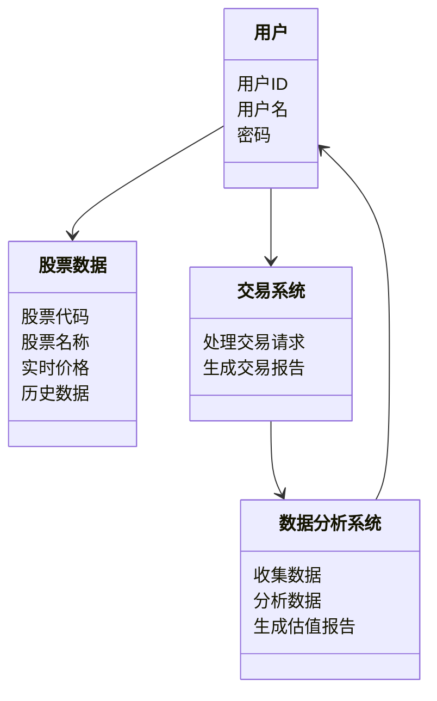
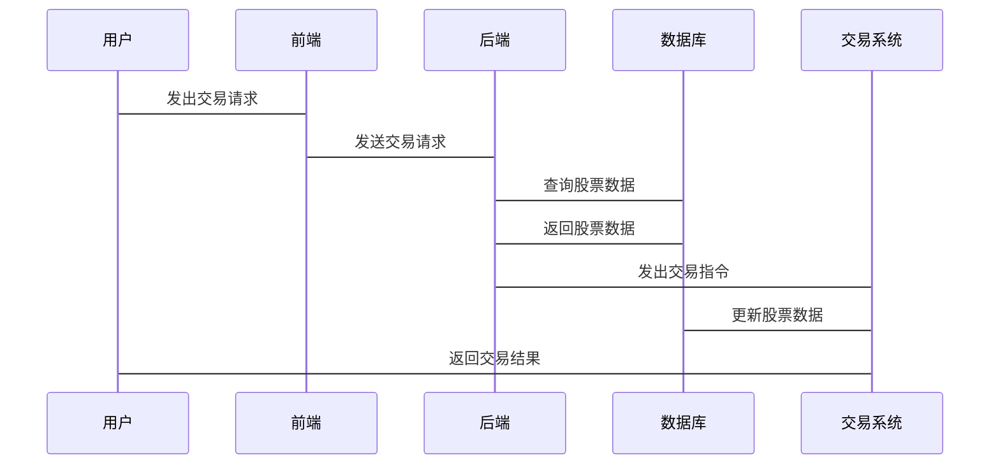

                 


# 全球股市估值与5G技术应用的关系

> 关键词：全球股市估值，5G技术，高频交易，实时数据分析，金融数据安全

> 摘要：本文探讨了5G技术对全球股市估值的影响，分析了5G技术的核心原理及其在金融服务业中的应用，建立了5G技术对股市估值的影响机制模型，并通过系统架构设计和项目实战验证了这一模型的可行性。

---

## 第一部分：背景介绍

### 第1章：全球股市估值与5G技术应用的背景

#### 1.1 问题背景

- **全球股市估值的重要性**：股市估值是衡量市场健康状况的重要指标，反映了投资者对市场未来表现的预期。准确的估值依赖于实时数据的处理和分析能力。

- **5G技术的快速发展与普及**：5G技术以其高速度、低延迟和大带宽的特点，正在改变各个行业的数据处理方式，特别是在金融领域，5G的应用潜力巨大。

- **5G技术对金融市场的潜在影响**：5G技术能够支持高频交易、智能投顾和实时数据分析等应用，这些应用将直接影响股市估值的计算和市场参与者的决策。

#### 1.2 问题描述

- **5G技术如何影响金融数据的传输和处理**：5G的高速和低延迟特性使得金融数据能够更实时地传输和处理，从而提高交易效率和数据准确性。

- **高频交易与实时数据分析的关联**：5G技术为高频交易提供了更稳定的网络环境，使得交易系统能够处理更大量的实时数据，从而影响股市估值。

- **5G在金融服务业中的具体应用场景**：5G技术可以用于智能投顾、实时市场监控和金融数据安全等方面，提升金融服务的效率和安全性。

#### 1.3 问题解决

- **提出利用5G技术提升金融数据分析效率的解决方案**：通过优化网络架构和数据处理流程，利用5G技术构建高效的金融数据分析平台。

- **通过案例分析验证5G对股市估值的影响**：通过具体案例分析，证明5G技术能够显著提升金融数据的处理能力，进而影响股市估值。

#### 1.4 边界与外延

- **5G技术应用的边界条件**：5G技术在金融领域的应用受到网络覆盖、设备兼容性和数据隐私等因素的限制。

- **5G技术在金融领域的外延应用**：5G技术不仅影响股市估值，还可以应用于智能金融设备、金融云服务等领域，进一步推动金融行业的数字化转型。

#### 1.5 概念结构与核心要素

- **核心概念的组成与关系**：5G技术、金融数据传输、高频交易、实时数据分析、股市估值之间的相互作用关系。

- **5G技术与股市估值的交互模型**：通过构建交互模型，展示5G技术如何通过提升数据传输和处理能力，进而影响股市估值的计算和市场参与者的决策。

---

## 第二部分：5G技术的核心原理

### 第2章：5G技术的核心原理与特性

#### 2.1 5G技术的主要特点

- **高频毫米波与大规模MIMO**：高频毫米波提供了更大的带宽，而大规模MIMO技术通过多天线技术提高了信道利用率和数据传输速率。

- **极低延迟与高速数据传输**：5G技术的低延迟和高速传输能力使得实时数据处理成为可能，这对高频交易和实时数据分析至关重要。

- **网络切片与边缘计算**：网络切片技术可以根据不同的应用场景灵活分配网络资源，而边缘计算技术将数据处理能力下沉到网络边缘，减少了数据传输延迟。

#### 2.2 5G网络架构

- **网络功能虚拟化（NFV）**：通过虚拟化技术实现网络功能的灵活部署和扩展，提高了网络的弹性和可扩展性。

- **边缘计算架构**：边缘计算将数据处理能力靠近数据源，减少了数据传输的距离，提高了处理效率。

- **5G核心网（NGC）的组成部分**：包括接入和移动管理功能（AMF）、会话管理功能（SMF）和用户平面功能（UPF）等，协同工作以实现高效的网络管理和数据传输。

#### 2.3 5G对金融数据传输的影响

- **高速数据传输对实时交易的影响**：5G的高速传输能力使得高频交易能够处理更大的数据量，提高了交易的效率和准确性。

- **低延迟对实时数据分析的影响**：低延迟确保了金融数据的实时传输和处理，使得实时数据分析和市场监控成为可能。

- **网络切片技术对金融数据安全的影响**：通过网络切片技术，可以为金融数据传输提供专用的网络通道，提高了数据传输的安全性和稳定性。

---

## 第三部分：5G技术在金融服务业中的应用

### 第3章：5G技术在金融服务业中的应用

#### 3.1 高频交易与实时数据分析

- **高频交易的定义与特点**：高频交易是指在极短的时间内进行大量交易，依赖于高速的数据传输和处理能力。

- **5G技术对高频交易的支持**：通过5G技术的高速和低延迟特性，高频交易系统可以更高效地处理大量的实时数据，提高交易速度和准确性。

- **实时数据分析的应用场景**：实时数据分析可以帮助投资者快速做出决策，优化投资策略，提高投资收益。

#### 3.2 智能投顾与金融数据安全

- **智能投顾的定义与特点**：智能投顾是利用人工智能技术为投资者提供个性化的投资建议，5G技术可以为智能投顾提供更强大的数据支持和处理能力。

- **5G技术对金融数据安全的影响**：通过增强的加密技术和实时监控，5G技术可以有效防止金融数据的泄露和篡改，提高了金融数据的安全性。

- **金融数据安全的重要性**：金融数据的安全性直接影响投资者的信心和市场的稳定性，5G技术在金融数据安全中的应用至关重要。

#### 3.3 5G技术对全球股市估值的影响

- **高频交易对股市估值的影响**：高频交易的快速发展可能导致市场的短期波动，进而影响股市估值的准确性。

- **实时数据分析对股市估值的影响**：通过实时数据分析，投资者可以更准确地评估市场的趋势和个股的价值，从而影响股市估值。

- **智能投顾对股市估值的影响**：智能投顾可以帮助投资者做出更明智的投资决策，优化市场资源配置，从而影响股市估值。

---

## 第四部分：5G技术对全球股市估值的影响机制

### 第4章：5G技术对全球股市估值的影响机制

#### 4.1 5G技术对股市估值的直接影响

- **高频交易的影响**：高频交易的高速和低延迟特性使得交易更加频繁，可能导致市场的短期波动，进而影响股市估值。

- **实时数据分析的影响**：实时数据分析可以帮助投资者更准确地评估市场的趋势和个股的价值，从而影响股市估值。

#### 4.2 5G技术对股市估值的间接影响

- **金融服务业的创新**：5G技术的应用推动了金融服务业的创新，如智能投顾和金融云服务等，这些创新可能影响市场的整体估值。

- **金融数据安全的影响**：5G技术在金融数据安全中的应用提高了市场的稳定性，从而间接影响股市估值。

#### 4.3 5G技术对股市估值的影响机制模型

- **模型构建**：通过构建数学模型，展示5G技术如何通过高频交易、实时数据分析和金融数据安全等途径影响股市估值。

- **模型验证**：通过实际数据和案例分析，验证模型的可行性和准确性。

---

## 第五部分：系统分析与架构设计方案

### 第5章：系统分析与架构设计方案

#### 5.1 问题场景介绍

- **问题场景**：如何利用5G技术构建高效的金融数据分析平台，提升股市估值的计算能力和准确性。

#### 5.2 项目介绍

- **项目目标**：构建基于5G技术的金融数据分析平台，支持高频交易和实时数据分析，提升股市估值的计算能力和准确性。

#### 5.3 系统功能设计

- **领域模型（Mermaid类图）**


- **系统架构设计（Mermaid架构图）**
```mermaid
client
    前端
        接收用户请求
        发送响应
    后端
        处理请求
        调用API
server
    数据库
        存储数据
        提供数据接口
    API接口
        提供数据查询和分析接口
```

- **系统接口设计**：定义系统的接口，包括用户接口、交易系统接口和数据分析系统接口，确保系统的高效运行和数据的准确传输。

- **系统交互（Mermaid序列图）**


#### 5.4 系统实现

- **系统实现细节**：详细描述系统实现的各个部分，包括前端、后端和数据库的设计与实现。

- **系统实现代码（Python示例）**
```python
def handle_transaction(request):
    # 解析请求
    stock_code = request['stock_code']
    quantity = request['quantity']
    
    # 查询股票数据
    stock_data = get_stock_data(stock_code)
    
    # 计算交易结果
    result = {
        'stock_code': stock_code,
        'quantity': quantity,
        'price': stock_data['current_price'],
        'total': stock_data['current_price'] * quantity
    }
    
    return result

# 数据库查询函数
def get_stock_data(stock_code):
    # 连接数据库
    db = connect_db()
    # 查询股票数据
    data = db.query(stock_code)
    db.close()
    return data
```

---

## 第六部分：项目实战

### 第6章：项目实战

#### 6.1 环境安装

- **环境需求**：安装必要的软件和工具，包括Python、数据库管理系统、5G网络设备等。

#### 6.2 系统核心实现源代码

```python
import requests
from datetime import datetime

def get_realtime_data(api_key):
    # 发送API请求
    response = requests.get(f'https://api.example.com/stock_data?api_key={api_key}')
    if response.status_code == 200:
        return response.json()
    else:
        return None

def analyze_data(data):
    # 数据分析逻辑
    metrics = {
        'average_price': sum([d['price'] for d in data]) / len(data),
        'volatility': max([d['price'] for d in data]) - min([d['price'] for d in data])
    }
    return metrics

# 实际案例分析
if __name__ == '__main__':
    api_key = 'your_api_key'
    data = get_realtime_data(api_key)
    if data:
        metrics = analyze_data(data)
        print(f"平均价格：{metrics['average_price']}")
        print(f"波动性：{metrics['volatility']}")
    else:
        print("数据获取失败")
```

#### 6.3 代码应用解读与分析

- **代码功能解读**：详细解读上述代码的功能，包括数据获取、数据分析和结果输出等部分。

- **实际案例分析**：通过具体案例分析，展示如何利用5G技术进行实时数据分析，并输出分析结果。

#### 6.4 项目小结

- **项目成果总结**：总结项目的主要成果，包括系统设计、实现和测试等方面。

- **经验总结与优化建议**：总结项目实施过程中的经验和教训，提出优化建议。

---

## 第七部分：最佳实践与未来展望

### 第7章：最佳实践与未来展望

#### 7.1 最佳实践

- **数据隐私保护**：在系统设计和实施过程中，必须重视数据隐私保护，确保金融数据的安全性和合法性。

- **系统兼容性**：在设计系统时，应考虑不同设备和网络环境的兼容性，确保系统的稳定性和可扩展性。

#### 7.2 未来展望

- **5G技术与人工智能的结合**：未来，5G技术可以与人工智能技术结合，进一步提升金融数据分析的能力和效率。

- **5G技术与区块链的结合**：通过与区块链技术的结合，5G技术可以进一步提升金融数据的安全性和透明度，推动金融行业的数字化转型。

---

## 附录

### 附录A：相关文献

- 列出与本文相关的文献和参考资源，供读者进一步查阅。

### 附录B：工具包下载链接

- 提供本文中使用工具和软件的下载链接，方便读者获取和安装。

### 附录C：术语表

- 列出文章中涉及的专业术语，并进行简要解释，帮助读者更好地理解文章内容。

---

通过以上结构和内容的安排，本文系统地探讨了5G技术对全球股市估值的影响，从技术原理到实际应用，再到系统设计和项目实战，为读者提供了全面而深入的分析和见解。

