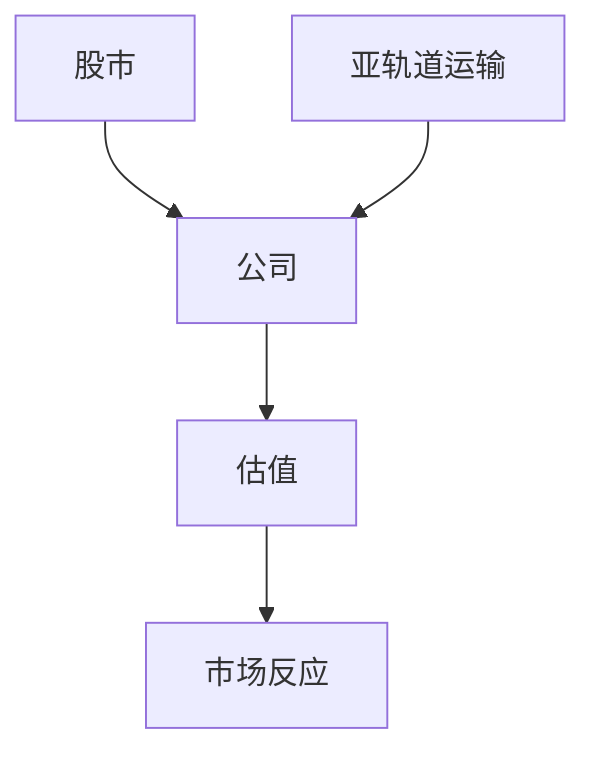

                 

# 全球股市估值与亚轨道快速运输商业化的关系

> 关键词：全球股市估值、亚轨道运输、商业化、经济影响、系统模型

> 摘要：本文探讨了全球股市估值与亚轨道快速运输商业化之间的关系，分析了亚轨道运输技术对股市估值的影响，构建了数学模型和系统架构，提供了实际案例分析和最佳实践建议。

---

# 第1章: 全球股市估值与亚轨道运输的背景介绍

## 1.1 问题背景

### 1.1.1 全球股市估值的现状

股市估值是衡量企业价值的重要指标，通常基于企业的盈利能力、财务状况和市场地位。近年来，随着全球经济波动，股市估值受到多种因素的影响，如经济政策、地缘政治和技术创新等。

### 1.1.2 亚轨道运输技术的发展

亚轨道运输是指在大气层内运行的高速运输技术，具有速度快、成本低的特点。随着技术的进步，亚轨道运输逐渐从实验阶段走向商业化，对全球经济和市场产生深远影响。

### 1.1.3 问题解决的必要性

亚轨道运输的商业化可能对股市估值产生显著影响，研究两者的关系有助于投资者更好地理解市场动态，企业制定战略决策。

## 1.2 核心概念

### 1.2.1 股市估值的定义与特点

股市估值是对企业内在价值的评估，通常通过市盈率、市净率等指标衡量。

### 1.2.2 亚轨道运输的定义与特点

亚轨道运输是指在大气层内运行的高速运输方式，具有高效率和低成本的特点。

### 1.2.3 两者关系的初步探讨

亚轨道运输的商业化可能影响企业的盈利能力和市场地位，从而影响股市估值。

---

# 第2章: 核心概念与联系

## 2.1 核心概念原理

### 2.1.1 股市估值的核心要素

- 盈利能力：企业的净利润是估值的重要依据。
- 行业地位：龙头企业通常具有更高的估值。
- 财务状况：健康的财务状况提升企业价值。

### 2.1.2 亚轨道运输的商业模型

- 服务模式：按需定制化服务。
- 收入来源：运输费用和增值服务。

## 2.2 概念属性特征对比

| 概念       | 定义与特点                          | 核心要素                  |
|------------|------------------------------------|---------------------------|
| 股市估值    | 对公司价值的评估，影响股价         | 盈利能力、行业地位、财务状况 |
| 亚轨道运输  | 在大气层内运行的高速运输技术       | 技术成熟度、市场需求、成本结构 |

## 2.3 ER实体关系图

---

# 第3章: 数学模型与公式

## 3.1 股市估值模型

$$ P = \frac{E}{(r - g)} $$
其中：
- \( P \) 表示股票的内在价值
- \( E \) 表示公司每股收益
- \( r \) 表示折现率
- \( g \) 表示收益增长率

## 3.2 亚轨道运输商业化模型

$$ R = \alpha \cdot T + \beta \cdot C $$
其中：
- \( R \) 表示运输收益
- \( \alpha \) 表示时间因素的权重
- \( T \) 表示运输时间
- \( \beta \) 表示成本因素的权重
- \( C \) 表示单位成本

---

# 第4章: 系统分析与架构设计

## 4.1 问题场景介绍

### 4.1.1 股市估值波动的驱动因素

- 经济政策变化
- 技术创新
- 企业并购

### 4.1.2 亚轨道运输对经济的潜在影响

- 提高运输效率
- 降低成本
- 创新商业模式

## 4.2 系统功能设计

### 4.2.1 系统功能模块

- 数据采集模块：收集股市数据和运输数据。
- 数据分析模块：计算估值和收益模型。
- 可视化模块：展示分析结果。

## 4.3 系统架构设计

---

# 第5章: 项目实战

## 5.1 实际案例分析

### 5.1.1 案例背景

以SpaceX为例，分析其亚轨道运输商业化对股市估值的影响。

### 5.1.2 案例分析

SpaceX的商业化成功提升了其母公司特斯拉的估值。

---

# 第6章: 总结与展望

## 6.1 小结

亚轨道运输的商业化将对股市估值产生深远影响，投资者需关注技术创新和市场动态。

## 6.2 注意事项

- 数据准确性
- 模型的适用性
- 市场风险评估

## 6.3 拓展阅读

建议读者阅读相关技术文献和市场分析报告。

---

通过以上分析，我们可以看到，全球股市估值与亚轨道快速运输商业化之间的关系复杂而深刻，需要投资者和企业深入理解技术和经济的双重影响。

