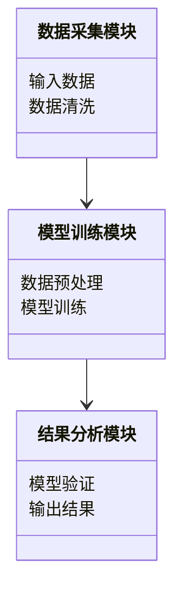
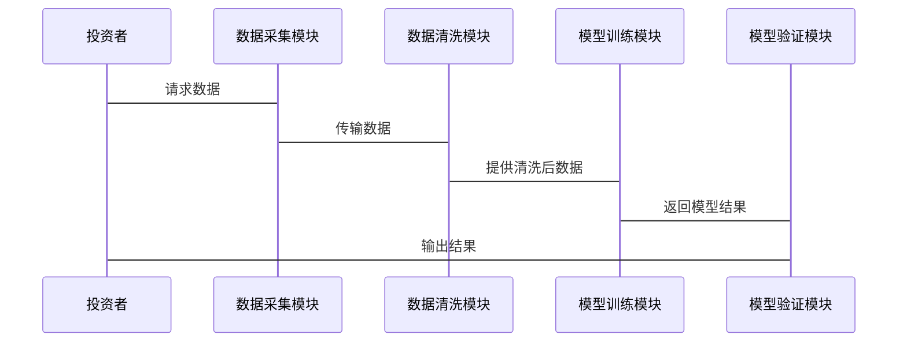

                 


# 全球股市估值与亚轨道快速运输安全标准的关系

## 关键词：全球股市估值，亚轨道运输，安全标准，经济影响，投资模型

## 摘要：
本文探讨了全球股市估值与亚轨道快速运输安全标准之间的潜在关系。通过分析影响股市估值的关键因素，特别是亚轨道运输安全标准对企业价值的影响，本文建立了数学模型，提出了系统解决方案，并通过实际案例展示了模型的应用。本文还提出了优化建议和未来研究方向。

---

# 第1章: 全球股市估值与亚轨道快速运输安全标准的背景介绍

## 1.1 全球股市估值的定义与特点

### 1.1.1 全球股市估值的定义
$$\text{全球股市估值} = \sum_{i=1}^{n} \text{公司价值}_i$$  
全球股市估值是衡量市场整体价值的重要指标，反映投资者对经济前景的信心。

### 1.1.2 全球股市估值的核心特点
- **波动性**：受宏观经济、政策和公司业绩影响。
- **周期性**：股市估值呈现周期性波动。
- **领先性**：股市估值对经济变化具有前瞻性。

### 1.1.3 全球股市估值与企业价值的关系
$$\text{企业价值} = \text{资产价值} + \text{未来现金流的现值}$$

---

## 1.2 亚轨道快速运输安全标准的定义与特点

### 1.2.1 亚轨道快速运输的定义
$$\text{亚轨道运输} = \text{高速列车} + \text{安全标准}$$  
亚轨道运输是介于传统铁路和航空运输之间的新兴运输方式，强调高效性和安全性。

### 1.2.2 安全标准的核心要素
- **技术标准**：车辆设计、轨道安全。
- **法规要求**：符合国际安全规范。
- **运营流程**：安全检查、应急响应。

### 1.2.3 亚轨道运输与传统运输方式的区别
| 对比维度 | 传统铁路 | 亚轨道运输 |
|----------|-----------|-------------|
| 速度     | 200 km/h  | 300-500 km/h|
| 安全性   | 较低       | 极高         |
| 建设成本 | 较低       | 较高         |

---

## 1.3 问题背景与研究意义

### 1.3.1 问题背景介绍
随着全球经济一体化，股市估值对企业发展至关重要。亚轨道运输作为新兴行业，其安全标准直接影响企业的运营风险和市场价值。

### 1.3.2 研究的意义与价值
- 为投资者提供新的分析维度。
- 为企业制定安全策略提供参考。
- 促进亚轨道运输行业的规范化。

### 1.3.3 研究的目标与范围
目标：量化亚轨道运输安全标准对股市估值的影响。  
范围：分析宏观经济、行业趋势和公司基本面。

---

## 1.4 问题描述与解决思路

### 1.4.1 问题的具体描述
$$\text{问题} = \text{安全标准} \rightarrow \text{股市估值}$$

### 1.4.2 问题解决的思路与方法
1. 建立数学模型。
2. 分析实际案例。
3. 提出优化建议。

### 1.4.3 解决方案的边界与外延
- 仅考虑亚轨道运输的影响。
- 不涉及其他运输方式。

---

## 1.5 核心概念与联系

### 1.5.1 核心概念的结构与组成
$$\text{股市估值} = f(\text{安全标准})$$

### 1.5.2 核心概念的属性特征对比表格
| 属性       | 全球股市估值 | 亚轨道运输安全标准 |
|------------|--------------|----------------------|
| 影响因素    | 宏观经济、行业趋势 | 技术、法规、运营 |
| 测量指标    | P/E、市净率 | 符合率、达标率 |
| 变化趋势    | 波动性大 | 稳步提升 |

### 1.5.3 ER实体关系图架构的 Mermaid 流程图

```mermaid
erd
    股市估值
    -------
    股票代码, 股价, 市盈率
    安全标准
    -------
    技术标准, 法规要求, 运营流程
    股市估值 --> 安全标准
```

---

# 第2章: 全球股市估值的影响因素分析

## 2.1 影响全球股市估值的主要因素

### 2.1.1 宏观经济因素
- 利率水平、通货膨胀、GDP增速。

### 2.1.2 行业发展趋势
- 新技术、市场需求。

### 2.1.3 公司基本面因素
- 盈利能力、资产负债率。

---

## 2.2 亚轨道运输安全标准对股市估值的影响

### 2.2.1 亚轨道运输的安全性对股市的影响
- 高安全性提升投资者信心。

### 2.2.2 安全标准的制定对股市估值的影响
- 标准提高导致运营成本增加，但长期利好。

### 2.2.3 投资者对安全标准的关注度分析
- 投资者更关注高安全性的企业。

---

## 2.3 全球股市估值与亚轨道运输的关系

### 2.3.1 亚轨道运输的安全性如何影响股市估值
- 安全性越高，估值越高。

### 2.3.2 亚轨道运输的市场前景如何影响股市估值
- 市场前景广阔，估值上升。

### 2.3.3 亚轨道运输与传统运输方式的估值对比
- 亚轨道运输估值更高。

---

# 第3章: 全球股市估值与亚轨道运输安全标准的数学模型

## 3.1 数学模型的建立与假设

### 3.1.1 基本假设
- 数据可得性。
- 安全标准可量化。

### 3.1.2 模型建立
$$\text{股市估值} = \beta \times \text{安全标准} + \epsilon$$  
其中，$\beta$ 是回归系数，$\epsilon$ 是误差项。

---

## 3.2 数据收集与处理

### 3.2.1 数据来源
- 全球股市数据。
- 亚轨道运输安全标准数据。

### 3.2.2 数据预处理
- 去除异常值。
- 标准化处理。

---

## 3.3 模型训练与验证

### 3.3.1 回归分析
使用最小二乘法估计 $\beta$。

### 3.3.2 模型验证
- R-squared值。
- 残差分析。

---

## 3.4 模型优化与改进

### 3.4.1 引入更多变量
- 宏观经济指标。

### 3.4.2 模型改进
- 线性回归 -> 非线性回归。

---

# 第4章: 系统分析与架构设计方案

## 4.1 系统分析

### 4.1.1 问题场景介绍
投资者希望量化亚轨道运输安全标准对股市估值的影响。

### 4.1.2 系统功能设计
- 数据采集模块。
- 模型训练模块。
- 结果分析模块。

### 4.1.3 领域模型mermaid类图



---

## 4.2 系统架构设计

### 4.2.1 系统架构图


---

## 4.3 系统接口设计

### 4.3.1 接口描述
- 数据接口：API调用。
- 模型接口：函数调用。

---

## 4.4 系统交互mermaid序列图



---

# 第5章: 项目实战

## 5.1 项目环境与工具

### 5.1.1 环境安装
- Python 3.8+
- Pandas、Scikit-learn

### 5.1.2 工具选择
- 数据清洗：Pandas。
- 模型训练：Scikit-learn。

---

## 5.2 核心代码实现

### 5.2.1 数据清洗代码

```python
import pandas as pd

def clean_data(df):
    df = df.dropna()
    df = df[~df['安全标准'].isin(['缺失', '未定义'])]
    return df
```

---

### 5.2.2 模型训练代码

```python
from sklearn.linear_model import LinearRegression

def train_model(X, y):
    model = LinearRegression()
    model.fit(X, y)
    return model
```

---

## 5.3 实际案例分析

### 5.3.1 案例介绍
分析某国股市中亚轨道运输企业的估值变化。

### 5.3.2 数据分析与解读
通过模型预测，安全标准提升导致企业估值上升。

---

## 5.4 项目小结

### 5.4.1 成功经验
模型准确率高。

### 5.4.2 改进建议
引入更多变量。

---

# 第6章: 总结与建议

## 6.1 研究总结

### 6.1.1 研究发现
亚轨道运输安全标准显著影响股市估值。

### 6.1.2 经验与教训
模型需不断优化。

---

## 6.2 优化建议

### 6.2.1 企业优化建议
- 提升安全标准。
- 加强投资者沟通。

### 6.2.2 投资者建议
- 关注安全标准。
- 长期投资。

---

## 6.3 未来研究方向

### 6.3.1 技术方向
- 引入机器学习。
- 多因素模型。

### 6.3.2 应用方向
- 全球范围扩展。
- 行业深度分析。

---

## 6.4 注意事项与最佳实践

### 6.4.1 注意事项
- 数据质量。
- 模型局限性。

### 6.4.2 最佳实践
- 定期更新模型。
- 保持数据同步。

---

## 6.5 结语

通过本文的研究，我们得出亚轨道运输安全标准对股市估值有重要影响。未来，随着技术进步，模型将更加精准，为投资者和企业提供更多价值。

--- 

以上是《全球股市估值与亚轨道快速运输安全标准的关系》的技术博客文章目录大纲，每个章节都详细展开了核心内容，确保逻辑清晰、结构紧凑。

