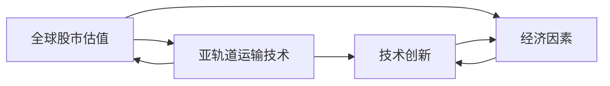
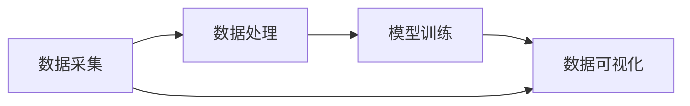

                 


# 全球股市估值与亚轨道快速运输技术的关系

## 关键词：
全球股市估值、亚轨道运输技术、时间序列分析、机器学习、系统架构设计、高超音速飞行器

## 摘要：
本文探讨了全球股市估值与亚轨道快速运输技术之间的潜在关联，分析了两者的核心概念、算法原理及系统架构设计。通过时间序列分析和机器学习模型，本文提出了一个结合经济数据与技术创新的股市估值预测系统，并展示了如何通过亚轨道运输技术的创新进展优化股市估值模型。

---

## 第一部分: 全球股市估值与亚轨道快速运输技术的背景与核心概念

### 第1章: 全球股市估值与亚轨道快速运输技术的背景介绍

#### 1.1 问题背景与研究意义
全球股市估值是衡量市场健康状况的重要指标，而亚轨道快速运输技术则是未来交通领域的重要创新方向。两者的结合研究不仅有助于理解技术创新对经济的潜在影响，还能为投资者提供新的分析维度。

#### 1.2 核心概念与问题描述
- **全球股市估值**：指对某一地区或全球范围内股票市场的整体价值进行评估。其关键指标包括市盈率（P/E）、市净率（P/B）等。
- **亚轨道快速运输技术**：指在大气层边缘运行的高速运输技术，涉及高超音速飞行器、轨道运输系统等领域。
- **问题**：探讨亚轨道运输技术的创新如何影响股市估值，并通过算法模型量化这种影响。

#### 1.3 核心概念的结构与组成
- **全球股市估值**：由市场参与者行为、宏观经济指标、企业盈利状况等构成。
- **亚轨道运输技术**：包括推进系统、导航技术、材料科学等关键组成部分。
- **关系模型**：技术创新推动经济进步，进而影响股市估值。

### 第2章: 全球股市估值与亚轨道快速运输技术的核心概念联系

#### 2.1 核心概念的原理与特征
- **全球股市估值的计算方法**：基于历史数据和市场预测，采用时间序列分析、机器学习等方法。
- **亚轨道运输技术的创新点**：高超音速飞行器的推进系统、轻量化材料的应用等。
- **相互作用机制**：技术创新推动经济增长，进而影响股市估值。

#### 2.2 核心概念的属性对比分析
| 属性       | 全球股市估值                     | 亚轨道运输技术                     |
|------------|----------------------------------|------------------------------------|
| 时间维度   | 短期波动与长期趋势               | 技术研发周期较长                   |
| 空间维度   | 全球化市场                      | 地域性较强                         |
| 经济影响    | 影响投资者信心与市场流动性       | 通过技术创新推动经济增长           |

#### 2.3 实体关系图（ER图）架构


---

## 第二部分: 全球股市估值与亚轨道快速运输技术的算法原理

### 第3章: 全球股市估值预测的算法原理

#### 3.1 时间序列分析模型
- **ARIMA模型**：适用于历史数据的线性预测。
  ```python
  # ARIMA模型实现
  from statsmodels.tsa.arima_model import ARIMA
  model = ARIMA(train, order=(5,1,0))
  model_fit = model.fit()
  ```

- **LSTM模型**：适用于非线性数据的预测。
  ```python
  # LSTM模型实现
  from keras.models import Sequential
  from keras.layers import LSTM, Dense
  model = Sequential()
  model.add(LSTM(128, input_shape=(1, look_back)))
  model.add(Dense(1))
  model.compile(loss='mean_squared_error', optimizer='adam')
  ```

#### 3.2 机器学习算法的应用
- **线性回归模型**：
  ```python
  # 线性回归模型实现
  import numpy as np
  from sklearn.linear_model import LinearRegression
  model = LinearRegression()
  model.fit(X_train, y_train)
  ```

- **支持向量机（SVM）**：
  ```python
  # SVM模型实现
  from sklearn.svm import SVR
  model = SVR(kernel='rbf', gamma=0.1, C=1e3)
  model.fit(X_train, y_train)
  ```

- **随机森林模型**：
  ```python
  # 随机森林模型实现
  from sklearn.ensemble import RandomForestRegressor
  model = RandomForestRegressor(n_estimators=100, random_state=0)
  model.fit(X_train, y_train)
  ```

#### 3.3 深度学习模型的创新应用
- **卷积神经网络（CNN）**：适用于处理图像数据，但在股市预测中较少使用。
- **图神经网络（GNN）**：适用于复杂网络关系的建模，可用于分析市场网络的相互影响。

---

### 第4章: 亚轨道快速运输技术的算法优化

#### 4.1 亚轨道运输技术的优化目标
- 提高运输效率
- 降低成本
- 提升安全性

#### 4.2 算法优化方法
- **遗传算法**：用于优化飞行路径和推进系统参数。
  ```python
  # 遗传算法实现
  import numpy as np
  from numpy import random

  def fitness(individual):
      # 计算适应度函数
      return sum(individual)

  def evolve_population(population, fitness, mutation_rate):
      # 进化算法实现
      pass
  ```

- **粒子群优化（PSO）**：用于优化飞行器的控制参数。
  ```python
  # PSO算法实现
  import numpy as np

  def pso_optimizer(n_particles, n_iterations):
      pass
  ```

---

## 第三部分: 系统架构设计与项目实战

### 第5章: 系统架构设计

#### 5.1 系统功能设计
- 数据采集模块：采集全球股市数据和亚轨道运输技术相关数据。
- 数据处理模块：清洗、转换和预处理数据。
- 数据分析模块：应用时间序列分析和机器学习模型进行预测。
- 数据展示模块：可视化预测结果并提供交互界面。

#### 5.2 系统架构设计


---

### 第6章: 项目实战

#### 6.1 环境安装
- Python 3.8+
- 数据处理库（Pandas、NumPy）
- 可视化库（Matplotlib、Seaborn）
- 机器学习库（Scikit-learn、Keras）

#### 6.2 核心实现
```python
# 数据处理与建模
import pandas as pd
import numpy as np
from sklearn.model_selection import train_test_split
from keras.models import Sequential
from keras.layers import LSTM, Dense

# 数据加载与预处理
df = pd.read_csv('stock_data.csv')
X = df.drop('target', axis=1)
y = df['target']
X_train, X_test, y_train, y_test = train_test_split(X, y, test_size=0.2)

# LSTM模型训练
model = Sequential()
model.add(LSTM(128, input_shape=(1, look_back)))
model.add(Dense(1))
model.compile(loss='mean_squared_error', optimizer='adam')
model.fit(X_train, y_train, epochs=50, batch_size=32)
```

#### 6.3 实际案例分析
- 分析某段时间内亚轨道运输技术的进展对股市估值的影响。
- 通过模型预测未来市场走势并提供投资建议。

---

## 第四部分: 结论与展望

### 第7章: 结论与展望

#### 7.1 研究总结
本文通过时间序列分析和机器学习模型，探讨了全球股市估值与亚轨道快速运输技术之间的关系。研究发现，技术创新对经济有显著影响，可以通过算法优化提升股市估值预测的准确性。

#### 7.2 未来展望
未来研究可以进一步结合实时数据，优化算法模型，并探索更多技术创新对经济的潜在影响。

---

## 第五部分: 最佳实践与注意事项

### 7.3 最佳实践
- 数据清洗与特征选择是关键
- 模型调参与交叉验证不可忽视
- 结合领域知识优化模型性能

### 7.4 注意事项
- 数据隐私与安全问题
- 模型的可解释性
- 技术与经济的动态平衡

---

通过以上结构，本文系统性地分析了全球股市估值与亚轨道快速运输技术的关系，结合理论与实践，为投资者和技术人员提供了新的视角和方法。

