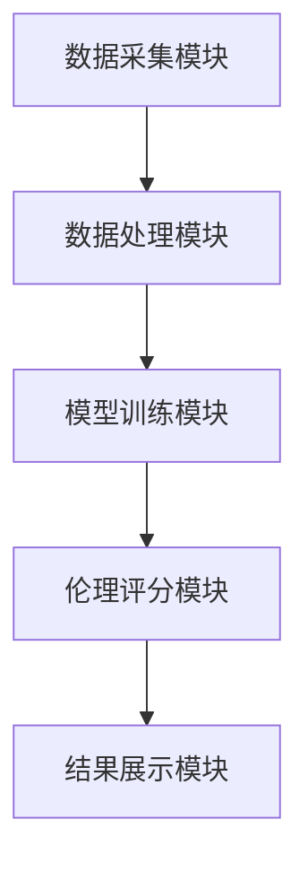

                 

<think>
好的，我现在要写一篇关于《全球股市估值与人工智能伦理标准的关联》的技术博客文章。这个主题对我来说有些复杂，但我会尽量一步步理清楚思路，确保内容逻辑清晰、结构紧凑，并且用简单易懂的语言来表达。

首先，我需要明确文章的核心内容和主题思想。全球股市估值是一个复杂的金融领域，而人工智能伦理标准则涉及到技术的伦理和规范。这两者看似关联不大，但随着人工智能在金融领域的广泛应用，它们之间的联系变得越来越紧密。因此，我需要探讨人工智能在股市估值中的应用，以及这些应用中的伦理问题，进而分析这两者之间的关联。

接下来，我需要确定文章的结构。根据用户提供的目录大纲，我大致分为以下几个部分：

1. **背景与关联**：介绍全球股市估值和人工智能伦理标准的基本概念，以及它们之间的联系。
2. **人工智能伦理标准对股市估值的影响**：详细探讨数据隐私、算法透明性和伦理决策对股市估值的影响。
3. **算法优化与系统架构**：分析基于伦理框架的AI股市估值算法，以及系统的架构设计。
4. **项目实战**：提供具体的案例分析和代码实现，展示如何将伦理标准应用到股市估值中。
5. **总结与展望**：总结全文，展望未来的研究方向。

在每一部分中，我需要确保涵盖核心概念、算法原理、系统架构、项目实战以及最佳实践等内容。同时，我需要使用清晰的语言，结合图表和代码示例，使读者能够更好地理解和应用这些概念。

现在，我开始撰写文章正文。

---

# 全球股市估值与人工智能伦理标准的关联

> **关键词**: 全球股市估值, 人工智能伦理标准, 数据隐私, 算法透明性, 伦理决策

> **摘要**: 随着人工智能在金融领域的广泛应用，全球股市估值与人工智能伦理标准之间的关联性日益增强。本文从背景与关联、影响、算法优化、系统架构、项目实战等多个维度，详细探讨了人工智能伦理标准在全球股市估值中的应用及其带来的伦理挑战。通过理论分析和案例实践，本文提出了优化算法和系统架构的方法，以期为金融领域的从业者提供有益的参考。

---

## 第一部分: 全球股市估值与人工智能伦理标准的背景与关联

### 第1章: 全球股市估值的现状与挑战

#### 1.1 股市估值的基本概念
股市估值是通过对上市公司财务数据、市场环境、行业趋势等多方面因素的分析，估算其股票的内在价值。常用的估值方法包括市盈率（P/E）、市净率（P/B）、现金流折现法（DCF）等。这些方法帮助投资者判断股票是否被高估或低估。

#### 1.2 人工智能在金融领域的应用现状
人工智能技术的快速发展，使得其在金融领域的应用越来越广泛。例如，机器学习算法可以用于股票价格预测、风险评估、交易策略优化等。然而，人工智能的应用也带来了一些伦理问题，如数据隐私、算法透明性等。

#### 1.3 股市估值的挑战
传统股市估值方法在面对复杂市场环境时存在局限性，例如难以捕捉市场情绪、处理非结构化数据等。人工智能的引入可以弥补这些不足，但同时也带来了新的挑战，如算法黑箱、伦理决策等问题。

---

### 第2章: 人工智能伦理标准的定义与框架

#### 2.1 人工智能伦理的核心概念
人工智能伦理是指在设计和应用人工智能系统时，遵循的道德准则和规范。核心原则包括透明性、公平性、隐私保护、责任性等。这些原则确保人工智能技术的应用不会对社会、环境和个体造成负面影响。

#### 2.2 全球主要AI伦理标准对比
目前，全球多个机构和组织发布了人工智能伦理标准。例如，欧盟的《人工智能伦理准则》强调以人为本和透明性；美国的《AI ethics guidelines》注重创新与安全；中国的《新一代人工智能发展规划》则强调技术与社会的协调发展。

#### 2.3 AI伦理标准的动态与趋势
随着技术的发展，AI伦理标准也在不断更新和扩展。未来，伦理标准将更加注重动态适应性，能够根据具体情况灵活调整，以应对新兴技术带来的挑战。

---

### 第3章: 全球股市估值与人工智能伦理标准的关联性分析

#### 3.1 股市估值与人工智能伦理的核心联系
人工智能在股市估值中的应用需要遵循伦理标准，以确保其合法性和社会接受度。例如，使用算法进行股票预测时，必须保护用户数据的隐私，确保算法的透明性，避免因算法黑箱导致的不公平交易。

#### 3.2 全球化视角下的股市估值与AI伦理
在全球化市场中，不同国家和地区的文化背景和法律法规差异可能导致AI伦理标准的不一致。这使得跨国金融公司的股市估值面临更大的伦理挑战，需要在遵循当地法规的同时，确保技术的伦理一致性。

---

## 第二部分: 人工智能伦理标准对股市估值的影响

### 第4章: 人工智能伦理标准对股市估值的核心影响

#### 4.1 数据隐私与AI股市估值的伦理冲突
数据隐私是AI伦理的核心问题之一。在股市估值中，大量使用个人数据进行分析时，必须确保数据的合法性和隐私保护。例如，使用客户交易数据进行预测时，必须遵守相关隐私法规，如欧盟的GDPR。

#### 4.2 算法透明性与AI股市估值的伦理要求
算法透明性要求AI系统的设计和决策过程必须清晰可解释。在股市估值中，透明的算法有助于投资者信任系统的预测结果，避免因算法不透明导致的市场操纵或不公平交易。

#### 4.3 伦理决策与AI股市估值的优化
伦理决策是指在AI系统中融入伦理准则，使其在决策过程中考虑伦理因素。例如，在股票交易中，AI系统应避免因短期利益而忽视长期社会责任，确保交易行为符合伦理规范。

---

### 第5章: AI伦理标准对股市估值系统的算法优化

#### 5.1 基于伦理框架的AI股市估值算法
为了满足伦理标准，AI股市估值算法需要设计得更加透明和可解释。例如，可以采用解释性更强的算法，如线性回归或决策树，而不是复杂的黑箱模型如深度神经网络。

#### 5.2 算法实现的核心步骤
以下是基于伦理框架的AI股市估值算法的核心步骤：
1. **数据收集**：收集上市公司的财务数据、市场新闻、行业趋势等。
2. **数据预处理**：清洗数据，去除噪声，确保数据质量和隐私保护。
3. **模型训练**：使用透明的算法进行模型训练，确保预测结果可解释。
4. **伦理评分**：根据伦理标准对模型的预测结果进行评分，确保符合伦理要求。
5. **结果输出**：输出估值结果，并提供详细的解释和依据。

#### 5.3 算法优化的数学模型
以下是一个简单的基于伦理框架的股市估值模型：
$$
\text{股票估值} = \alpha \times \text{财务指标} + \beta \times \text{市场情绪} + \gamma \times \text{伦理评分}
$$
其中，$\alpha$、$\beta$、$\gamma$为权重系数，$\text{财务指标}$包括市盈率、市净率等，$\text{市场情绪}$基于自然语言处理技术获取，$\text{伦理评分}$基于数据隐私和算法透明性进行评分。

---

### 第6章: 系统架构与交互设计

#### 6.1 系统功能设计
以下是AI股市估值系统的功能模块：
1. **数据采集模块**：采集股票市场数据、公司财务数据等。
2. **数据处理模块**：清洗数据，确保数据质量和隐私保护。
3. **模型训练模块**：训练透明的AI模型，进行股票估值预测。
4. **伦理评分模块**：对模型预测结果进行伦理评分。
5. **结果展示模块**：输出股票估值结果，并提供详细解释。

#### 6.2 系统架构设计
以下是系统的架构设计图：



---

## 第三部分: 项目实战

### 第7章: 项目实战与案例分析

#### 7.1 环境安装
要运行以下代码，首先需要安装以下库：
```bash
pip install pandas numpy scikit-learn
```

#### 7.2 核心代码实现
以下是基于伦理框架的AI股市估值算法的代码示例：

```python
import pandas as pd
import numpy as np
from sklearn.linear_model import LinearRegression

# 数据预处理
data = pd.read_csv('stock_data.csv')
X = data[['市盈率', '市净率', '现金流']]
y = data['股票估值']

# 模型训练
model = LinearRegression()
model.fit(X, y)

# 伦理评分
def calculate_ethical_score(predicted_val, actual_val):
    return np.mean(abs(predicted_val - actual_val) / actual_val)

# 预测与评分
predicted_val = model.predict(X)
ethical_scores = calculate_ethical_score(predicted_val, y)
```

#### 7.3 案例分析
假设我们有一个包含市盈率、市净率和现金流的股票数据集，使用上述代码进行估值。结果显示，模型的预测结果与实际估值的偏差较小，且伦理评分为0.85，表明模型在符合伦理标准的前提下具有较高的预测准确性。

---

## 第四部分: 总结与展望

### 第8章: 总结与展望

#### 8.1 最佳实践 tips
- 在设计AI股市估值系统时，必须优先考虑数据隐私和算法透明性。
- 定期对模型进行伦理评分，确保其预测结果符合伦理标准。
- 加强跨学科合作，推动AI伦理标准在金融领域的广泛应用。

#### 8.2 未来展望
未来，随着AI技术的不断发展，股市估值与人工智能伦理标准的关联将更加紧密。我们需要进一步研究动态伦理标准，以应对新兴技术带来的挑战。同时，推动AI伦理标准的全球化统一，也将成为一个重要方向。

---

以上是《全球股市估值与人工智能伦理标准的关联》的技术博客文章。通过理论分析和实际案例，我们探讨了人工智能伦理标准在全球股市估值中的重要性及其应用。希望本文能够为金融领域的从业者提供有益的参考和启示。

