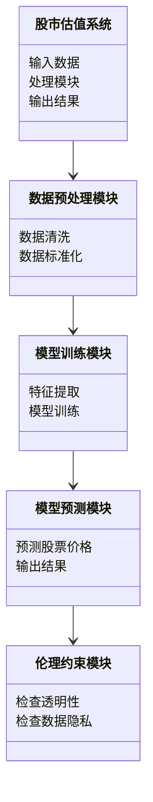
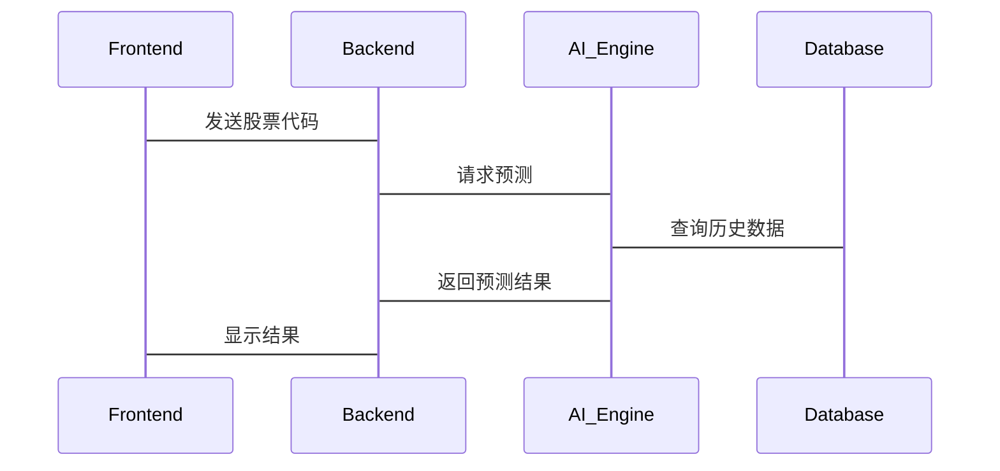

                 


# 全球股市估值与人工智能伦理的关联

## 关键词：全球股市估值、人工智能、伦理、金融应用、机器学习、自然语言处理

## 摘要：本文探讨了人工智能在全球股市估值中的应用及其伦理问题。通过分析AI技术如何提升股市估值的准确性，同时讨论了伦理约束对AI金融应用的影响。结合实际案例和数学模型，本文提出了构建一个结合AI伦理的股市估值系统的方案，并展望了未来的研究方向。

---

## 第一部分: 全球股市估值与人工智能伦理的背景与关联

### 第1章: 全球股市估值与人工智能伦理的背景介绍

#### 1.1 问题背景

- **1.1.1 全球股市估值的基本概念**
  - 股市估值的定义与意义
  - 传统估值方法的局限性

- **1.1.2 人工智能在金融领域的应用现状**
  - AI技术在金融行业的应用领域
  - 当前AI在股市分析中的典型应用

- **1.1.3 问题的提出与研究意义**
  - AI技术如何解决传统估值方法的不足
  - 研究AI伦理对股市估值的影响的重要性

#### 1.2 问题描述

- **1.2.1 股市估值的传统方法与局限性**
  - 市盈率、市净率等传统估值指标的优缺点
  - 传统分析方法在应对复杂市场环境中的不足

- **1.2.2 人工智能在股市估值中的潜力与挑战**
  - 机器学习、深度学习在预测股票价格中的应用
  - 数据量、算法复杂度带来的计算挑战

- **1.2.3 伦理问题在AI金融应用中的重要性**
  - AI算法的不可解释性对投资决策的影响
  - 数据偏见对市场公平性的威胁

#### 1.3 问题解决

- **1.3.1 AI技术如何提升股市估值的准确性**
  - 机器学习模型在时间序列分析中的应用
  - 自然语言处理技术在财经新闻分析中的应用

- **1.3.2 伦理问题对AI金融应用的约束与影响**
  - 透明性与可解释性对AI算法的要求
  - 数据隐私与安全对金融系统的保护

- **1.3.3 全球化视角下的股市估值与AI伦理的结合**
  - 不同市场环境下AI伦理的适用性
  - 全球化背景下的数据共享与伦理协调

#### 1.4 边界与外延

- **1.4.1 股市估值的边界条件**
  - 数据来源的限制
  - 市场波动的不可预测性

- **1.4.2 人工智能伦理的适用范围**
  - 伦理原则在不同金融场景中的适用性
  - 伦理框架的可扩展性

- **1.4.3 两者的关联性与独立性**
  - AI技术对股市估值的推动作用
  - 伦理约束对AI技术应用的优化作用

#### 1.5 概念结构与核心要素

- **1.5.1 股市估值的核心要素**
  - 市场数据、公司基本面、宏观经济指标
  - 投资者情绪、市场流动性

- **1.5.2 人工智能伦理的核心要素**
  - 透明性、可解释性、数据隐私、道德责任
  - 算法公平性、用户知情权、数据安全

- **1.5.3 两者的关联性分析**
  - AI技术如何影响股市估值的准确性与公平性
  - 伦理约束如何优化AI在金融中的应用

---

## 第二部分: 全球股市估值与人工智能伦理的核心概念与联系

### 第2章: 核心概念与联系

#### 2.1 AI在股市估值中的核心原理

- **2.1.1 机器学习模型在股市预测中的应用**
  - 监督学习、无监督学习、强化学习在股市分析中的应用
  - 时间序列分析与股票价格预测

- **2.1.2 自然语言处理在财经新闻中的应用**
  - 文本挖掘、情感分析在市场情绪分析中的作用
  - 信息抽取与新闻事件对股价的影响

- **2.1.3 时间序列分析与股票价格预测**
  - LSTM与GRU在时间序列预测中的应用
  - 结合技术指标与市场情绪的多因素预测模型

#### 2.2 人工智能伦理的核心原则

- **2.2.1 透明性与可解释性**
  - AI决策过程的可解释性对投资者信任的重要性
  - 伦理透明性对算法决策的可追溯性要求

- **2.2.2 道德责任与 accountability**
  - AI系统开发者、金融机构的道德责任
  - 错误决策的责任归属与法律后果

- **2.2.3 数据隐私与安全**
  - 金融数据的敏感性与保护要求
  - 数据泄露对市场公平性的影响

#### 2.3 股市估值与AI伦理的联系

- **2.3.1 AI算法的黑箱问题与股市估值的不确定性**
  - 不可解释性对投资决策的影响
  - 黑箱算法的风险与伦理问题

- **2.3.2 数据偏见对股市估值的影响**
  - 历史数据偏见对预测模型的影响
  - 偏见对市场公平性与投资者权益的威胁

- **2.3.3 伦理约束对AI金融应用的优化作用**
  - 伦理框架对算法设计的指导作用
  - 伦理约束如何提高算法的公平性与准确性

#### 2.4 核心概念对比分析

- **2.4.1 股市估值与AI伦理的对比表格**
  | 比较维度 | 股市估值 | AI伦理 |
  |----------|----------|--------|
  | 核心目标 | 判断股票价值 | 确保技术应用的道德性 |
  | 主要工具 | 金融模型、数据分析 | 伦理框架、法律法规 |
  | 关键挑战 | 数据不足、市场波动 | 算法不可解释性、数据隐私 |
  | 应用场景 | 股票交易、投资决策 | 金融系统设计、政策制定 |

- **2.4.2 ER实体关系图架构**
  ```mermaid
  graph TD
      A(股市估值) --> B(AI技术)
      B --> C(伦理约束)
      A --> D(投资者决策)
      C --> D
      A --> E(市场数据)
  ```

---

## 第三部分: 人工智能伦理与股市估值的算法原理

### 第3章: 算法原理与数学模型

#### 3.1 AI算法在股市估值中的应用

- **3.1.1 机器学习算法流程图（Mermaid）**
  ```mermaid
  graph TD
      A[数据预处理] --> B[特征提取]
      B --> C[模型训练]
      C --> D[模型预测]
      D --> E[结果评估]
  ```

- **3.1.2 时间序列预测模型（LSTM）**
  - LSTM网络结构
  - 模型训练流程

- **3.1.3 代码实现**
  ```python
  import numpy as np
  import tensorflow as tf
  from tensorflow.keras import layers

  # 示例代码：LSTM模型训练
  def create_model(input_shape):
      model = tf.keras.Sequential()
      model.add(layers.LSTM(64, input_shape=input_shape))
      model.add(layers.Dense(1))
      model.compile(optimizer='adam', loss='mean_squared_error')
      return model

  # 数据准备
  data = np.random.randn(1000, 1).reshape(-1, 1)
  input_shape = (None, 1)
  model = create_model(input_shape)
  model.fit(data, data, epochs=10, batch_size=32)
  ```

- **3.1.4 数学模型与公式**
  - LSTM单元的遗忘门、输入门、输出门公式
  - 损失函数与优化器的选择

#### 3.2 自然语言处理在财经新闻中的应用

- **3.2.1 文本向量化（如Word2Vec、BERT）**
  - 向量表示方法的优缺点

- **3.2.2 情感分析模型**
  - 基于深度学习的情感分析模型

- **3.2.3 代码实现**
  ```python
  from transformers import pipeline

  # 示例代码：情感分析
  classifier = pipeline("sentiment-analysis")
  result = classifier("Company's Q3 earnings beat expectations")
  print(result)
  ```

#### 3.3 伦理约束对算法的影响

- **3.3.1 算法透明性与可解释性**
  - 解释性模型（如线性回归）与黑箱模型（如深度学习）的对比

- **3.3.2 数据隐私与安全**
  - 数据加密与匿名化处理

---

## 第四部分: 系统分析与架构设计

### 第4章: 系统分析与架构设计方案

#### 4.1 问题场景介绍

- **4.1.1 系统目标**
  - 构建一个结合AI伦理的股市估值系统

- **4.1.2 项目介绍**
  - 系统功能模块划分

#### 4.2 系统功能设计（领域模型Mermaid类图）



#### 4.3 系统架构设计（Mermaid架构图）


#### 4.4 系统接口设计

- **4.4.1 接口描述**
  - 前端接口：API请求与响应格式
  - 后端接口：数据处理与模型调用

#### 4.5 系统交互（Mermaid序列图）



---

## 第五部分: 项目实战

### 第5章: 项目实战

#### 5.1 环境安装

- **5.1.1 安装Python与相关库**
  - 安装TensorFlow、Keras、Transformers等库

#### 5.2 系统核心实现源代码

- **5.2.1 数据预处理代码**
  ```python
  import pandas as pd

  data = pd.read_csv('stock_data.csv')
  data = data.dropna()
  ```

- **5.2.2 模型训练代码**
  ```python
  model = create_model((None, 1))
  model.fit(data, data, epochs=10, batch_size=32)
  ```

- **5.2.3 模型预测代码**
  ```python
  predictions = model.predict(new_data)
  ```

#### 5.3 代码应用解读与分析

- **5.3.1 代码功能分析**
  - 数据预处理：清洗和标准化数据
  - 模型训练：构建与训练AI模型
  - 模型预测：生成股票价格预测结果

#### 5.4 实际案例分析

- **5.4.1 数据来源与预处理**
  - 数据清洗与特征提取

- **5.4.2 模型训练与评估**
  - 训练结果分析与优化

- **5.4.3 案例分析与解读**
  - 预测结果与实际数据的对比分析

#### 5.5 项目小结

- **5.5.1 项目总结**
  - 项目目标的实现情况
  - 系统性能与稳定性分析

- **5.5.2 经验与教训**
  - 开发过程中的问题与解决方案
  - 系统优化的方向

---

## 第六部分: 最佳实践与小结

### 第6章: 最佳实践

#### 6.1 最佳实践 tips

- **6.1.1 系统设计建议**
  - 模块化设计与可扩展性
  - 伦理约束的嵌入式设计

- **6.1.2 数据管理建议**
  - 数据隐私保护措施
  - 数据备份与恢复策略

- **6.1.3 系统优化建议**
  - 模型性能优化
  - 算法透明性与可解释性提升

#### 6.2 小结

- **6.2.1 全文总结**
  - 本文的主要内容与研究成果
  - 系统设计与实现的主要收获

- **6.2.2 未来研究方向**
  - 新型AI算法在股市估值中的应用
  - 伦理约束对AI金融应用的进一步研究

#### 6.3 注意事项

- **6.3.1 开发过程中的注意事项**
  - 数据质量控制
  - 算法选择与优化
  - 伦理约束的实施细节

- **6.3.2 系统部署与维护**
  - 系统监控与维护
  - 数据更新与模型再训练

#### 6.4 拓展阅读

- **6.4.1 推荐书籍与论文**
  - 人工智能领域的经典著作
  - 金融伦理相关的学术论文

- **6.4.2 其他推荐阅读资源**
  - 行业报告、技术博客、在线课程

---

## 附录: 参考文献与代码仓库

- **附录A 参考文献**
  - 列出相关书籍、论文、技术文档等

- **附录B 代码仓库**
  - 提供GitHub或其他代码托管平台的链接
  - 提供代码仓库的使用说明

---

## 索引

- 按照文章内容，提供术语索引
- 按照章节顺序，提供主要概念和术语的索引

---

## 致谢

- 感谢读者、合作伙伴、技术支持等

---

通过以上目录大纲，您可以逐步展开每部分内容，确保每个章节都包含详细的技术细节和实际案例分析，同时结合数学模型和算法流程图，确保文章的逻辑性和专业性。

