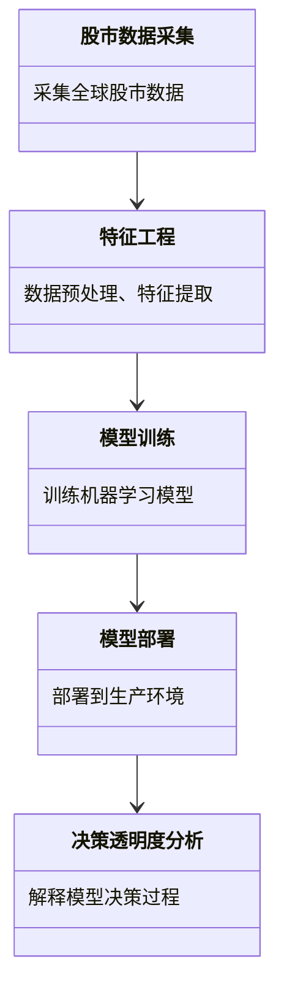
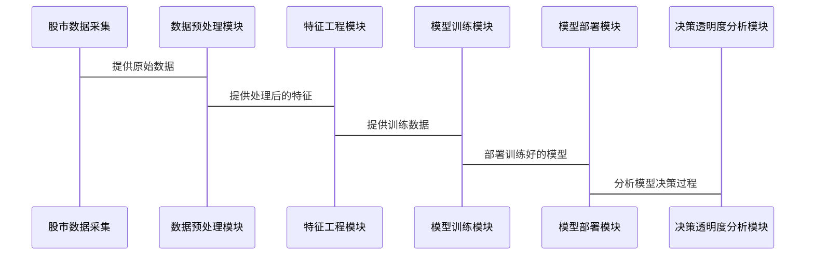

                 


# 全球股市估值与人工智能决策透明度的关联

> 关键词：全球股市估值，人工智能，决策透明度，金融分析，算法可解释性，市场风险

> 摘要：本文探讨了全球股市估值与人工智能决策透明度之间的关联性，分析了人工智能在金融领域的应用背景，深入阐述了股市估值的核心概念与方法，详细讲解了人工智能决策透明度的技术挑战与解决方案，并通过实际案例分析了两者在实际金融场景中的互动关系。文章从技术实现、系统架构、项目实战等多维度展开，最终得出提高人工智能决策透明度对全球股市估值稳定性与风险控制的重要意义。

---

## 第1章 全球股市估值的基本概念

### 1.1 股市估值的基本概念

#### 1.1.1 股市估值的定义

股市估值是指通过对公司财务数据、市场环境、行业趋势等多方面因素的分析，对股票的内在价值进行评估的过程。其核心目标是确定股票的合理价格区间，帮助投资者做出理性的投资决策。

#### 1.1.2 股市估值的核心要素

- **公司基本面**：包括营业收入、净利润、资产负债率等财务指标。
- **市场环境**：如宏观经济状况、货币政策、行业竞争格局等。
- **市场情绪**：投资者的心理预期和行为对股价的影响。

#### 1.1.3 股市估值的主要方法

1. **相对估值法**：通过比较股票与行业或市场平均市盈率、市净率等指标来评估其价值。
2. **绝对估值法**：基于公司未来现金流的折现值来确定股票的内在价值。
3. **技术分析法**：通过分析股价的历史走势来预测未来的价格变动。

### 1.2 全球股市估值的现状

#### 1.2.1 全球主要股市的估值指标

全球主要股市包括纽约证券交易所、纳斯达克、伦敦金融时报指数、香港恒生指数等。不同市场的估值指标反映了其独特的经济结构和市场特点。

#### 1.2.2 不同经济周期下的估值波动

经济周期的波动直接影响股市估值。例如，在经济繁荣期，股市估值通常较高；而在经济衰退期，估值可能大幅下降。

#### 1.2.3 全球化视角下的股市估值差异

不同国家和地区的经济政策、文化背景、市场结构等因素导致全球股市估值存在显著差异。

### 1.3 人工智能在金融领域的应用背景

#### 1.3.1 人工智能在金融领域的核心应用

人工智能在金融领域的应用包括股票预测、风险管理、交易自动化等。

#### 1.3.2 人工智能在股市估值中的潜力

通过机器学习算法，人工智能可以分析海量数据，发现传统方法难以察觉的市场规律。

#### 1.3.3 人工智能决策透明度的重要性

透明度是用户信任人工智能决策的基础，也是确保算法合规性的必要条件。

---

## 第2章 人工智能决策透明度的核心概念

### 2.1 人工智能决策的黑箱问题

#### 2.1.1 人工智能决策的不透明性来源

深度学习模型通常被视为“黑箱”，其决策过程难以解释。

#### 2.1.2 黑箱模型对金融决策的风险

不透明的决策可能导致误判，进而引发市场波动。

#### 2.1.3 提高决策透明度的必要性

透明度有助于增强用户信任，降低市场风险。

### 2.2 透明度与金融监管的关系

#### 2.2.1 金融监管对透明度的需求

金融监管机构需要了解人工智能决策的依据，以确保市场公平。

#### 2.2.2 透明度不足对金融市场的风险

不透明的决策可能导致市场信息不对称，引发系统性风险。

#### 2.2.3 提高透明度的监管措施

包括要求金融机构披露算法的基本原理，确保决策过程可追溯。

### 2.3 人工智能决策透明度的衡量标准

#### 2.3.1 透明度的定义与分类

透明度可以分为数据透明度、算法透明度和决策透明度。

#### 2.3.2 透明度的量化指标

包括模型的可解释性、预测结果的可追溯性等。

#### 2.3.3 透明度与用户信任的关系

高透明度的决策更容易获得用户的信任，从而提高市场稳定性。

---

## 第3章 全球股市估值与人工智能决策透明度的关联分析

### 3.1 股市估值与人工智能决策的互动关系

#### 3.1.1 人工智能如何影响股市估值

通过算法预测市场趋势，影响投资者的决策。

#### 3.1.2 股市估值如何影响人工智能决策

估值数据作为输入，影响算法的预测结果。

#### 3.1.3 两者之间的动态平衡

透明度的高低直接影响股市估值的稳定性。

### 3.2 人工智能决策透明度对股市估值的影响

#### 3.2.1 透明度高的决策对股市稳定性的影响

透明的决策有助于稳定市场预期，减少波动。

#### 3.2.2 透明度低的决策对股市波动的影响

不透明的决策可能导致市场恐慌，加剧波动。

#### 3.2.3 不同市场环境下的透明度影响差异

例如，在牛市中，透明度高的决策有助于维持市场稳定；在熊市中，透明度低的决策可能加剧市场下跌。

### 3.3 全球化视角下的关联性分析

#### 3.3.1 不同国家股市对人工智能决策透明度的敏感性

例如，成熟市场对透明度的要求更高，新兴市场则可能更关注算法的实用性。

#### 3.3.2 全球经济环境对关联性的影响

全球经济一体化背景下，人工智能决策透明度对全球股市估值的影响更加显著。

#### 3.3.3 未来发展趋势预测

随着技术进步，人工智能决策透明度将逐步提高，进一步影响全球股市估值。

---

## 第4章 人工智能决策透明度的技术实现

### 4.1 人工智能决策透明度的技术挑战

#### 4.1.1 深度学习模型的黑箱问题

深度学习模型通常难以解释，导致决策过程不透明。

#### 4.1.2 解释性模型的优势与局限

解释性模型虽然易于理解，但可能在复杂场景下表现不佳。

#### 4.1.3 提高透明度的技术难点

需要在保证模型性能的同时，提高其可解释性。

### 4.2 提高决策透明度的技术方法

#### 4.2.1 可解释性模型的设计

例如，线性回归模型、决策树等易于解释的模型。

#### 4.2.2 模型解释工具的开发

如 SHAP 值、LIME 等工具可以帮助解释模型决策。

#### 4.2.3 提高透明度的其他技术手段

包括数据可视化、决策日志记录等。

---

## 第5章 系统分析与架构设计方案

### 5.1 问题场景介绍

本文将构建一个基于人工智能的股市估值系统，探讨其决策透明度对全球股市估值的影响。

### 5.2 项目介绍

本项目旨在利用机器学习算法对全球股市进行估值预测，同时确保决策过程的透明度。

### 5.3 系统功能设计

#### 5.3.1 领域模型（Mermaid 类图）



### 5.4 系统架构设计（Mermaid 架构图）


### 5.5 系统接口设计

系统接口包括数据输入接口、模型调用接口和结果输出接口。

### 5.6 系统交互（Mermaid 序列图）



---

## 第6章 项目实战

### 6.1 环境安装

安装必要的 Python 库，如 numpy、pandas、scikit-learn、shap 等。

### 6.2 系统核心实现源代码

以下是基于线性回归模型的简单实现：

```python
import pandas as pd
import numpy as np
from sklearn.linear_model import LinearRegression
from sklearn.metrics import mean_squared_error
import shap

# 数据加载
data = pd.read_csv('stock_data.csv')

# 特征与目标分离
X = data[['revenue', 'profit', 'market_cap']]
y = data['stock_price']

# 模型训练
model = LinearRegression()
model.fit(X, y)

# 模型预测
predictions = model.predict(X)

# 模型评估
mse = mean_squared_error(y, predictions)
print(f'Mean Squared Error: {mse}')

# 可解释性分析
explainer = shap.Explorer(model, X.columns)
shap_values = explainer.shap_values(X)
```

### 6.3 代码应用解读与分析

通过 SHAP 值，我们可以了解每个特征对预测结果的影响程度。

### 6.4 实际案例分析

以某公司为例，分析其股票价格预测结果及模型决策的透明度。

### 6.5 项目小结

本项目展示了如何在实际中实现透明的人工智能决策，并对全球股市估值产生影响。

---

## 第7章 总结

### 7.1 本文核心观点总结

人工智能决策透明度对全球股市估值具有重要影响，提高透明度有助于稳定市场。

### 7.2 未来研究方向

未来可以进一步研究如何在复杂模型（如深度学习）中提高透明度。

### 7.3 最佳实践 tips

- 在实际应用中，优先选择可解释性较强的算法。
- 定期对模型进行透明度评估和优化。

---

## 第8章 注意事项

- 本文内容基于理论分析，实际市场情况可能有所不同。
- 投资者在使用人工智能决策时，需结合多种因素进行综合判断。

---

## 第9章 拓展阅读

- [推荐书籍]《机器学习实战》
- [推荐博客]人工智能与金融的深度结合

---

通过本文的分析，我们可以看到，人工智能决策透明度对全球股市估值的影响是一个复杂但重要的问题。随着技术的不断进步，我们有理由相信，未来的金融决策将更加透明和高效。

