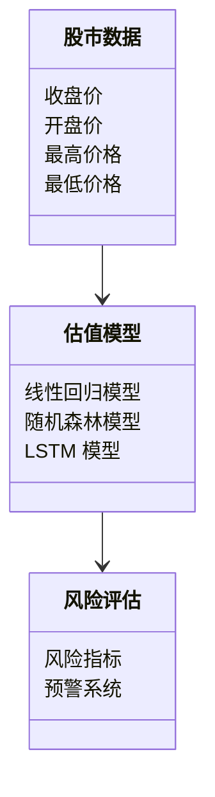
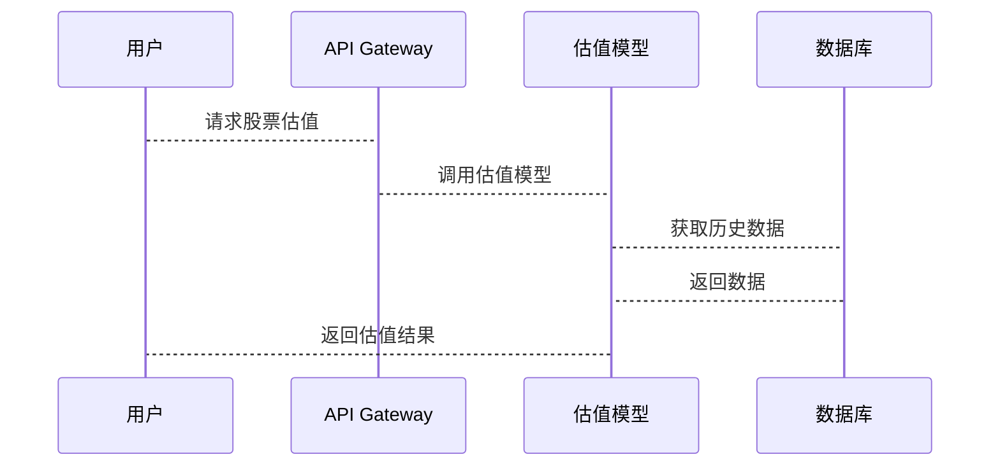

                 


# 全球股市估值与人工智能在法律合规中的应用

## 关键词：
全球股市估值、人工智能、法律合规、机器学习、NLP、系统架构、项目实战

## 摘要：
本文将详细探讨全球股市估值与人工智能在法律合规中的应用。首先，从全球股市估值的基本概念、重要性以及现状入手，结合人工智能技术的现状和潜力，分析两者结合的趋势。接着，深入讲解人工智能的核心算法原理，包括机器学习和自然语言处理，展示如何应用于股市估值和法律合规。最后，通过实际案例分析，探讨系统架构设计与项目实战，为读者提供全面的理论和实践指导。

---

# 第一部分: 全球股市估值与人工智能概述

## 第1章: 全球股市估值的背景与现状

### 1.1 全球股市估值的背景

#### 1.1.1 全球股市的基本概念
- 股市的定义与基本功能
- 股票的种类及其特点
- 全球化背景下的股市特点

#### 1.1.2 股市估值的重要性
- 为什么需要对股市进行估值
- 股市估值对投资者和企业的意义
- 全球化背景下的估值挑战

#### 1.1.3 全球股市估值的边界与外延
- 估值的范围与限制
- 外延：从个股到整体市场的估值

### 1.2 人工智能技术的现状

#### 1.2.1 人工智能的定义与核心特征
- 人工智能的基本概念
- 机器学习、深度学习、自然语言处理的核心特征
- AI技术的现状与发展

#### 1.2.2 人工智能在金融领域的应用潜力
- AI在金融分析、风险控制、交易策略中的应用
- AI如何提升金融行业的效率

#### 1.2.3 全球化背景下的AI技术趋势
- AI技术的全球化发展
- 不同国家和地区在AI金融应用中的特点

### 1.3 全球股市估值与人工智能的结合趋势

#### 1.3.1 数据驱动的估值模型
- 数据的重要性与AI在数据处理中的作用
- 从传统估值到智能估值的转变

#### 1.3.2 人工智能在法律合规中的应用
- 合规性检查的自动化
- 风险评估与预警系统
- 合规性报告的智能化生成

---

## 第2章: 全球股市估值的核心概念与技术框架

### 2.1 股市估值的基本原理

#### 2.1.1 股票估值的主要方法
- 市盈率（P/E ratio）
- 市净率（P/B ratio）
- 股息率（Dividend Yield）
- 内在价值法（DCF模型）

#### 2.1.2 市盈率与市净率的对比分析
- 如何选择合适的估值指标
- 不同市场环境下的估值方法

#### 2.1.3 股市估值的边界与外延
- 估值的范围与限制
- 外延：从个股到整体市场的估值

### 2.2 人工智能在法律合规中的应用

#### 2.2.1 法律合规的基本概念
- 法律合规的定义与核心要素
- 合规性评估的标准与流程

#### 2.2.2 人工智能在法律合规中的角色
- AI如何辅助法律合规的自动化
- 风险评估与预警系统
- 合规性报告的智能化生成

#### 2.2.3 合规性评估的核心要素
- 数据的准确性与完整性
- 模型的可解释性与透明性

---

## 第3章: 全球股市估值与人工智能的联系

### 3.1 股市估值与人工智能的结合点

#### 3.1.1 数据驱动的估值模型
- 数据的重要性与AI在数据处理中的作用
- 从传统估值到智能估值的转变

#### 3.1.2 AI算法在预测中的应用
- 机器学习与深度学习在股市预测中的应用
- 时间序列分析与预测模型

#### 3.1.3 从传统估值到智能估值的转变
- 传统估值方法的局限性
- AI技术如何提升估值的准确性与效率

### 3.2 人工智能在法律合规中的具体应用

#### 3.2.1 合规性检查的自动化
- 自然语言处理在法律文本分析中的应用
- AI如何辅助合规性检查

#### 3.2.2 风险评估与预警系统
- 基于AI的风险评估模型
- 预警系统的构建与应用

#### 3.2.3 合规性报告的智能化生成
- 自动化报告生成的流程与方法
- AI在报告中的具体应用

---

# 第二部分: 人工智能算法原理与实现

## 第4章: 人工智能算法原理

### 4.1 机器学习算法基础

#### 4.1.1 监督学习、无监督学习与强化学习
- 监督学习的定义与应用场景
- 无监督学习的定义与应用场景
- 强化学习的定义与应用场景

#### 4.1.2 神经网络的基本原理
- 神经网络的结构与功能
- 深度学习的核心算法

#### 4.1.3 深度学习的核心算法
- 卷积神经网络（CNN）
- 循环神经网络（RNN）
- Transformer架构

### 4.2 自然语言处理技术

#### 4.2.1 NLP的核心技术与应用
- 分词、词性标注、句法分析
- 基于NLP的情感分析与主题提取

#### 4.2.2 NLP在法律文本分析中的应用
- 合同审查与合规性分析
- 法律文书的自动分类与摘要

#### 4.2.3 NLP在股市新闻分析中的应用
- 股市新闻的情感分析
- 新闻对股价影响的预测

---

## 第5章: 算法原理与数学模型

### 5.1 机器学习算法的数学模型

#### 5.1.1 线性回归模型
- 线性回归的数学公式：$$y = \beta_0 + \beta_1x + \epsilon$$
- 案例分析：基于线性回归的简单股价预测

#### 5.1.2 支持向量机（SVM）
- SVM的数学公式：$$max(\frac{1}{2}\|w\|^2 + C \sum_{i=1}^n \xi_i)$$
- 案例分析：SVM在股票分类中的应用

#### 5.1.3 随机森林
- 随机森林的数学模型：$$y = \sum_{i=1}^n \text{Tree}_i(x)$$
- 案例分析：随机森林在风险评估中的应用

### 5.2 NLP算法的数学模型

#### 5.2.1 词嵌入模型（Word2Vec）
- Word2Vec的训练目标：$$\log P(w_i|w_{i-1}) = \log \frac{\exp(w_{i-1} \cdot w_i)}{\sum_{w} \exp(w_{i-1} \cdot w)}}$$
- 案例分析：Word2Vec在股票新闻分析中的应用

#### 5.2.2 Transformer模型
- Transformer的数学公式：$$\text{Attention}(Q, K, V) = \text{softmax}\left(\frac{QK^T}{\sqrt{d_k}}\right)V$$
- 案例分析：Transformer在长文本分析中的应用

---

## 第6章: 系统分析与架构设计方案

### 6.1 问题场景介绍

#### 6.1.1 股市估值系统的需求分析
- 系统目标：基于AI的智能估值模型
- 用户需求：投资者、机构投资者、监管机构
- 功能需求：实时数据采集、估值模型构建、风险评估

#### 6.1.2 法律合规系统的需求分析
- 系统目标：合规性检查与风险预警
- 用户需求：金融机构、法律部门、监管机构
- 功能需求：合同审查、合规报告生成、风险预警

### 6.2 项目介绍

#### 6.2.1 项目目标
- 建立一个基于AI的全球股市估值系统
- 开发一个法律合规的智能合规系统

#### 6.2.2 项目范围
- 数据范围：全球主要股市数据、新闻数据、法律文本
- 功能范围：实时估值、风险评估、合规性检查
- 时间范围：项目周期与阶段划分

### 6.3 系统功能设计

#### 6.3.1 领域模型（mermaid 类图）


#### 6.3.2 系统架构设计（mermaid 架构图）
```mermaid
docker {
    股市估值系统
    [
        前端：React
        后端：Flask/Django
        数据库：MySQL/PostgreSQL
        AI 模型：TensorFlow/PyTorch
    ]
}
```

#### 6.3.3 系统接口设计
- API 接口：RESTful API
- 数据接口：实时数据接口、历史数据接口
- 模型接口：估值模型接口、NLP 模型接口

#### 6.3.4 系统交互流程图（mermaid 序列图）


---

## 第7章: 项目实战

### 7.1 环境安装与配置

#### 7.1.1 安装 Python 环境
- 使用 Anaconda 或虚拟环境
- 安装必要的库：numpy、pandas、scikit-learn、tensorflow、pytorch

#### 7.1.2 数据源配置
- 数据获取：Yahoo Finance API、Alpha Vantage API
- 数据预处理：清洗、特征提取、数据增强

### 7.2 系统核心实现源代码

#### 7.2.1 估值模型实现（线性回归）
```python
import numpy as np
from sklearn.linear_model import LinearRegression

# 数据准备
X = np.array([[1], [2], [3], [4], [5]])
y = [2, 4, 5, 4, 5]

# 模型训练
model = LinearRegression()
model.fit(X, y)

# 预测
print(model.predict([[6]]))
```

#### 7.2.2 NLP 模型实现（情感分析）
```python
from transformers import pipeline

# 加载预训练模型
sentiment_pipeline = pipeline("sentiment-analysis")

# 情感分析
result = sentiment_pipeline("This stock is a good investment.")
print(result)
```

#### 7.2.3 系统交互流程实现
```python
# API 接口实现
from flask import Flask, request, jsonify

app = Flask(__name__)

@app.route('/predict', methods=['POST'])
def predict():
    data = request.json
    # 调用估值模型
    result = model.predict(data)
    return jsonify({'result': result})

if __name__ == '__main__':
    app.run()
```

### 7.3 代码应用解读与分析

#### 7.3.1 代码功能分析
- 线性回归模型：简单股票价格预测
- 情感分析模型：股票新闻情感分析
- API 接口：前端与后端交互

#### 7.3.2 代码实现细节
- 数据预处理的步骤：清洗、特征提取、数据增强
- 模型训练的参数设置：超参数调优
- API 接口的安全性：身份验证、速率限制

### 7.4 实际案例分析

#### 7.4.1 股票价格预测案例
- 数据来源：某股票的历史数据
- 模型选择：线性回归、随机森林、LSTM
- 预测结果：与实际数据对比分析

#### 7.4.2 法律文本分析案例
- 数据来源：公司年报、法律合同
- 模型选择：NLP 情感分析、关键词提取
- 分析结果：合规性评估报告

### 7.5 项目小结

#### 7.5.1 项目总结
- 项目目标的实现情况
- 系统的优缺点分析
- 可优化的空间

#### 7.5.2 项目经验分享
- 开发过程中的难点与解决方案
- 团队协作的经验与教训
- 项目文档的编写与管理

---

## 第三部分: 最佳实践与总结

## 第8章: 最佳实践

### 8.1 小结

#### 8.1.1 核心内容回顾
- 全球股市估值的基本概念与技术框架
- 人工智能在法律合规中的具体应用
- 系统架构设计与项目实战

#### 8.1.2 关键点总结
- 数据的重要性与AI技术的结合
- 系统架构设计的合理性与可扩展性
- 项目实战中的经验与教训

### 8.2 注意事项

#### 8.2.1 数据处理中的注意事项
- 数据的准确性和完整性
- 数据隐私与合规性
- 数据预处理的细节

#### 8.2.2 模型选择与优化中的注意事项
- 模型的可解释性与透明性
- 模型的泛化能力与过拟合问题
- 模型的训练效率与计算资源

### 8.3 拓展阅读

#### 8.3.1 推荐书籍与论文
- 《机器学习实战》
- 《深度学习》
- 《自然语言处理实战》
- 《法律合规与人工智能》

#### 8.3.2 技术博客与在线资源
- Medium 上的相关技术博客
- GitHub 上的开源项目
- 技术论坛与社区讨论

---

## 第9章: 总结与展望

### 9.1 总结

#### 9.1.1 全球股市估值的核心要点
- 数据驱动的估值模型
- 人工智能在预测中的应用
- 系统架构设计的重要性

#### 9.1.2 人工智能在法律合规中的应用前景
- 合规性检查的自动化
- 风险评估与预警系统
- 合规性报告的智能化生成

### 9.2 展望

#### 9.2.1 技术发展趋势
- 多模态AI技术的应用
- 自监督学习在金融领域的潜力
- 可解释性AI的发展

#### 9.2.2 应用领域的扩展
- 更多金融场景中的AI应用
- 全球化背景下的跨市场估值
- 个性化投资策略的实现

---

## 附录: 参考文献与工具

### 附录A: 参考文献

1. 《机器学习实战》
2. 《深度学习》
3. 《自然语言处理实战》
4. 《法律合规与人工智能》
5. 相关技术博客与论文链接

### 附录B: 工具与库

1. Python 环境：Anaconda/虚拟环境
2. 数据处理库：numpy、pandas
3. 机器学习库：scikit-learn、tensorflow、pytorch
4. NLP 库：transformers、spaCy
5. 可视化工具：matplotlib、seaborn

---

## 结语

通过本文的详细探讨，我们不仅了解了全球股市估值的基本概念与技术框架，还深入分析了人工智能在法律合规中的具体应用。从算法原理到系统架构设计，再到项目实战，我们为读者提供了一个全面的视角，帮助读者更好地理解和应用这些技术。未来，随着AI技术的不断发展，全球股市估值与法律合规的结合将更加紧密，为金融行业带来更多的创新与突破。

