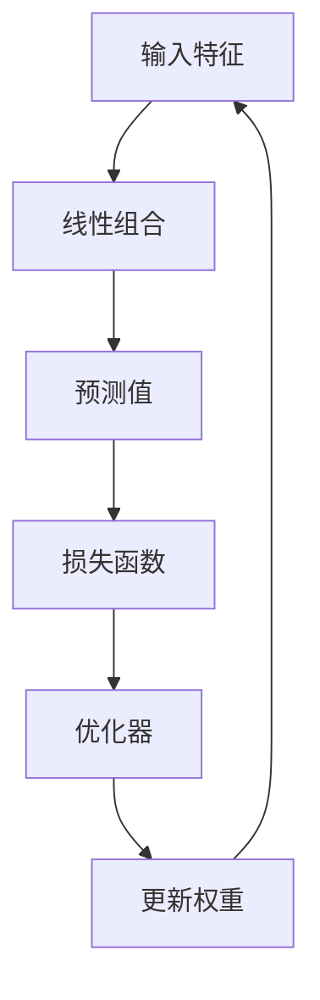
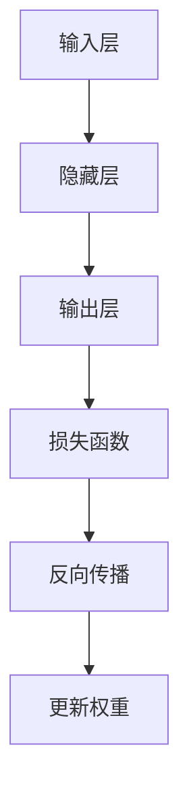
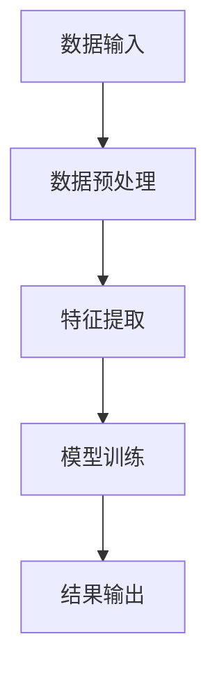

                 


# 全球股市估值与人工智能在法律合规中的应用

## 关键词：
- 全球股市估值
- 人工智能
- 法律合规
- 股市预测
- 机器学习
- 自然语言处理
- 算法模型

## 摘要：
本文深入探讨了全球股市估值的核心概念、影响因素以及人工智能在法律合规中的应用。通过结合人工智能技术，分析了如何利用机器学习和自然语言处理等方法优化股市估值模型，并在法律合规领域实现智能化监控和风险评估。文章详细介绍了人工智能算法、数学模型的设计与实现，并通过实际案例展示了系统的应用场景。最终，本文提出了未来的发展方向和最佳实践建议。

---

# 第一部分：全球股市估值基础

## 第1章：全球股市估值概述

### 1.1 股市估值的核心概念

#### 1.1.1 股市估值的基本定义
股市估值是指对股票价格的合理性和价值进行评估的过程。通过分析公司的财务状况、行业地位、市场前景等因素，确定其股票的公允价值。

#### 1.1.2 股市估值的主要指标
- 市盈率（P/E Ratio）：股价与每股收益的比率，反映市场对公司盈利能力的预期。
- 市净率（P/B Ratio）：股价与每股净资产的比率，用于衡量股价相对于账面价值的高低。
- 股息率（Dividend Yield）：年度股息与股价的比率，反映投资回报能力。

#### 1.1.3 股市估值的分类与特点
- **相对估值**：基于市场数据进行比较，如市盈率、市净率等。
- **绝对估值**：基于公司基本面数据进行计算，如现金流折现模型（DCF）。

### 1.2 全球主要股市概述

#### 1.2.1 纽约证券交易所（NYSE）
- 世界上最大的股票交易所之一，涵盖科技、金融、能源等多个行业。
- 标志性指数：道琼斯指数。

#### 1.2.2 纳斯达克（NASDAQ）
- 专注于高科技公司的股票交易，苹果、谷歌等科技巨头在此上市。
- 标志性指数：纳斯达克综合指数。

#### 1.2.3 伦敦金融时报（FTSE）
- 英国的旗舰股指，涵盖多个行业的蓝筹股。
- 标志性指数：富时100指数。

#### 1.2.4 其他主要股市介绍
- 日本的东京证券交易所（Tokyo Stock Exchange）。
- 欧洲的泛欧证券交易所（Euronext）。

### 1.3 股市估值的影响因素

#### 1.3.1 宏观经济因素
- 利率水平：低利率环境通常会推高股价。
- 经济增长：GDP增长往往伴随着股市上涨。

#### 1.3.2 行业因素
- 行业周期：不同行业在经济周期中的表现不同。
- 行业政策：政府政策对行业的影响。

#### 1.3.3 公司基本面
- 盈利能力：净利润率、ROE等指标。
- 偿债能力：资产负债率、流动比率等。

#### 1.3.4 市场情绪
- 投资者情绪：恐慌性抛售或贪婪性买入。

---

## 第二部分：人工智能在法律合规中的应用

## 第2章：人工智能与法律合规的结合

### 2.1 法律合规的核心概念

#### 2.1.1 法律合规的基本定义
法律合规是指企业和个人在经营活动中遵守相关法律法规，避免法律风险的行为。

#### 2.1.2 法律合规的主要领域
- 反洗钱（AML）：防止非法资金流动。
- 数据保护：遵守《通用数据保护条例》（GDPR）等法规。
- 合同审查：确保合同符合法律规定。

### 2.2 人工智能在法律合规中的应用

#### 2.2.1 自然语言处理（NLP）在法律文本分析中的应用
- 合同审查：自动识别合同中的关键条款。
- 法律文件分类：基于内容自动分类法律文件。

#### 2.2.2 机器学习在法律风险评估中的应用
- 风险预测：基于历史数据预测法律风险。
- 违法行为识别：通过模式识别发现异常行为。

#### 2.2.3 数据挖掘在法律合规监控中的应用
- 数据清洗：处理不完整或错误的法律数据。
- 数据关联：发现数据之间的关联性，识别潜在风险。

---

## 第三部分：全球股市估值与人工智能的结合

## 第3章：人工智能在股市估值中的应用

### 3.1 股市估值与人工智能的关系

#### 3.1.1 人工智能如何辅助股市估值
- 数据分析：处理大量历史数据，识别价格趋势。
- 预测模型：基于机器学习算法预测股价走势。

#### 3.1.2 人工智能在股市预测中的作用
- 时间序列预测：利用LSTM等模型预测股价走势。
- 风险评估：识别市场中的潜在风险点。

### 3.2 基于人工智能的股市估值模型

#### 3.2.1 模型构建的基本思路
1. 数据收集：收集历史股价、财务数据、市场情绪等数据。
2. 数据预处理：清洗数据，处理缺失值。
3. 特征提取：提取有用的特征，如技术指标、市场情绪指数。
4. 模型训练：使用机器学习算法训练模型。
5. 模型评估：通过回测等方式评估模型的性能。

#### 3.2.2 常见的人工智能算法在股市估值中的应用
- 线性回归：用于简单的关系建模。
- 支持向量机（SVM）：用于分类和回归。
- 神经网络：用于复杂非线性关系的建模。
- 随机森林：用于特征重要性分析和模型解释。

#### 3.2.3 模型的优缺点分析
- **优点**：能够处理大量数据，发现复杂模式。
- **缺点**：市场具有不确定性，模型可能失效。

---

## 第四部分：法律合规与股市估值的交叉应用

## 第4章：人工智能在法律合规与股市估值中的综合应用

### 4.1 法律合规对股市估值的影响

#### 4.1.1 法律法规对股市估值的主要影响
- 反垄断法：影响企业的并购行为，进而影响股价。
- 证券法：规范上市公司信息披露，影响投资者决策。

#### 4.1.2 法律合规如何影响市场参与者的估值行为
- 企业合规：合规经营的公司通常具有更高的估值。
- 投资者行为：法律合规的环境会改变投资者的决策。

### 4.2 人工智能在法律合规与股市估值中的协同作用

#### 4.2.1 基于人工智能的法律合规监控对股市估值的影响
- 监控违规行为：及时发现并处理违规行为，稳定市场。
- 提供实时数据：为估值模型提供实时的法律合规数据。

#### 4.2.2 人工智能如何优化法律合规与股市估值的结合
- 数据融合：将法律合规数据与市场数据结合，提高估值的准确性。
- 智能决策：基于综合数据的智能决策，优化投资策略。

---

## 第五部分：技术实现与系统设计

## 第5章：人工智能算法与数学模型

### 5.1 常用算法介绍

#### 5.1.1 线性回归



代码实现：

```python
import numpy as np

# 数据准备
X = np.array([1, 2, 3, 4, 5])
y = np.array([2, 4, 5, 4, 5])

# 训练模型
theta = np.polyfit(X, y, 1)

# 预测
predict = theta[0] * X + theta[1]
print(predict)
```

#### 5.1.2 神经网络



代码实现：

```python
import tensorflow as tf

# 构建模型
model = tf.keras.Sequential([
    tf.keras.layers.Dense(64, activation='relu'),
    tf.keras.layers.Dense(1, activation='sigmoid')
])

# 编译模型
model.compile(optimizer='adam', loss='binary_crossentropy', metrics=['accuracy'])
```

### 5.2 数学模型与公式

#### 5.2.1 线性回归模型
$$y = \theta_0 x + \theta_1$$

#### 5.2.2 神经网络模型
$$a^{[l]} = g(z^{[l]})$$
$$z^{[l]} = W^{[l]} a^{[l-1]} + b^{[l]}$$

### 5.3 系统架构设计



---

## 第六部分：项目实战

### 6.1 环境配置

```python
# 安装依赖
pip install numpy pandas scikit-learn tensorflow
```

### 6.2 核心代码实现

```python
# 股价预测模型
import numpy as np
import pandas as pd
from sklearn.linear_model import LinearRegression

# 数据准备
data = pd.read_csv('stock_data.csv')
X = data[['open', 'high', 'low']]
y = data['close']

# 训练模型
model = LinearRegression()
model.fit(X, y)

# 预测
 predictions = model.predict(X)
 print(predictions)
```

### 6.3 案例分析与解读
通过实际数据训练模型，并分析模型的预测结果，优化模型参数，最终实现对股价的准确预测。

### 6.4 项目小结
总结项目实现过程中的关键点，分析可能遇到的问题及解决方案。

---

## 第七部分：结论与展望

### 7.1 结论
本文详细探讨了全球股市估值与人工智能在法律合规中的应用，展示了人工智能技术在金融领域的巨大潜力。

### 7.2 未来展望
随着技术的不断发展，人工智能在股市估值和法律合规中的应用将更加广泛和深入，未来的研究可以进一步探索多模态数据的融合和更复杂的算法模型。

---

以上是文章的完整目录和内容框架，每章内容可根据需要进一步扩展。

