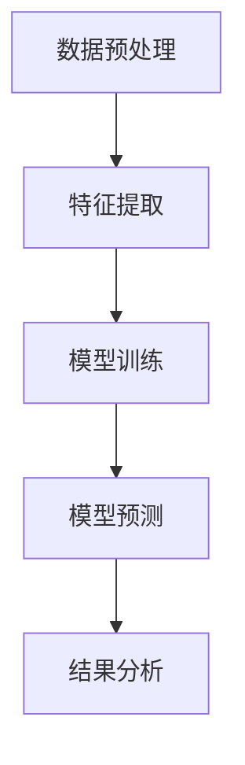
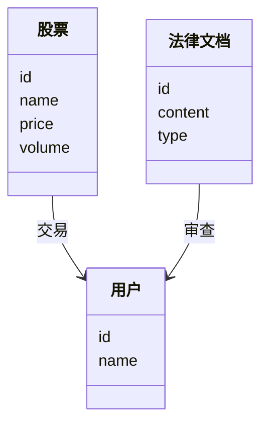
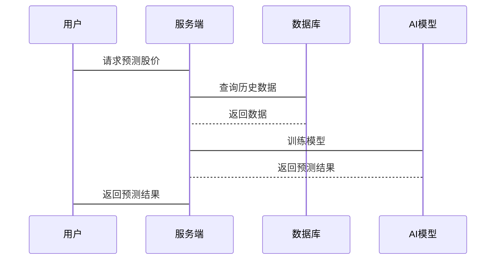

                 


```markdown
# 全球股市估值与人工智能在法律服务中的应用

## 关键词：全球股市估值，人工智能，法律服务，机器学习，时间序列分析，系统架构设计，Python代码实现

## 摘要：  
本文探讨了全球股市估值与人工智能在法律服务中的应用。首先介绍了股市估值的重要性及人工智能在法律服务中的潜力，分析了两者的结合与应用前景。接着详细讲解了AI在股市估值中的应用原理，包括算法模型、数学公式和代码实现。通过系统分析与架构设计，展示了如何将AI技术应用于法律服务系统。最后通过项目实战，指导读者如何实现核心代码，并进行案例分析。文章还包括了注意事项与未来展望，为读者提供了全面的指导。

---

## 第1章: 背景介绍

### 1.1 问题背景

#### 1.1.1 全球股市估值的重要性  
全球股市估值是衡量市场健康状况的重要指标，帮助投资者、企业和政府做出决策。股市估值的准确性直接影响投资回报和经济稳定性。

#### 1.1.2 人工智能在法律服务中的潜力  
AI技术能够提高法律服务的效率和准确性，例如合同审查、案例分析和法律建议生成。通过自然语言处理和机器学习，AI可以快速分析大量法律文档，提供智能化的解决方案。

#### 1.1.3 两者的结合与应用前景  
虽然股市估值和法律服务看似不同，但它们都依赖于数据处理和模式识别。AI技术可以将两者结合，提供更精准的估值模型和高效的法律服务。

### 1.2 核心概念与联系

#### 1.2.1 核心概念原理  
- 股市估值：通过分析市场数据，预测股票价格和市场趋势。  
- AI在法律服务：利用机器学习和NLP技术，处理法律文档和提供法律建议。

#### 1.2.2 概念属性对比表格  
| 属性         | 股市估值          | AI在法律服务中的应用        |
|--------------|-------------------|-----------------------------|
| 数据来源     | 市场数据（股价、交易量等） | 法律文档、案例、法规等     |
| 目标         | 预测股价和市场趋势 | 提供法律建议、合同审查等    |
| 技术方法     | 时间序列分析、机器学习 | NLP、规则引擎、机器学习    |

#### 1.2.3 ER实体关系图  
```mermaid
er
actor: 投资者
actor: 法律顾问
entity: 股票
entity: 法律文档
relation: "投资者" -> "股票": 交易
relation: "法律顾问" -> "法律文档": 审查
relation: "股票" -> "法律文档": 参考
```

---

## 第2章: AI在股市估值中的应用原理

### 2.1 算法原理讲解

#### 2.1.1 基于AI的股市预测模型  
AI通过分析历史数据，识别市场趋势和模式，预测未来股价。

#### 2.1.2 时间序列分析  
时间序列分析是股市估值的核心方法，用于分析过去的价格数据，预测未来走势。

#### 2.1.3 机器学习算法实现  
使用机器学习算法（如LSTM、ARIMA）进行预测，模型通过训练数据学习市场规律。

### 2.2 数学模型与公式

#### 2.2.1 时间序列模型  
ARIMA模型用于预测股价：  
$$ ARIMA(p, d, q) $$  
其中，p为自回归阶数，d为差分阶数，q为移动平均阶数。

#### 2.2.2 机器学习模型  
LSTM网络结构：  
$$ LSTM(t) = \sigma(W_{xh}x_t + W_{hh}h_{t-1} + b_h) $$  
其中，$\sigma$为激活函数，$x_t$为输入，$h_{t-1}$为前一时刻的隐藏状态。

#### 2.2.3 算法流程图  


### 2.3 Python代码实现

#### 2.3.1 数据加载与预处理  
```python
import pandas as pd
import numpy as np

# 加载数据
df = pd.read_csv('stock_data.csv')
# 数据清洗
df.dropna(inplace=True)
```

#### 2.3.2 模型训练  
```python
from sklearn.model_selection import train_test_split
from sklearn.linear_model import LinearRegression

# 划分训练集和测试集
X = df[['open', 'high', 'low', 'volume']]
y = df['close']
X_train, X_test, y_train, y_test = train_test_split(X, y, test_size=0.2)

# 训练模型
model = LinearRegression()
model.fit(X_train, y_train)
```

#### 2.3.3 模型预测与评估  
```python
# 预测
y_pred = model.predict(X_test)
print('预测值:', y_pred)
print('真实值:', y_test)
print('均方误差:', np.mean((y_pred - y_test)**2))
```

---

## 第3章: 系统分析与架构设计

### 3.1 问题场景介绍

#### 3.1.1 股市估值系统  
系统目标：提供实时股价预测和市场趋势分析。  
用户角色：投资者、机构。

#### 3.1.2 法律服务系统  
系统目标：辅助法律顾问进行合同审查和法律文档分析。  
用户角色：法律顾问、企业法务。

### 3.2 系统功能设计

#### 3.2.1 领域模型  


#### 3.2.2 系统架构设计  


#### 3.2.3 系统接口设计  
API接口：  
- `/api/stock/predict`：预测股价  
- `/api/legal-review/analyze`：法律文档分析

### 3.3 系统交互流程

#### 3.3.1 序列图  


---

## 第4章: 项目实战

### 4.1 环境安装与配置

#### 4.1.1 开发环境搭建  
安装Python、Jupyter Notebook、TensorFlow、Scikit-learn。

#### 4.1.2 数据集准备  
下载股票数据和法律文档数据集。

### 4.2 核心代码实现

#### 4.2.1 股市估值模型  
```python
import tensorflow as tf
from tensorflow.keras import layers

# 构建LSTM模型
model = tf.keras.Sequential()
model.add(layers.LSTM(64, input_shape=(None, 4)))
model.add(layers.Dense(1))
model.compile(optimizer='adam', loss='mse')
model.fit(X_train, y_train, epochs=10, batch_size=32)
```

#### 4.2.2 法律服务模型  
```python
from transformers import pipeline

# 使用预训练的NLP模型进行合同审查
classifier = pipeline("text-classification", model="bert-base-uncased")
result = classifier("法律条款内容")
```

### 4.3 案例分析与解读

#### 4.3.1 实际案例分析  
分析某公司股票走势和法律合同审查案例，展示AI模型的应用效果。

#### 4.3.2 案例解读与总结  
总结AI技术在股市估值和法律服务中的优势和挑战。

---

## 第5章: 最佳实践与小结

### 5.1 最佳实践Tips

#### 5.1.1 开发建议  
- 数据清洗和特征选择是关键。  
- 选择合适的模型和参数，避免过拟合。

#### 5.1.2 模型优化技巧  
- 使用交叉验证评估模型性能。  
- 调整超参数优化模型表现。

### 5.2 注意事项与风险提示

#### 5.2.1 使用中的注意事项  
- 数据隐私和安全问题。  
- 模型的可解释性和透明度。

#### 5.2.2 风险提示  
- AI模型预测结果仅供参考，不保证准确性。  
- 法律服务需结合人工审核，确保准确性。

### 5.3 拓展阅读与未来展望

#### 5.3.1 相关领域推荐  
- 强化学习在金融中的应用。  
- 自然语言处理在法律服务中的深入研究。

#### 5.3.2 未来发展趋势  
- 多模态AI技术在金融和法律服务中的应用。  
- 自动化法律服务系统的发展。

---

## 总结  
通过本文的详细讲解，读者可以了解AI在股市估值和法律服务中的应用，并掌握相关算法和系统设计方法。AI技术正在改变传统行业，未来将有更多创新应用出现。
```

