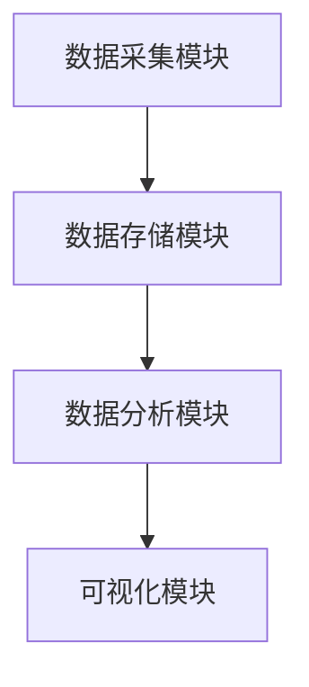
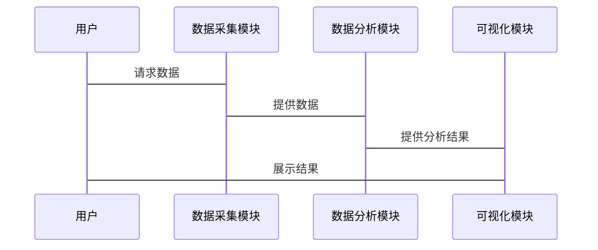

                 

# 全球股市估值与人工智能在海洋资源管理中的应用

> 关键词：全球股市估值、人工智能、海洋资源管理、机器学习、深度学习、环境监测

> 摘要：本文探讨了全球股市估值与人工智能在海洋资源管理中的应用。首先，我们介绍了股市估值的基本概念、核心要素和常见方法，然后分析了人工智能在股市估值中的优势和应用场景。接着，我们深入探讨了海洋资源管理的基本概念、核心目标和面临的挑战，最后详细讲解了人工智能在海洋环境监测、资源评估和优化管理中的技术应用。通过本文，读者可以全面了解人工智能如何助力金融和海洋资源管理领域的创新与发展。

---

# 第一部分: 全球股市估值与人工智能概述

## 第1章: 全球股市估值的基本概念

### 1.1 股市估值的定义与意义

股市估值是指对股票价格进行合理评估的过程，旨在确定其内在价值。它是投资者在股票市场中做出投资决策的重要依据。股市估值的意义在于帮助投资者识别被低估或高估的股票，从而优化投资组合。

#### 1.1.1 股市估值的基本定义

股市估值是通过对公司财务数据、市场环境和行业趋势的分析，确定股票的合理价格区间。其核心在于平衡公司的内在价值与市场情绪。

#### 1.1.2 股市估值的重要性

股市估值是投资者进行理性决策的基础，能够帮助投资者规避市场泡沫和非理性投资。同时，股市估值也是机构投资者制定投资策略的重要工具。

#### 1.1.3 股市估值的边界与外延

股市估值不仅关注公司的财务表现，还考虑宏观经济、行业竞争和政策环境等外部因素。其外延包括技术分析和基本面分析的结合。

### 1.2 股市估值的核心要素

#### 1.2.1 市盈率（P/E Ratio）

市盈率是衡量股票估值的重要指标，计算公式为：

$$ \text{市盈率} = \frac{\text{股价}}{\text{每股净利润}} $$

市盈率反映了市场对公司的盈利能力和成长性的预期。

#### 1.2.2 市净率（P/B Ratio）

市净率是股价与每股净资产的比率，计算公式为：

$$ \text{市净率} = \frac{\text{股价}}{\text{每股净资产}} $$

市净率适用于评估资产密集型行业的公司价值。

#### 1.2.3 股息率（Dividend Yield）

股息率是衡量股票收益能力的重要指标，计算公式为：

$$ \text{股息率} = \frac{\text{每股股息}}{\text{股价}} $$

股息率高的股票通常被视为防御性投资。

#### 1.2.4 公司基本面分析

公司基本面分析包括财务报表分析、行业地位分析和管理团队评估。以下是公司基本面分析的要素：

| 要素 | 描述 |
|------|------|
| 收入与利润 | 公司的收入和利润增长情况 |
| 资产与负债 | 公司的资产结构和负债情况 |
| 现金流 | 公司的现金流健康状况 |
| 管理团队 | 公司高管的背景和能力 |

### 1.3 股市估值的方法

#### 1.3.1 市盈率法

市盈率法通过比较公司与行业平均水平的市盈率，判断股票的估值水平。

#### 1.3.2 市净率法

市净率法适用于资产密集型行业，通过比较公司与行业平均市净率，判断股票的估值水平。

#### 1.3.3 股息率法

股息率法通过比较公司股息率与行业平均水平，判断股票的收益能力。

#### 1.3.4 现金流折现法（DCF）

现金流折现法通过预测公司未来现金流，折现至当前价值，评估公司内在价值。

---

## 第2章: 人工智能在股市估值中的应用

### 2.1 人工智能的基本概念

人工智能（AI）是指模拟人类智能的计算机系统，包括学习、推理和自适应能力。机器学习是AI的核心技术，通过数据训练模型，实现预测和分类任务。

#### 2.1.1 人工智能的定义

人工智能是模拟人类智能的计算机系统，涵盖机器学习、自然语言处理和计算机视觉等领域。

#### 2.1.2 机器学习的定义

机器学习是AI的分支，通过数据训练模型，实现对新数据的预测和分类。

#### 2.1.3 深度学习的定义

深度学习是机器学习的子领域，通过多层神经网络模型，学习数据的复杂特征。

### 2.2 人工智能在股市估值中的优势

#### 2.2.1 数据处理能力

人工智能能够处理海量数据，提取市场情绪和趋势。

#### 2.2.2 模式识别能力

人工智能能够识别复杂数据中的模式，发现潜在的投资机会。

#### 2.2.3 预测能力

人工智能通过历史数据训练模型，预测股票价格走势。

### 2.3 人工智能在股市估值中的应用场景

#### 2.3.1 技术分析

技术分析通过分析历史价格和成交量数据，预测未来价格走势。

#### 2.3.2 基本面分析

基本面分析通过分析公司财务数据，评估其内在价值。

#### 2.3.3 风险管理

人工智能帮助投资者优化投资组合，降低风险。

---

# 第二部分: 人工智能在海洋资源管理中的应用

## 第3章: 海洋资源管理的基本概念

### 3.1 海洋资源的定义与分类

海洋资源是指海洋中的可再生和不可再生资源，包括渔业资源、能源资源和矿产资源。

#### 3.1.1 海洋资源的基本定义

海洋资源是指海洋中可利用的物质和能量，包括生物资源和非生物资源。

#### 3.1.2 海洋资源的分类

海洋资源可以分为生物资源（如鱼类）和非生物资源（如石油）。

#### 3.1.3 海洋资源的可持续性

海洋资源的可持续性是指在不破坏生态系统的情况下，合理利用资源。

### 3.2 海洋资源管理的核心目标

#### 3.2.1 资源保护

保护海洋生态系统，防止资源枯竭。

#### 3.2.2 资源利用

合理开发和利用海洋资源，促进经济发展。

#### 3.2.3 资源监测

实时监测海洋资源的动态变化，及时发现和解决问题。

### 3.3 海洋资源管理的挑战

#### 3.3.1 环境变化的影响

气候变化对海洋生态系统造成重大影响。

#### 3.3.2 人类活动的干扰

过度捕捞和污染破坏海洋环境。

#### 3.3.3 资源分布的不确定性

海洋资源的分布受多种因素影响，难以准确预测。

---

## 第4章: 人工智能在海洋资源管理中的技术应用

### 4.1 人工智能在海洋环境监测中的应用

#### 4.1.1 海洋温度监测

通过卫星和传感器数据，监测海洋温度变化，预测气候变化。

#### 4.1.2 海洋污染监测

利用图像识别技术，检测海洋中的污染区域。

#### 4.1.3 海洋生态监测

通过AI技术，监测海洋生物的分布和数量变化。

### 4.2 人工智能在海洋资源评估中的应用

#### 4.2.1 渔业资源评估

通过AI模型，预测渔业资源的分布和储量。

#### 4.2.2 石油和天然气资源评估

利用AI技术，分析地震数据，预测能源资源的储量。

#### 4.2.3 矿产资源评估

通过AI算法，分析海底地形，评估矿产资源的潜力。

### 4.3 人工智能在海洋资源优化管理中的应用

#### 4.3.1 资源分配优化

通过AI算法，优化资源分配，提高利用效率。

#### 4.3.2 资源利用效率提升

通过AI技术，优化捕捞和能源开发策略，提高资源利用效率。

#### 4.3.3 资源保护策略优化

通过AI模型，制定科学的保护计划，保护濒危物种和生态系统。

---

## 第5章: 人工智能在海洋资源管理中的算法原理与实现

### 5.1 机器学习算法在海洋资源管理中的应用

#### 5.1.1 算法选择与实现

根据具体应用场景，选择合适的机器学习算法，如支持向量机（SVM）和随机森林（Random Forest）。

#### 5.1.2 算法实现步骤

1. 数据预处理：清洗和标准化数据。
2. 特征提取：提取关键特征。
3. 模型训练：训练机器学习模型。
4. 模型评估：验证模型性能。

### 5.2 深度学习算法在海洋资源管理中的应用

#### 5.2.1 深度学习模型的选择

根据具体任务，选择合适的深度学习模型，如卷积神经网络（CNN）和循环神经网络（RNN）。

#### 5.2.2 深度学习模型的实现

1. 数据准备：收集和整理数据。
2. 模型设计：搭建深度学习模型。
3. 模型训练：训练模型。
4. 模型部署：将模型应用于实际场景。

### 5.3 人工智能算法在海洋资源管理中的实际案例

#### 5.3.1 渔业资源监测案例

通过AI算法，监测渔业资源的分布和储量，帮助制定科学的捕捞策略。

#### 5.3.2 石油资源评估案例

利用AI技术，分析地震数据，预测石油和天然气的储量，优化资源开发策略。

---

## 第6章: 人工智能在海洋资源管理中的系统架构与实现

### 6.1 系统功能设计

#### 6.1.1 数据采集模块

通过传感器和卫星数据，采集海洋环境和资源数据。

#### 6.1.2 数据分析模块

利用AI算法，分析数据，生成资源评估和管理建议。

#### 6.1.3 可视化模块

将分析结果可视化，帮助决策者直观了解资源状况。

### 6.2 系统架构设计

#### 6.2.1 系统架构图

#### 6.2.2 系统接口设计

系统接口包括数据接口和用户接口，数据接口用于数据的输入和输出，用户接口用于展示分析结果。

### 6.3 系统交互设计

#### 6.3.1 系统交互流程图

---

## 第7章: 人工智能在海洋资源管理中的项目实战

### 7.1 项目背景与目标

#### 7.1.1 项目背景

随着海洋资源开发的加剧，保护海洋生态系统和合理利用资源变得尤为重要。

#### 7.1.2 项目目标

通过AI技术，实现海洋资源的智能化监测和管理。

### 7.2 项目核心实现

#### 7.2.1 环境监测模块

利用AI算法，实时监测海洋环境的温度、盐度和污染水平。

#### 7.2.2 资源评估模块

通过AI模型，评估海洋资源的储量和分布情况。

#### 7.2.3 资源管理模块

优化资源分配策略，提高资源利用效率。

### 7.3 项目小结

通过本项目，我们展示了人工智能在海洋资源管理中的巨大潜力，为未来的可持续发展提供了新的思路。

---

## 第8章: 人工智能在海洋资源管理中的最佳实践与注意事项

### 8.1 最佳实践

#### 8.1.1 数据质量的重要性

高质量的数据是AI模型准确性的基础。

#### 8.1.2 模型的可解释性

模型的可解释性是实际应用中的重要考量因素。

#### 8.1.3 持续优化

根据实际应用效果，持续优化模型和系统。

### 8.2 小结

人工智能在海洋资源管理中的应用前景广阔，但也面临技术和数据的挑战。

---

## 第9章: 未来展望与总结

### 9.1 未来展望

随着AI技术的不断发展，其在海洋资源管理中的应用将更加广泛和深入。

### 9.2 总结

本文全面探讨了人工智能在全球股市估值和海洋资源管理中的应用，展示了AI技术在金融和海洋资源管理领域的巨大潜力。

---

通过本文的分析，我们可以看到，人工智能在股市估值和海洋资源管理中的应用正在改变传统的行业模式，为投资者和资源管理者提供了更高效、更精准的工具。未来，随着技术的不断进步，人工智能将在更多领域发挥重要作用。

