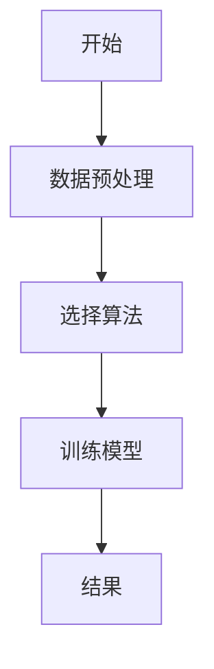

                 


```markdown
# 全球股市估值与人工智能在环境监测中的应用

> 关键词：全球股市估值、人工智能、环境监测、机器学习、系统架构设计

> 摘要：本文系统探讨了全球股市估值与人工智能在环境监测中的应用。首先，从股市估值的背景和核心概念出发，分析传统与现代估值方法的优劣，详细介绍机器学习在股市预测中的应用。其次，深入探讨人工智能在环境监测中的算法原理，结合实际案例，展示系统架构设计和项目实现。最后，总结最佳实践，展望未来发展方向。

---

## 第一部分：全球股市估值与人工智能应用概述

### 第1章：全球股市估值背景与核心概念

#### 1.1 股市估值的背景
- 股市估值是投资者评估股票内在价值的关键步骤。
- 经济指标如GDP、利率等对股市有显著影响。
- 股市波动性要求及时准确的估值方法。

#### 1.2 股市估值的核心概念
- **市盈率（P/E）**：股价与每股收益的比率。
- **市净率（P/B）**：股价与每股净资产的比率。
- **股息率**：股息与股价的比率。

```mermaid
entity Entity {
  id: string
  name: string
  description: string
}
```

---

### 第2章：人工智能在环境监测中的应用背景

#### 2.1 环境监测的基本概念
- 环境监测是通过技术手段收集和分析环境数据的过程。
- 主要监测指标包括空气质量、水质、噪声等。

#### 2.2 人工智能在环境监测中的应用背景
- AI能够提高数据处理效率和预测准确性。
- 常用算法如SVM、CNN、RNN等。

---

## 第二部分：股市估值的传统方法与现代方法对比

### 第3章：传统与现代估值方法对比

#### 3.1 传统方法
- **市盈率法**：适用于盈利稳定的公司。
- **市净率法**：适用于资产密集型企业。

#### 3.2 现代方法
- **现金流折现法**：DCF模型。
- **机器学习模型**：如随机森林、神经网络。

---

## 第三部分：人工智能在环境监测中的算法原理

### 第4章：环境监测中的算法实现

#### 4.1 数据预处理
- 清洗：去除异常值。
- 标准化：统一数据格式。

#### 4.2 算法选择
- **SVM**：用于分类。
- **CNN**：用于图像识别。



---

## 第四部分：系统架构设计

### 第5章：系统架构设计

#### 5.1 股市估值系统
- **功能设计**：数据采集、清洗、预测。
- **架构图**：展示模块交互。

#### 5.2 环境监测系统
- **功能设计**：数据采集、分析、预警。

---

## 第五部分：项目实战与案例分析

### 第6章：项目实战

#### 6.1 股市估值项目
- **环境安装**：安装Python、库。
- **核心实现**：编写预测代码。

#### 6.2 环境监测项目
- **环境安装**：安装相关工具。
- **核心实现**：开发监测系统。

---

## 第六部分：最佳实践与注意事项

### 第7章：最佳实践与小结

#### 7.1 股市估值
- 定期更新模型参数。
- 结合多指标分析。

#### 7.2 环境监测
- 确保数据准确性。
- 及时维护系统。

#### 7.3 综合分析
- 对比两者的优缺点。
- 总结经验教训。

---

**小结**：本文系统阐述了全球股市估值与人工智能在环境监测中的应用，通过对比分析和案例展示，为读者提供了全面的视角。未来，随着技术进步，AI在金融和环境领域的应用将更加广泛。
```

