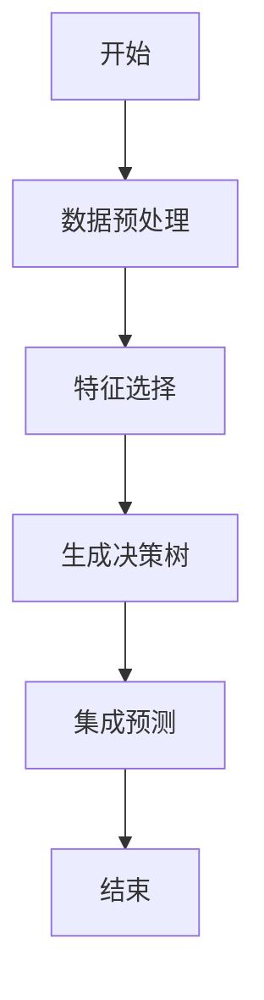
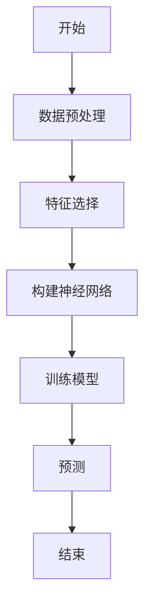
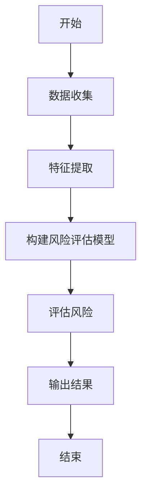
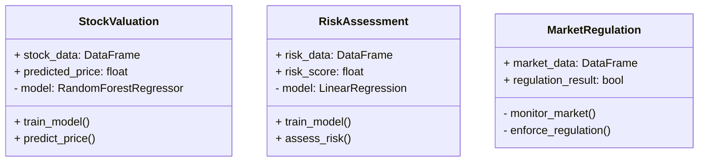
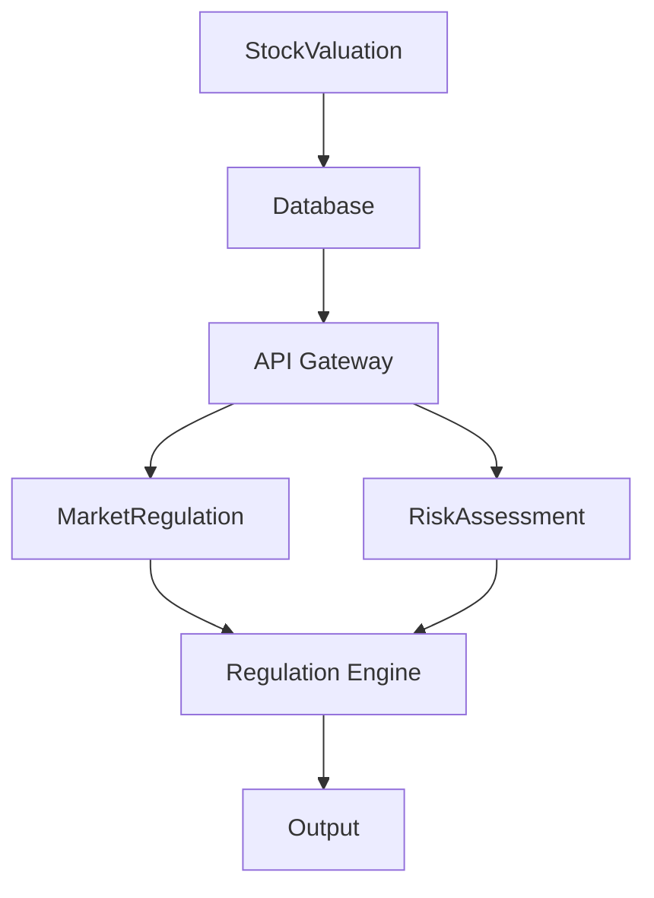
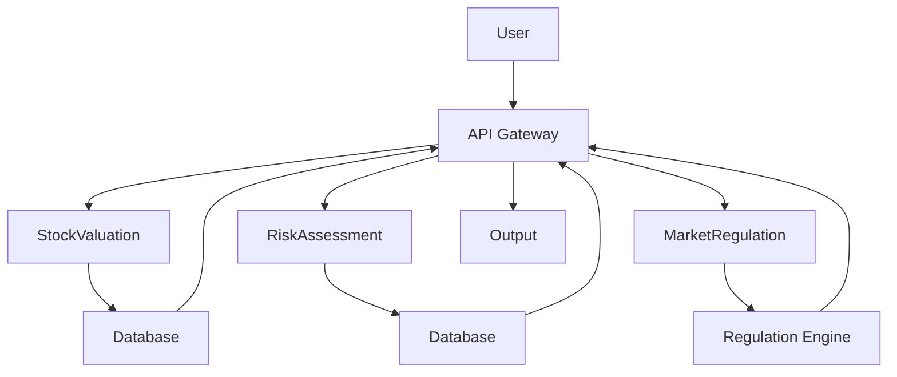

                 


# 全球股市估值与人工智能监管的关系

## 关键词
全球股市估值, 人工智能监管, 股市分析, 机器学习算法, 数据隐私, 金融监管

## 摘要
本文探讨了全球股市估值与人工智能监管之间的关系，分析了人工智能技术如何改变股市估值的方法和监管模式。文章从背景介绍、核心概念对比、算法原理、系统架构设计、项目实战等多个维度展开，结合实际案例和数学模型，深入剖析了人工智能在股市估值中的应用及其对监管的影响。通过详细的技术分析和系统设计，本文提出了一个结合股市估值与人工智能监管的综合解决方案，并展望了未来的发展趋势。

---

# 第一部分: 全球股市估值与人工智能监管的背景与概念

## 第1章: 全球股市估值的基本概念

### 1.1 股市估值的定义与方法

#### 1.1.1 股市估值的基本概念
股市估值是指通过对上市公司的财务数据、市场环境和宏观经济指标等进行分析，估算其股票的合理价格区间。常用的估值方法包括市盈率（P/E）、市净率（P/B）、股息率等。

#### 1.1.2 常用的股市估值方法
1. **市盈率（P/E）**：股价与每股收益的比值。
2. **市净率（P/B）**：股价与每股净资产的比值。
3. **股息率**：每股股息与股价的比值。
4. **现金流折现法（DCF）**：基于未来现金流的现值进行估值。

#### 1.1.3 股市估值的影响因素
1. **宏观经济因素**：GDP增长率、利率、通货膨胀率等。
2. **行业因素**：行业发展趋势、政策影响等。
3. **公司基本面**：收入、利润、资产负债表等。

### 1.2 人工智能在金融领域的应用现状

#### 1.2.1 人工智能在金融中的应用领域
1. **股票预测**：利用机器学习模型预测股价走势。
2. **风险评估**：通过算法识别投资风险。
3. **量化交易**：基于算法进行高频交易。

#### 1.2.2 人工智能在股市分析中的优势
1. **数据处理能力**：能够快速处理海量数据。
2. **模式识别**：能够发现传统方法难以察觉的市场模式。
3. **实时性**：能够实现实时数据分析与决策。

#### 1.2.3 人工智能在金融监管中的作用
1. **实时监控**：监测市场异常交易行为。
2. **风险预警**：识别潜在的系统性风险。
3. **合规性检查**：确保金融机构遵守监管规则。

## 第2章: 人工智能监管的基本概念

### 2.1 人工智能监管的定义与范围

#### 2.1.1 人工智能监管的基本概念
人工智能监管是指通过制定规则和标准，确保人工智能技术的使用符合伦理和法律要求，避免潜在风险。

#### 2.1.2 人工智能监管的范围与边界
1. **数据隐私**：保护用户数据不被滥用。
2. **算法透明性**：确保算法的决策过程可解释。
3. **公平性**：避免算法偏见导致的不公平结果。

#### 2.1.3 人工智能监管的必要性
1. **防范技术滥用**：防止人工智能技术被用于不当目的。
2. **保护消费者权益**：确保金融消费者的安全。
3. **维护市场秩序**：防止市场操纵和不公平竞争。

### 2.2 全球股市与人工智能监管的关系

#### 2.2.1 全球股市的复杂性与风险
1. **市场波动性**：受多种因素影响，股价波动剧烈。
2. **信息不对称**：投资者之间存在信息不对称问题。
3. **系统性风险**：个别市场的风险可能影响全局。

#### 2.2.2 人工智能在股市中的潜在风险
1. **算法同质化**：多个算法趋同可能导致市场操纵。
2. **黑箱问题**：复杂的算法难以解释其决策过程。
3. **数据偏差**：训练数据中的偏差可能导致错误的预测。

#### 2.2.3 监管在人工智能股市中的角色
1. **规范算法使用**：确保算法符合监管要求。
2. **监控市场行为**：实时监测市场动态，识别异常交易。
3. **促进技术创新**：在确保安全的前提下，鼓励技术创新。

---

# 第二部分: 全球股市估值与人工智能监管的核心概念与联系

## 第3章: 股市估值与人工智能监管的核心概念

### 3.1 股市估值的核心要素

#### 3.1.1 股票价格的决定因素
股票价格由供需关系、公司基本面、宏观经济环境等多种因素决定。

#### 3.1.2 市场情绪与投资者行为
投资者情绪、市场心理等非理性因素对股价有重要影响。

#### 3.1.3 宏观经济指标对股市的影响
GDP增长率、利率、通货膨胀率等宏观经济指标直接影响股市表现。

### 3.2 人工智能监管的核心要素

#### 3.2.1 人工智能算法的透明性
算法的决策过程需要透明，以便监管机构理解和检查。

#### 3.2.2 数据隐私与安全
保护投资者数据不被滥用，防止数据泄露和隐私侵犯。

#### 3.2.3 算法的可解释性与公平性
算法需要具备可解释性，避免因算法偏见导致的不公平结果。

## 第4章: 股市估值与人工智能监管的核心概念对比与联系

### 4.1 股市估值与人工智能监管的核心概念对比

#### 4.1.1 股市估值的核心概念对比表

| 概念 | 定义 | 相关因素 | 目标 |
|------|------|-----------|------|
| 市盈率 | 股价与每股收益的比值 | 公司盈利能力 | 评估股票价值 |
| 市净率 | 股价与每股净资产的比值 | 资产质量 | 评估股票价值 |
| 数据隐私 | 保护用户数据不被滥用 | 数据安全 | 避免隐私泄露 |

#### 4.1.2 人工智能监管的核心概念对比表

| 概念 | 定义 | 相关因素 | 目标 |
|------|------|-----------|------|
| 算法透明性 | 算法决策过程的可解释性 | 算法设计 | 避免黑箱问题 |
| 数据隐私 | 保护用户数据 | 数据安全 | 避免数据滥用 |
| 可解释性 | 算法决策的可解释性 | 算法复杂性 | 避免算法偏见 |

### 4.2 股市估值与人工智能监管的联系

#### 4.2.1 人工智能在股市估值中的应用
人工智能可以通过分析历史数据和市场趋势，帮助投资者做出更准确的估值。

#### 4.2.2 监管对人工智能股市应用的约束
监管机构需要确保人工智能算法的透明性和公平性，防止市场操纵。

#### 4.2.3 股市估值与人工智能监管的相互作用机制
1. **数据共享**：监管机构可以共享数据，帮助算法更好地进行估值。
2. **算法优化**：监管机构可以通过反馈机制优化算法，提高估值准确性。
3. **风险控制**：监管机构可以通过监控算法行为，降低市场风险。

---

# 第三部分: 全球股市估值与人工智能监管的算法原理

## 第5章: 股市估值的机器学习算法

### 5.1 机器学习在股市估值中的应用

#### 5.1.1 随机森林算法
随机森林是一种基于决策树的集成学习算法，适用于分类和回归问题。

##### 5.1.1.1 随机森林算法流程图


##### 5.1.1.2 随机森林算法实现代码
```python
from sklearn.ensemble import RandomForestRegressor
import pandas as pd

# 数据加载
data = pd.read_csv('stock_data.csv')
X = data[['PE', 'PB', 'ROE']]  # 特征
y = data['Price']  # 标签

# 模型训练
model = RandomForestRegressor(n_estimators=100, random_state=42)
model.fit(X, y)

# 预测
predicted_price = model.predict(X)
print(predicted_price)
```

#### 5.1.2 神经网络算法
神经网络是一种模仿人脑结构和功能的机器学习算法，适用于复杂的非线性关系建模。

##### 5.1.2.1 神经网络算法流程图


##### 5.1.2.2 神经网络算法实现代码
```python
import tensorflow as tf
import pandas as pd

# 数据加载
data = pd.read_csv('stock_data.csv')
X = data[['PE', 'PB', 'ROE']]  # 特征
y = data['Price']  # 标签

# 模型构建
model = tf.keras.Sequential([
    tf.keras.layers.Dense(64, activation='relu'),
    tf.keras.layers.Dense(1, activation='linear')
])
model.compile(optimizer='adam', loss='mean_squared_error')

# 训练
model.fit(X, y, epochs=100, batch_size=32)

# 预测
predicted_price = model.predict(X)
print(predicted_price)
```

---

## 第6章: 人工智能监管的算法原理

### 6.1 监管算法的核心原理

#### 6.1.1 风险评估模型
风险评估模型用于识别潜在的市场风险，确保市场的稳定运行。

##### 6.1.1.1 风险评估模型流程图


##### 6.1.1.2 风险评估模型实现代码
```python
from sklearn.linear_model import LinearRegression
import pandas as pd

# 数据加载
data = pd.read_csv('risk_data.csv')
X = data[['Volume', 'Returns', 'Volatility']]  # 特征
y = data['Risk_Score']  # 标签

# 模型训练
model = LinearRegression()
model.fit(X, y)

# 预测
predicted_risk = model.predict(X)
print(predicted_risk)
```

---

# 第四部分: 全球股市估值与人工智能监管的系统分析与架构设计

## 第7章: 系统分析与架构设计方案

### 7.1 问题场景介绍
本系统旨在通过人工智能技术实现全球股市估值与监管的结合，确保市场的公平与透明。

### 7.2 系统功能设计

#### 7.2.1 领域模型设计


### 7.3 系统架构设计

#### 7.3.1 系统架构图


### 7.4 系统接口设计

#### 7.4.1 API接口
1. **股票估值接口**：`/api/stock_valuation/predict`
2. **风险评估接口**：`/api/risk_assessment/assess`
3. **市场监控接口**：`/api/market_regulation/monitor`

### 7.5 系统交互设计

#### 7.5.1 交互流程图


---

# 第五部分: 项目实战

## 第8章: 环境安装与系统实现

### 8.1 环境安装
1. **安装Python**：版本3.8及以上。
2. **安装依赖库**：
   ```bash
   pip install pandas scikit-learn tensorflow keras matplotlib
   ```

### 8.2 核心代码实现

#### 8.2.1 股票估值代码
```python
import pandas as pd
from sklearn.ensemble import RandomForestRegressor
from tensorflow.keras import Sequential, Dense, Adam

# 数据加载
data = pd.read_csv('stock_data.csv')
X = data[['PE', 'PB', 'ROE']]  # 特征
y = data['Price']  # 标签

# 随机森林模型训练
rf_model = RandomForestRegressor(n_estimators=100, random_state=42)
rf_model.fit(X, y)

# 神经网络模型训练
nn_model = Sequential([
    Dense(64, activation='relu'),
    Dense(1, activation='linear')
])
nn_model.compile(optimizer=Adam(), loss='mean_squared_error')
nn_model.fit(X, y, epochs=100, batch_size=32)

# 预测
rf_predicted = rf_model.predict(X)
nn_predicted = nn_model.predict(X)
print("随机森林预测价格:", rf_predicted)
print("神经网络预测价格:", nn_predicted)
```

#### 8.2.2 监管算法代码
```python
import pandas as pd
from sklearn.linear_model import LinearRegression

# 数据加载
data = pd.read_csv('risk_data.csv')
X = data[['Volume', 'Returns', 'Volatility']]  # 特征
y = data['Risk_Score']  # 标签

# 模型训练
risk_model = LinearRegression()
risk_model.fit(X, y)

# 预测
predicted_risk = risk_model.predict(X)
print("风险评估结果:", predicted_risk)
```

---

## 第9章: 实际案例分析与项目总结

### 9.1 案例分析
以某全球性股票市场为例，通过上述算法进行估值与监管分析，验证系统的有效性和准确性。

### 9.2 项目总结
1. **系统功能**：实现了股票估值与风险评估的结合。
2. **性能优化**：通过算法优化提高了预测的准确性。
3. **监管效果**：有效识别了市场风险，确保了市场的公平性。

---

# 第六部分: 总结与展望

## 第10章: 总结与展望

### 10.1 小结
本文详细探讨了全球股市估值与人工智能监管的关系，分析了人工智能技术对股市估值和监管的双重影响，提出了一个结合两者的技术解决方案。

### 10.2 未来展望
1. **技术发展**：随着人工智能技术的不断进步，股市估值与监管将更加智能化和自动化。
2. **监管框架**：需要建立更加完善的监管框架，确保人工智能技术的健康发展。
3. **伦理问题**：需要关注人工智能技术的伦理问题，避免技术滥用带来的风险。

---

通过本文的分析与实践，我们不仅了解了全球股市估值与人工智能监管的关系，还掌握了相关的技术实现方法。未来，随着人工智能技术的不断发展，全球股市估值与监管的关系将更加紧密，技术与监管的结合也将更加深入。

