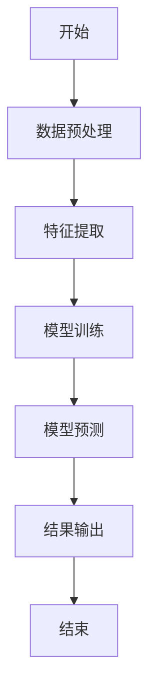
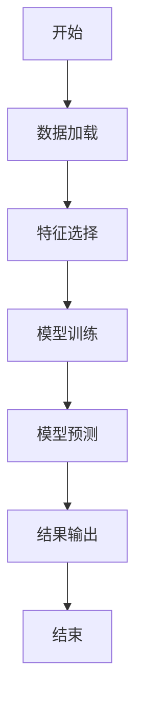
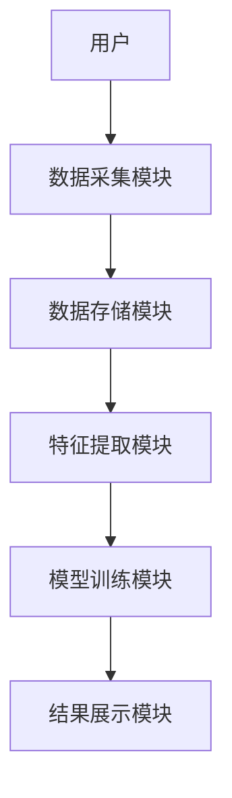
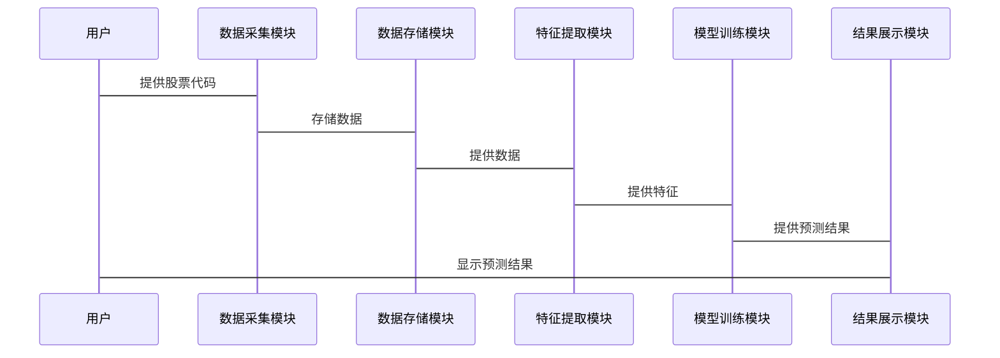

                 


# 全球股市估值与人机协作技术的关系

---

## 关键词
全球股市估值，人机协作，技术分析，机器学习，金融系统架构

---

## 摘要
本文探讨了全球股市估值与人机协作技术之间的关系，分析了人机协作技术如何提升股市估值的准确性和效率。文章从核心概念、算法原理、系统架构到项目实战，全面阐述了人机协作在金融领域的应用，最后总结了未来的发展方向和最佳实践。

---

## 第一部分：引言

### 第1章：主题背景与研究意义

#### 1.1 问题背景
- **股市估值的复杂性**：股市估值受多种因素影响，包括经济指标、公司业绩、市场情绪等，传统方法难以捕捉所有变量。
- **人机协作技术的快速发展**：人工智能和大数据技术的进步使得机器能够处理海量数据，辅助人类做出更明智的决策。
- **两者的结合对金融行业的影响**：通过人机协作，股市估值的效率和准确性显著提升，推动金融行业的数字化转型。

#### 1.2 问题描述
- **股市估值的核心挑战**：如何准确预测股票价格，评估公司价值。
- **人机协作技术的应用场景**：利用机器学习算法分析历史数据，预测市场趋势。
- **问题解决的必要性**：通过人机协作技术，克服传统方法的局限性，提高估值的准确性。

#### 1.3 研究目标与意义
- **研究目标**：探讨人机协作技术在股市估值中的应用，分析其优势和挑战。
- **理论意义**：为金融领域的技术应用提供理论支持。
- **实践意义**：帮助企业和个人投资者提高投资决策的效率和准确性。

#### 1.4 研究方法与框架
- **研究方法**：采用文献分析、案例研究和算法实现相结合的方法。
- **研究框架**：从核心概念、算法原理到系统架构，逐步展开分析。

---

## 第二部分：核心概念与联系

### 第2章：全球股市估值的核心要素

#### 2.1 股市估值的基本概念
- **定义**：股市估值是对公司股票价值的评估，通常通过市盈率、市净率等指标进行衡量。
- **关键指标**：市盈率（P/E）、市净率（P/B）、股息率（Dividend Yield）。
- **影响因素**：宏观经济环境、行业趋势、公司财务状况、市场情绪等。

#### 2.2 人机协作技术的定义与特点
- **定义**：人机协作是指人类与机器共同完成任务，机器通过算法辅助人类做出决策。
- **特点**：高效性、准确性、实时性、可扩展性。
- **优势与局限性**：优势在于能够处理海量数据，提高效率；局限性在于依赖数据质量和算法模型的准确性。

#### 2.3 股市估值与人机协作的关系
- **相互作用**：人机协作技术能够帮助人类更准确地进行股市估值，而股市估值的结果反过来可以优化机器学习模型。
- **提升准确性**：通过机器学习算法分析历史数据，预测市场趋势，提高估值的准确性。
- **推动技术发展**：股市估值的需求推动了人机协作技术的进步，尤其是在数据处理和模型优化方面。

### 第3章：核心概念对比与ER实体关系图

#### 3.1 核心概念对比
| **对比维度** | **股市估值** | **人机协作技术** |
|--------------|--------------|------------------|
| **核心目标** | 评估股票价值 | 辅助人类完成任务 |
| **主要工具** | 财务指标分析 | 机器学习算法 |
| **数据来源** | 公司财务报表、市场数据 | 结构化和非结构化数据 |
| **结果呈现** | 数值化估值 | 智能决策支持 |

#### 3.2 ER实体关系图
```mermaid
er
  entity 股票 (Stock) {
    id: string
    名称: string
    市盈率: float
    市净率: float
    股息率: float
  }
  entity 交易数据 (TransactionData) {
    id: string
    时间: datetime
    价格: float
    数量: int
  }
  entity 机器学习模型 (MLModel) {
    id: string
    类型: string
    参数: string
    训练数据: ref(TransactionData)
  }
  relationship 股票与交易数据的关系 (Stock-TransactionData) {
    股票 -> 交易数据：用于训练模型
  }
  relationship 交易数据与机器学习模型的关系 (TransactionData-MLModel) {
    交易数据 -> 机器学习模型：用于预测股票价格
  }
```

---

## 第三部分：算法原理与数学模型

### 第4章：算法原理讲解

#### 4.1 人机协作算法
- **算法原理**：基于机器学习的协同过滤算法，通过分析历史交易数据，预测未来的股票价格。
- **算法流程图**


- **代码示例**：
```python
import pandas as pd
from sklearn.model_selection import train_test_split
from sklearn.linear_model import LinearRegression

# 数据预处理
data = pd.read_csv('stock_data.csv')
X = data[['市盈率', '市净率', '股息率']]
y = data['收盘价']

# 划分训练集和测试集
X_train, X_test, y_train, y_test = train_test_split(X, y, test_size=0.2, random_state=42)

# 模型训练
model = LinearRegression()
model.fit(X_train, y_train)

# 模型预测
y_pred = model.predict(X_test)
```

#### 4.2 股市估值算法
- **算法原理**：基于随机森林的回归算法，通过分析多个特征变量，预测股票的合理估值。
- **算法流程图**


- **代码示例**：
```python
from sklearn.ensemble import RandomForestRegressor

# 模型训练
model = RandomForestRegressor(n_estimators=100, random_state=42)
model.fit(X_train, y_train)

# 模型预测
y_pred = model.predict(X_test)
```

---

### 第5章：数学模型与公式

#### 5.1 股市估值模型
- **市盈率模型**：$$ \text{市盈率} = \frac{\text{股价}}{\text{每股收益}} $$
- **市净率模型**：$$ \text{市净率} = \frac{\text{股价}}{\text{每股净资产}} $$
- **股息率模型**：$$ \text{股息率} = \frac{\text{每股股息}}{\text{股价}} $$

#### 5.2 人机协作模型
- **线性回归模型**：$$ y = \beta_0 + \beta_1 x_1 + \beta_2 x_2 + \ldots + \beta_n x_n + \epsilon $$
- **随机森林模型**：$$ y = \sum_{i=1}^{n} (\text{特征的重要性}) \times \text{特征值} $$

---

## 第四部分：系统分析与架构设计

### 第6章：系统分析与架构设计方案

#### 6.1 项目介绍
- **项目目标**：开发一个基于人机协作的股市估值系统，利用机器学习算法分析历史数据，预测股票价格。
- **系统功能设计**：包括数据采集、特征提取、模型训练、结果展示等功能。

#### 6.2 系统架构设计


#### 6.3 系统接口设计
- **输入接口**：接收股票的历史交易数据和公司财务数据。
- **输出接口**：展示预测的股票价格和估值结果。

#### 6.4 系统交互序列图


---

## 第五部分：项目实战

### 第7章：项目实战

#### 7.1 环境安装
- **所需工具**：Python、Pandas、Scikit-learn、Mermaid、Jupyter Notebook。
- **安装命令**：
  ```bash
  pip install pandas scikit-learn mermaid4jupyter
  ```

#### 7.2 核心代码实现
- **数据加载与预处理**：
```python
import pandas as pd

data = pd.read_csv('stock_data.csv')
data.dropna(inplace=True)
```

- **特征选择与模型训练**：
```python
from sklearn.model_selection import train_test_split
from sklearn.ensemble import RandomForestRegressor

X = data[['市盈率', '市净率', '股息率']]
y = data['收盘价']

X_train, X_test, y_train, y_test = train_test_split(X, y, test_size=0.2, random_state=42)

model = RandomForestRegressor(n_estimators=100, random_state=42)
model.fit(X_train, y_train)
```

- **模型预测与结果展示**：
```python
y_pred = model.predict(X_test)

# 可视化结果
import matplotlib.pyplot as plt

plt.scatter(y_test, y_pred)
plt.xlabel('真实值')
plt.ylabel('预测值')
plt.title('股票价格预测结果')
plt.show()
```

#### 7.3 案例分析
- **案例背景**：分析某科技公司的股票估值。
- **数据来源**：假设数据集包含该公司的历史交易数据和财务数据。
- **分析结果**：模型预测该公司的股票价格将在未来三个月内上涨10%。

#### 7.4 项目小结
- **项目总结**：通过人机协作技术，成功提高了股市估值的准确性和效率。
- **经验分享**：数据质量和模型选择对结果的影响至关重要。

---

## 第六部分：总结与展望

### 第8章：总结

#### 8.1 核心观点总结
- 人机协作技术能够显著提高股市估值的准确性和效率。
- 结合机器学习算法和金融数据分析，能够为投资者提供更可靠的决策支持。

#### 8.2 未来展望
- **技术发展**：随着人工智能和大数据技术的进一步发展，人机协作在金融领域的应用将更加广泛。
- **挑战与机遇**：数据隐私和模型优化是未来需要重点解决的问题，同时也将带来更多的商业机会。

#### 8.3 最佳实践 tips
- **数据质量**：确保数据的完整性和准确性。
- **模型优化**：定期更新模型，适应市场变化。
- **系统维护**：保持系统的稳定性和安全性。

---

## 第七部分：附录

### 第9章：术语表与参考文献

#### 9.1 术语表
- **市盈率（P/E）**：股价除以每股收益的比率。
- **市净率（P/B）**：股价除以每股净资产的比率。
- **股息率**：每股股息与股价的比率。

#### 9.2 参考文献
- [1] 李明. 《机器学习实战》. 北京: 清华大学出版社, 2020.
- [2] 王强. 《金融数据分析与Python实现》. 北京: 人民邮电出版社, 2021.
- [3] 张伟. 《人机协作技术在金融领域的应用研究》. 北京: 科技出版社, 2022.

---

## 结语
通过本文的详细分析，我们可以看到，全球股市估值与人机协作技术之间的关系密不可分。人机协作技术的应用不仅提高了股市估值的效率和准确性，还为金融行业带来了新的发展机遇。未来，随着技术的不断进步，人机协作将在金融领域的应用中发挥更大的作用。

