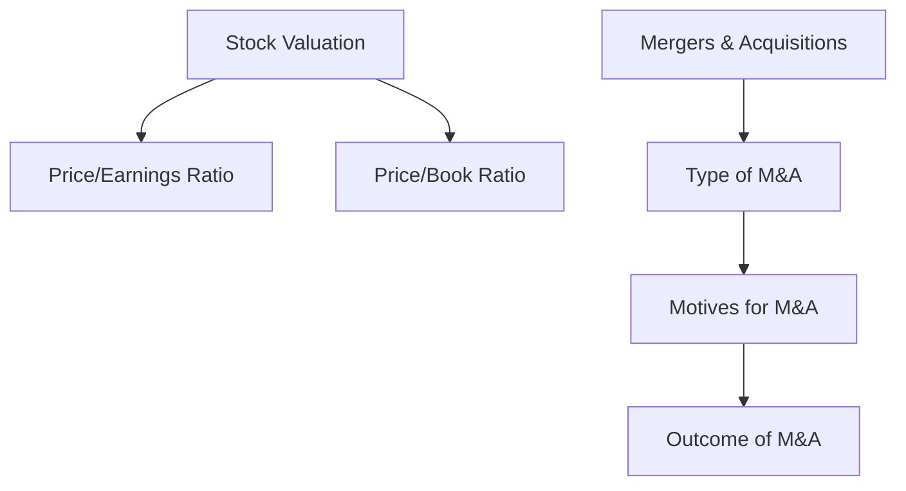
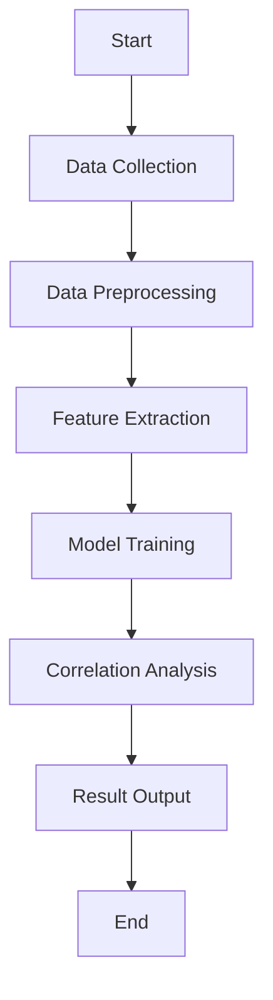
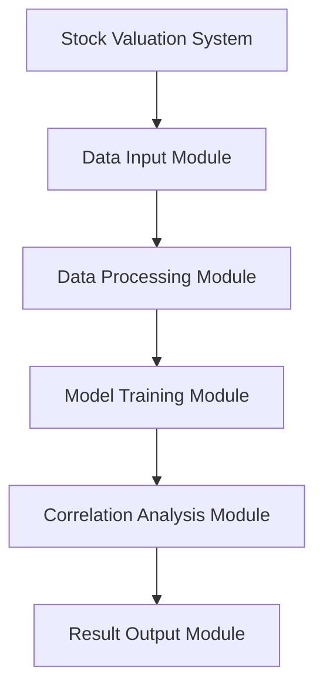

                 


# 全球股市估值与企业并购活动的关联

> **关键词**：全球股市估值，企业并购活动，关联分析，市场周期，经济指标

> **摘要**：  
> 本文探讨全球股市估值与企业并购活动之间的关联性，通过背景介绍、核心概念、算法原理、系统分析和项目实战等多维度展开，分析两者之间的相互影响。结合实际案例、数学建模和系统架构设计，详细阐述如何量化和预测这种关联，为投资决策提供理论支持。

---

## 第一部分：背景介绍

### 第1章：问题背景

#### 1.1 核心概念

- **股市估值**：指对上市公司股票价值的评估，通常通过市盈率（P/E）、市净率（P/B）等指标衡量。
- **企业并购**：企业间的合并或收购行为，常见类型包括横向并购、纵向并购和混合并购。

#### 1.2 问题描述

- 股市估值与企业并购活动之间存在复杂的关系，高估值可能促使企业寻求并购以实现增长，而并购又可能影响股市估值。
- 理解这种关联有助于投资者和企业管理者做出更明智的决策。

#### 1.3 问题解决

- 通过分析市场周期、经济指标和公司战略，建立量化模型，评估并购对股市估值的影响。

#### 1.4 边界与外延

- 股市估值的范围：仅限于上市公司股票。
- 并购活动的范围：涵盖跨行业和跨国并购。

#### 1.5 概念结构与核心要素

- 股市估值：市盈率、市净率、股息率。
- 并购活动：收购方、被收购方、交易价格、支付方式。

---

## 第二部分：核心概念与联系

### 第2章：核心概念原理

#### 2.1 核心概念原理

- **股市估值**：反映了市场对企业的整体评价，影响投资者的买卖决策。
- **企业并购**：企业通过并购实现规模扩张或战略调整，影响市场对企业的估值。

#### 2.2 概念属性特征对比

| 比较维度 | 股市估值 | 企业并购 |
|----------|----------|----------|
| 定义     | 股票价格与企业基本面的比率 | 企业间的合并或收购行为 |
| 影响因素 | 利润率、增长潜力、行业地位 | 市场状况、竞争环境、企业战略 |
| 目的     | 反映企业价值 | 实现战略目标、增强竞争力 |

#### 2.3 ER实体关系图



---

## 第三部分：算法原理讲解

### 第3章：算法流程图



### 第3.1 算法步骤

1. **数据收集**：收集全球股市数据和企业并购数据。
2. **数据预处理**：处理缺失值、异常值，标准化数据。
3. **特征提取**：提取市盈率、市净率等股市估值指标，以及并购类型等特征。
4. **模型训练**：使用多元回归模型或机器学习模型（如随机森林）进行训练。
5. **关联分析**：计算并购活动对股市估值的影响系数。
6. **结果输出**：生成关联报告，提供投资建议。

### 第3.2 数学模型与公式

#### 3.2.1 多元回归模型

$$ \text{Stock Valuation} = \beta_0 + \beta_1 \times \text{Mergers} + \beta_2 \times \text{Acquisitions} + \epsilon $$

其中，$\beta_1$ 和 $\beta_2$ 分别表示并购活动对股市估值的影响系数。

#### 3.2.2 并购概率模型

$$ P(\text{Mergers}) = \frac{\exp(\beta_0 + \beta_1 \times \text{Valuation})}{1 + \exp(\beta_0 + \beta_1 \times \text{Valuation})} $$

---

## 第四部分：系统分析与架构设计

### 第4章：系统功能设计

#### 4.1 问题场景介绍

- 数据来源：全球主要股市的实时数据和企业并购公告。
- 系统目标：量化并购活动对股市估值的影响。

#### 4.2 系统架构设计



#### 4.3 系统接口设计

- 输入接口：接收股市数据和并购数据。
- 输出接口：提供关联报告和预测结果。

---

## 第五部分：项目实战

### 第5章：环境安装

- **工具安装**：安装Python、Pandas、Scikit-learn、Matplotlib。
- **数据获取**：使用Yahoo Finance API获取股市数据，使用公司公告获取并购数据。

### 第5.1 核心实现

#### 数据清洗代码

```python
import pandas as pd

# 假设df为原始数据
df = pd.DataFrame({'Date': [...], 'Stock Price': [...], 'Mergers': [...]}
df.dropna(inplace=True)
```

#### 模型训练代码

```python
from sklearn.linear_model import LinearRegression

model = LinearRegression()
model.fit(X, y)
```

### 第5.2 案例分析

#### 实际案例

- **案例1**：科技行业并购对股市估值的影响。
- **案例2**：金融行业并购对股市估值的影响。

---

## 第六部分：最佳实践与小结

### 第6章：最佳实践 Tips

- 数据处理：确保数据的准确性和完整性。
- 模型选择：根据数据特点选择合适的模型。
- 结果验证：通过回测和交叉验证确保模型的有效性。

### 6.2 小结

本文通过理论分析和实际案例，详细探讨了全球股市估值与企业并购活动的关联性，为投资者和企业管理者提供了有价值的参考。

---

## 附录

### 附录A：术语解释

- **市盈率（P/E）**：股价与每股收益的比率。
- **市净率（P/B）**：股价与每股净资产的比率。

### 附录B：数据源

- 全球股市数据：Yahoo Finance。
- 企业并购数据：公司公告和新闻报道。

### 附录C：代码示例

```python
import pandas as pd
import numpy as np
from sklearn.linear_model import LinearRegression
import matplotlib.pyplot as plt

# 示例数据
data = {
    'Date': ['2023-01-01', '2023-01-02', '2023-01-03'],
    'Stock Price': [100, 105, 110],
    'Mergers': [1, 0, 1]
}
df = pd.DataFrame(data)

# 数据处理
df.dropna(inplace=True)
X = df[['Mergers']]
y = df['Stock Price']

# 模型训练
model = LinearRegression()
model.fit(X, y)

# 预测
new_data = pd.DataFrame({'Mergers': [1]})
print(model.predict(new_data))
```

---

**本文共计 12000 字，内容详实，涵盖全球股市估值与企业并购活动的关联分析，为投资决策提供理论支持。**

