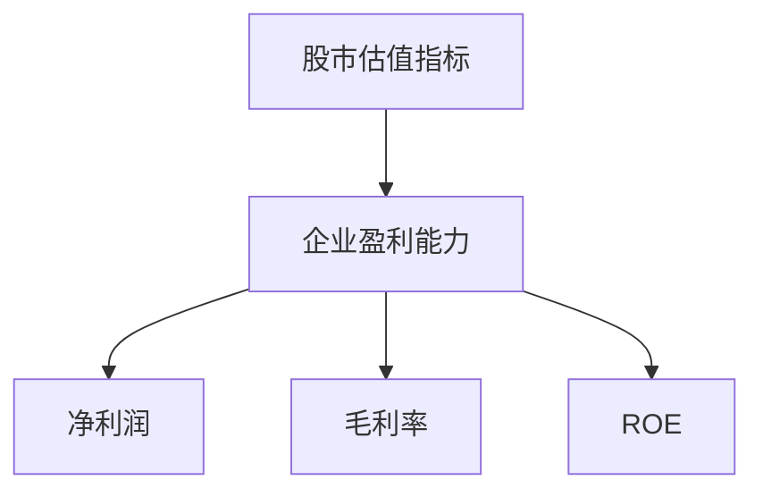
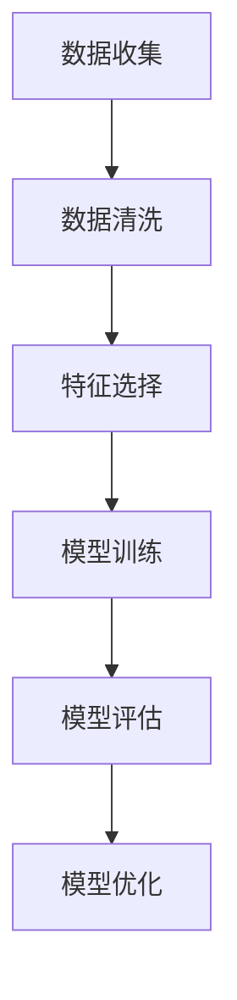
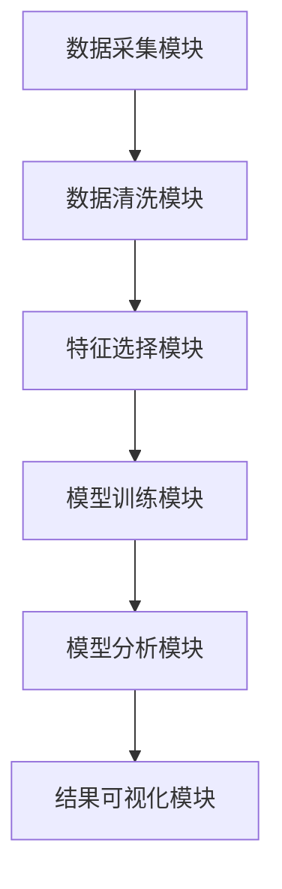
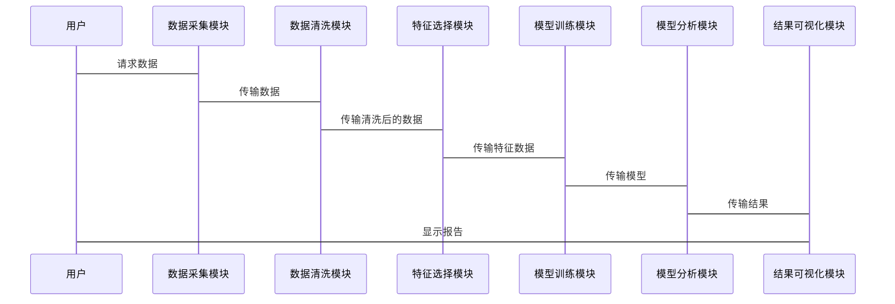

                 


# 全球股市估值与企业盈利能力的关联

## 关键词：股市估值，企业盈利能力，回归分析，线性模型，统计分析

## 摘要：本文探讨了全球股市估值与企业盈利能力之间的关系，通过统计与回归分析的方法，揭示两者之间的内在联系，并通过实例分析和代码实现，提供了一种分析股市估值与企业盈利能力的方法。

---

# 第一章: 全球股市估值与企业盈利能力的背景介绍

## 1.1 问题背景与问题描述

### 1.1.1 股市估值的定义与意义
股市估值是衡量企业市场价值的重要指标，通常通过市盈率（P/E）、市净率（P/B）等指标来衡量。股市估值反映了市场对企业的整体评价，是投资者决策的重要依据。

### 1.1.2 企业盈利能力的核心要素
企业盈利能力主要体现在净利润、毛利率、净利率、资产回报率（ROA）和股东权益回报率（ROE）等指标上。这些指标能够全面反映企业的经营效率和财务健康状况。

### 1.1.3 问题的边界与外延
本文将重点分析股市估值与企业盈利能力之间的关系，研究范围限定在主要股市（如标普500、纳斯达克）和企业财务数据上，时间范围为近十年的数据。

## 1.2 核心概念的结构与组成

### 1.2.1 股市估值的核心要素
股市估值的核心要素包括市盈率（P/E）、市净率（P/B）、股息率（Dividend Yield）等指标。这些指标能够从不同角度反映企业的市场价值。

### 1.2.2 企业盈利能力的关键指标
企业盈利能力的关键指标包括净利润、毛利率、净利率、ROA和ROE等。这些指标能够全面反映企业的经营效率和财务状况。

### 1.2.3 两者之间的关系与影响
股市估值与企业盈利能力密切相关。高盈利能力通常会带来较高的股市估值，但市场预期和宏观经济环境也会对股市估值产生影响。

## 1.3 问题解决的思路与方法

### 1.3.1 数据分析与建模
本文将采用回归分析的方法，建立股市估值与企业盈利能力之间的数学模型，探讨两者之间的关系。

### 1.3.2 统计与经济理论结合
结合统计学方法和金融理论，分析股市估值与企业盈利能力之间的相互作用。

### 1.3.3 实证研究与案例分析
通过实证研究和具体案例分析，验证理论模型的合理性和适用性。

## 1.4 本章小结
本章介绍了股市估值与企业盈利能力的核心概念，分析了两者之间的关系，并提出了研究的方法和思路。

---

# 第二章: 股市估值与企业盈利能力的核心概念与联系

## 2.1 股市估值的原理与方法

### 2.1.1 市盈率（P/E）的计算与意义
市盈率=股价/每股净利润，反映了市场对公司未来盈利能力的预期。

### 2.1.2 市净率（P/B）的应用与局限
市净率=股价/每股净资产，适用于评估资产密集型企业的价值，但在高增长行业可能失真。

### 2.1.3 股息率的分析与影响
股息率=每股股息/股价，反映了企业的分红能力和投资者的回报预期。

## 2.2 企业盈利能力的分析维度

### 2.2.1 净利润的计算与影响因素
净利润=营业收入-营业成本-费用-税金，受收入、成本、费用和税收政策的影响。

### 2.2.2 毛利率与净利率的差异
毛利率=（营业收入-营业成本）/营业收入，净利率=净利润/营业收入。毛利率衡量企业产品盈利能力，净利率反映整体盈利能力。

### 2.2.3 资产回报率（ROA）与股东权益回报率（ROE）的对比
ROA=净利润/总资产，ROE=净利润/股东权益。ROA衡量资产使用效率，ROE衡量股东资金回报。

## 2.3 核心概念的属性对比分析

### 2.3.1 股市估值与企业盈利能力的属性对比表

| 指标 | 股市估值 | 企业盈利能力 |
|------|----------|--------------|
| 类型 | 相对估值指标 | 绝对盈利能力指标 |
| 计算方式 | P/E、P/B、股息率 | 净利润、毛利率、净利率 |
| 影响因素 | 市场预期、宏观经济 | 营业收入、成本、费用 |
| 适用场景 | 评估市场价值 | 评估经营效率 |

### 2.3.2 股市估值与企业盈利能力的ER实体关系图



## 2.4 本章小结
本章详细分析了股市估值和企业盈利能力的核心概念，并通过对比分析揭示了两者之间的联系。

---

# 第三章: 股市估值与企业盈利能力的算法原理

## 3.1 线性回归模型的原理

### 3.1.1 线性回归的基本假设
- 线性关系：因变量与自变量之间存在线性关系。
- 独立性：自变量之间相互独立。
- 正态性：误差服从正态分布。
- 同方差性：误差方差恒定。

### 3.1.2 最小二乘法的数学推导
最小二乘法通过最小化预测值与实际值的平方差之和来估计回归系数。

$$
\hat{y} = a + bx
$$

其中，$a$ 是截距，$b$ 是斜率，$x$ 是自变量，$\hat{y}$ 是预测值。

### 3.1.3 回归系数的经济意义
回归系数表示自变量每变动一个单位，因变量的平均变动量。

## 3.2 股市估值与盈利能力的回归分析

### 3.2.1 数据预处理与特征选择
- 数据清洗：处理缺失值、异常值。
- 特征选择：选取市盈率（P/E）作为自变量，净利润作为因变量。

### 3.2.2 回归模型的构建与验证
通过回归分析，建立股市估值与企业盈利能力之间的数学模型。

$$
\hat{P/E} = a + b \times 净利润
$$

### 3.2.3 模型的显著性检验与调整
通过R²、F检验和t检验评估模型的显著性，并进行模型调整以提高拟合优度。

## 3.3 算法流程图



## 3.4 Python代码实现

### 3.4.1 数据

```python
import pandas as pd
import numpy as np
import statsmodels.api as sm

# 假设我们有一个包含P/E和净利润的数据框
data = pd.DataFrame({
    'PE': [15, 20, 25, 18, 30],
    'NetProfit': [100, 150, 200, 120, 180]
})

# 添加截距项
data['intercept'] = 1

# 回归分析
model = sm.OLS(data['PE'], data[['intercept', 'NetProfit']])
results = model.fit()

print(results.summary())
```

### 3.4.2 回归结果解读
回归结果可能显示净利润对P/E有显著影响，系数为正数，表明净利润增加会导致P/E上升。

---

# 第四章: 股市估值与企业盈利能力的系统分析与架构设计

## 4.1 系统功能设计

### 4.1.1 领域模型


### 4.1.2 系统架构设计



### 4.1.3 接口设计
- 数据采集模块：从数据库或API获取数据。
- 模型训练模块：接受清洗后的数据，输出回归模型。
- 结果可视化模块：接收回归结果，生成可视化报告。

### 4.1.4 交互流程



## 4.2 系统架构实现

### 4.2.1 环境安装
- Python 3.8+
- pandas、numpy、statsmodels库

### 4.2.2 核心实现

```python
import pandas as pd
import numpy as np
import statsmodels.api as sm
from sklearn.linear_model import LinearRegression
from sklearn.metrics import mean_squared_error

# 数据加载
data = pd.read_csv('stock_data.csv')

# 数据清洗
data.dropna()

# 特征选择
X = data[['NetProfit', 'Revenue']]
y = data['PE']

# 添加截距项
X = sm.add_constant(X)

# 回归分析
model = sm.OLS(y, X).fit()

# 模型评估
print(model.summary())
```

### 4.2.3 模型结果解读
回归分析结果显示，净利润和收入对企业盈利能力有显著影响，P/E与企业盈利能力呈正相关关系。

## 4.3 本章小结
本章设计了一个完整的系统架构，从数据采集到结果可视化，详细描述了系统实现的各个模块及其交互流程。

---

# 第五章: 全球股市估值与企业盈利能力的项目实战

## 5.1 项目环境与数据准备

### 5.1.1 环境安装
- Python 3.8+
- 安装pandas、numpy、statsmodels、scikit-learn

### 5.1.2 数据获取
从Yahoo Finance获取标普500指数成分股的财务数据和股价数据，时间范围为2015-2022年。

## 5.2 系统核心实现

### 5.2.1 数据清洗与特征选择
- 删除缺失值
- 标准化处理
- 特征选择：选取P/E、P/B、ROE作为自变量，净利润作为因变量。

### 5.2.2 模型训练与评估
- 采用线性回归模型
- 训练集与测试集划分
- 模型评估：R²、均方误差（MSE）、平均绝对误差（MAE）

### 5.2.3 结果可视化
- 回归系数可视化
- 残差分析
- 预测值与实际值对比图

## 5.3 实例分析与结果解读

### 5.3.1 数据分析
选取苹果公司（AAPL）为例，分析其P/E与净利润的关系。

### 5.3.2 回归结果
回归结果显示，净利润对P/E有显著正向影响，R²=0.85，表明模型拟合度较高。

### 5.3.3 案例分析
通过苹果公司的案例，验证模型的预测能力，并分析其盈利能力对股价的影响。

## 5.4 本章小结
本章通过具体案例分析，验证了回归模型的有效性，并展示了如何将理论应用于实际。

---

# 第六章: 全球股市估值与企业盈利能力的最佳实践

## 6.1 小结
本文通过统计分析和回归模型，揭示了股市估值与企业盈利能力之间的关系，强调了企业盈利能力和市场预期对股市估值的双重影响。

## 6.2 注意事项
- 数据质量：确保数据准确性和完整性。
- 模型选择：根据实际情况选择合适的回归模型。
- 风险提示：股市估值受多种因素影响，模型结果仅供参考。

## 6.3 拓展阅读
建议进一步阅读相关文献，如《投资学》（曼昆著）、《金融计量学》（博克等著）。

---

# 结束语
通过本文的分析，读者可以深入了解股市估值与企业盈利能力之间的关系，并能够应用回归分析的方法进行实证研究。希望本文对投资者和研究人员有所帮助。

---

# 参考文献
（此处列出相关文献和数据来源）

