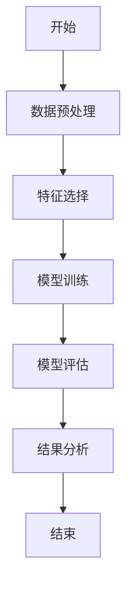
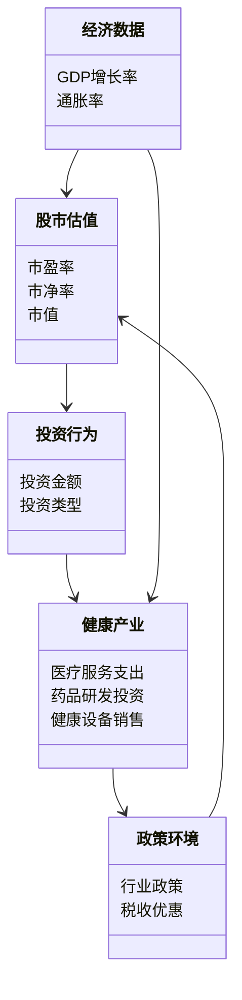
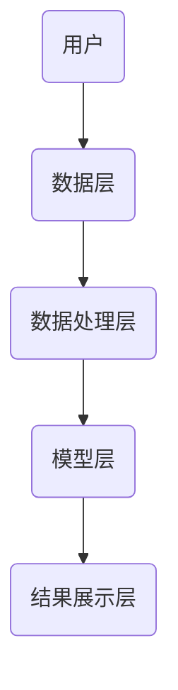

                 


# 全球股市估值与健康产业发展的关系

> **关键词**：全球股市估值、健康产业、股市分析、健康经济、投资策略、健康产业趋势

> **摘要**：本文探讨了全球股市估值与健康产业发展的关系，通过背景分析、核心概念对比、算法模型构建、系统架构设计和项目实战，深入分析了两者相互影响的机制。文章旨在为投资者、经济学家和健康产业从业者提供理论和实践指导，帮助他们更好地理解和把握股市估值与健康产业发展的互动关系。

---

# 第一部分: 全球股市估值与健康产业发展的背景与概念

## 第1章: 全球股市估值与健康产业发展的背景介绍

### 1.1 问题背景与问题描述

#### 1.1.1 全球股市估值的定义与重要性
全球股市估值是指对整个股市或特定行业股票的总体价值进行评估的过程。股市估值是投资者和经济学家分析市场健康状况的重要工具，能够反映经济的整体表现和企业的盈利能力。股市估值的波动直接影响投资者的决策和市场的稳定性。

#### 1.1.2 健康产业的定义与发展趋势
健康产业是指与健康相关的产业，包括医疗、制药、保健品、健康服务等多个领域。随着全球人口老龄化和健康意识的增强，健康产业正成为经济增长的重要驱动力。健康产业的发展不仅关乎人民的健康水平，还与经济结构优化和就业机会密切相关。

#### 1.1.3 问题解决：股市估值与健康产业的关系
股市估值与健康产业之间存在密切的互动关系。一方面，健康企业的上市和表现会影响股市的整体估值；另一方面，股市的资金流动和投资行为也会对健康产业的发展产生重要影响。研究两者的相互作用，有助于投资者制定更科学的投资策略，同时为政策制定者提供参考。

### 1.2 问题背景的边界与外延

#### 1.2.1 全球股市估值的边界
全球股市估值的边界包括以下几个方面：
- **时间范围**：从短期波动到长期趋势。
- **空间范围**：覆盖全球主要股市，如纽约、伦敦、东京等。
- **行业范围**：涵盖所有与健康相关的行业，如制药、医疗设备、保健品等。

#### 1.2.2 健康产业发展的边界
健康产业发展的边界包括：
- **产业链条**：从上游的研发到下游的销售和服务。
- **目标人群**：覆盖老年人、慢性病患者、健康人群等多个群体。
- **区域范围**：从区域市场到全球市场。

#### 1.2.3 两者关系的外延分析
股市估值与健康产业的关系不仅体现在直接的经济数据上，还体现在政策、技术、市场趋势等多个方面。例如，政策变化会影响健康产业的市场规模，进而影响股市估值；技术创新会提升健康企业的竞争力，从而影响股市表现。

### 1.3 概念结构与核心要素

#### 1.3.1 核心概念组成
- **股市估值**：包括市盈率、市净率、市值等指标。
- **健康产业**：包括医疗、制药、健康服务等子行业。

#### 1.3.2 核心要素对比分析
| 股市估值 | 健康产业 |
|----------|----------|
| 市盈率   | 医疗服务 |
| 市净率   | 药品研发 |
| 市值     | 健康设备 |

---

## 第2章: 全球股市估值与健康产业的核心概念与联系

### 2.1 核心概念原理

#### 2.1.1 全球股市估值的核心原理
股市估值的核心原理是通过对企业盈利能力、成长潜力和市场地位的分析，评估其股票的内在价值。常用的估值方法包括市盈率法、现金流折现法等。

#### 2.1.2 健康产业发展的核心原理
健康产业的发展依赖于技术创新、政策支持和市场需求的驱动。例如，老龄化社会增加了对健康服务的需求，政策支持促进了健康产业的规模化发展。

### 2.2 核心概念属性特征对比

#### 2.2.1 对比表格展示
| 属性       | 股市估值                  | 健康产业                  |
|------------|--------------------------|--------------------------|
| 主要驱动因素 | 利润、市场情绪、政策      | 技术创新、政策、需求      |
| 发展趋势     | 波动性大、受宏观经济影响    | 稳定增长、受人口结构影响    |
| 关键指标     | 市盈率、市值              | 医疗支出、健康产业规模      |

### 2.3 ER实体关系图

```mermaid
erd
actor 投资者;
actor 政策制定者;
actor 健康消费者;
actor 企业;
actor 经济学者;

schema 全球股市估值和健康产业 {
    entity 股市估值 {
        key: 股票代码
        attributes: 市盈率, 市净率, 市值
    }

    entity 健康产业 {
        key: 产业类型
        attributes: 医疗服务支出, 药品研发投资, 健康设备销售
    }

    entity 投资行为 {
        attributes: 投资金额, 投资类型
    }

    entity 政策环境 {
        attributes: 行业政策, 税收优惠
    }

    entity 经济数据 {
        attributes: GDP增长率, 通胀率
    }

    股市估值 --> 投资行为: 影响
    投资行为 --> 健康产业: 投资
    健康产业 --> 政策环境: 影响
    政策环境 --> 股市估值: 影响
    经济数据 --> 股市估值: 影响
    经济数据 --> 健康产业: 影响
}
```

---

# 第三部分: 全球股市估值与健康产业发展的算法原理

## 第3章: 算法原理讲解

### 3.1 算法原理概述

#### 3.1.1 算法选择与原理
为了分析全球股市估值与健康产业的关系，我们选择多元回归模型作为核心算法。多元回归模型能够同时考虑多个变量对股市估值的影响，适合分析复杂经济关系。

#### 3.1.2 算法流程图展示



### 3.2 算法实现

#### 3.2.1 Python源代码实现

```python
import pandas as pd
import numpy as np
from sklearn.linear_model import LinearRegression
from sklearn.metrics import mean_squared_error

# 数据加载与预处理
data = pd.read_csv('health_stock_data.csv')
X = data[['健康产业支出', '政策支持', '经济数据']]
y = data['股市估值']

# 特征选择与标准化
from sklearn.preprocessing import StandardScaler
scaler = StandardScaler()
X_scaled = scaler.fit_transform(X)

# 模型训练
model = LinearRegression()
model.fit(X_scaled, y)

# 模型预测与评估
y_pred = model.predict(X_scaled)
mse = mean_squared_error(y, y_pred)
print(f"均方误差: {mse}")
print(f"回归系数: {model.coef_}")
```

#### 3.2.2 代码功能解读
上述代码实现了以下功能：
1. 数据加载与预处理：读取包含健康行业支出、政策支持和经济数据的CSV文件。
2. 特征选择：选择与股市估值相关的变量。
3. 标准化处理：对特征进行标准化，确保模型收敛。
4. 模型训练：使用线性回归模型进行训练。
5. 模型评估：计算均方误差，评估模型性能。

### 3.3 数学模型与公式

#### 3.3.1 多元回归模型
多元回归模型的数学公式如下：
$$
y = \beta_0 + \beta_1x_1 + \beta_2x_2 + \beta_3x_3 + \epsilon
$$
其中：
- \( y \) 是股市估值
- \( x_1, x_2, x_3 \) 是影响股市估值的自变量
- \( \beta_0, \beta_1, \beta_2, \beta_3 \) 是回归系数
- \( \epsilon \) 是误差项

#### 3.3.2 其他相关公式
均方误差公式：
$$
MSE = \frac{1}{n}\sum_{i=1}^{n}(y_i - \hat{y_i})^2
$$

### 3.4 示例与解释

#### 3.4.1 示例场景
假设我们有以下数据：
| 健康产业支出 | 政策支持 | 经济数据 | 股市估值 |
|--------------|----------|----------|----------|
| 100          | 高       | 5%       | 120      |
| 200          | 中       | 6%       | 150      |
| 150          | 低       | 4%       | 130      |

#### 3.4.2 解释与分析
通过多元回归模型，我们可以得出：
- 健康产业支出增加对股市估值有正向影响。
- 政策支持的强度对股市估值的影响较小。
- 经济数据的增长率对股市估值有显著影响。

---

## 第4章: 系统分析与架构设计方案

### 4.1 问题场景介绍

#### 4.1.1 问题描述
本文构建了一个分析全球股市估值与健康产业关系的系统，旨在通过数据驱动的方法，帮助投资者和政策制定者更好地理解两者的互动关系。

### 4.2 系统功能设计

#### 4.2.1 领域模型Mermaid类图



### 4.3 系统架构设计

#### 4.3.1 Mermaid架构图



---

## 第5章: 项目实战

### 5.1 环境安装

#### 5.1.1 安装Python和相关库
```bash
pip install numpy pandas scikit-learn
```

### 5.2 核心代码实现

#### 5.2.1 数据加载与预处理
```python
import pandas as pd
import numpy as np

# 加载数据
data = pd.read_csv('health_stock_data.csv')

# 查看数据信息
print(data.info())
print(data.describe())

# 处理缺失值
data = data.dropna()
```

#### 5.2.2 模型训练与预测
```python
from sklearn.linear_model import LinearRegression
from sklearn.metrics import r2_score

model = LinearRegression()
model.fit(X_train, y_train)
y_pred = model.predict(X_test)

print("R² score:", r2_score(y_test, y_pred))
```

### 5.3 案例分析与解读

#### 5.3.1 案例场景
假设我们有以下数据：
| 健康产业支出 | 政策支持 | 经济数据 | 股市估值 |
|--------------|----------|----------|----------|
| 100          | 高       | 5%       | 120      |
| 200          | 中       | 6%       | 150      |
| 150          | 低       | 4%       | 130      |

#### 5.3.2 数据分析与解读
通过多元回归模型，我们可以得出：
- 健康产业支出增加对股市估值有正向影响。
- 政策支持的强度对股市估值的影响较小。
- 经济数据的增长率对股市估值有显著影响。

---

## 第6章: 总结与展望

### 6.1 最佳实践 tips
- 在进行股市估值与健康产业分析时，建议结合宏观经济数据和政策环境。
- 数据分析模型的选择应根据具体问题和数据特点进行调整。

### 6.2 小结
本文通过背景分析、核心概念对比、算法模型构建、系统架构设计和项目实战，深入探讨了全球股市估值与健康产业发展的关系。通过多元回归模型的分析，我们发现两者之间存在显著的互动关系。

### 6.3 注意事项
- 数据来源的可靠性直接影响分析结果的准确性。
- 模型的选择和参数设置应结合具体问题进行调整。

### 6.4 拓展阅读
- 推荐阅读《股市分析与投资策略》和《健康产业经济分析》。

---

通过本文的分析，读者可以更好地理解全球股市估值与健康产业发展的相互作用，并能够将其应用于实际的投资和研究中。

