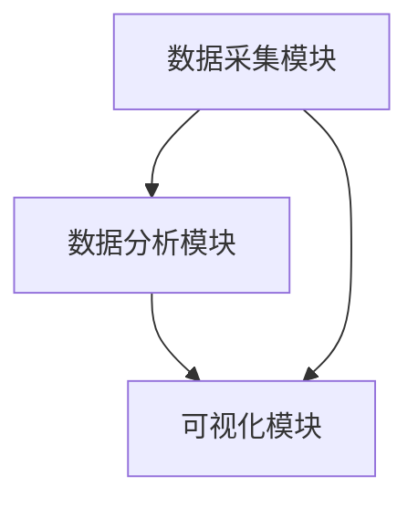

                 


# 全球股市估值与共享经济模式的关系

---

## 关键词：全球股市估值、共享经济模式、股市分析、经济效应、技术分析、数据建模

---

## 摘要：本文探讨了全球股市估值与共享经济模式之间的复杂关系。通过分析共享经济模式对股市估值的影响，结合技术分析、数据建模和实际案例，揭示共享经济如何改变传统经济模式，并为投资者提供新的视角和策略。文章从背景介绍、核心概念、算法原理、系统架构、项目实战等多个维度展开，旨在帮助读者深入理解两者的关系，并掌握如何利用技术手段进行分析和预测。

---

# 第一部分: 背景介绍

## 第1章: 全球股市估值的基础知识

### 1.1 股市估值的基本概念

#### 1.1.1 股市估值的定义
股市估值是指对上市公司股票价值的评估，通常基于公司财务数据、市场环境和行业趋势等因素。股票的内在价值与市场价值之间的差异反映了市场的波动性和投资者的预期。

#### 1.1.2 股市估值的主要指标
- **市盈率（P/E）**：股价与每股收益的比率，反映市场对公司的估值是否合理。
- **市净率（P/B）**：股价与每股净资产的比率，衡量股价相对于账面价值的高低。
- **股息率**：每股股息与股价的比率，反映股票的收益能力。

#### 1.1.3 股市估值的影响因素
- **宏观经济因素**：GDP增长率、通货膨胀、利率政策等。
- **行业因素**：行业生命周期、竞争格局、政策法规。
- **公司基本面**：盈利能力、资产负债情况、管理团队等。

### 1.2 共享经济模式的定义与特点

#### 1.2.1 共享经济的定义
共享经济是指通过技术手段，将闲置资源（如闲置资产、劳动力、知识等）进行共享和优化配置的经济模式。其核心是通过平台撮合供需双方，降低交易成本，提高资源利用率。

#### 1.2.2 共享经济的核心特征
- **去中心化**：通过平台连接供需双方，减少中间环节。
- **按需分配**：资源根据需求动态分配，提高效率。
- **共享收益**：供需双方共享资源带来的收益。

#### 1.2.3 共享经济与传统经济模式的区别
| 特性                | 共享经济            | 传统经济            |
|---------------------|--------------------|--------------------|
| 资源分配方式        | 按需分配            | 固定分配            |
| 交易成本            | 低                  | 高                  |
| 资源利用率          | 高                  | 低                  |
| 中介角色            | 平台                | 中间商、代理商      |

### 1.3 股市估值与共享经济的初步联系

#### 1.3.1 股市估值与经济模式的关系
股市估值是经济运行的晴雨表，反映了市场对经济模式的预期。共享经济作为新兴的经济模式，对股市估值的影响日益显著。

#### 1.3.2 共享经济对股市的影响
共享经济模式的兴起，催生了新的行业和商业模式，对传统行业和相关企业的估值产生了深远影响。例如，共享住宿平台的兴起可能影响传统酒店业的估值。

#### 1.3.3 共享经济模式的典型企业分析
以共享经济代表企业为例，分析其上市后的股市表现及估值变化。例如，Airbnb、滴滴出行等企业的上市对相关行业的估值影响。

---

## 第2章: 全球股市估值的影响因素分析

### 2.1 宏观经济因素对股市估值的影响

#### 2.1.1 经济周期与股市估值的关系
经济周期的波动直接影响股市估值。例如，经济衰退可能导致股市估值下降，而经济复苏可能提升股市估值。

#### 2.1.2 利率政策对股市的影响
低利率环境通常会推高股市估值，因为投资者寻求更高收益的投资渠道。反之，高利率可能导致股市估值下降。

#### 2.1.3 通货膨胀与股市估值的关系
适度的通货膨胀可能推高股市估值，而过高的通货膨胀可能导致股市估值下降，甚至引发经济危机。

### 2.2 行业因素对股市估值的影响

#### 2.2.1 行业生命周期与股市估值
行业生命周期的不同阶段会影响股市估值。例如，成长期行业的估值通常较高，而衰退期行业的估值可能较低。

#### 2.2.2 行业竞争格局对股市的影响
行业集中度高、竞争激烈可能导致股市估值下降，而新兴行业的估值可能较高。

#### 2.2.3 行业政策对股市估值的影响
政策的变化对行业估值有直接影响。例如，政府对共享经济的政策支持可能提升相关行业的估值。

### 2.3 公司基本面因素对股市估值的影响

#### 2.3.1 盈利能力对股市估值的影响
盈利能力强的公司通常具有较高的股市估值。

#### 2.3.2 偿债能力对股市估值的影响
良好的偿债能力通常会提高市场的信任度，从而提升股市估值。

#### 2.3.3 发展潜力对股市估值的影响
具有较大发展潜力的公司通常会获得更高的股市估值。

---

## 第3章: 共享经济模式的核心概念与特征

### 3.1 共享经济的运作机制

#### 3.1.1 资源共享的实现方式
通过平台技术实现资源的共享和分配，例如闲置房屋、闲置车辆等。

#### 3.1.2 共享经济的参与者角色
供需双方通过平台进行交互，平台负责撮合交易并收取一定服务费。

#### 3.1.3 共享经济的盈利模式
通过收取交易佣金、会员费、广告费等实现盈利。

### 3.2 共享经济的经济效应

#### 3.2.1 共享经济对资源配置效率的影响
通过共享经济模式，资源的利用效率显著提高，降低了浪费。

#### 3.2.2 共享经济对就业模式的影响
共享经济催生了大量灵活就业机会，例如司机、民宿房东等。

#### 3.2.3 共享经济对消费行为的影响
共享经济改变了传统的消费模式，消费者更倾向于按需消费。

---

## 第4章: 共享经济模式对股市估值的影响

### 4.1 共享经济模式对传统行业的冲击

#### 4.1.1 对住宿行业的冲击
共享住宿平台的兴起对传统酒店行业形成了竞争压力，可能导致酒店行业的估值下降。

#### 4.1.2 对交通行业的冲击
共享出行模式（如滴滴出行）对传统出租车行业形成了竞争，可能影响相关企业的估值。

#### 4.1.3 对零售行业的冲击
共享零售模式（如共享办公空间）可能影响传统商业地产的估值。

### 4.2 共享经济模式的新兴企业对股市的影响

#### 4.2.1 新兴共享企业的上市影响
新兴共享经济企业的上市可能推动相关行业的估值上升，例如共享办公空间、共享医疗设备等。

#### 4.2.2 投资者对共享经济模式的预期
投资者对共享经济模式的未来发展前景有较高预期，可能推高相关企业的股市估值。

---

## 第5章: 技术分析视角下的共享经济与股市估值

### 5.1 技术分析的基本概念

#### 5.1.1 技术分析的定义
技术分析是通过分析历史价格数据，预测未来价格走势的方法。

#### 5.1.2 技术分析的主要工具
- **K线图**：反映股票价格的波动情况。
- **均线**：反映价格的平均趋势。
- **成交量**：反映市场的交易活跃度。

### 5.2 共享经济模式对技术分析的影响

#### 5.2.1 共享经济模式对股价波动的影响
共享经济模式的不确定性可能导致股价波动加剧。

#### 5.2.2 共享经济模式对技术指标的影响
共享经济模式的兴起可能改变某些技术指标的解读方式。

#### 5.2.3 共享经济模式下的技术分析策略
投资者可以通过技术分析工具，结合共享经济模式的特征，制定更有效的投资策略。

---

## 第6章: 数据建模与共享经济模式的股市估值分析

### 6.1 数据建模的基本概念

#### 6.1.1 数据建模的定义
数据建模是通过数学模型对数据进行分析和预测的过程。

#### 6.1.2 数据建模的主要方法
- **回归分析**：用于预测变量之间的关系。
- **时间序列分析**：用于分析数据的时序变化。
- **机器学习算法**：用于复杂的数据模式识别。

### 6.2 共享经济模式的股市估值建模

#### 6.2.1 数据收集与 preprocessing
- 收集共享经济相关企业的财务数据、市场数据等。
- 对数据进行清洗和预处理。

#### 6.2.2 建模与分析
- 使用回归分析预测共享经济模式对股市估值的影响。
- 使用时间序列分析预测未来股价走势。

#### 6.2.3 模型结果解读
- 分析共享经济模式对股市估值的具体影响。
- 提供基于模型的 investment recommendations。

---

## 第7章: 系统架构与共享经济模式的实现

### 7.1 系统架构设计

#### 7.1.1 系统功能设计
- 数据采集模块：采集共享经济相关企业的财务数据、市场数据等。
- 数据分析模块：对数据进行建模和分析，预测股市估值。
- 可视化模块：将分析结果以图表形式展示，方便投资者理解和决策。

#### 7.1.2 系统架构图


### 7.2 系统接口设计

#### 7.2.1 数据接口
- 数据源接口：与共享经济相关的企业数据库对接。
- 数据分析接口：与第三方数据分析工具对接。

#### 7.2.2 用户接口
- 网站或应用程序接口：为投资者提供数据查询和分析结果展示。

---

## 第8章: 项目实战——基于Python的共享经济模式股市估值分析

### 8.1 环境安装与配置

#### 8.1.1 Python安装
- 安装Python 3.8及以上版本。
- 安装必要的库：pandas、numpy、matplotlib、scikit-learn。

#### 8.1.2 数据源获取
- 从公开数据源获取共享经济相关企业的历史股价数据。

### 8.2 系统核心实现

#### 8.2.1 数据清洗与预处理
```python
import pandas as pd
import numpy as np

# 读取数据
df = pd.read_csv('shared_economy_stocks.csv')

# 数据清洗
df.dropna(inplace=True)
df = df[~df['date'].duplicated()]
```

#### 8.2.2 数据建模与分析
```python
from sklearn.linear_model import LinearRegression

# 数据分割
X = df[['PE', 'P/B', 'industry_growth']]
y = df['stock_price']

# 建立模型
model = LinearRegression()
model.fit(X, y)

# 预测结果
predictions = model.predict(X)
```

#### 8.2.3 结果可视化
```python
import matplotlib.pyplot as plt

plt.scatter(X, y, color='blue')
plt.plot(X, predictions, color='red')
plt.title('Stock Price Prediction')
plt.xlabel('Financial Indicators')
plt.ylabel('Stock Price')
plt.show()
```

### 8.3 实际案例分析

#### 8.3.1 案例背景
以共享住宿平台为例，分析其上市后的股市表现。

#### 8.3.2 数据分析
- 使用回归分析预测未来股价走势。
- 对比上市前后的估值变化。

### 8.4 项目总结

#### 8.4.1 项目成果
- 建立了基于Python的股市估值分析模型。
- 验证了共享经济模式对股市估值的影响。

#### 8.4.2 项目启示
- 技术手段在经济分析中的重要性。
- 共享经济模式对股市估值的深远影响。

---

## 第9章: 最佳实践与总结

### 9.1 投资策略 tips

#### 9.1.1 关注行业动态
投资者应密切关注共享经济模式的发展趋势，及时调整投资策略。

#### 9.1.2 结合技术分析
结合技术分析和基本面分析，制定科学的投资决策。

#### 9.1.3 风险管理
合理控制投资风险，避免过度集中投资。

### 9.2 未来展望

#### 9.2.1 共享经济模式的进一步发展
随着技术的进步，共享经济模式将更加成熟，对股市估值的影响也将更加显著。

#### 9.2.2 技术分析的创新应用
技术分析方法将不断创新，为投资者提供更精准的决策支持。

### 9.3 项目小结

#### 9.3.1 核心收获
通过本项目，我们深入探讨了共享经济模式对股市估值的影响，掌握了基于Python的数据分析方法。

#### 9.3.2 展望未来
未来，我们将继续研究共享经济模式的更多影响，探索更先进的数据分析方法。

---

## 第10章: 注意事项与拓展阅读

### 10.1 投资风险提示

#### 10.1.1 市场风险
股市投资存在市场波动风险，投资者需谨慎决策。

#### 10.1.2 信息风险
数据源的准确性和完整性直接影响分析结果，投资者需确保数据质量。

### 10.2 拓展阅读建议

#### 10.2.1 经济学经典著作
- 《经济学原理》——曼昆
- 《资本论》——马克思

#### 10.2.2 技术分析书籍
- 《股票作手回忆录》——利佛摩尔
- 《技术分析的入门到精通》——克雷默

### 10.3 持续学习建议

#### 10.3.1 关注行业动态
持续关注共享经济模式的发展，了解最新的行业动态。

#### 10.3.2 学习新技术
学习最新的数据分析技术和工具，提升自己的技术能力。

---

# 结语

通过本文的深入探讨，我们不仅了解了全球股市估值与共享经济模式的关系，还掌握了基于技术分析和数据建模的分析方法。希望本文能为投资者和研究者提供新的视角和思路，帮助大家更好地理解和应对共享经济模式带来的挑战和机遇。

