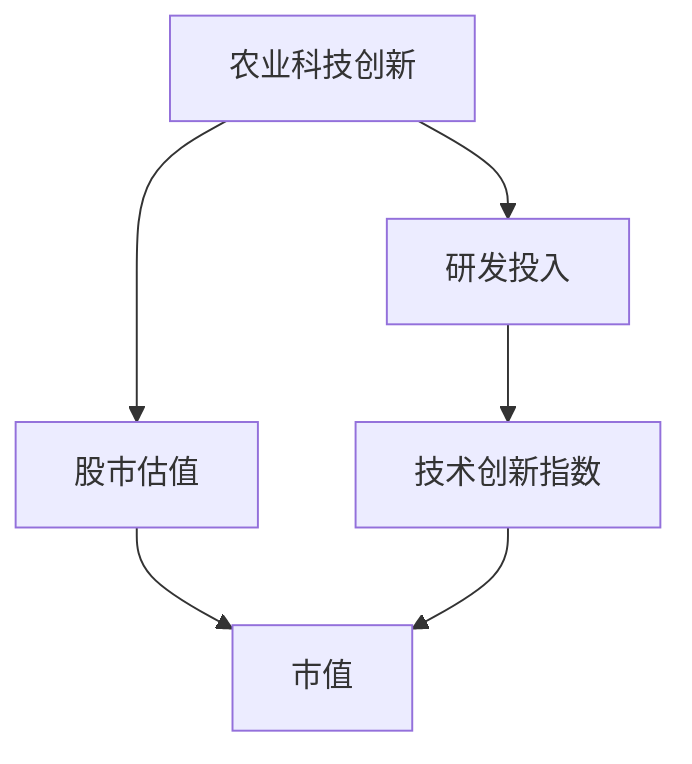
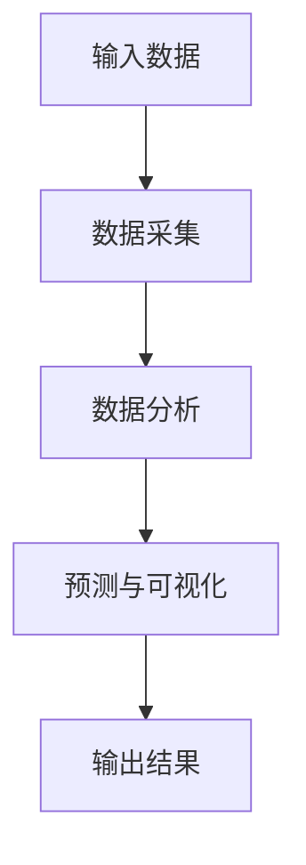

                 


# 全球股市估值与农业科技创新的关联

> 关键词：全球股市估值，农业科技创新，关联机制，数学模型，系统设计

> 摘要：本文探讨全球股市估值与农业科技创新之间的关联，分析农业科技创新如何通过提升企业盈利能力、行业竞争力和投资者信心直接影响股市估值。同时，从全球化视角分析农业科技创新对全球供应链和股市估值的间接影响。通过构建数学模型和系统设计，详细阐述农业科技创新对股市估值的系统性影响，并通过实际案例分析验证模型的有效性。

---

# 第1章: 全球股市估值与农业科技创新的背景介绍

## 1.1 问题背景

### 1.1.1 全球股市估值的重要性

股市估值是衡量企业市场价值的重要指标，反映了投资者对企业的信心和市场预期。全球股市估值的波动直接影响全球资本流动和经济资源配置。通过对全球股市估值的分析，可以揭示经济趋势和市场风险。

### 1.1.2 农业科技创新的必要性

随着全球人口增长和资源有限性，农业科技创新是解决粮食安全问题的关键。农业科技创新通过提高生产效率、降低资源消耗和增强抗风险能力，为农业可持续发展提供技术支持。

### 1.1.3 两者关联的研究意义

研究农业科技创新与全球股市估值的关联，可以为投资者提供新的投资视角，同时为政策制定者提供优化农业科技创新支持的依据。此外，这种关联研究有助于更好地理解科技与资本市场的互动关系。

## 1.2 问题描述

### 1.2.1 农业科技创新对股市的影响

农业科技创新不仅影响农业生产力，还通过企业盈利能力和行业竞争力间接影响股市估值。例如，农业科技企业的技术创新可能导致企业利润增长，从而推动股价上涨。

### 1.2.2 全球化视角下的股市波动

全球化使得资本和资源在全球范围内流动，农业科技创新的全球化应用可能影响全球股市估值。例如，一家农业科技创新企业的成功可能带动整个行业的股价波动。

### 1.2.3 农业科技创新与股市估值的双向作用

农业科技创新可以推动股市估值上升，而股市估值的变化反过来也会影响农业科技创新的投资力度。这种双向作用形成了一个动态的系统性关联。

## 1.3 问题解决

### 1.3.1 农业科技创新如何影响股市估值

通过分析农业科技创新对企业盈利能力的影响，构建数学模型量化其对股市估值的贡献。例如，技术创新可以降低生产成本，提高利润率，从而提升市盈率（P/E）。

### 1.3.2 全球化视角下的股市估值模型构建

从全球化视角出发，考虑农业科技创新对全球供应链的影响，构建多变量模型分析其对全球股市估值的系统性影响。

### 1.3.3 通过数据驱动的方法量化两者关联

利用大数据和机器学习技术，量化农业科技创新对股市估值的具体影响路径，例如通过分析专利数量、研发投入和市场表现等变量。

## 1.4 边界与外延

### 1.4.1 农业科技创新的边界条件

农业科技创新的边界条件包括技术可行性、成本效益和政策支持。例如，某些技术创新可能因成本过高而难以大规模应用。

### 1.4.2 全球股市估值的适用范围

全球股市估值的分析需要考虑不同市场的差异性，例如发达国家和发展中国家的股市表现可能受农业科技创新的影响程度不同。

### 1.4.3 两者关联的外部影响因素

外部影响因素包括全球经济周期、政策变化和自然灾害等。例如，全球经济衰退可能削弱农业科技创新对股市估值的正面影响。

## 1.5 核心概念

### 1.5.1 农业科技创新的核心要素

农业科技创新的核心要素包括技术创新、研发投入、政策支持和市场应用。技术创新是核心，研发投入是基础，政策支持是保障，市场应用是关键。

### 1.5.2 全球股市估值的关键指标

全球股市估值的关键指标包括市盈率（P/E）、市净率（P/B）、市值与利润比（EV/EBITDA）等。这些指标反映了市场的整体估值水平和企业盈利能力。

### 1.5.3 两者关联的机制与路径

农业科技创新通过提升企业盈利能力和行业竞争力直接影响股市估值，同时通过全球化供应链影响全球股市估值。此外，投资者信心和市场预期也起到中介作用。

---

# 第2章: 农业科技创新与股市估值的核心概念比较

## 2.1 农业科技创新的核心要素

### 2.1.1 农业科技创新的定义与分类

农业科技创新是指在农业生产过程中引入新技术、新方法和新工具，以提高生产效率、降低资源消耗和增强抗风险能力。分类包括生物技术、信息技术、机械技术和管理技术。

### 2.1.2 技术创新对农业生产力的提升作用

技术创新通过提高土地利用率、减少劳动力需求和增强抗病虫害能力，显著提升农业生产力。例如，智能农业系统可以实现精准种植和资源优化配置。

### 2.1.3 农业科技创新的驱动因素

驱动因素包括市场需求、技术进步、政策支持和资本投入。市场需求是主要动力，技术进步是核心驱动力，政策支持和资本投入是必要条件。

## 2.2 全球股市估值的关键指标

### 2.2.1 市盈率（P/E）的计算与意义

市盈率=股票价格/每股净利润。市盈率反映了市场对企业的盈利能力和成长性的预期。低市盈率可能意味着低估，高市盈率可能意味着高成长性或高风险。

### 2.2.2 市净率（P/B）的应用

市净率=股票价格/每股净资产。市净率适用于评估资产密集型企业的估值，例如银行和制造业企业。低市净率可能意味着低估，高市净率可能意味着高风险。

### 2.2.3 市值与利润的关系

市值=股价×股数，利润是企业盈利能力的直接体现。市值与利润的关系反映了市场对企业的整体评价，高市值可能意味着高利润或高成长性。

## 2.3 农业科技创新与股市估值的对比分析

### 2.3.1 农业科技创新对股市估值的直接影响

农业科技创新通过提高企业盈利能力和行业竞争力，直接影响股市估值。例如，技术创新可以降低生产成本，提高利润率，从而提升市盈率。

### 2.3.2 全球化视角下的间接影响

农业科技创新通过优化全球供应链和提高农业效率，间接影响全球股市估值。例如，农业科技创新可能降低粮食价格波动，稳定市场预期。

### 2.3.3 两者关联的比较分析表格

下表对比了农业科技创新和股市估值的关键指标和影响路径：

| 指标 | 农业科技创新 | 股市估值 |
|------|-------------|---------|
| 核心要素 | 技术创新、研发投入 | 市盈率、市净率 |
| 影响路径 | 提高企业利润、行业竞争力 | 推动股价上涨、提升市值 |
| 关联机制 | 直接影响企业盈利能力，间接影响市场预期 | 反映企业价值和市场信心 |

---

# 第3章: 农业科技创新与股市估值的关联机制

## 3.1 农业科技创新对股市估值的直接影响

### 3.1.1 技术创新对企业盈利能力的影响

技术创新通过提高生产效率和降低成本，显著提升企业盈利能力。例如，智能农业系统可以减少劳动力需求，降低生产成本，从而提高利润率。

### 3.1.2 技术创新对行业竞争力的提升

农业科技创新可以增强企业的市场竞争力，例如通过技术创新提高产品质量和降低生产成本，从而在市场中占据优势地位。

### 3.1.3 技术创新对股价的推动作用

技术创新带来的盈利增长和市场竞争力提升，通常会推动股价上涨。例如，农业科技企业的技术创新可能导致股价上涨，吸引更多投资者。

## 3.2 全球化视角下的间接影响

### 3.2.1 农业科技创新对全球供应链的影响

农业科技创新通过优化生产流程和提高效率，优化全球供应链。例如，智能农业技术可以实现全球范围内的精准种植和资源优化配置。

### 3.2.2 全球化对股市估值的放大效应

全球化使得资本和资源在全球范围内流动，农业科技创新的全球化应用可能放大其对股市估值的影响。例如，一家农业科技创新企业的成功可能带动整个行业的股价波动。

### 3.2.3 农业科技创新的全球化扩散

农业科技创新的全球化扩散可以降低全球粮食价格波动，稳定市场预期，从而间接影响全球股市估值。

## 3.3 关联机制的综合分析

### 3.3.1 农业科技创新与股市估值的双向互动

农业科技创新可以推动股市估值上升，而股市估值的变化反过来也会影响农业科技创新的投资力度。例如，高股市估值可能吸引更多资本进入农业科技创新领域。

### 3.3.2 全球化视角下的系统性影响

全球化视角下的系统性影响使得农业科技创新对股市估值的影响更加复杂和深远。例如，全球化供应链的优化可能降低全球粮食价格波动，从而影响股市估值。

### 3.3.3 关联机制的动态变化

关联机制随着市场环境和技术进步而动态变化。例如，新兴技术的应用可能改变农业科技创新对股市估值的具体影响路径。

---

# 第4章: 农业科技创新与股市估值的数学模型与公式

## 4.1 农业科技创新对股市估值的数学模型

我们可以构建一个简单的数学模型，量化农业科技创新对股市估值的影响：

$$ \text{股市估值} = f(\text{农业科技创新}, \text{其他因素}) $$

其中，$$ f $$ 是一个综合函数，考虑农业科技创新和其他因素对股市估值的综合影响。

## 4.2 农业科技创新对股市估值的具体公式

假设我们有 $$ n $$ 家农业科技创新企业，其市值为 $$ S_i $$，研发投入为 $$ R_i $$，技术创新指数为 $$ T_i $$。我们可以构建以下回归模型：

$$ S_i = \beta_0 + \beta_1 R_i + \beta_2 T_i + \epsilon_i $$

其中，$$ \beta_0 $$ 是截距，$$ \beta_1 $$ 和 $$ \beta_2 $$ 是回归系数，$$ \epsilon_i $$ 是误差项。该模型可以用来量化研发投入和技术创新指数对股市估值的具体影响。

---

# 第5章: 农业科技创新与股市估值的系统设计

## 5.1 问题场景介绍

我们希望通过系统设计，分析农业科技创新对全球股市估值的影响，构建一个数据驱动的分析系统，帮助投资者和政策制定者更好地理解两者之间的关联。

## 5.2 系统功能设计

### 5.2.1 数据采集模块

数据采集模块负责收集农业科技创新企业和全球股市的相关数据，包括研发投入、技术创新指数、股价、市值等。

### 5.2.2 数据分析模块

数据分析模块对采集的数据进行清洗、建模和分析，量化农业科技创新对股市估值的具体影响。

### 5.2.3 预测与可视化模块

预测与可视化模块基于分析结果，提供未来股市估值的预测和可视化展示。

## 5.3 系统架构设计

### 5.3.1 领域模型

使用 Mermaid 绘制领域模型：



### 5.3.2 系统架构

使用 Mermaid 绘制系统架构：



---

# 第6章: 农业科技创新与股市估值的项目实战

## 6.1 环境安装

### 6.1.1 安装Python

安装 Python 和相关库（如 pandas、numpy、scikit-learn）：

```bash
pip install pandas numpy scikit-learn
```

## 6.2 系统核心实现源代码

### 6.2.1 数据预处理

```python
import pandas as pd
import numpy as np

# 假设我们有农业科技创新企业的数据
data = pd.DataFrame({
    '企业名称': ['企业A', '企业B', '企业C'],
    '研发投入': [100, 200, 150],
    '技术创新指数': [0.8, 0.6, 0.7],
    '市值': [1000, 2000, 1500]
})

# 数据清洗
data.dropna()  # 删除缺失值
```

### 6.2.2 模型训练

```python
from sklearn.linear_model import LinearRegression

# 构建线性回归模型
model = LinearRegression()

# 训练模型
X = data[['研发投入', '技术创新指数']]
y = data['市值']

model.fit(X, y)

# 输出回归系数
print(model.coef_)
```

### 6.2.3 预测与可视化

```python
# 预测市值
new_data = pd.DataFrame({
    '研发投入': [150],
    '技术创新指数': [0.7]
})

predicted_m

