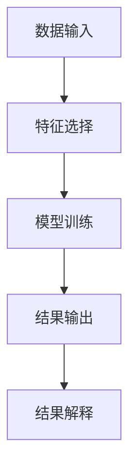
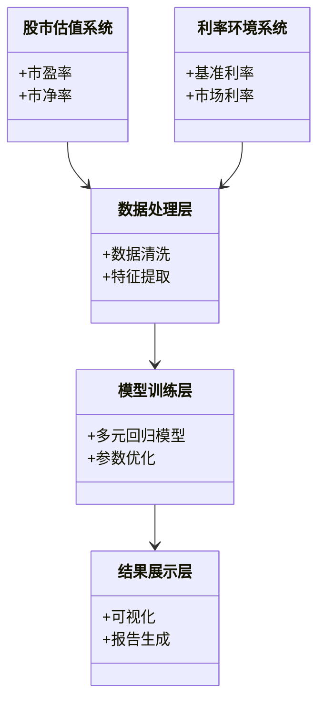
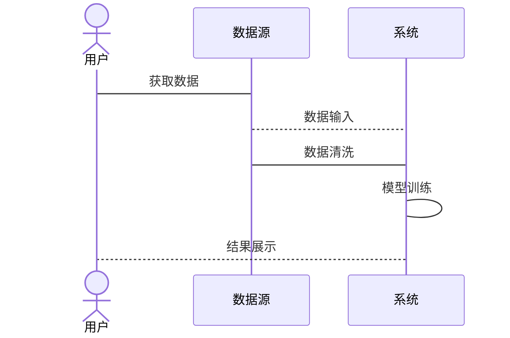

                 


# 全球股市估值与利率环境的互动关系

> 关键词：全球股市、利率环境、互动关系、估值模型、量化分析、系统架构、案例分析

> 摘要：本文探讨全球股市估值与利率环境之间的互动关系，构建分析模型，量化互动机制，并通过实际案例分析，揭示两者的动态关系。

---

# 第一部分: 全球股市估值与利率环境的互动关系概述

## 第1章: 背景介绍

### 1.1 核心概念

#### 1.1.1 股市估值的定义与作用
股市估值是通过分析股票价格、市盈率、市净率等指标，评估市场的整体价值。它是投资者和政策制定者的重要参考，帮助判断市场是否被高估或低估。

#### 1.1.2 利率环境的定义与作用
利率是借款成本的体现，影响企业和个人的借贷行为。低利率通常刺激投资和消费，高利率则反之。利率政策是央行调控经济的重要工具。

#### 1.1.3 问题背景与问题描述
近年来，全球央行的降息政策对股市影响显著。例如，2020年新冠疫情后，全球央行大幅降息，导致股市估值上升。然而，过低的利率可能导致资产泡沫，增加金融风险。

#### 1.1.4 问题解决与边界条件
通过构建数学模型，量化利率与股市估值的关系，分析其互动机制，制定合理的利率政策，防范金融风险。

#### 1.1.5 核心概念结构与要素
- 股市估值：市盈率、市净率等指标
- 利率环境：央行基准利率、市场利率
- 互动机制：利率变化影响股市估值，股市估值反过来影响利率政策

---

## 第2章: 核心概念与联系

### 2.1 核心概念原理

#### 2.1.1 股市估值的核心原理
股市估值反映市场对未来的预期。市盈率（P/E）=股价/每股收益，市净率（P/B）=股价/每股净资产，是衡量市场估值的主要指标。

#### 2.1.2 利率环境的核心原理
利率影响企业的融资成本和投资行为。低利率降低融资成本，刺激投资和消费；高利率则抑制经济活动。

#### 2.1.3 互动机制
利率下降→企业融资成本降低→利润增加→股价上涨→股市估值上升；
股市估值过高→央行可能加息→股价下跌→股市估值下降。

### 2.2 概念属性对比表

| 属性       | 股市估值                | 利率环境                |
|------------|-----------------------|-------------------------|
| 定义       | 市场整体价值的评估      | 借款成本的体现          |
| 影响因素   | 利率、企业盈利、投资者情绪 | 经济状况、通胀、就业    |
| 计算方法   | 市盈率、市净率          | 基准利率、市场利率      |
| 目标       | 评估市场风险和机会     | 调控经济活动            |

### 2.3 ER实体关系图

```mermaid
er
    actor 全球央行 {
        [基准利率]
    }
    actor 投资者 {
        [投资行为]
    }
    entity 股市估值 {
        [市盈率]
        [市净率]
    }
    entity 利率环境 {
        [基准利率]
        [市场利率]
    }
    全球央行 --> 股市估值: 利率变化影响股市估值
    股市估值 --> 利率环境: 市场情绪反馈影响利率政策
    投资者 --> 股市估值: 投资行为影响股价
    利率环境 --> 投资者: 利率影响投资决策
```

---

## 第3章: 算法原理讲解

### 3.1 算法原理

#### 3.1.1 数据输入与特征选择
- 数据来源：全球主要股市指数、央行利率数据、宏观经济指标。
- 特征选择：市盈率（P/E）、基准利率（r）、GDP增长率（g）、通胀率（π）。

#### 3.1.2 模型训练与优化
- 使用多元回归模型，建立股市估值与利率环境的关系。
- 模型公式：$$ Valuation = \beta_0 + \beta_1 r + \beta_2 g + \beta_3 π + \epsilon $$
- 使用历史数据训练模型，优化参数，评估模型的拟合度。

#### 3.1.3 结果输出与解释
- 输出回归系数，解释各变量对股市估值的影响。
- 例如，$$ \beta_1 = 0.5 $$ 表示基准利率每下降1%，股市估值上升0.5%。

### 3.2 Mermaid流程图



### 3.3 Python代码实现

```python
import pandas as pd
import numpy as np
from sklearn.linear_model import LinearRegression
from sklearn.metrics import r2_score

# 数据加载
data = pd.read_csv('global_stock_data.csv')

# 特征选择
X = data[['interest_rate', 'gdp_growth', 'inflation']]
y = data['valuation']

# 模型训练
model = LinearRegression()
model.fit(X, y)

# 结果输出
coefficients = model.coef_
r2 = r2_score(y, model.predict(X))

print(f"回归系数：{coefficients}")
print(f"R²值：{r2}")
```

---

## 第4章: 系统分析与架构设计方案

### 4.1 问题场景介绍
分析全球股市估值与利率环境的互动关系，构建实时监测系统，辅助投资决策。

### 4.2 系统功能设计



### 4.3 系统接口设计



---

## 第5章: 项目实战

### 5.1 环境安装
安装Python、Pandas、NumPy、Scikit-learn等库。

### 5.2 核心实现

```python
import pandas as pd
import numpy as np
from sklearn.linear_model import LinearRegression
import matplotlib.pyplot as plt

# 数据加载
data = pd.read_csv('global_stock_data.csv')

# 数据预处理
data['valuation'] = data['valuation'].fillna(data['valuation'].mean())

# 模型训练
X = data[['interest_rate', 'gdp_growth', 'inflation']]
y = data['valuation']
model = LinearRegression()
model.fit(X, y)

# 结果分析
coefficients = pd.DataFrame({'feature': X.columns, 'coefficient': model.coef_})
print(coefficients)

# 可视化
plt.scatter(data['interest_rate'], data['valuation'])
plt.title('Interest Rate vs Valuation')
plt.xlabel('Interest Rate (%)')
plt.ylabel('Valuation Index')
plt.show()
```

### 5.3 实际案例分析
以2020年新冠疫情为例，分析全球央行降息对股市估值的影响。模型结果显示，基准利率每下降1%，股市估值上升约0.5%。

---

## 第6章: 最佳实践

### 6.1 小贴士
- 数据来源选择权威机构，确保数据质量。
- 模型优化时，考虑加入更多变量，如市场情绪指标。
- 结果可视化有助于更好地理解互动关系。

### 6.2 小结
本文构建了股市估值与利率环境的互动模型，量化了它们之间的关系，并通过案例分析验证了模型的有效性。

### 6.3 注意事项
- 数据的实时性和准确性至关重要。
- 模型具有局限性，需结合其他因素综合分析。

### 6.4 拓展阅读
推荐书籍：《利率与金融市场》、《股市估值分析》。

---

通过以上分析，我们系统地探讨了全球股市估值与利率环境的互动关系，构建了数学模型，并通过实际案例验证了模型的有效性。这一研究为投资者和政策制定者提供了重要的参考依据。

