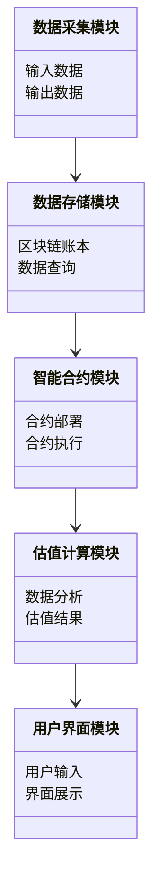
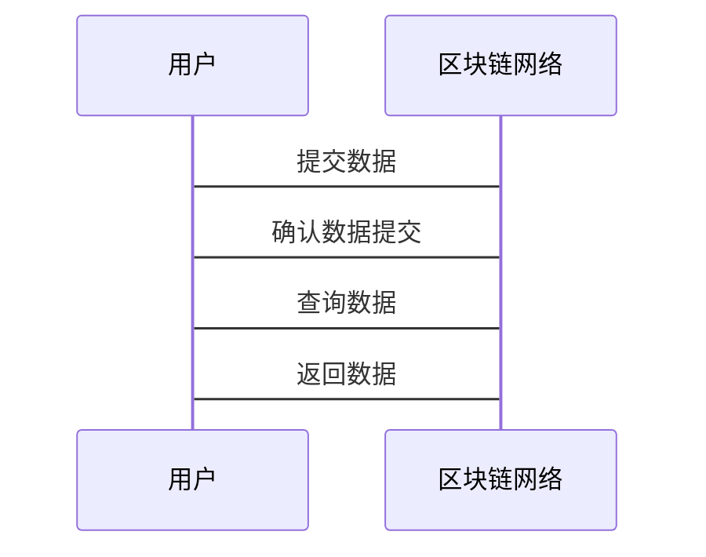

                 


# 全球股市估值与区块链在供应链管理中的应用

## 关键词：全球股市估值、区块链技术、供应链管理、分布式账本、智能合约、金融创新

## 摘要：本文探讨了全球股市估值的传统方法与现代模型，分析了影响股市估值的关键因素，并深入介绍了区块链技术的基本原理及其在供应链管理中的应用。通过结合区块链技术，本文展示了如何提升供应链透明度和效率，从而优化金融资产的估值流程。文章最后总结了区块链技术在金融与供应链领域的潜力，并展望了其未来的发展方向。

---

# 第一部分: 全球股市估值与区块链技术概述

## 第1章: 背景介绍与核心概念

### 1.1 问题背景与描述

#### 1.1.1 全球股市估值的重要性
股市估值是投资者评估企业价值的核心方法，直接关系到投资决策的准确性。传统估值方法依赖历史数据和静态指标，而现代技术的进步（如人工智能和大数据分析）为动态估值提供了新的可能。

#### 1.1.2 区块链技术的兴起及其应用领域
区块链技术作为一种分布式账本技术，通过去中心化和不可篡改的特性，正在改变金融、供应链等多个领域的运作方式。其核心应用包括金融支付、智能合约和数据安全。

#### 1.1.3 问题解决与边界外延
本文旨在探讨如何利用区块链技术提升股市估值的准确性和效率。通过分析供应链管理中的区块链应用，本文试图为金融资产的估值提供新的视角。

### 1.2 核心概念与联系

#### 1.2.1 核心概念原理
- **股市估值**：通过分析企业财务数据和市场因素，评估其股票的内在价值。
- **区块链技术**：分布式账本和智能合约的应用，确保数据的真实性和透明性。

#### 1.2.2 核心概念属性特征对比表格
| 特性         | 股市估值              | 区块链技术              |
|--------------|----------------------|--------------------------|
| 数据来源     | 企业财务报表          | 分布式账本              |
| 中心化程度   | 高（依赖金融机构）    | 低（去中心化）          |
| 透明度       | 低（依赖披露机制）    | 高（区块链记录公开）    |

#### 1.2.3 ER实体关系图
```mermaid
er
actor 投资者
actor 企业
actor 金融机构
actor 监管机构

database 股票市场数据
database 区块链账本

关系：投资者 -> 查看股票市场数据
关系：企业 -> 更新股票市场数据
关系：金融机构 -> 审核股票市场数据
关系：监管机构 -> 监督区块链账本
```

---

# 第二部分: 全球股市估值分析

## 第2章: 全球股市估值方法与模型

### 2.1 传统估值方法

#### 2.1.1 市盈率（P/E）分析
市盈率 = 股票价格 / 每股净利润

$$ P/E = \frac{\text{股价}}{\text{每股收益}} $$

#### 2.1.2 市净率（P/B）分析
市净率 = 股票价格 / 每股净资产

$$ P/B = \frac{\text{股价}}{\text{每股净资产}} $$

#### 2.1.3 股息率分析
股息率 = 每股股息 / 股票价格

$$ \text{股息率} = \frac{\text{每股股息}}{\text{股价}} $$

### 2.2 现代估值模型

#### 2.2.1 股权自由现金流模型
股权自由现金流 = 净利润 - 折旧 - 利息支出 + 税后

$$ \text{股权自由现金流} = \text{净利润} - \text{折旧} - \text{利息支出} + \text{税后} $$

#### 2.2.2 加权平均资本成本模型
加权平均资本成本 = (债务成本 × 权重) + (股权成本 × 权重)

$$ WACC = (D \times r_D) + (E \times r_E) $$

#### 2.2.3 风险中性定价模型
风险中性定价通过无风险利率和市场风险溢价确定股票的公允价值。

---

## 第3章: 影响股市估值的主要因素

### 3.1 宏观经济因素

#### 3.1.1 利率水平对股市估值的影响
低利率环境通常会推高股市估值，因为资金成本降低，投资者更倾向于投资股票。

#### 3.1.2 汇率波动对股市估值的影响
汇率波动会影响出口型企业盈利能力和股票估值。

#### 3.1.3 宏观经济政策对股市估值的影响
财政政策和货币政策直接影响市场情绪和企业盈利能力。

### 3.2 公司基本面因素

#### 3.2.1 盈利能力对股市估值的影响
高盈利能力通常意味着更高的股票估值。

#### 3.2.2 偿债能力对股市估值的影响
良好的偿债能力能提高投资者信心，进而影响股价。

#### 3.2.3 增长能力对股市估值的影响
高增长潜力通常会推高企业的市盈率和市净率。

---

## 第4章: 区块链技术在金融领域的应用

### 4.1 区块链技术的基本原理

#### 4.1.1 分布式账本技术
区块链通过分布式节点记录交易数据，确保数据的不可篡改性。

#### 4.1.2 智能合约的实现机制
智能合约是在区块链上自动执行的代码，用于自动履行合同条款。

#### 4.1.3 区块链的安全性与去中心化特点
区块链的安全性基于密码学算法和去中心化的网络结构。

### 4.2 区块链在金融领域的具体应用

#### 4.2.1 金融支付
区块链技术可以实现跨境支付的实时结算，降低交易成本。

#### 4.2.2 资产证券化
区块链可以用于发行和管理资产支持证券，提高透明度和效率。

#### 4.2.3 供应链金融
区块链技术可以提升供应链的透明度，优化融资流程。

---

# 第三部分: 区块链在供应链管理中的应用

## 第5章: 区块链技术在供应链管理中的应用

### 5.1 供应链管理的基本概念

#### 5.1.1 供应链管理的定义
供应链管理是通过优化物流、信息流和资金流，提升企业运营效率。

#### 5.1.2 供应链管理的核心目标
降低成本、提高效率、增强透明度。

### 5.2 区块链技术对供应链管理的影响

#### 5.2.1 提高透明度
区块链可以实时记录供应链中的每一笔交易，确保数据的真实性和可追溯性。

#### 5.2.2 优化效率
通过区块链技术，可以实现供应链各环节的自动化和智能化，减少人为干预。

#### 5.2.3 提升信任度
区块链的去中心化特性可以降低供应链中的信任成本，增强各方的合作信心。

### 5.3 区块链在供应链管理中的具体应用

#### 5.3.1 货物追踪
通过区块链记录货物的运输信息，实现全程追踪。

#### 5.3.2 供应商管理
区块链可以用于供应商资质认证和信用评估，提升供应链管理的效率。

#### 5.3.3 智能合约的应用
智能合约可以自动执行供应链中的合同条款，减少人为操作风险。

---

## 第6章: 区块链技术对金融资产估值的影响

### 6.1 区块链技术如何影响金融资产估值

#### 6.1.1 提高数据准确性
区块链技术确保供应链数据的真实性和完整性，从而提升金融资产估值的准确性。

#### 6.1.2 实时数据更新
区块链可以实时更新供应链数据，确保估值模型使用的数据是最新的。

#### 6.1.3 降低估值成本
通过自动化数据采集和处理，区块链技术可以显著降低金融资产估值的成本。

### 6.2 区块链技术在金融创新中的应用

#### 6.2.1 数字资产估值
区块链技术为数字资产的估值提供了新的方法和工具。

#### 6.2.2 去中心化金融（DeFi）
DeFi通过区块链技术实现金融产品的去中心化，为金融资产估值提供了新的应用场景。

---

## 第7章: 系统架构设计与实现

### 7.1 问题场景介绍

#### 7.1.1 供应链管理中的数据孤岛问题
传统供应链管理中存在数据孤岛，信息传递不畅，影响估值准确性。

#### 7.1.2 数据安全与隐私保护
如何确保供应链数据的安全性和隐私性是区块链技术在供应链管理中应用的关键问题。

### 7.2 项目介绍

#### 7.2.1 项目目标
通过区块链技术实现供应链数据的透明化和高效管理，提升金融资产估值的准确性和效率。

#### 7.2.2 项目范围
本项目聚焦于供应链管理中的货物追踪和供应商管理，后续将扩展到更多环节。

### 7.3 系统功能设计

#### 7.3.1 功能模块划分
- 数据采集模块
- 数据存储模块
- 智能合约模块
- 估值计算模块
- 用户界面模块

#### 7.3.2 领域模型类图


### 7.4 系统架构设计

#### 7.4.1 系统架构图
```mermaid
container 区块链网络 {
    participant 节点1
    participant 节点2
    participant 节点3
}
actor 用户
actor 供应商
actor 运输商
actor 金融机构

用户 -> 区块链网络: 数据提交
供应商 -> 区块链网络: 数据提交
运输商 -> 区块链网络: 数据提交
金融机构 -> 区块链网络: 数据查询
```

#### 7.4.2 接口设计
- 数据提交接口：用于提交供应链数据到区块链网络。
- 数据查询接口：用于从区块链网络查询供应链数据。

#### 7.4.3 系统交互序列图


---

## 第8章: 项目实战与案例分析

### 8.1 环境安装

#### 8.1.1 安装区块链框架
选择以太坊或其他区块链框架，安装相应的开发环境。

#### 8.1.2 安装开发工具
安装Solidity编译器、以太坊节点客户端（如Geth）等工具。

### 8.2 系统核心实现源代码

#### 8.2.1 智能合约实现
```solidity
// Solidity 智能合约代码示例
contract SupplyChain {
    struct Product {
        uint price;
        uint quantity;
        string status;
    }

    mapping(uint => Product) products;

    function addProduct(uint id, uint price, uint quantity, string memory status) public {
        products[id] = Product(price, quantity, status);
    }

    function getProduct(uint id) public view returns (uint, uint, string memory) {
        Product memory p = products[id];
        return (p.price, p.quantity, p.status);
    }
}
```

#### 8.2.2 数据采集与处理
```python
import json
from web3 import Web3

# 连接到以太坊节点
web3 = Web3(Web3.HTTPProvider("http://localhost:8545"))

# 调用智能合约接口
contract_address = "0x..."
contract = web3.eth.contract(contract_address, abi=...)

def add_product(product_id, price, quantity, status):
    transaction = contract.functions.addProduct(product_id, price, quantity, status).transact()
    receipt = web3.eth.wait_for_transaction_receipt(transaction)
    return receipt

def get_product(product_id):
    product_info = contract.functions.getProduct(product_id).call()
    return product_info
```

### 8.3 案例分析与实际应用

#### 8.3.1 案例分析
以某食品供应链为例，通过区块链技术实现产品的全程追踪，确保数据真实性和可追溯性。

#### 8.3.2 实际应用
在实际项目中，通过区块链技术优化供应链管理，提升企业运营效率和金融资产估值的准确性。

---

## 第9章: 总结与展望

### 9.1 总结

#### 9.1.1 核心观点总结
区块链技术在供应链管理中的应用可以显著提升数据透明度和效率，进而优化金融资产的估值流程。

#### 9.1.2 突出优势总结
- 提高数据准确性
- 降低估值成本
- 增强系统安全性

### 9.2 展望

#### 9.2.1 未来发展趋势
- 区块链技术与人工智能的结合
- 更多行业中的区块链应用
- 数字资产估值的进一步发展

#### 9.2.2 未来研究方向
- 区块链技术在更多金融领域的应用研究
- 更高效的区块链共识机制
- 区块链数据隐私保护技术

---

## 第10章: 附录

### 10.1 术语表

- **区块链**：分布式账本技术，用于记录和验证交易。
- **智能合约**：区块链上的自动执行代码，用于履行合同条款。
- **供应链管理**：优化物流、信息流和资金流的过程。

### 10.2 参考文献

- 《区块链技术发展报告》
- 《供应链管理最佳实践》
- 《金融资产估值方法论》

---

通过以上章节的详细阐述，本文系统地探讨了全球股市估值与区块链在供应链管理中的应用，结合理论分析和实际案例，为读者提供了全面的理解和实践指导。

