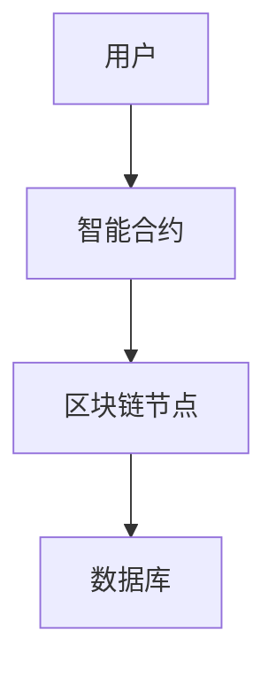
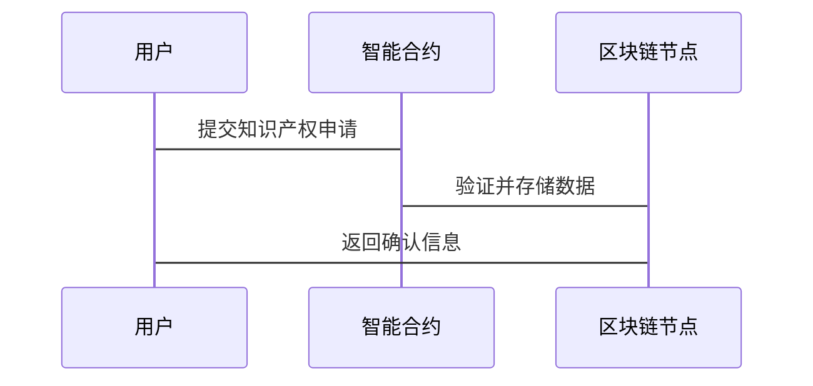

                 


# 全球股市估值与区块链在知识产权保护中的应用

> **关键词**：全球股市估值、区块链技术、知识产权保护、智能合约、分布式账本、共识机制  
>
> **摘要**：本文旨在探讨全球股市估值的核心概念、影响因素及其与区块链技术的结合。通过分析区块链技术的基本原理、知识产权保护的应用场景，以及如何利用区块链提升全球股市估值的透明度与效率，本文为读者提供一个全面的技术视角，以理解股市估值与区块链技术的深度融合。  

---

## 第一部分：全球股市估值与区块链技术的结合

### 第1章：全球股市估值的基本概念与重要性

#### 1.1 股市估值的定义与核心要素
股市估值是通过对公司财务数据、市场环境和行业趋势的分析，评估一家公司的股票价格是否合理的过程。其核心要素包括：
- **公司基本面**：营收、利润、资产负债表等。
- **市场环境**：宏观经济指标、行业趋势、政策影响。
- **估值指标**：市盈率（PE）、市净率（PB）、股息率等。

#### 1.2 全球股市估值的背景与现状
全球化背景下，股市估值呈现出地域差异性。不同国家的经济政策、市场成熟度和投资者行为直接影响股市估值的水平。例如，美国股市以科技股为主导，而新兴市场如印度和中国则以制造业和消费股为主。

#### 1.3 区块链技术对股市估值的潜在影响
区块链技术通过提供透明、不可篡改的交易记录，能够提升股市估值的准确性和效率。例如，通过区块链记录股票发行、交易和分红的全过程，可以减少信息不对称，降低估值误差。

---

### 第2章：影响全球股市估值的主要因素

#### 2.1 宏观经济因素
- **经济周期**：经济增长期通常伴随着股市估值的上升。
- **利率水平**：低利率环境有利于股市估值的提升。
- **通货膨胀**：适度通胀有助于企业盈利增长，但过高的通胀会侵蚀股市估值。

#### 2.2 行业与公司基本面因素
- **行业发展趋势**：朝阳行业（如科技、新能源）通常具有较高的估值溢价。
- **公司财务状况**：高成长性公司更容易获得市场认可。
- **公司治理**：良好的治理结构有助于提升市场对公司的信任度。

#### 2.3 市场情绪与投资者行为
- **市场情绪**：投资者情绪波动会直接影响股市估值。
- **投资者行为**：机构投资者与散户的行为差异会影响市场定价。

---

### 第3章：全球股市估值的主要方法与模型

#### 3.1 常用估值方法概述
- **市盈率（PE）法**：通过比较公司股价与每股收益的比率，评估股票估值水平。
- **市净率（PB）法**：通过比较公司股价与每股净资产的比率，评估股票估值水平。
- **现金流折现法（DCF）**：通过折现未来现金流，评估公司内在价值。

#### 3.2 区块链技术在估值方法中的应用
区块链技术可以提供实时、透明的财务数据，为估值模型提供更可靠的基础。例如，通过区块链记录的实时财务数据可以用于动态调整DCF模型的输入参数。

---

## 第二部分：区块链在知识产权保护中的应用

### 第4章：区块链技术的基本原理与知识产权保护

#### 4.1 区块链的核心特点
- **去中心化**：数据存储在分布式网络中，不存在单点故障。
- **不可篡改性**：通过密码学技术确保数据的完整性和不可篡改性。
- **可追溯性**：每一条数据都可以追溯到其来源。

#### 4.2 知识产权保护的核心挑战
- **侵权问题**：知识产权的归属和使用权限难以有效追踪。
- **交易透明度**：知识产权交易过程缺乏透明性和可追溯性。
- **确权成本**：传统确权流程复杂且成本高昂。

---

### 第5章：区块链在知识产权保护中的应用场景

#### 5.1 知识产权登记与确权
- **区块链登记**：通过区块链记录知识产权的创建时间和权利归属，确保数据不可篡改。
- **智能合约**：通过智能合约自动执行知识产权的授权和使用许可。

#### 5.2 知识产权交易与管理
- **分布式账本**：记录知识产权的交易历史和使用情况，确保交易透明。
- **智能合约**：自动执行交易条款，减少人为干预。

#### 5.3 知识产权侵权监测
- **区块链存证**：通过区块链存储知识产权内容的哈希值，快速识别侵权行为。
- **链上分析**：利用区块链数据进行侵权行为的追踪和分析。

---

### 第6章：区块链知识产权保护系统的架构设计

#### 6.1 系统功能设计
- **用户模块**：用户可以提交知识产权申请、查询信息、发起交易。
- **智能合约模块**：自动执行知识产权的授权和交易。
- **区块链节点**：分布式存储和验证数据。

#### 6.2 系统架构设计


#### 6.3 系统交互设计


---

### 第7章：案例分析与实际应用

#### 7.1 知识产权保护的区块链平台案例
- **案例背景**：某区块链知识产权保护平台的设计与实现。
- **系统实现**：基于Solidity开发智能合约，使用以太坊区块链进行数据存储。
- **实际效果**：通过区块链技术实现知识产权的确权、交易和侵权监测。

#### 7.2 代码实现与分析
```python
# 示例代码：区块链知识产权保护平台的智能合约实现
contract IPProtection {
    mapping(address => string) public registry;

    function register(string memory ipHash) public {
        registry[msg.sender] = ipHash;
    }

    function query(address addr) public view returns (string memory) {
        return registry[addr];
    }
}
```

---

## 第三部分：总结与展望

### 第8章：总结
本文从全球股市估值与区块链技术的结合出发，探讨了区块链在知识产权保护中的应用场景。通过分析区块链技术的核心特点，本文展示了如何利用区块链技术提升股市估值的透明度与效率，并为知识产权保护提供了一种创新的解决方案。

### 第9章：展望
未来，随着区块链技术的不断发展，其在股市估值和知识产权保护中的应用将更加广泛。例如，结合人工智能技术，可以进一步优化区块链系统的性能，提升数据处理效率。此外，随着DeFi（去中心化金融）的发展，区块链技术在金融领域的应用也将进一步深化。

---

通过本文的分析，读者可以全面理解全球股市估值与区块链技术的结合，以及区块链在知识产权保护中的潜力与挑战。希望本文能够为相关领域的研究和实践提供有价值的参考。

