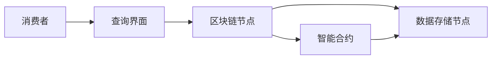

                 


# 全球股市估值与区块链在食品溯源中的应用

## 关键词：
全球股市估值、区块链、食品溯源、股市分析、区块链技术、系统设计、数学模型

## 摘要：
本文探讨了全球股市估值的核心概念、方法及其数学模型，分析了区块链技术在食品溯源中的应用，通过实际案例展示了如何利用区块链提升食品供应链的透明度和效率。文章深入讲解了股市估值的影响因素、估值模型，以及区块链的系统设计与实现，为投资者和技术爱好者提供了理论与实践相结合的深度解析。

---

# 全球股市估值与区块链在食品溯源中的应用

## 第1章: 全球股市估值概述

### 1.1 股市估值的基本概念

#### 1.1.1 股市估值的定义
股市估值是通过对公司财务数据和市场因素的分析，确定股票内在价值的过程。它帮助投资者判断股票是否被高估或低估。

#### 1.1.2 股市估值的核心要素
- **公司基本面**：收入、利润、资产、负债等。
- **市场因素**：宏观经济、行业趋势、政策等。
- **股票价格**：当前市场价格与内在价值的比较。

#### 1.1.3 股市估值的分类与特点
- **相对估值**：基于市场数据的比较，如市盈率、市净率。
- **绝对估值**：通过现金流折现等方法计算股票的内在价值。

### 1.2 股市估值的主要方法

#### 1.2.1 市盈率（PE）法
市盈率是股票价格与每股收益的比率，用于衡量股票的估值水平。

公式：
$$ PE = \frac{股票价格}{每股收益} $$

#### 1.2.2 市净率（PB）法
市净率是股票价格与每股净资产的比率，适用于评估资产密集型行业。

公式：
$$ PB = \frac{股票价格}{每股净资产} $$

#### 1.2.3 股息率法
股息率是每股股息与股票价格的比率，反映股票的分红能力。

公式：
$$ 股息率 = \frac{每股股息}{股票价格} \times 100\% $$

#### 1.2.4 现金流折现法
现金流折现模型（DCF）通过将未来现金流折现至现值，评估股票的内在价值。

公式：
$$ V = \sum_{t=1}^{n} \frac{CF_t}{(1+r)^t} $$

### 1.3 股市估值模型

#### 1.3.1 单一估值模型
基于单一指标进行估值，如仅使用市盈率。

#### 1.3.2 综合估值模型
结合多个指标，如市盈率和市净率，进行综合评估。

#### 1.3.3 行业比较法
将目标公司的估值与同行业公司进行比较，寻找相对优势。

## 第2章: 股市估值的关键影响因素

### 2.1 宏观经济因素

#### 2.1.1 经济周期
经济周期波动直接影响股市表现，周期性行业的估值受经济扩张或衰退影响显著。

#### 2.1.2 利率水平
低利率环境通常推高股市估值，反之则可能压低估值。

#### 2.1.3 汇率波动
汇率变化影响出口型企业利润，进而影响股市估值。

#### 2.1.4 宏观政策
财政政策和货币政策调整会影响市场情绪和企业盈利能力。

### 2.2 微观企业因素

#### 2.2.1 盈利能力
高盈利能力通常意味着较高的股票估值。

#### 2.2.2 偿债能力
良好的财务状况有助于提升市场对公司的信心。

#### 2.2.3 运营效率
高效的运营能力通常带来更高的市场估值。

#### 2.2.4 发展潜力
高增长潜力的企业通常具有较高的估值倍数。

### 2.3 市场情绪与投资者行为

#### 2.3.1 市场情绪分析
投资者情绪波动会影响短期市场估值。

#### 2.3.2 投资者行为模型
基于心理学和行为经济学的投资者行为分析。

#### 2.3.3 市场波动性
高波动性市场中，估值可能偏离基本面。

## 第3章: 股市估值的数学模型与公式

### 3.1 常用估值公式

#### 3.1.1 市盈率公式
$$ PE = \frac{股票价格}{每股收益} $$

#### 3.1.2 市净率公式
$$ PB = \frac{股票价格}{每股净资产} $$

#### 3.1.3 现金流折现模型
$$ V = \sum_{t=1}^{n} \frac{CF_t}{(1+r)^t} $$

### 3.2 估值模型的比较与选择

#### 3.2.1 不同估值方法的适用场景
- **市盈率**：适用于盈利稳定的公司。
- **市净率**：适用于资产密集型行业。
- **现金流折现模型**：适用于高成长性公司。

#### 3.2.2 估值模型的优缺点分析
- **优点**：提供量化依据，便于比较。
- **缺点**：忽视非财务因素，可能受市场情绪影响。

#### 3.2.3 综合估值模型的构建
结合多种估值方法，得出更准确的估值区间。

## 第4章: 区块链技术在食品溯源中的应用

### 4.1 区块链技术概述

#### 4.1.1 区块链的基本概念
区块链是一种去中心化的分布式账本技术，具有不可篡改和可追溯的特点。

#### 4.1.2 区块链的核心特征
- **去中心化**：无需信任第三方。
- **不可篡改**：数据一旦写入，无法修改。
- **可追溯**：每笔交易均可追踪。

### 4.2 食品溯源系统的设计

#### 4.2.1 系统设计背景
食品溯源系统旨在提升供应链透明度，确保产品质量和安全。

#### 4.2.2 系统功能需求
- **数据采集**：记录生产、加工、运输等环节的信息。
- **数据存储**：区块链存储数据，确保不可篡改。
- **查询功能**：消费者可通过扫码查询产品信息。

#### 4.2.3 系统架构设计



### 4.3 区块链食品溯源系统的实现

#### 4.3.1 数据采集与处理
通过传感器和RFID技术采集食品信息，确保数据的真实性。

#### 4.3.2 数据上链
将采集的数据通过智能合约写入区块链，确保数据的不可篡改性。

#### 4.3.3 系统实现代码
```python
# 智能合约实现
def record_transaction(sender, receiver, product_info):
    blockchain.add_block(sender, receiver, product_info)
    return True

# 数据查询实现
def query_product_info(product_id):
    return blockchain.query(product_id)
```

### 4.4 实际案例分析

#### 4.4.1 案例：沃尔玛的食品溯源系统
沃尔玛通过区块链技术实现食品供应链的透明化，提升消费者信任。

#### 4.4.2 案例分析总结
区块链技术显著提升了食品溯源的效率和透明度，减少了欺诈行为。

### 4.5 系统优化与未来展望

#### 4.5.1 系统优化方向
- **性能优化**：提升区块链的处理速度。
- **功能扩展**：增加供应链金融、智能合约等功能。

#### 4.5.2 未来展望
区块链技术将在食品溯源中发挥更大的作用，推动整个行业的数字化转型。

---

## 总结

本文详细探讨了全球股市估值的核心方法及其影响因素，并分析了区块链技术在食品溯源中的应用。通过数学模型和实际案例，展示了如何利用区块链提升食品供应链的透明度和效率。未来，随着技术的进步，股市估值和区块链技术将更加深度融合，为投资者和消费者带来更大的价值。

---

## 最佳实践 Tips

1. **股市估值**：在实际投资中，建议结合多种估值方法，综合分析股票的内在价值。
2. **区块链应用**：企业应选择合适的区块链平台和解决方案，确保系统的安全性和高效性。
3. **持续学习**：股市和区块链技术都在不断变化，保持学习和更新是关键。

---

希望这篇文章能为读者在股市估值和区块链技术方面提供有价值的见解和指导。

