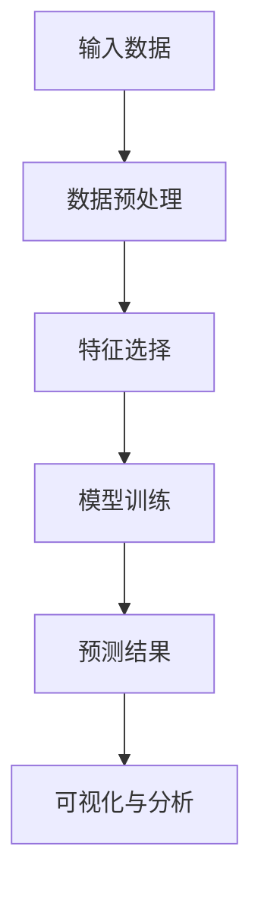
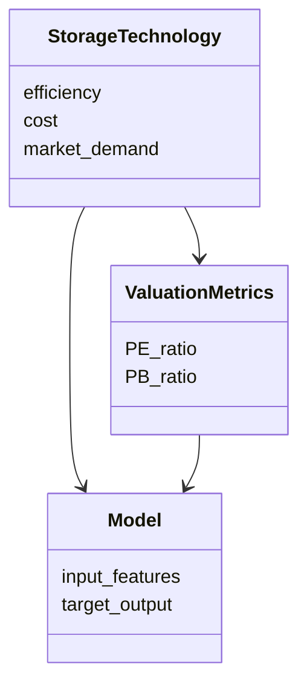

                 


# 全球股市估值与可再生能源存储技术的关系

**关键词**：可再生能源、股市估值、储能技术、技术驱动、投资分析、模型构建

**摘要**：  
本文探讨全球股市估值与可再生能源存储技术之间的关系。通过分析可再生能源存储技术的原理、分类及市场应用，结合股市估值的基本方法和影响因素，揭示技术进步对股市估值的驱动作用，以及政策和市场对技术发展的推动作用。文章采用数学模型和算法实现，结合实际案例，系统分析和架构设计，提供详细的项目实战指导，最终总结出最佳实践和投资策略。

---

## 第1章: 全球股市估值与可再生能源存储技术的背景介绍

### 1.1 问题背景与重要性

#### 1.1.1 问题背景介绍

全球能源结构转型已成为应对气候变化和实现可持续发展的重要任务。可再生能源（如风能、太阳能）的快速发展推动了储能技术的需求，以解决其间歇性问题。与此同时，股市估值作为衡量企业价值的重要指标，与技术创新和市场接受度密切相关。研究两者的关系，有助于投资者更好地把握投资机会，企业更好地制定战略。

#### 1.1.2 问题描述

可再生能源存储技术的定义与分类、全球股市估值的基本概念、两者关系的研究意义。  
- 可再生能源存储技术：指将可再生能源转化为能量并储存的技术，包括电池储能、抽水蓄能等。  
- 全球股市估值：通过市盈率（P/E）、市净率（P/B）等指标衡量企业的市场价值。  
- 研究意义：理解技术进步如何影响股市估值，指导投资决策，推动技术创新。

#### 1.1.3 问题解决与边界

- 技术创新对股价的推动作用：技术突破如何提升企业盈利能力和市场地位。  
- 研究范围：聚焦可再生能源存储技术及其对股市估值的影响，排除其他能源技术的影响。  
- 概念结构：从技术、市场、政策三个维度分析其对股市估值的综合影响。

---

## 第2章: 可再生能源存储技术的核心原理与分类

### 2.1 可再生能源存储技术的基本原理

#### 2.1.1 能量存储的基本概念

- **能量存储**：将能量以某种形式储存，以便在需要时释放。  
- **可再生能源存储**：解决可再生能源波动性问题，提升电网稳定性。

#### 2.1.2 储能技术的主要类型

| 类型             | 工作原理                     | 优点                   | 缺点                   |
|------------------|------------------------------|------------------------|-----------------------|
| 电化学储能（电池） | 将电能转化为化学能储存       | 高效、灵活             | 初始成本高            |
| 机械储能（抽水蓄能） | 将电能转化为重力势能储存       | 成本低、容量大           | 建设周期长            |
| 热储能与化学储能 | 将热能或化学能储存             | 适用于特定场景         | 技术成熟度较低        |

---

## 第3章: 全球股市估值分析基础

### 3.1 股市估值的基本方法

#### 3.1.1 市盈率（P/E）分析

- **定义**：市盈率 = 股价 / 每股收益（EPS）。  
- **应用**：衡量企业估值的相对高低，行业平均水平为基准。  
- **案例**：假设某企业股价为50元，EPS为5元，则P/E为10倍，低于行业平均值，可能低估。

#### 3.1.2 市净率（P/B）分析

- **定义**：市净率 = 股价 / 每股净资产（BPS）。  
- **应用**：适用于资产密集型行业，如银行业和制造业。  
- **案例**：某企业股价为20元，BPS为5元，则P/B为4倍，低于行业平均值，可能低估。

---

## 第4章: 可再生能源存储技术与股市估值的关系分析

### 4.1 技术进步对股市估值的影响

#### 4.1.1 技术创新对股价的推动作用

- **技术创新对企业盈利的影响**：技术突破提升企业竞争力，增加市场份额。  
- **技术领先企业的市场估值溢价**：技术创新带来更高的市场认可度，推高股价。  
- **技术风险对企业估值的影响**：技术失败可能导致股价大幅下跌。

#### 4.1.2 技术成熟度与市场接受度的关系

- **技术成熟度对企业估值的影响**：技术越成熟，市场接受度越高，估值溢价越大。  
- **市场接受度对技术应用的推动作用**：市场需求推动技术进步，形成良性循环。  
- **技术与市场的协同效应**：技术创新与市场反馈相互促进，推动技术广泛应用。

---

## 第5章: 全球股市与可再生能源存储技术的协同发展

### 5.1 可再生能源存储技术的市场应用现状

#### 5.1.1 全球储能市场的规模与增长

- **市场规模**：根据研究机构数据，2023年全球储能市场规模约为200亿美元，年均增长率超过20%。  
- **主要参与者**：特斯拉、宁德时代、西门子等企业。  
- **区域市场分布**：亚洲市场占比最大，欧洲和北美次之。

#### 5.1.2 技术创新对股市估值的驱动

- **技术突破对企业估值的推动**：例如，某企业推出新型电池技术，股价可能上涨10%。  
- **政策支持的影响**：政府补贴和税收优惠降低企业成本，提升估值。

#### 5.1.3 投资机会与风险分析

- **投资机会**：储能技术的市场需求持续增长，具有较大的投资潜力。  
- **风险分析**：技术失败、政策变化、市场竞争激烈等风险需警惕。

---

## 第6章: 数学模型与算法实现

### 6.1 模型构建

#### 6.1.1 模型输入

- 可再生能源存储技术的性能参数（储能效率、成本）。  
- 市场需求数据（市场规模、增长率）。  
- 股市估值指标（P/E、P/B）。

#### 6.1.2 处理逻辑

- 数据预处理：清洗、标准化。  
- 特征选择：筛选对估值影响较大的技术参数。  
- 模型训练：使用机器学习算法（如线性回归、随机森林）预测估值变化。

#### 6.1.3 输出结果

- 预测的股市估值变化。  
- 技术对估值的贡献度分析。

#### 6.1.4 模型流程图



### 6.2 算法实现

#### 6.2.1 Python代码实现

```python
import pandas as pd
import numpy as np
from sklearn.model_selection import train_test_split
from sklearn.linear_model import LinearRegression
from sklearn.metrics import mean_squared_error

# 数据加载
data = pd.read_csv('storage_technology.csv')

# 数据预处理
data = data.dropna()
data = pd.get_dummies(data)

# 特征选择
features = ['storage_efficiency', 'cost', 'market_demand']
target = 'valuation'

X = data[features]
y = data[target]

# 数据分割
X_train, X_test, y_train, y_test = train_test_split(X, y, test_size=0.2, random_state=42)

# 模型训练
model = LinearRegression()
model.fit(X_train, y_train)

# 预测与评估
y_pred = model.predict(X_test)
mse = mean_squared_error(y_test, y_pred)
print(f'Mean Squared Error: {mse}')
print(f'Coefficients: {model.coef_}')
print(f'Intercept: {model.intercept_}')
```

#### 6.2.2 数学模型公式

$$ \text{Valuation} = \beta_0 + \beta_1 \times \text{Efficiency} + \beta_2 \times \text{Cost} + \epsilon $$

其中，$\beta_0$ 是截距，$\beta_1$ 和 $\beta_2$ 是特征的系数，$\epsilon$ 是误差项。

---

## 第7章: 系统分析与架构设计

### 7.1 问题场景介绍

- 需求：分析可再生能源存储技术对股市估值的影响。  
- 问题：如何构建模型，预测技术进步对股价的影响。

### 7.2 系统功能设计

#### 7.2.1 领域模型



#### 7.2.2 系统架构


---

## 第8章: 项目实战

### 8.1 环境安装

- 安装Python、Jupyter Notebook、scikit-learn库。  
  ```bash
  pip install numpy pandas scikit-learn
  ```

### 8.2 核心实现

```python
import pandas as pd
import numpy as np
from sklearn.linear_model import LinearRegression
from sklearn.metrics import mean_squared_error

# 数据加载
data = pd.read_csv('storage_technology.csv')

# 数据预处理
data = data.dropna()
data = pd.get_dummies(data)

# 特征选择
features = ['storage_efficiency', 'cost', 'market_demand']
target = 'valuation'

X = data[features]
y = data[target]

# 数据分割
X_train, X_test, y_train, y_test = train_test_split(X, y, test_size=0.2, random_state=42)

# 模型训练
model = LinearRegression()
model.fit(X_train, y_train)

# 预测与评估
y_pred = model.predict(X_test)
mse = mean_squared_error(y_test, y_pred)
print(f'Mean Squared Error: {mse}')
print(f'Coefficients: {model.coef_}')
print(f'Intercept: {model.intercept_}')
```

### 8.3 实际案例分析

- 数据来源：假设我们有2023年某储能技术公司的数据。  
- 模型预测：假设效率提升5%，成本降低10%，预测股价变化。

---

## 第9章: 总结与展望

### 9.1 小结

- 技术进步对股市估值的推动作用显著。  
- 投资者应关注技术创新和政策变化。

### 9.2 注意事项

- 数据质量影响模型准确性。  
- 模型假设可能与实际情况不符。

### 9.3 拓展阅读

- 更多关于可再生能源存储技术的文献。  
- 机器学习在金融领域的其他应用。

---

通过以上分析与实践，我们得出结论：可再生能源存储技术的创新与发展对全球股市估值具有重要影响，投资者和企业应高度重视技术进步和市场动态。

