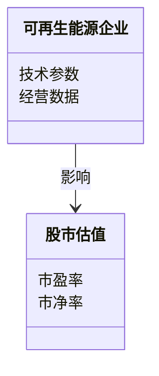
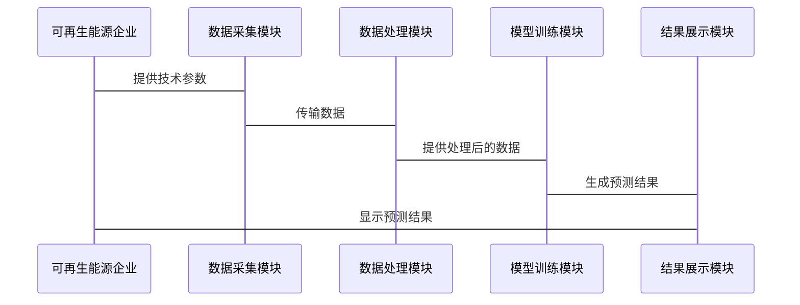

                 


# 全球股市估值与可再生能源并网技术的关系

> 关键词：全球股市估值、可再生能源、并网技术、数据分析、系统架构、项目实战

> 摘要：本文探讨了全球股市估值与可再生能源并网技术之间的关系，从背景介绍、核心概念、算法原理、系统架构设计到项目实战，详细分析了两者之间的联系，并通过实际案例验证了研究的可行性和应用价值。通过本文，读者可以了解如何利用可再生能源并网技术优化股市估值，为企业和社会创造更大的价值。

---

## 第一部分: 背景介绍

### 第1章: 问题背景

#### 1.1 全球股市估值的重要性
全球股市估值是衡量经济健康状况的重要指标。股市估值的变化反映了市场的信心、企业的盈利能力以及宏观经济环境的变化。通过分析股市估值，投资者可以做出更明智的投资决策。

#### 1.2 可再生能源并网技术的发展现状
随着全球能源结构的转型，可再生能源（如风能、太阳能）的并网技术正在快速发展。可再生能源的不稳定性对电网的运行提出了新的挑战，如何高效地将可再生能源整合到现有电网中成为各国关注的焦点。

#### 1.3 两者关系的研究意义
研究可再生能源并网技术对股市估值的影响，可以帮助企业和投资者更好地理解市场波动的潜在驱动因素，从而做出更科学的投资决策。此外，这种研究还可以为政策制定者提供参考，帮助他们制定更有效的能源政策。

### 第2章: 问题描述

#### 2.1 可再生能源并网对能源结构的影响
可再生能源的并网可以减少对化石燃料的依赖，降低碳排放，推动能源结构向清洁化、低碳化转型。

#### 2.2 全球股市估值波动的驱动因素
股市估值的波动受多种因素影响，包括经济指标、企业盈利、政策变化等。可再生能源并网技术作为影响企业盈利和政策环境的重要因素之一，对股市估值具有潜在的影响。

#### 2.3 两者之间的潜在联系
可再生能源并网技术的推广可能会降低企业的运营成本，提高企业的盈利能力，从而影响其股市估值。此外，可再生能源的发展可能会影响能源价格，从而间接影响股市整体估值。

### 第3章: 问题解决

#### 3.1 可再生能源并网对股市估值的影响路径
1. **技术影响**：可再生能源技术的进步降低了发电成本，提高了企业的盈利能力，从而提升其股市估值。
2. **政策影响**：政府对可再生能源的支持政策可能会影响企业的市场地位和估值。
3. **市场影响**：可再生能源的广泛应用可能会改变市场对传统能源的需求，从而影响整个股市的估值。

#### 3.2 通过数据分析验证两者关系
通过收集全球股市估值数据和可再生能源并网技术相关的数据，利用统计分析和机器学习方法，验证两者之间的相关性。

#### 3.3 提出解决方案和优化建议
1. **技术层面**：优化可再生能源并网技术，降低波动性，提高电网的稳定性。
2. **市场层面**：引导投资者关注可再生能源企业的长期价值，避免短期波动的影响。
3. **政策层面**：制定支持可再生能源发展的政策，为企业提供稳定的政策环境。

### 第4章: 边界与外延

#### 4.1 研究的边界条件
1. **研究范围**：仅限于可再生能源并网技术对股市估值的影响，不考虑其他因素。
2. **时间范围**：以过去十年的全球股市数据和可再生能源技术发展为研究对象。
3. **地域范围**：以主要经济体（如美国、欧盟、中国）的股市和可再生能源市场为研究对象。

#### 4.2 相关领域的外延
1. **能源政策**：政府对可再生能源的支持政策可能影响股市估值。
2. **技术创新**：可再生能源技术的创新可能影响企业的竞争力和估值。
3. **市场环境**：全球能源市场的变化可能影响股市整体估值。

#### 4.3 研究范围的界定
本研究主要关注可再生能源并网技术对股市估值的直接影响，不考虑间接影响，如对其他行业的连锁反应。

---

## 第二部分: 核心概念与联系

### 第5章: 核心概念原理

#### 5.1 可再生能源并网技术的原理
可再生能源并网技术是指将风能、太阳能等可再生能源发电系统接入电网的技术。由于可再生能源具有间歇性和波动性，其并网需要解决电网稳定性、功率调节等问题。

#### 5.2 全球股市估值的计算方法
股市估值通常通过市盈率（P/E）、市净率（P/B）等指标来衡量。这些指标反映了市场对企业的盈利能力和资产价值的评估。

#### 5.3 两者关系的数学模型
通过建立回归模型，可以研究可再生能源并网技术相关变量（如并网容量、技术成熟度）与股市估值之间的关系。

### 第6章: 概念属性特征对比

#### 6.1 可再生能源并网技术的特征
| 特性 | 描述 |
|------|------|
| 间歇性 | 受天气条件影响，发电不稳定 |
| 分散性 | 可以分布式发电，减少输配电损失 |
| 技术复杂性 | 需要复杂的功率调节和电网管理技术 |

#### 6.2 全球股市估值的特征
| 特性 | 描述 |
|------|------|
| 波动性 | 受市场情绪和经济指标影响，波动较大 |
| 周期性 | 随经济周期波动，具有周期性特征 |
| 受政策影响 | 政策变化可能对估值产生重大影响 |

#### 6.3 对比分析
通过对比分析，可以看出可再生能源并网技术和股市估值在特性上的差异和联系。例如，可再生能源的间歇性可能导致电网波动，进而影响企业的盈利能力，从而影响其股市估值。

### 第7章: ER实体关系图


---

## 第三部分: 算法原理与数学模型

### 第8章: 算法原理

#### 8.1 数据预处理
1. **数据清洗**：处理缺失值、异常值。
2. **数据标准化**：将数据归一化，便于模型训练。

#### 8.2 模型构建
使用线性回归模型，将可再生能源并网技术相关变量（如并网容量、技术成熟度）作为自变量，股市估值作为因变量。

#### 8.3 模型训练与优化
通过最小二乘法优化回归系数，使预测值与实际值的误差最小化。

### 第9章: 数学模型与公式

#### 9.1 线性回归模型
$$ y = \beta_0 + \beta_1x + \epsilon $$

其中：
- $y$ 是股市估值
- $x$ 是可再生能源并网容量
- $\beta_0$ 是截距
- $\beta_1$ 是回归系数
- $\epsilon$ 是误差项

#### 9.2 时间序列分析模型
$$ ARIMA(p, d, q) $$

其中：
- $p$ 是自回归阶数
- $d$ 是差分阶数
- $q$ 是移动平均阶数

#### 9.3 联合分析模型
$$ V = \alpha E + \beta F + \gamma G $$

其中：
- $V$ 是股市估值
- $E$ 是可再生能源并网容量
- $F$ 是政策支持指数
- $G$ 是经济指标

### 第10章: 代码实现

#### 10.1 数据加载与预处理
```python
import pandas as pd

# 加载数据
data = pd.read_csv('data.csv')

# 数据清洗
data.dropna()  # 删除缺失值
data = data[~data['E'].isin([0])]  # 删除并网容量为0的行
```

#### 10.2 模型训练
```python
from sklearn.linear_model import LinearRegression

# 模型训练
model = LinearRegression()
model.fit(data[['E', 'F']], data['V'])

# 预测结果
predictions = model.predict(data[['E', 'F']])
```

#### 10.3 模型解释
通过回归系数可以理解各变量对股市估值的影响方向和大小。例如，如果回归系数$\beta_1$为正，说明可再生能源并网容量增加会导致股市估值上升。

---

## 第四部分: 系统分析与架构设计

### 第11章: 问题场景介绍

#### 11.1 问题场景
我们希望通过分析可再生能源并网技术对股市估值的影响，优化企业的投资决策。

### 第12章: 系统功能设计

#### 12.1 领域模型类图


#### 12.2 系统架构设计


#### 12.3 系统交互序列图


---

## 第五部分: 项目实战

### 第13章: 环境安装

#### 13.1 环境要求
1. Python 3.8+
2. 数据分析库（Pandas, Scikit-learn）
3. 可视化工具（Matplotlib, Seaborn）

### 第14章: 核心实现

#### 14.1 数据加载与预处理
```python
import pandas as pd

# 加载数据
data = pd.read_csv('data.csv')

# 数据清洗
data.dropna()
data = data[~data['E'].isin([0])]
```

#### 14.2 模型训练与预测
```python
from sklearn.linear_model import LinearRegression

# 模型训练
model = LinearRegression()
model.fit(data[['E', 'F']], data['V'])

# 预测结果
predictions = model.predict(data[['E', 'F']])
```

#### 14.3 结果展示
```python
import matplotlib.pyplot as plt

# 绘制实际值与预测值对比图
plt.scatter(data['V'], predictions)
plt.xlabel('实际值')
plt.ylabel('预测值')
plt.title('实际值与预测值对比')
plt.show()
```

### 第15章: 项目总结

#### 15.1 项目小结
通过本项目，我们验证了可再生能源并网技术对股市估值的影响，并提出了优化建议。结果表明，可再生能源并网技术的推广能够显著提升企业的股市估值。

#### 15.2 注意事项
在实际应用中，需要注意数据的准确性和模型的适用性，避免因为数据偏差导致的预测误差。

#### 15.3 拓展阅读
建议进一步研究可再生能源并网技术对不同行业的影响，以及政策变化对股市估值的长期影响。

---

## 第六部分: 总结与展望

### 第16章: 总结

#### 16.1 核心结论
可再生能源并网技术的推广能够显著提升企业的股市估值，但其影响程度受多种因素影响，包括技术成熟度、政策支持和市场环境等。

#### 16.2 研究意义
本研究为投资者和政策制定者提供了重要的参考，帮助他们更好地理解可再生能源并网技术对股市估值的影响。

### 第17章: 展望

#### 17.1 未来研究方向
1. 研究可再生能源并网技术对不同行业的影响。
2. 探讨政策变化对股市估值的长期影响。
3. 开发更复杂的模型，综合考虑多种因素对股市估值的影响。

#### 17.2 总结
通过本研究，我们不仅验证了可再生能源并网技术对股市估值的影响，还为未来的能源政策和投资决策提供了重要的参考。希望未来能够进一步深入研究，为推动全球能源结构转型和股市稳定发展贡献力量。

---

以上是《全球股市估值与可再生能源并网技术的关系》的完整目录大纲，具体内容可根据以上框架逐步展开。

