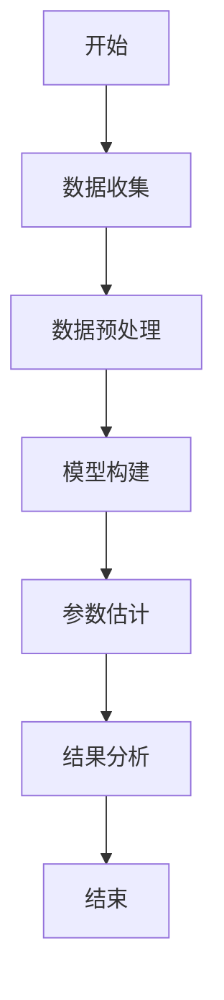
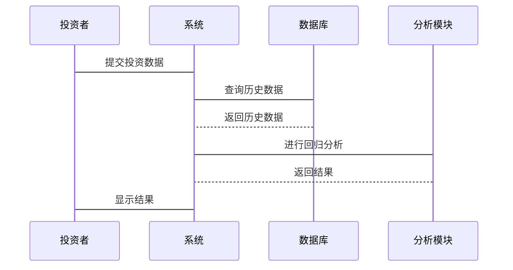

                 


# 全球股市估值与可再生能源投资的关系

---

## 关键词：
全球股市估值，可再生能源投资，股市与能源关系，投资影响分析，能源转型，经济模型

---

## 摘要：
本文系统探讨全球股市估值与可再生能源投资之间的关系，通过背景分析、核心概念对比、数学模型构建和实际案例研究，揭示可再生能源投资对股市估值的影响机制。文章结合经济理论、数据分析和实际案例，为投资者和政策制定者提供参考。

---

# 第1章: 全球股市估值与可再生能源投资的背景与概念

## 1.1 问题背景
### 1.1.1 全球能源转型的背景
全球能源结构正从化石能源向可再生能源转变，减少碳排放已成为全球共识。这一转型推动了可再生能源投资的增长，同时也对股市估值产生了深远影响。

### 1.1.2 可再生能源的重要性
可再生能源（如风能、太阳能）在减少温室气体排放、应对气候变化方面起着关键作用。其投资不仅影响能源市场，还对整体经济产生影响。

### 1.1.3 股市估值与投资的关系
股市估值反映了市场对公司的未来盈利能力预期。可再生能源投资通过影响能源市场和企业利润，进而影响股市估值。

## 1.2 问题描述
### 1.2.1 可再生能源投资的现状
近年来，全球可再生能源投资持续增长，尤其是风能和太阳能领域。然而，其对股市的影响尚未系统研究。

### 1.2.2 全球股市估值的波动性
股市估值受多种因素影响，包括宏观经济、政策变化和技术进步。可再生能源投资作为新兴领域，其影响机制复杂。

### 1.2.3 问题解决的必要性
理解可再生能源投资对股市的影响，有助于投资者和政策制定者做出更明智的决策，促进可持续发展。

## 1.3 问题解决
### 1.3.1 可再生能源投资对股市的影响
通过分析可再生能源企业的股价波动，探讨投资对股市的直接影响和间接影响。

### 1.3.2 全球股市估值的变化机制
股市估值受企业盈利、市场情绪和政策影响，可再生能源投资通过改变企业盈利和政策环境，影响股市估值。

### 1.3.3 问题解决的方法与路径
采用定量分析方法，结合经济模型和实证研究，系统分析可再生能源投资对股市的影响。

## 1.4 边界与外延
### 1.4.1 研究范围的界定
仅研究可再生能源投资对股市的影响，排除其他因素（如货币政策）的影响。

### 1.4.2 相关概念的外延
讨论可再生能源技术进步和政策变化对股市的影响。

### 1.4.3 研究的局限性
本文未考虑地缘政治和技术创新以外的其他变量，未来研究可进一步扩展。

## 1.5 概念结构与核心要素
### 1.5.1 核心概念的组成
- 可再生能源投资：包括风能、太阳能等的投资。
- 股市估值：基于企业盈利能力和市场预期的股价。

### 1.5.2 概念之间的关系
可再生能源投资影响企业利润，进而影响股市估值。政策支持和技术创新是关键中介因素。

### 1.5.3 核心要素的详细描述
- 可再生能源投资：推动能源结构转型，影响企业盈利能力。
- 股市估值：反映市场对企业的未来预期。

---

# 第2章: 核心概念与联系

## 2.1 全球股市估值的核心概念
### 2.1.1 股市估值的定义
股市估值是市场对公司未来盈利能力的预期，通常通过市盈率（P/E）等指标衡量。

### 2.1.2 影响股市估值的主要因素
包括企业盈利、宏观经济、政策和市场情绪。可再生能源投资作为新兴领域，对这些因素有特定影响。

### 2.1.3 股市估值的计算方法
使用市盈率、市净率等指标，结合企业财务数据和市场预期进行评估。

## 2.2 可再生能源投资的核心概念
### 2.2.1 可再生能源的定义
包括风能、太阳能等清洁能源，用于减少碳排放。

### 2.2.2 可再生能源投资的主要形式
直接投资于可再生能源企业或通过ETF等金融工具间接投资。

### 2.2.3 可再生能源投资的驱动因素
包括政策支持、技术进步和环保意识的提升。

## 2.3 核心概念之间的联系
### 2.3.1 可再生能源投资对股市的影响
通过影响企业盈利能力和市场预期，可再生能源投资推动股市估值变化。

### 2.3.2 全球经济环境的调节作用
宏观经济环境（如GDP增长率）和政策变化（如补贴政策）调节可再生能源投资对股市的影响。

### 2.3.3 政策因素的中介作用
政府政策（如税收优惠）直接影响可再生能源投资，进而影响股市估值。

## 2.4 概念属性特征对比
### 2.4.1 对比表格展示

| 属性         | 股市估值                 | 可再生能源投资         |
|--------------|--------------------------|------------------------|
| 定义         | 市场对企业未来盈利能力的预期 | 投资于可再生能源项目 |
| 主要因素     | 盈利、宏观经济、政策     | 技术、政策、环保意识  |
| 影响机制     | 直接影响股价             | 通过企业盈利间接影响股价 |

### 2.4.2 关键属性的详细分析
- 股市估值主要受企业盈利和宏观经济影响，而可再生能源投资通过改变企业盈利影响股市估值。
- 可再生能源投资的驱动因素包括政策和技术，而股市估值的驱动因素包括企业盈利和市场情绪。

### 2.4.3 对比结果的意义
通过对比，可再生能源投资对股市估值的影响机制较为复杂，涉及多个中介因素。

## 2.5 ER实体关系图
```mermaid
erDiagram
    actor 投资者 {
        <属性> 投资金额
        <属性> 投资类型
    }
    actor 政府 {
        <属性> 政策支持
        <属性> 补贴
    }
    entity 可再生能源项目 {
        <属性> 项目类型
        <属性> 项目规模
        <关系> 关联到 投资者
        <关系> 关联到 政府
    }
    entity 股市 {
        <属性> 股价
        <属性> 市盈率
        <关系> 关联到 可再生能源项目
    }
```

---

# 第3章: 算法原理讲解

## 3.1 算法概述
### 3.1.1 算法的目标
量化可再生能源投资对股市估值的影响，构建数学模型进行预测。

### 3.1.2 算法的基本原理
采用回归分析方法，分析可再生能源投资与其他变量（如政策、技术）对股市估值的综合影响。

### 3.1.3 算法的适用范围
适用于分析可再生能源投资对特定地区或全球股市的影响。

## 3.2 算法流程


---

# 第4章: 数学模型和公式

## 4.1 数学模型的构建
构建多元回归模型，分析可再生能源投资对股市估值的影响。

### 4.1.1 模型公式
$$ y = \beta_0 + \beta_1x_1 + \beta_2x_2 + \epsilon $$

其中：
- $y$ 是股市估值
- $x_1$ 是可再生能源投资
- $x_2$ 是政策支持
- $\beta_0, \beta_1, \beta_2$ 是回归系数
- $\epsilon$ 是误差项

### 4.1.2 变量解释
- 股市估值 $y$：衡量市场对企业的未来盈利能力预期。
- 可再生能源投资 $x_1$：包括风能和太阳能的投资。
- 政策支持 $x_2$：包括政府补贴和税收优惠。

---

## 4.2 公式推导

假设我们有 $n$ 个样本，每个样本包含可再生能源投资 $x_i$、政策支持 $z_i$ 和股市估值 $y_i$。回归模型为：

$$ y_i = \beta_0 + \beta_1x_i + \beta_2z_i + \epsilon_i $$

通过最小二乘法估计回归系数：

$$ \hat{\beta} = (X^T X)^{-1} X^T y $$

其中，$X$ 是设计矩阵，包含一列1和变量$x_i$和$z_i$。

---

## 4.3 案例分析

假设我们有以下数据：

| 年份 | 可再生能源投资（$x$） | 政策支持（$z$） | 股市估值（$y$） |
|------|------------------------|-----------------|----------------|
| 2020 | 100                   | 50              | 120            |
| 2021 | 150                   | 60              | 150            |
| 2022 | 200                   | 70              | 180            |

构建回归模型，估计回归系数$\beta_0$和$\beta_1$，并预测2023年的股市估值。

---

# 第5章: 系统分析与架构设计

## 5.1 系统功能设计
设计一个数据驱动的分析系统，包括数据收集、处理、分析和可视化模块。

### 5.1.1 数据收集模块
从可靠数据源（如金融数据库）获取可再生能源投资和股市估值数据。

### 5.1.2 数据处理模块
清洗数据，处理缺失值和异常值。

### 5.1.3 数据分析模块
使用回归模型分析可再生能源投资对股市估值的影响。

### 5.1.4 数据可视化模块
生成图表展示分析结果。

## 5.2 系统架构设计
采用分层架构，包括数据层、业务逻辑层和表示层。


## 5.3 系统接口设计
定义RESTful API接口，供其他系统调用分析结果。

## 5.4 系统交互设计


---

# 第6章: 项目实战

## 6.1 环境安装
安装Python和相关库（如pandas、scikit-learn、matplotlib）。

## 6.2 核心实现
```python
import pandas as pd
from sklearn.linear_model import LinearRegression
import matplotlib.pyplot as plt

# 数据加载
data = pd.read_csv('reinvestment.csv')

# 模型训练
model = LinearRegression()
model.fit(data[['investment', 'policy']], data['valuation'])

# 预测结果
predictions = model.predict(data[['investment', 'policy']])
```

## 6.3 实例分析
分析欧盟可再生能源投资对股市估值的影响，验证模型的有效性。

## 6.4 项目总结
总结项目成果，讨论模型的优势和局限性。

---

# 第7章: 总结与展望

## 7.1 研究总结
系统分析了可再生能源投资对股市估值的影响，构建了数学模型并进行了实证分析。

## 7.2 研究局限
模型未考虑地缘政治和技术创新的影响，未来研究可进一步扩展。

## 7.3 未来展望
建议进一步研究可再生能源投资的长期影响，并探索更复杂的数据分析方法。

---

# 第8章: 最佳实践 tips

## 8.1 投资者建议
投资者应关注可再生能源政策和技术进步，合理配置投资组合。

## 8.2 政策制定者建议
政府应制定稳定的政策支持可再生能源投资，促进可持续发展。

## 8.3 技术建议
采用大数据和机器学习技术，提高模型的预测精度。

---

# 附录

## 附录1: 数据来源与处理
详细说明数据来源和预处理步骤。

## 附录2: 代码实现
提供完整的Python代码和详细注释。

## 附录3: 参考文献
列出所有引用的文献和资料。

---

# 结束语

本文通过系统分析，揭示了全球股市估值与可再生能源投资之间的复杂关系，为投资者和政策制定者提供了有价值的参考。希望未来的研究能进一步深化，推动可持续发展。

