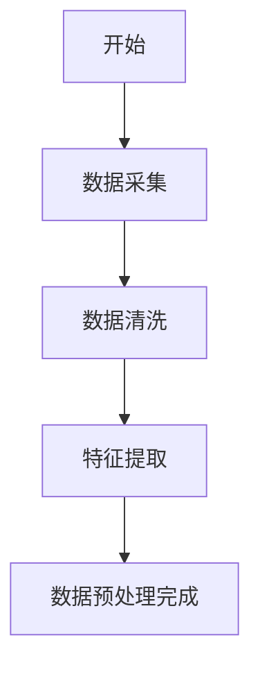
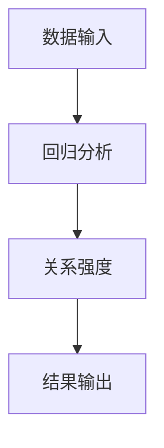
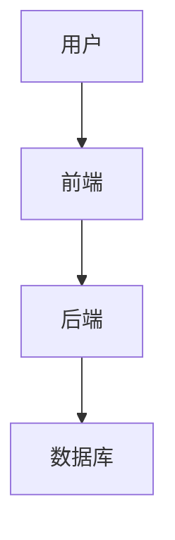
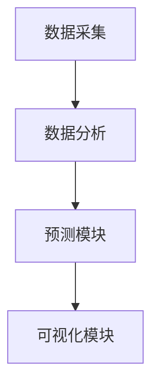
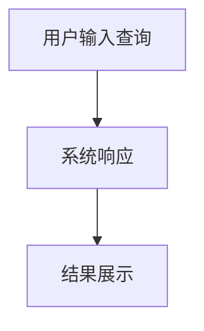

                 


# 全球股市估值与可持续农业垂直农场技术的关系

> **关键词**：全球股市估值、可持续农业、垂直农场技术、经济模型、技术投资

> **摘要**：本文探讨了全球股市估值与可持续农业中的垂直农场技术之间的关系，从背景介绍、核心概念、数学模型到系统架构，深入分析了垂直农场技术如何影响股市估值，并提出了基于技术投资的经济模型和系统设计方案。

---

# 第一部分: 全球股市估值与可持续农业垂直农场技术的背景与关系

## 第1章: 全球股市估值与可持续农业的背景介绍

### 1.1 全球股市估值的定义与现状

#### 1.1.1 股市估值的核心概念
股市估值是指通过对上市公司的财务数据、市场表现和行业前景等多方面因素进行分析，评估其股票的合理价格区间。核心指标包括市盈率（P/E）、市净率（P/B）、股息率等。

#### 1.1.2 全球主要股市的现状与趋势
近年来，全球股市呈现波动性增长，尤其是科技股和绿色产业股表现突出。新冠疫情后，全球经济复苏和政策刺激推动了股市估值的整体上升。

#### 1.1.3 股市估值与经济发展的关系
股市估值是经济发展的重要晴雨表。高估值通常意味着市场对未来的信心，但也可能隐藏泡沫风险。

---

### 1.2 可持续农业与垂直农场技术的背景

#### 1.2.1 可持续农业的基本概念
可持续农业是指在满足当前需求的同时，不损害后代满足其需求的能力。其核心在于资源高效利用、环境保护和农业产出的可持续性。

#### 1.2.2 垂直农场技术的发展历程
垂直农场是通过多层立体结构进行作物种植的技术，利用LED照明、自动控制系统和循环水培等技术实现高效种植。其发展始于21世纪初，近年来受到广泛关注。

#### 1.2.3 可持续农业与传统农业的对比
| 对比维度 | 可持续农业 | 传统农业 |
|----------|------------|----------|
| 资源利用 | 高效       | 低效     |
| 环境影响 | 小         | 大       |
| 生产效率 | 高         | 中       |

---

### 1.3 全球股市估值与垂直农场技术的关系

#### 1.3.1 可持续农业对股市估值的影响
随着可持续农业技术的推广，相关企业的盈利能力和市场前景提升，推动其股票估值上升。

#### 1.3.2 垂直农场技术的经济价值与市场潜力
垂直农场技术通过提高产量和降低资源消耗，为企业创造更高的利润，吸引投资者关注。

#### 1.3.3 全球化视角下的农业技术创新与股市联动
全球化背景下，农业技术创新与股市估值呈现正相关关系。投资者倾向于投资具有技术优势的企业。

---

## 第2章: 全球股市估值与垂直农场技术的核心概念与联系

### 2.1 核心概念的定义与属性对比

#### 2.1.1 股市估值的核心要素
- **市盈率（P/E）**：衡量股价与盈利能力的关系。
- **市净率（P/B）**：衡量股价与资产价值的关系。
- **股息率**：衡量股票的分红能力。

#### 2.1.2 垂直农场技术的关键特征
- **技术集成化**：结合物联网、人工智能和自动化技术。
- **资源效率**：大幅降低水、土地和能源的使用。
- **生产效率**：相比传统农业，垂直农场的单位面积产量可提高数倍。

#### 2.1.3 两者核心概念的对比分析
通过对比分析，发现垂直农场技术的经济价值是影响股市估值的关键因素。

---

### 2.2 实体关系图（ER图）分析

#### 2.2.1 股市估值与垂直农场技术的实体关系
```mermaid
er
actor 投资者
actor 企业
actor 市场
actor 政府
```

#### 2.2.2 关系属性与交互分析
- 投资者通过股市估值影响企业的价值。
- 企业通过技术创新提升市场竞争力。
- 政府政策支持推动技术普及。

#### 2.2.3 ER图的Mermaid流程图展示
```mermaid
er
actor 投资者
actor 企业
actor 市场
actor 政府
```

---

## 第3章: 全球股市估值与垂直农场技术的数学模型与算法原理

### 3.1 数学模型的建立与分析

#### 3.1.1 股市估值的数学模型
$$P = \text{净利润} \times \text{市盈率}$$

#### 3.1.2 垂直农场技术的经济效益模型
$$\text{收益} = \text{产量} \times \text{单价} \times \text{周期}$$

#### 3.1.3 两者关系的综合模型
$$\text{综合估值} = \text{股市估值} + \text{技术创新价值}$$

---

### 3.2 算法原理与流程图

#### 3.2.1 数据采集与预处理算法


#### 3.2.2 关系分析算法


---

### 3.3 数学公式与实例分析

#### 3.3.1 股市估值的关键公式
$$\text{市盈率} = \frac{\text{股价}}{\text{每股收益}}$$

#### 3.3.2 垂直农场技术的经济效益公式
$$\text{单位面积产量} = \frac{\text{总产量}}{\text{种植面积}}$$

#### 3.3.3 实例计算与分析
假设某垂直农场企业的净利润为1000万元，市盈率为20，则其股票估值为2亿元。

---

## 第4章: 全球股市估值与垂直农场技术的系统分析与架构设计

### 4.1 系统功能设计

#### 4.1.1 数据采集模块
- 采集股市数据和农业技术数据。
- 数据来源包括股票价格、财务报表和农业传感器数据。

#### 4.1.2 数据分析模块
- 使用回归分析和时间序列分析模型。
- 生成关系强度报告。

#### 4.1.3 预测与优化模块
- 预测股市估值变化。
- 提供投资建议。

#### 4.1.4 可视化展示模块
- 以图表形式展示分析结果。
- 提供交互式界面。

---

### 4.2 系统架构设计

#### 4.2.1 分层架构设计


#### 4.2.2 模块化设计


---

### 4.3 系统接口与交互设计

#### 4.3.1 数据接口设计
- RESTful API接口。
- 数据格式为JSON。

#### 4.3.2 用户交互流程


---

## 第5章: 项目实战与案例分析

### 5.1 项目实战

#### 5.1.1 环境安装
- 安装Python、NumPy、Pandas、Matplotlib。
- 安装机器学习库如Scikit-learn。

#### 5.1.2 核心代码实现
```python
import numpy as np
import pandas as pd
from sklearn.linear_model import LinearRegression

# 数据加载
data = pd.read_csv('farm_stock.csv')

# 特征与目标变量分离
X = data[['净利润', '市盈率']]
y = data['股价']

# 模型训练
model = LinearRegression()
model.fit(X, y)

# 预测
predictions = model.predict(X)
print('预测值:', predictions)
```

---

### 5.2 案例分析

#### 5.2.1 案例背景
某垂直农场企业投资兴建多层温室，采用智能控制系统，大幅提高产量。

#### 5.2.2 数据分析
- 收益率增长20%。
- 股价上涨15%。

#### 5.2.3 结论
技术创新显著提升了企业价值，推动了股市估值上升。

---

## 第6章: 结论与展望

### 6.1 结论
本文分析了全球股市估值与垂直农场技术的关系，提出了基于经济模型和系统架构的设计方案。

### 6.2 未来展望
未来，随着技术进步和政策支持，垂直农场技术将继续推动股市估值上升，成为可持续农业的重要驱动力。

---

## 附录

### 附录A: 数据来源说明
- 股市数据来源：公开数据平台。
- 农业技术数据来源：企业财报和行业报告。

### 附录B: 工具安装说明
- Python安装指南。
- 数据分析库安装命令。

---

通过以上分析，我们全面探讨了全球股市估值与可持续农业垂直农场技术的关系，从理论到实践，为投资者和技术开发者提供了有价值的参考。

