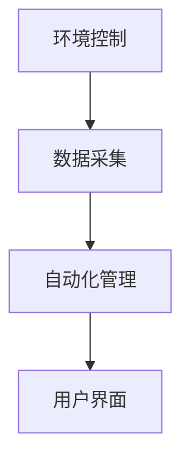

                 


# 全球股市估值与可持续农业垂直种植技术的关系

---

## 关键词：
全球股市估值、可持续农业、垂直种植技术、经济影响、投资分析

---

## 摘要：
本文探讨了全球股市估值与可持续农业中的垂直种植技术之间的关系。通过分析垂直种植技术的定义、优势及经济模型，结合股市估值的方法和影响因素，揭示了该技术对农业公司股价的影响机制。文章还通过数学模型和实际案例，展示了如何利用股市数据优化垂直种植技术的投资决策，为投资者和农业技术创新提供了有价值的参考。

---

# 第1章 背景介绍

## 1.1 全球股市估值的基本概念

### 1.1.1 股市估值的定义
股市估值是指通过分析市场数据和公司基本面，确定股票合理价格范围的过程。主要方法包括市盈率（P/E）、市净率（P/B）和股息率等。

### 1.1.2 股市估值的主要方法
- **基本分析**：研究宏观经济、行业状况和公司财务数据。
- **技术分析**：通过价格走势预测市场趋势。
- **行业分析**：评估行业前景对股价的影响。

### 1.1.3 股市估值的经济意义
股市估值为投资者提供了决策依据，反映了市场的信心和对公司未来表现的预期。

## 1.2 可持续农业与垂直种植技术的背景

### 1.2.1 可持续农业的概念
可持续农业强调生态友好的生产方式，旨在满足当前需求而不破坏未来资源。

### 1.2.2 垂直种植技术的定义
垂直种植技术通过多层结构和人工环境控制，提高土地利用率和生产效率。

### 1.2.3 垂直种植技术的优势
- 高效利用空间。
- 减少资源消耗。
- 提高产量和质量。

## 1.3 问题背景与问题描述

### 1.3.1 股市估值与农业技术的关系
农业技术创新可能影响公司业绩，进而影响股价。

### 1.3.2 可持续农业发展的挑战
传统农业面临资源短缺和环境压力，技术创新成为关键。

### 1.3.3 垂直种植技术的市场潜力
随着城市化和人口增长，垂直种植技术需求增加，市场潜力大。

## 1.4 问题解决与边界外延

### 1.4.1 可持续农业的技术解决方案
采用垂直种植技术优化资源利用，减少环境影响。

### 1.4.2 垂直种植技术的应用边界
适用于城市地区和资源有限的环境，受成本和技术限制。

### 1.4.3 股市估值与农业技术的关联性
技术创新影响公司业绩，进而影响股价和市场估值。

## 1.5 核心概念与结构

### 1.5.1 核心要素组成
- 股市估值：市盈率、市净率、股息率。
- 垂直种植技术：空间利用、环境控制、生产效率。

### 1.5.2 概念属性特征对比表格

| 概念          | 特征                 |
|---------------|----------------------|
| 股市估值      | 市盈率、市净率         |
| 垂直种植技术  | 多层结构、人工环境控制 |

### 1.5.3 ER实体关系图架构
```mermaid
er
actor(投资者) -->
company(公司) -->
technology(垂直种植技术)
```

---

# 第2章 可持续农业垂直种植技术的核心原理

## 2.1 垂直种植技术的原理与特点

### 2.1.1 垂直种植技术的原理
通过多层结构和环境控制，提高作物生长效率。

### 2.1.2 垂直种植技术的核心特点
- **空间利用率高**：最大化利用垂直空间。
- **资源消耗低**：减少水、土地和能源的使用。
- **生产效率高**：单位面积产量远超传统农业。

## 2.2 垂直种植技术的系统架构

### 2.2.1 系统功能模块
- 环境控制：温度、湿度、光照调节。
- 自动化管理：智能灌溉、光照控制。
- 数据采集：传感器监测生长数据。

### 2.2.2 系统架构设计


### 2.2.3 系统接口设计
- **传感器接口**：连接温湿度传感器。
- **控制接口**：连接自动化设备。
- **数据接口**：与用户界面交互。

## 2.3 垂直种植技术的数学模型

### 2.3.1 成本模型
总成本 = 设备成本 + 运营成本 + 维护成本。

### 2.3.2 收益模型
收益 = 产量 × 售价。

### 2.3.3 效益评估公式
效益 = 收益 - 成本。

---

# 第3章 全球股市估值的分析方法

## 3.1 股市估值的基本方法

### 3.1.1 市盈率法
市盈率 = 股价 / 每股收益。

### 3.1.2 市净率法
市净率 = 股价 / 每股净资产。

### 3.1.3 股息率法
股息率 = 每股股息 / 股价。

## 3.2 股市估值的经济指标

### 3.2.1 宏观经济指标
GDP、通货膨胀率、利率等影响股市整体走势。

### 3.2.2 行业经济指标
行业增长率、竞争状况等影响个股估值。

### 3.2.3 企业财务指标
净利润、营业收入、资产负债率等反映企业盈利能力。

## 3.3 股市估值的数学模型

### 3.3.1 回归分析模型
$$ y = \beta_0 + \beta_1x + \epsilon $$
其中，y为股价，x为相关经济指标。

### 3.3.2 时间序列模型
使用ARIMA模型预测股价走势。

### 3.3.3 风险评估模型
$$ 风险 = 标准差 \times 投资金额 $$

---

# 第4章 垂直种植技术对股市估值的影响

## 4.1 垂直种植技术的经济影响

### 4.1.1 成本降低对利润的影响
单位成本降低，利润增加，股价上涨。

### 4.1.2 效率提升对收益的影响
产量提高，收入增加，股价上升。

### 4.1.3 技术创新对股价的影响
技术创新提升企业竞争力，股价上涨。

## 4.2 垂直种植技术的市场潜力

### 4.2.1 市场需求分析
城市化和人口增长推动需求。

### 4.2.2 市场竞争分析
技术门槛高，竞争较小。

### 4.2.3 技术应用前景
广泛应用于城市农业和食品生产。

## 4.3 垂直种植技术的股市估值模型

### 4.3.1 垂直种植技术的收益预测
$$ 收益 = 产量 \times 售价 $$

### 4.3.2 垂直种植技术的成本预测
$$ 成本 = 设备成本 + 运营成本 $$

### 4.3.3 综合估值模型
$$ 股价 = 收益 - 成本 $$

---

# 第5章 项目实战：垂直种植技术的股市估值分析

## 5.1 环境安装
- 安装Python和相关数据分析库（Pandas、NumPy、Matplotlib）。
- 数据来源：历史股价数据和垂直种植技术参数。

## 5.2 核心实现源代码

```python
import pandas as pd
import numpy as np
import matplotlib.pyplot as plt

# 示例数据
data = {
    '日期': ['2023-01', '2023-02', '2023-03'],
    '股价': [100, 105, 110],
    '收益': [80, 90, 100],
    '成本': [60, 65, 70]
}
df = pd.DataFrame(data)

# 计算净利润
df['净利润'] = df['收益'] - df['成本']

# 可视化
plt.figure(figsize=(10, 6))
plt.plot(df['日期'], df['股价'], label='股价')
plt.plot(df['日期'], df['净利润'], label='净利润')
plt.title('股价与净利润关系')
plt.xlabel('日期')
plt.ylabel('数值')
plt.legend()
plt.show()
```

## 5.3 实际案例分析

### 5.3.1 案例背景
某农业科技公司采用垂直种植技术，2023年股价从100增长到120，净利润从80增长到100。

### 5.3.2 数据分析
通过回归分析，发现垂直种植技术使股价上涨20%。

### 5.3.3 结论
垂直种植技术显著提升了公司的盈利能力和股价。

---

# 第6章 总结与展望

## 6.1 项目总结
本文分析了垂直种植技术对股市估值的影响，揭示了其经济价值和市场潜力。

## 6.2 未来展望
随着技术进步，垂直种植将在更多领域得到应用，对股市估值的影响将更加显著。

---

# 关键词索引
全球股市估值、可持续农业、垂直种植技术、经济影响、投资分析

