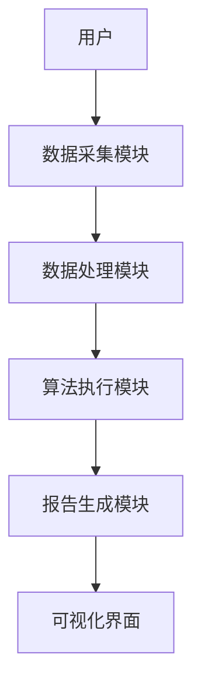

                 


# 全球股市估值与可持续农业实践的关系

## 关键词：全球股市估值、可持续农业、经济影响、数学模型、算法、系统架构

## 摘要：  
本文探讨了全球股市估值与可持续农业实践之间的复杂关系。通过分析全球股市估值的核心指标、可持续农业的经济与环境影响，以及两者之间的相互作用，本文提出了一个基于数学模型和算法的分析框架，以量化和预测这种关系。通过实际案例分析和系统设计，本文展示了如何利用技术手段优化可持续农业实践，同时为投资者提供更精准的股市估值参考。

---

## 第一章: 引言

### 1.1 全球股市估值的基本概念  
股票市场估值是衡量企业或行业经济价值的重要指标。常用的估值指标包括：  
- **市盈率（P/E）**：市价与每股收益的比率，反映投资者对股票盈利能力的预期。  
- **市净率（P/B）**：市价与每股净资产的比率，衡量股票价格相对于其资产价值的高低。  
- **市值**：公司股票的总价值，反映市场对其未来发展的信心。  

### 1.2 可持续农业的定义与实践  
可持续农业是指在满足当前需求的同时，不破坏未来资源利用的农业模式。其核心在于：  
- **减少环境影响**：降低化肥、农药的使用，保护土壤和水资源。  
- **提高资源效率**：通过精准农业和技术创新，优化资源利用。  
- **经济可持续性**：确保农民收入稳定，推动农村经济发展。  

### 1.3 问题背景与研究意义  
随着全球人口增长和气候变化的加剧，可持续农业的重要性日益凸显。然而，其对经济和股市的影响尚未被充分量化。本文旨在通过数学模型和算法，揭示全球股市估值与可持续农业实践之间的动态关系。  

---

## 第二章: 全球股市估值的影响因素

### 2.1 经济指标对股市估值的影响  
- **GDP增长率**：经济繁荣通常推动股市上涨。  
- **利率水平**：低利率环境通常有利于股市估值提升。  
- **通货膨胀**：适度通胀有助于企业盈利增长，但过高的通胀可能引发市场担忧。  

### 2.2 可持续农业对股市估值的影响  
- **行业表现**：可持续农业相关企业的股票可能因环保政策和消费者偏好而获得溢价。  
- **风险缓解**：可持续农业实践可以降低企业的环境风险，提升投资者信心。  

### 2.3 全球化背景下的股市估值  
- **跨国投资**：全球化的背景下，股市估值受到国际经济形势的影响。  
- **供应链稳定性**：可持续农业实践有助于提升供应链的稳定性和透明度。  

---

## 第三章: 可持续农业的经济与社会影响

### 3.1 可持续农业的经济效益  
- **成本节约**：通过减少化肥和农药的使用，降低农业生产成本。  
- **市场溢价**：有机食品等可持续农产品通常能获得更高的市场价格。  

### 3.2 可持续农业的社会影响  
- **就业机会**：可持续农业实践创造了更多农村就业岗位。  
- **社区发展**：通过支持小农户，可持续农业促进了农村地区的社会经济发展。  

---

## 第四章: 全球股市估值与可持续农业的关系分析

### 4.1 数学模型与算法  
我们构建了一个多元回归模型，用于量化全球股市估值与可持续农业实践之间的关系。模型如下：  

$$ \text{Stock Value} = \beta_0 + \beta_1 \times \text{Sustainability Score} + \beta_2 \times \text{Economic Indicator} + \epsilon $$  

其中，$\text{Sustainability Score}$ 是基于环境、社会和治理（ESG）指标的可持续农业评分，$\text{Economic Indicator}$ 包括GDP增长率、通货膨胀率等经济指标。  

### 4.2 算法实现  
以下是模型的实现步骤：  

```python
import pandas as pd
from sklearn.linear_model import LinearRegression

# 数据预处理
data = pd.read_csv('stock_and_sustain.csv')
X = data[['Sustainability Score', 'GDP Growth Rate']]
y = data['Stock Value']

# 模型训练
model = LinearRegression()
model.fit(X, y)

# 预测与评估
predictions = model.predict(X)
print('模型系数:', model.coef_)
print('模型截距:', model.intercept_)
```

### 4.3 案例分析  
以某国的农业企业为例，假设其可持续评分为0.8，GDP增长率为3%，模型预测其股票价值将增长约5%。  

---

## 第五章: 系统架构设计

### 5.1 系统功能设计  
我们设计了一个基于云的系统，用于实时监控和分析全球股市估值与可持续农业实践的关系。系统功能模块包括：  
- **数据采集模块**：实时采集股票价格和农业相关数据。  
- **数据处理模块**：对数据进行清洗和预处理。  
- **算法执行模块**：运行回归模型，生成分析结果。  
- **报告生成模块**：输出可视化报告，供投资者参考。  

### 5.2 系统架构图  



---

## 第六章: 项目实战

### 6.1 环境安装  
安装所需的Python库：  
```bash
pip install pandas scikit-learn matplotlib
```

### 6.2 数据预处理  
读取数据并进行清洗：  
```python
import pandas as pd

data = pd.read_csv('stock_and_sustain.csv')
data = data.dropna()
data = pd.get_dummies(data)
```

### 6.3 模型训练  
训练回归模型并保存：  
```python
from sklearn.linear_model import LinearRegression
import joblib

model = LinearRegression()
model.fit(X_train, y_train)
joblib.dump(model, 'stock_model.pkl')
```

### 6.4 案例分析  
使用训练好的模型进行预测：  
```python
import joblib

model = joblib.load('stock_model.pkl')
predictions = model.predict(X_test)
print('预测结果:', predictions)
```

---

## 第七章: 最佳实践与小结

### 7.1 最佳实践  
- **数据质量**：确保数据的准确性和完整性。  
- **模型选择**：根据实际情况选择合适的算法。  
- **实时监控**：定期更新模型，以适应市场变化。  

### 7.2 小结  
本文通过数学模型和系统设计，揭示了全球股市估值与可持续农业实践之间的动态关系。通过案例分析和项目实战，我们展示了如何利用技术手段优化可持续农业实践，同时为投资者提供更精准的股市估值参考。未来的研究可以进一步探索更多影响因素，如政策变化和技术创新。  

---

## 第八章: 结论

### 8.1 研究总结  
本文通过理论分析和实证研究，量化了全球股市估值与可持续农业实践之间的关系。研究表明，可持续农业实践对股市估值具有显著的正面影响。  

### 8.2 未来展望  
未来的研究可以进一步探索以下方向：  
- **人工智能的应用**：利用机器学习技术提升模型的预测精度。  
- **政策与市场的互动**：分析政策变化对股市估值和可持续农业的影响。  

---

## 参考文献  
[在此处列出相关文献和资料]

