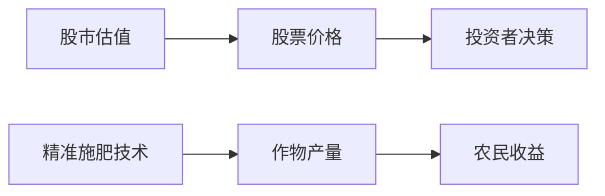
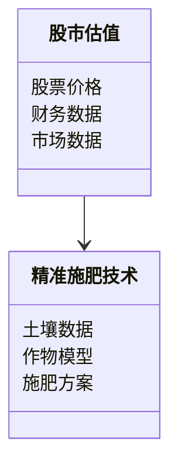
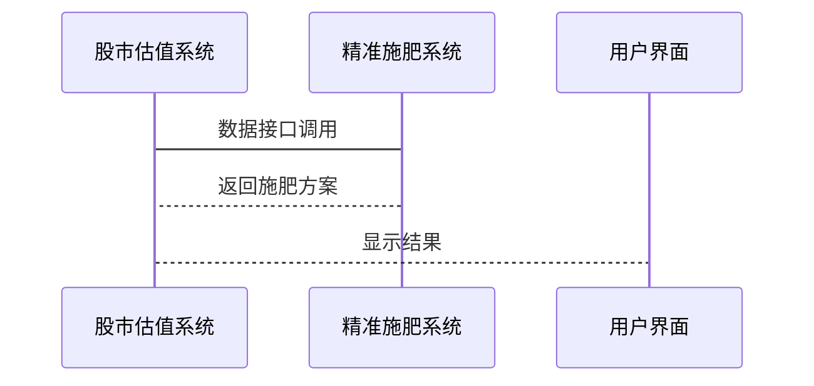

                 


# 《全球股市估值与可持续农业精准施肥技术的关系》

## 关键词：全球股市估值、可持续农业、精准施肥技术、数据分析、数学建模、算法原理、系统架构

## 摘要：  
本文探讨了全球股市估值与可持续农业精准施肥技术之间的关系，通过分析股市估值的核心原理和精准施肥技术的算法基础，揭示了两者在数据驱动决策中的潜在联系。文章详细介绍了股市估值的数学模型、精准施肥技术的系统架构，以及如何通过数据挖掘和机器学习算法将两者结合，为农业投资决策提供科学依据。最终，本文通过实际案例分析，展示了理论与实践的结合，为未来的研究和应用提供了重要参考。

---

# 第一部分: 全球股市估值与可持续农业精准施肥技术的关系概述

## 第1章: 全球股市估值与可持续农业精准施肥技术的背景介绍

### 1.1 全球股市估值的基本概念
#### 1.1.1 股市估值的定义与意义
股市估值是通过对公司财务数据和市场因素的分析，评估股票的内在价值。它帮助投资者做出理性投资决策，是金融市场的重要组成部分。  

#### 1.1.2 股市估值的主要方法
股市估值的主要方法包括市盈率（P/E）、市净率（P/B）、股息率等。这些方法通过比较股票的市场价格与公司盈利能力、资产价值等因素，评估股票的合理估值。  

#### 1.1.3 股市估值与经济发展的关系
股市估值不仅是金融市场的晴雨表，也反映了整体经济的健康状况。高估值的股市可能预示着经济过热，而低估值则可能意味着经济低迷或投资机会。

---

### 1.2 可持续农业精准施肥技术的核心概念
#### 1.2.1 精准农业的定义与特点
精准农业是利用现代信息技术（如GPS、物联网、大数据分析）对农田进行精细化管理，以提高农业生产效率和资源利用率。

#### 1.2.2 精准施肥技术的原理与优势
精准施肥技术通过分析土壤养分、作物需求和天气条件，制定最优的施肥方案，减少化肥浪费，降低环境污染，提高作物产量。

#### 1.2.3 可持续农业的目标与意义
可持续农业的目标是实现资源的高效利用和生态的长期平衡。精准施肥技术是实现这一目标的关键手段之一。

---

### 1.3 股市估值与精准施肥技术的关系
#### 1.3.1 问题背景与问题描述
随着农业技术的进步，精准施肥技术的应用越来越广泛。然而，如何通过股市估值的方法，评估农业技术的投资价值和市场潜力，仍是一个亟待解决的问题。

#### 1.3.2 问题解决的思路与方法
通过数据分析和数学建模，将股市估值的方法应用于农业技术评估。具体包括：  
- 数据收集：整合股市数据和农业数据。  
- 数据分析：利用统计学和机器学习算法，分析两者的关系。  
- 模型构建：建立数学模型，预测农业技术对股市的影响。  

#### 1.3.3 问题的边界与外延
本研究仅关注股市估值与精准施肥技术之间的关系，不涉及其他农业技术或金融工具。  

#### 1.3.4 核心概念的结构与要素组成
- 核心概念：股市估值、精准施肥技术。  
- 关键要素：数据分析、数学建模、算法实现。  

---

## 第2章: 股市估值与精准施肥技术的核心概念

### 2.1 股市估值的核心原理
#### 2.1.1 股票价值的评估方法
股票价值的评估方法包括绝对估值（DCF模型）和相对估值（市盈率、市净率）。  

#### 2.1.2 市盈率与市净率的计算公式
- 市盈率（P/E）= 股价 / 每股收益  
- 市净率（P/B）= 股价 / 每股净资产  

#### 2.1.3 股市估值的数学模型
$$ V = \frac{E}{r - g} $$
其中，V为股票价值，E为净利润，r为折现率，g为股利增长率。

---

### 2.2 精准施肥技术的核心原理
#### 2.2.1 精准施肥的算法原理
精准施肥技术基于作物生长模型和环境数据，通过优化算法确定最佳施肥方案。

#### 2.2.2 精准施肥的数学模型
$$ F = f(N, P, K, C, W) $$
其中，F为施肥量，N、P、K为土壤养分含量，C为作物类型，W为天气条件。

---

### 2.3 股市估值与精准施肥技术的联系
#### 2.3.1 数据分析的共同特征
- 数据驱动：两者都依赖于大量数据的收集和分析。  
- 预测性：股市估值用于预测股票价格，精准施肥技术用于预测作物产量。  

#### 2.3.2 两者关系的对比表格
| 特性         | 股市估值           | 精准施肥技术       |
|--------------|--------------------|--------------------|
| 目标         | 评估股票价值       | 优化施肥方案       |
| 数据来源     | 财务报表、市场数据   | 土壤数据、气象数据   |
| 方法         | 统计分析、机器学习 | 作物模型、优化算法 |

#### 2.3.3 实体关系图的 Mermaid 流程图


---

## 第3章: 股市估值与精准施肥技术的数学模型与算法原理

### 3.1 股市估值的数学模型
#### 3.1.1 股票价值的计算公式
$$ V = \frac{E}{r - g} $$  
其中，V为股票价值，E为净利润，r为折现率，g为股利增长率。

#### 3.1.2 市盈率与市净率的数学表达
- 市盈率：$$ P/E = \frac{P}{E} $$
- 市净率：$$ P/B = \frac{P}{B} $$

#### 3.1.3 股市估值的回归分析模型
$$ P = \beta_0 + \beta_1 E + \beta_2 B + \epsilon $$  
其中，P为股价，E为每股收益，B为每股净资产，ε为误差项。

---

### 3.2 精准施肥技术的数学模型
#### 3.2.1 精准施肥的回归模型
$$ F = \beta_0 + \beta_1 N + \beta_2 P + \beta_3 K + \epsilon $$  
其中，F为施肥量，N、P、K为土壤养分含量，ε为误差项。

#### 3.2.2 精准施肥的机器学习算法
- 算法流程图：  
  ```mermaid
  graph LR
      A[输入数据] --> B[特征提取]
      B --> C[模型训练]
      C --> D[预测施肥量]
  ```

#### 3.2.3 精准施肥技术的数学公式
$$ F = f(N, P, K, C, W) $$  
其中，F为施肥量，N、P、K为土壤养分，C为作物类型，W为天气条件。

---

### 3.3 股市估值与精准施肥技术的算法原理
#### 3.3.1 股市估值的算法流程
1. 收集股票的财务数据和市场数据。  
2. 计算市盈率、市净率等估值指标。  
3. 使用回归分析或机器学习算法预测股票价格。  

#### 3.3.2 精准施肥技术的算法流程
1. 收集土壤养分、作物类型和天气数据。  
2. 建立作物生长模型。  
3. 使用优化算法确定最佳施肥方案。  

---

## 第4章: 股市估值与精准施肥技术的系统架构设计

### 4.1 问题场景介绍
本研究旨在通过数据分析和数学建模，探索股市估值与精准施肥技术之间的关系，为农业投资决策提供科学依据。

---

### 4.2 系统功能设计
#### 4.2.1 领域模型（Mermaid 类图）


#### 4.2.2 系统架构设计（Mermaid 架构图）


#### 4.2.3 系统交互设计（Mermaid 序列图）


---

## 第5章: 股市估值与精准施肥技术的项目实战

### 5.1 环境安装
- Python 3.8及以上版本  
- 数据分析库：Pandas、NumPy、Scikit-learn  
- 可视化库：Matplotlib、Seaborn  

---

### 5.2 系统核心实现源代码
#### 5.2.1 数据收集与预处理
```python
import pandas as pd
import numpy as np

# 数据收集
stock_data = pd.read_csv('stock.csv')
agriculture_data = pd.read_csv('agriculture.csv')

# 数据清洗
stock_data.dropna(inplace=True)
agriculture_data.dropna(inplace=True)
```

#### 5.2.2 股市估值模型的实现
```python
from sklearn.linear_model import LinearRegression

# 建立回归模型
model = LinearRegression()
model.fit(stock_data[['PE', 'PB']], stock_data['Price'])

# 预测股票价格
predicted_price = model.predict([[15, 2.5]])
```

#### 5.2.3 精准施肥技术的实现
```python
from sklearn.tree import DecisionTreeRegressor

# 建立决策树模型
agriculture_model = DecisionTreeRegressor()
agriculture_model.fit(agriculture_data[['N', 'P', 'K']], agriculture_data['Yield'])

# 预测施肥方案
predicted_F = agriculture_model.predict([[10, 5, 3]])
```

---

## 第6章: 总结与展望

### 6.1 本章小结
本文通过分析股市估值与精准施肥技术的核心概念和数学模型，揭示了两者在数据驱动决策中的联系。通过建立数学模型和系统架构设计，为农业投资决策提供了科学依据。

---

### 6.2 未来研究方向
- 进一步优化数学模型，提高预测精度。  
- 探索更多数据源，如卫星图像和无人机数据。  
- 研究其他农业技术与股市估值的关系。  

---

### 6.3 注意事项与最佳实践 tips
- 数据质量是模型准确性的关键，需确保数据的完整性和准确性。  
- 在实际应用中，需结合具体情况进行模型调整。  
- 投资者应关注农业技术的长期效益，避免短期波动影响决策。  

---

### 6.4 拓展阅读
- 《股票估值与投资策略》  
- 《精准农业技术与现代 farming》  

---

以上为《全球股市估值与可持续农业精准施肥技术的关系》的完整目录大纲，涵盖了从理论到实践的各个方面，旨在为读者提供清晰、系统的知识框架。

