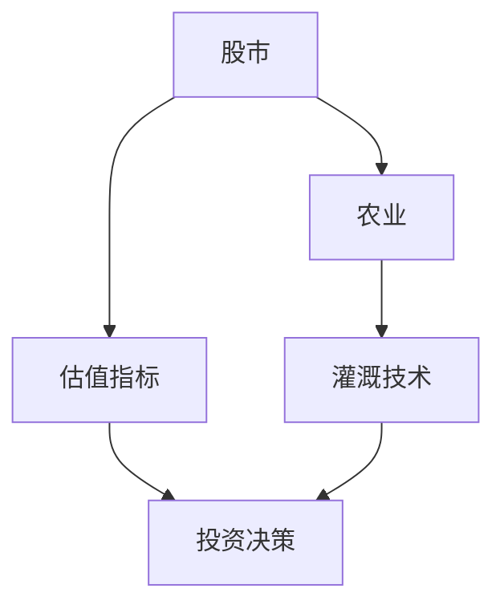
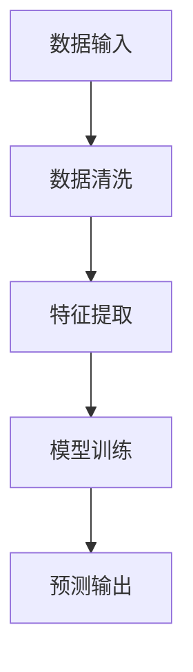
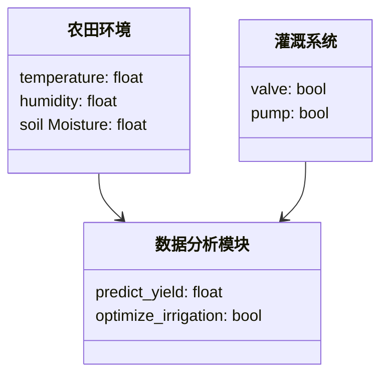
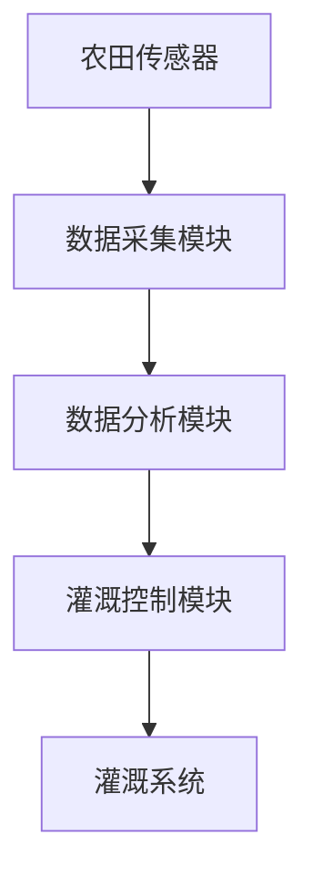
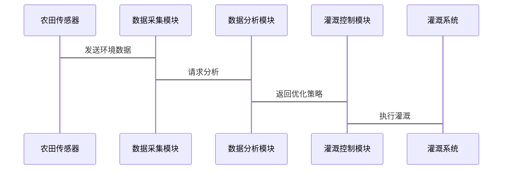

                 


# 全球股市估值与可持续农业精准灌溉技术的关系

## 关键词：股市估值，精准灌溉，可持续农业，数据分析，机器学习，系统架构

## 摘要：
本文探讨了全球股市估值与可持续农业中的精准灌溉技术之间的关系。通过分析股市估值的波动性与农业投资决策的关联，结合精准灌溉技术在提高农业效率和降低成本方面的优势，提出了一种利用数据驱动的方法优化农业投资和灌溉策略，从而实现可持续农业发展的方法。本文详细讲解了数据分析算法、系统架构设计和实际案例，为读者提供了从理论到实践的全面指导。

---

## 第一部分：背景介绍

### 第1章：背景介绍

#### 1.1 问题背景
##### 1.1.1 全球股市估值的重要性
股市估值是衡量企业价值的重要指标，反映了市场对经济前景的信心。股市的波动性直接影响投资者的决策，进而影响农业投资的流向。

##### 1.1.2 可持续农业与精准灌溉技术的必要性
随着全球人口增长和气候变化，传统农业模式面临资源浪费和环境压力。精准灌溉技术通过优化水资源利用，提高作物产量，成为可持续农业的核心技术。

##### 1.1.3 问题解决的紧迫性
如何通过技术手段优化农业投资，提高农业效率，已成为全球关注的焦点。股市估值与农业技术的结合，为解决这一问题提供了新的思路。

#### 1.2 问题描述
##### 1.2.1 全球股市估值的波动性分析
股市估值受多种因素影响，包括经济指标、政策变化和市场情绪。农业作为实体经济的重要组成部分，其表现直接影响股市估值。

##### 1.2.2 可持续农业面临的挑战
传统农业模式资源利用效率低，环境影响大。精准灌溉技术虽能提高效率，但其推广和应用受到资金和技术的限制。

##### 1.2.3 精准灌溉技术的现状与不足
现有精准灌溉技术在数据采集和分析方面仍有不足，无法实时优化灌溉策略。

#### 1.3 问题解决
##### 1.3.1 利用股市估值优化农业投资
通过分析股市估值，投资者可以更准确地判断农业投资的时机和方向。

##### 1.3.2 通过精准灌溉技术提高农业效率
精准灌溉技术通过实时监测土壤湿度和气象数据，优化灌溉策略，提高作物产量。

##### 1.3.3 结合两者实现可持续发展
将股市估值与精准灌溉技术结合，可以实现农业投资的精准化和灌溉管理的智能化，从而推动可持续农业发展。

#### 1.4 边界与外延
##### 1.4.1 股市估值的边界条件
股市估值的分析需要考虑宏观经济指标、行业趋势和企业基本面。

##### 1.4.2 精准灌溉技术的适用范围
适用于干旱和水资源短缺地区，适合高附加值作物的种植。

##### 1.4.3 两者结合的可行性分析
技术可行性、经济可行性和政策支持是关键因素。

#### 1.5 概念结构与核心要素组成
##### 1.5.1 股市估值的核心要素
包括市盈率、市净率、股息率等指标。

##### 1.5.2 精准灌溉技术的关键组成部分
包括传感器、数据采集系统、分析模型和灌溉控制模块。

##### 1.5.3 两者结合的概念模型
通过数据驱动优化灌溉策略，提升农业产量，进而影响股市估值。

---

## 第二部分：核心概念与联系

### 第2章：核心概念与联系

#### 2.1 核心概念原理
##### 2.1.1 股市估值的原理
股市估值基于市场对企业的未来盈利能力的预期，反映了市场参与者的集体判断。

##### 2.1.2 精准灌溉技术的原理
通过实时监测土壤湿度、气象数据和作物需求，精准控制灌溉量和时间。

##### 2.1.3 两者结合的机制
通过数据分析，优化灌溉策略，提高农业产量，进而影响农业企业的盈利能力，最终反映在股市估值中。

#### 2.2 概念属性特征对比
| 属性       | 股市估值                | 精准灌溉技术              |
|------------|-----------------------|---------------------------|
| 核心目标   | 评估企业价值            | 提高农业效率                |
| 数据来源   | 财务报表、市场数据      | 气象数据、土壤传感器数据    |
| 影响因素   | 宏观经济、行业趋势      | 气候变化、资源状况          |
| 输出结果   | 估值指标                | 灌溉策略                  |

#### 2.3 ER实体关系图架构


---

## 第三部分：算法原理讲解

### 第3章：算法原理讲解

#### 3.1 数据分析与预测算法
##### 3.1.1 数据预处理
清洗数据，处理缺失值和异常值，提取特征。

##### 3.1.2 算法选择
使用线性回归和机器学习模型（如随机森林）进行预测。

##### 3.1.3 算法实现


#### 3.2 数学模型与公式
##### 3.3.1 线性回归模型
$$ y = \beta_0 + \beta_1x + \epsilon $$

##### 3.3.2 机器学习模型
$$ y = f(x; \theta) $$

#### 3.4 代码实现
```python
import pandas as pd
from sklearn.linear_model import LinearRegression

# 数据预处理
data = pd.read_csv('agriculture_data.csv')
data.dropna(inplace=True)

# 特征提取
X = data[['temperature', 'humidity']]
y = data['yield']

# 模型训练
model = LinearRegression()
model.fit(X, y)

# 预测输出
y_pred = model.predict(X)
```

---

## 第四部分：系统分析与架构设计

### 第4章：系统分析与架构设计

#### 4.1 问题场景介绍
系统需要实时监测农田环境，优化灌溉策略，并分析股市估值对农业投资的影响。

#### 4.2 项目介绍
开发一个基于物联网的精准灌溉系统，结合数据分析优化灌溉策略。

#### 4.3 系统功能设计
##### 4.3.1 领域模型


#### 4.4 系统架构设计
##### 4.4.1 系统架构图


#### 4.5 系统接口设计
##### 4.5.1 数据接口
传感器数据接口、灌溉系统控制接口。

##### 4.5.2 API接口
RESTful API用于数据传输和系统控制。

#### 4.6 系统交互设计
##### 4.6.1 交互流程


---

## 第五部分：项目实战

### 第5章：项目实战

#### 5.1 环境安装
安装必要的Python库，如pandas、scikit-learn、Flask。

#### 5.2 核心代码实现
```python
from flask import Flask, jsonify
import requests

app = Flask(__name__)

@app.route('/optimize_irrigation', methods=['POST'])
def optimize_irrigation():
    data = request.json
    # 数据分析逻辑
    return jsonify({'status': 'success', 'message': 'Irrigation optimized'})

if __name__ == '__main__':
    app.run(debug=True)
```

#### 5.3 案例分析
分析某地区玉米种植的数据，优化灌溉策略，提高产量，进而提升农业企业的估值。

#### 5.4 结果解读
通过数据驱动优化灌溉策略，提高农业产量，进而影响股市估值。

---

## 第六部分：最佳实践和小结

### 第6章：总结与展望

#### 6.1 最佳实践
建议农业企业和投资者结合股市估值和精准灌溉技术，优化投资和管理。

#### 6.2 小结
本文通过分析股市估值与精准灌溉技术的关系，提出了一种数据驱动的方法优化农业投资和灌溉策略，为实现可持续农业发展提供了新思路。

#### 6.3 注意事项
在实际应用中，需考虑数据质量和模型的泛化能力。

#### 6.4 拓展阅读
推荐相关书籍和论文，深入学习数据分析和农业技术的结合。

---

通过以上分析，我们可以看到，股市估值与精准灌溉技术的结合不仅能够优化农业投资，还能提高农业效率，推动可持续农业发展。希望本文能为相关领域的研究和实践提供有价值的参考。

