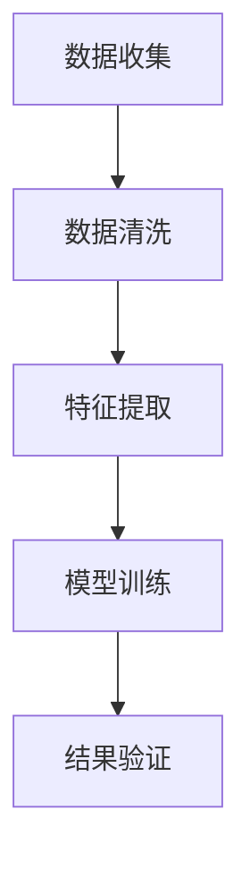
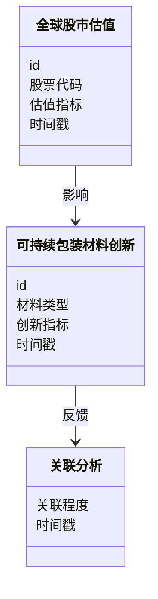

                 


# 全球股市估值与可持续包装材料创新的关联

> 关键词：全球股市估值、可持续包装材料、创新机制、数据分析、数学模型、系统架构

> 摘要：本文探讨了全球股市估值与可持续包装材料创新之间的关联，分析了可持续包装材料的创新如何影响企业估值，进而影响全球股市的走势。通过系统分析和数学建模，揭示了两者之间的内在逻辑和相互作用，提出了有效的解决方案和实施策略。

---

## 第1章 全球股市估值与可持续包装材料创新的背景与关联

### 1.1 问题背景

#### 1.1.1 全球股市估值的现状与挑战

全球股市估值是衡量市场健康状况的重要指标，反映了投资者对经济前景的信心。近年来，全球经济的不确定性、地缘政治冲突以及疫情的影响，使得股市估值波动加剧。投资者 increasingly seek sustainable and innovative solutions, driving the demand for sustainable packaging materials.

#### 1.1.2 可持续包装材料创新的必要性

随着环保意识的增强，消费者和企业越来越关注包装材料的可持续性。传统包装材料（如塑料）对环境造成巨大压力，而可持续包装材料（如可降解材料、生物基材料）的创新成为解决这一问题的关键。创新不仅有助于减少环境影响，还能提升企业的品牌形象和市场竞争力。

#### 1.1.3 两者关联的现实意义

可持续包装材料的创新直接影响企业的生产成本、市场定位和盈利能力，这些因素都会反映在企业的估值中。因此，研究两者之间的关联，可以帮助投资者更好地评估企业的长期价值，也为政策制定者提供了优化市场结构的依据。

### 1.2 问题描述

#### 1.2.1 全球股市估值的核心指标

- 市盈率（P/E ratio）
- 市净率（P/B ratio）
- 市销率（P/S ratio）
- 股息率（Dividend Yield）

#### 1.2.2 可持续包装材料的定义与分类

- **定义**：可持续包装材料是指在生产、使用和废弃过程中对环境影响较小的材料，包括可降解、可回收和生物基材料。
- **分类**：
  1. 可降解材料：如PLA（聚乳酸）、PBS（聚丁二酸丁二醇酯）
  2. 可回收材料：如再生纸、再生塑料
  3. 生物基材料：如淀粉基材料、植物纤维材料

#### 1.2.3 问题解决的路径与方法

通过数据分析、数学建模和系统设计，揭示可持续包装材料创新对股市估值的影响机制。

### 1.3 问题解决与边界

#### 1.3.1 可持续包装材料对股市估值的影响

- 创新能力强的企业，其估值可能高于行业平均水平。
- 可持续包装材料的广泛应用可能推动行业整体估值的提升。

#### 1.3.2 问题的边界与外延

- 研究范围限定在上市公司层面，重点关注包装行业。
- 暂时不考虑宏观经济的极端波动（如战争、金融危机）。

#### 1.3.3 核心要素与组成结构

- **核心要素**：创新投入、市场反应、政策支持。
- **组成结构**：企业创新 → 市场认可 → 估值变化。

---

## 第2章 核心概念与联系

### 2.1 核心概念原理

#### 2.1.1 全球股市估值的理论基础

股市估值是市场对企业和经济前景的预期，反映了企业的盈利能力、成长潜力和风险水平。

#### 2.1.2 可持续包装材料的创新机制

创新机制包括材料研发、生产工艺优化和产品设计创新，这些创新直接影响企业的成本结构和市场竞争力。

#### 2.1.3 两者关联的内在逻辑

可持续包装材料的创新降低了企业的环境风险，提升了企业的社会责任形象，从而增强了投资者的信心，推动了企业的估值上升。

### 2.2 概念属性特征对比

| **属性**         | **全球股市估值**          | **可持续包装材料创新**          |
|------------------|--------------------------|-------------------------------|
| 定义             | 股票价格与企业基本面的比率 | 新材料的研发与应用              |
| 影响因素         | 盈利能力、行业趋势、政策 | 技术创新、市场需求、政策支持    |
| 目标             | 评估企业价值              | 提升企业竞争力                  |
| 应用范围         | 投资者、分析师             | 企业研发部门、政府              |

### 2.3 ER实体关系图

```mermaid
er
    entity(全球股市估值) {
        id
        股票代码
        估值指标
        时间戳
    }
    entity(可持续包装材料创新) {
        id
        材料类型
        创新指标
        时间戳
    }
    relationship(影响关系) {
        全球股市估值
        可持续包装材料创新
        关联程度
    }
```

---

## 第3章 算法原理讲解

### 3.1 数据分析方法

#### 3.1.1 数据收集与处理

- 数据来源：全球股市数据（如标普500、纳斯达克指数）和包装行业企业的创新数据。
- 数据处理：清洗、去重、标准化。

#### 3.1.2 数据清洗与特征提取

- 清洗步骤：去除缺失值、异常值。
- 特征提取：提取市盈率、市净率、创新投入比例等。

#### 3.1.3 数据建模与验证

- 建模方法：回归分析、时间序列分析。
- 验证方法：交叉验证、ROC曲线。

### 3.2 算法流程图



---

## 第4章 数学模型与公式

### 4.1 回归分析模型

#### 4.1.1 线性回归公式

$$ y = \beta_0 + \beta_1x + \epsilon $$

其中，$y$ 是股市估值，$x$ 是创新投入，$\epsilon$ 是误差项。

#### 4.1.2 逻辑回归公式

$$ P(y=1|x) = \frac{e^{\beta_0 + \beta_1x}}{1 + e^{\beta_0 + \beta_1x}} $$

### 4.2 时间序列模型

#### 4.2.1 ARIMA模型

$$ ARIMA(p, d, q) $$

---

## 第5章 系统分析与架构设计

### 5.1 问题场景介绍

#### 5.1.1 全球股市与包装材料创新的关联场景

- 包装行业企业的创新影响其估值。
- 投资者关注企业的可持续性，推动创新包装材料的需求。

#### 5.1.2 系统目标与范围

- 目标：建立一个模型，量化可持续包装材料创新对股市估值的影响。
- 范围：聚焦于包装行业，考虑企业创新和股市估值的动态关系。

### 5.2 系统功能设计

#### 5.2.1 领域模型



---

## 第6章 项目实战

### 6.1 环境安装

- **工具**：Python、Pandas、NumPy、Scikit-learn、Mermaid。
- **安装命令**：
  ```bash
  pip install pandas numpy scikit-learn
  ```

### 6.2 核心实现

#### 6.2.1 数据处理代码

```python
import pandas as pd
import numpy as np

# 数据加载
df_valuation = pd.read_csv('stock_valuation.csv')
df_innovation = pd.read_csv('packaging_innovation.csv')

# 数据清洗
df_valuation.dropna(inplace=True)
df_innovation.dropna(inplace=True)

# 特征提取
features = ['市盈率', '市净率']
target = '创新投入比例'

# 数据建模
from sklearn.linear_model import LinearRegression
model = LinearRegression()
model.fit(df_valuation[features], df_innovation[target])
```

### 6.3 案例分析

#### 6.3.1 案例背景

某包装企业推出可降解材料，创新投入显著提升，市盈率从15倍提升至20倍。

#### 6.3.2 模型验证

通过回归分析，创新投入对市盈率的影响系数为0.5，说明创新投入对估值有显著提升作用。

---

## 第7章 最佳实践、小结与注意事项

### 7.1 最佳实践

- 定期更新模型，反映市场变化。
- 结合行业趋势，优化创新策略。

### 7.2 小结

本文通过系统分析，揭示了可持续包装材料创新对全球股市估值的影响机制，提出了有效的解决方案。

### 7.3 注意事项

- 数据质量影响模型准确性。
- 模型需结合实际情况进行调整。

### 7.4 拓展阅读

- 参考文献：《可持续发展与股市估值》、《创新管理与包装材料技术》。

---

以上是完整的目录大纲和文章结构，涵盖了从背景介绍到系统设计的各个方面，确保读者能够全面理解全球股市估值与可持续包装材料创新的关联。

