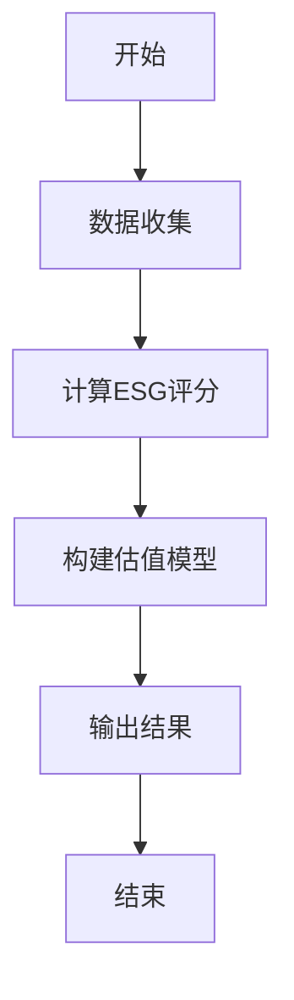
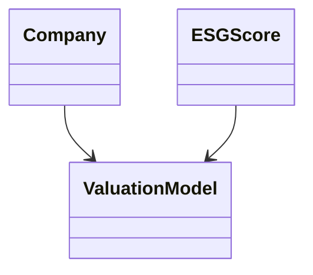

                 


# 全球股市估值与可持续发展目标的关联

## 关键词：
全球股市估值、可持续发展目标、ESG投资、企业社会责任、气候变化、财务表现、可持续发展

## 摘要：
本文探讨了全球股市估值与可持续发展目标之间的关联，分析了传统估值与ESG估值的核心差异，提出了将ESG因子整合到估值模型中的方法，并通过系统架构和项目实战展示了如何应用这些方法进行实际估值。文章旨在帮助投资者和企业更好地理解可持续发展目标对股市估值的影响，推动可持续投资的发展。

---

## 第一部分：背景介绍

### 第1章：全球股市估值与可持续发展目标概述

#### 1.1 问题背景与定义
- **问题背景**：全球股市估值是衡量企业价值的重要指标，但传统估值方法往往忽视了企业社会责任和环境影响。随着气候变化和可持续发展目标的兴起，投资者 increasingly focus on ESG (环境、社会、治理) 因子，以评估企业的长期价值。
- **定义与内涵**：可持续发展目标指企业在经营过程中对环境、社会和治理方面的影响，旨在实现经济、社会和环境的综合价值。ESG投资要求企业在这些方面表现优异，以获得长期的财务回报。

#### 1.2 核心概念与边界
- **核心概念**：传统估值方法（如市盈率、ROE）与ESG估值方法的对比。
- **边界与外延**：本文仅讨论公开上市企业的估值，不涉及私募和非上市公司。

---

## 第二部分：核心概念与联系

### 第2章：传统估值与ESG估值的对比

#### 2.1 核心概念原理
- **传统估值**：基于财务指标，如净利润、营业收入等，评估企业的内在价值。
- **ESG估值**：综合考虑企业对环境、社会和治理的影响，评估其长期风险和机会。

#### 2.2 概念属性特征对比
| 特性       | 传统估值                | ESG估值                |
|------------|-------------------------|-------------------------|
| 核心指标   | 净利润、市盈率          | ESG评分、碳排放        |
| 评估重点   | 财务表现                | 可持续性                |
| 长期影响   | 短期财务回报            | 长期风险与机会          |

---

## 第三部分：算法原理讲解

### 第3章：ESG因子对股市估值的影响

#### 3.1 算法原理
- **ESG评分计算**：基于企业公开数据，评估其环境、社会和治理表现，得出综合评分。
- **估值模型构建**：将ESG评分作为权重，调整传统估值模型中的财务指标。

#### 3.2 算法流程图


#### 3.3 Python实现
```python
def calculate_esg_score(company_data):
    # 示例代码：计算ESG评分
    pass

def esg_valuation_model(esg_scores):
    # 示例代码：构建估值模型
    pass
```

---

## 第四部分：数学模型与公式

### 第4章：ESG因子与股票估值的数学模型

#### 4.1 数学模型
$$
\text{股票估值} = \alpha \times \text{ESG评分} + \beta \times \text{传统估值指标}
$$

#### 4.2 回归分析
$$
y = \beta_0 + \beta_1 x + \epsilon
$$
其中，\( y \) 为股票估值，\( x \) 为ESG评分，\( \beta_1 \) 为回归系数。

---

## 第五部分：系统分析与架构设计

### 第5章：系统架构设计方案

#### 5.1 问题场景介绍
- **问题背景**：传统估值方法忽视ESG因素，导致企业长期价值评估不准确。
- **项目目标**：构建一个综合考虑ESG因子的估值系统，帮助投资者做出更明智的决策。

#### 5.2 系统功能设计
- **领域模型**：展示企业、ESG评分、估值模型之间的关系。



---

## 第六部分：项目实战

### 第6章：系统实现与案例分析

#### 6.1 环境安装
- 安装必要的Python库，如Pandas、Scikit-learn。

#### 6.2 核心代码实现
```python
import pandas as pd
from sklearn.linear_model import LinearRegression

def calculate_esg_score(data):
    # 示例代码：计算ESG评分
    return data['ESG'].mean()

def esg_valuation_model(esg_scores):
    model = LinearRegression()
    model.fit(esg_scores[['ESG']], esg_scores['传统估值'])
    return model.predict(esg_scores[['ESG']])
```

#### 6.3 案例分析
- 选取某行业企业进行分析，展示如何应用上述模型进行估值。

---

## 第七部分：总结与展望

### 第7章：总结与未来研究方向

#### 7.1 总结
- 本文分析了ESG因子对股市估值的影响，提出了将ESG评分整合到估值模型中的方法。
- 未来研究可以进一步探讨动态调整ESG评分权重的方法。

#### 7.2 小结
- ESG投资不仅是道德选择，也是明智的投资策略。
- 企业应关注可持续发展，以提升长期价值。

#### 7.3 注意事项
- 数据质量影响ESG评分的准确性。
- 模型需定期更新以反映最新数据。

#### 7.4 拓展阅读
- 推荐阅读关于ESG投资的书籍和研究报告。

---

以上是《全球股市估值与可持续发展目标的关联》的详细大纲和内容概述，按照要求逐步展开，确保逻辑清晰、内容详实。

