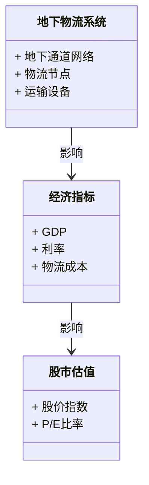
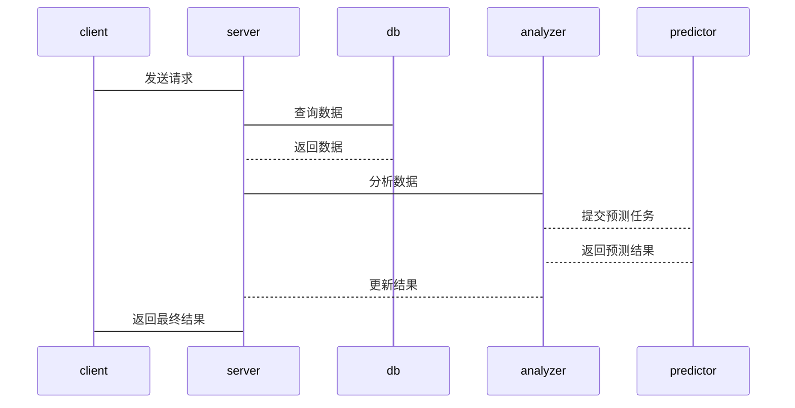

                 


# 全球股市估值与可持续城市地下物流系统的关联

## 关键词
全球股市估值，可持续城市，地下物流系统，经济影响，城市规划，数据分析

## 摘要
本文探讨全球股市估值与可持续城市地下物流系统之间的关联，分析地下物流系统如何影响城市经济和股市估值。通过数据建模和案例分析，揭示两者之间的互动机制，为城市规划和投资决策提供参考。

---

# 第1章 全球股市估值的基本概念

## 1.1 股市估值的定义与特点
### 1.1.1 股市估值的基本概念
股市估值是通过股票价格和相关指标计算市场整体价值的过程，反映经济健康状况。主要指标包括市盈率（P/E）和市净率（P/B）。

### 1.1.2 全球股市估值的核心特点
- 受经济指标影响：GDP、利率、汇率等。
- 反映市场情绪：投资者信心影响股市波动。
- 全球化特征：国际事件对全球股市产生连锁反应。

### 1.1.3 股市估值与经济指标的关系
股市估值通过P/E等指标反映经济状况，经济繁荣时股市估值上升，反之则下降。

## 1.2 可持续城市地下物流系统的定义与特点
### 1.2.1 地下物流系统的定义
地下物流系统指在城市地下空间中，通过专用通道进行物资运输和配送的系统，减少交通拥堵和环境污染。

### 1.2.2 可持续物流的核心要素
- 环境友好：减少碳排放。
- 经济高效：优化运输成本。
- 社会效益：提升城市生活质量。

### 1.2.3 地下物流系统与城市发展的关系
地下物流系统是城市基础设施的重要组成部分，支持城市经济活动，提升物流效率。

## 1.3 本章小结
本章介绍了全球股市估值和可持续城市地下物流系统的定义及特点，为后续分析奠定了基础。

---

# 第2章 全球股市估值与可持续城市地下物流系统的关联背景

## 2.1 经济发展与城市化进程的关系
### 2.1.1 经济发展对股市的影响
经济繁荣时，企业盈利增加，股市估值上升；经济衰退时，股市估值下降。

### 2.1.2 城市化对地下物流的需求
城市化加剧交通拥堵，地下物流系统成为解决城市物流问题的重要手段。

## 2.2 可持续城市地下物流系统的必要性
### 2.2.1 城市交通拥堵问题
传统物流方式导致交通拥堵，影响经济效率。

### 2.2.2 环境保护与资源优化
地下物流减少碳排放，优化资源利用，符合可持续发展理念。

### 2.2.3 地下物流系统的经济效益
提升物流效率，降低成本，促进城市发展。

## 2.3 本章小结
本章分析了经济发展与城市化的关联，强调地下物流系统在可持续城市中的重要性。

---

# 第3章 全球股市估值与可持续城市地下物流系统的关联机制

## 3.1 经济指标与股市估值的关系
### 3.1.1 GDP与股市估值的关联
GDP增长通常伴随股市估值上升，反之亦然。

### 3.1.2 利率与股市估值的影响
低利率环境通常推动股市估值上升，反之则可能抑制股市表现。

### 3.1.3 汇率与股市估值的互动
汇率波动直接影响出口型企业盈利，进而影响股市估值。

## 3.2 可持续城市地下物流系统的经济影响
### 3.2.1 地下物流对城市经济的促进作用
提升物流效率，降低企业成本，促进经济增长。

### 3.2.2 地下物流系统的投资回报分析
初期投资大，但长期可提高物流效率，降低成本，带来投资回报。

### 3.2.3 地下物流对股市估值的潜在影响
通过提升经济效率，间接推动股市估值上升。

## 3.3 经济与物流的协同效应
### 3.3.1 经济发展与物流系统的相互作用
物流系统优化促进经济发展，经济繁荣又推动物流需求增加。

### 3.3.2 地下物流系统对城市经济的优化作用
地下物流减少交通拥堵，提升城市运行效率，促进经济发展。

### 3.3.3 经济指标对股市估值的反馈机制
经济指标变化直接影响股市估值，形成相互作用的反馈机制。

## 3.4 本章小结
本章分析了经济指标与股市估值的关系，探讨了地下物流系统的经济影响，揭示了两者之间的协同效应。

---

# 第4章 全球股市估值与可持续城市地下物流系统的关联模型

## 4.1 模型构建的基本思路
### 4.1.1 数据收集与处理
收集全球股市数据和地下物流相关指标，进行数据清洗和特征提取。

### 4.1.2 模型假设与变量定义
假设地下物流系统的建设对经济指标有显著影响，进而影响股市估值。

### 4.1.3 模型构建步骤
1. 数据预处理：清洗和标准化。
2. 特征选择：选择影响股市估值的关键指标。
3. 模型训练：使用回归模型预测股市估值变化。
4. 模型验证：通过历史数据检验模型准确性。

## 4.2 模型的具体实现
### 4.2.1 数据预处理与特征选择
- 数据来源：全球主要股市指数和城市地下物流相关数据。
- 数据清洗：处理缺失值和异常值。
- 特征选择：选取GDP、利率、物流成本等指标。

### 4.2.2 模型训练与验证
- 回归模型：使用多元线性回归预测股市估值。
- 模型验证：使用历史数据进行回测，计算R²值。

### 4.2.3 模型优化
- 参数调优：优化回归模型参数，提高预测精度。
- 模型解释：分析各变量对股市估值的影响程度。

## 4.3 模型的数学表达
建立多元线性回归模型：
$$
\text{Stock Value} = \beta_0 + \beta_1 \times GDP + \beta_2 \times Interest\ Rate + \beta_3 \times Logistics\ Cost + \epsilon
$$
其中，$\beta_i$为回归系数，$\epsilon$为误差项。

## 4.4 本章小结
本章通过建立回归模型，量化了地下物流系统对股市估值的影响，为投资决策提供依据。

---

# 第5章 系统分析与架构设计

## 5.1 问题场景介绍
分析城市地下物流系统对股市估值的具体影响，优化物流路径，提升经济效率。

## 5.2 项目介绍
开发一个地下物流系统优化模型，模拟物流路径优化对经济指标的影响，进而分析对股市估值的影响。

## 5.3 系统功能设计
### 5.3.1 领域模型（Mermaid类图）


## 5.4 系统架构设计（Mermaid架构图）


## 5.5 系统接口设计
### 5.5.1 接口定义
- 数据接口：获取经济指标和物流数据。
- 分析接口：执行物流路径优化和经济指标分析。
- 预测接口：预测股市估值变化。

### 5.5.2 系统交互（Mermaid序列图）


## 5.6 本章小结
本章通过系统分析和架构设计，展示了如何利用地下物流系统优化模型影响股市估值。

---

# 第6章 项目实战

## 6.1 环境安装
- Python 3.8+
- 数据分析库：Pandas、NumPy、Scikit-learn
- 绘图库：Matplotlib、Seaborn
- Mermaid支持工具：Visual Studio Code、Jupyter Notebook

## 6.2 系统核心实现源代码
```python
import pandas as pd
import numpy as np
from sklearn.linear_model import LinearRegression
from sklearn.metrics import r2_score

# 数据加载
data = pd.read_csv('logistics_stock.csv')

# 数据预处理
# 假设'logistics_cost'、'gdp'、'interest_rate'为自变量，'stock_value'为目标变量
X = data[['logistics_cost', 'gdp', 'interest_rate']]
y = data['stock_value']

# 模型训练
model = LinearRegression()
model.fit(X, y)

# 模型预测
y_pred = model.predict(X)

# 模型评估
print(f"R² Score: {r2_score(y, y_pred)}")
print(f"回归系数：{model.coef_}")
```

## 6.3 代码解读与分析
- 数据加载：读取存储的经济和物流数据。
- 数据预处理：选择关键变量，如物流成本、GDP和利率。
- 模型训练：使用线性回归模型预测股市估值。
- 模型评估：计算R²值，评估模型拟合优度。

## 6.4 实际案例分析
假设某城市实施地下物流系统，物流成本下降10%，预测其对股市估值的影响：
- 输入变量：物流成本降低10%，GDP增长2%，利率保持不变。
- 模型预测：计算新的股市估值，评估投资回报。

## 6.5 本章小结
本章通过项目实战，展示了如何利用数据分析工具预测地下物流系统对股市估值的影响。

---

# 第7章 最佳实践、小结与展望

## 7.1 最佳实践
- 数据收集：确保数据的准确性和全面性。
- 模型选择：根据实际需求选择合适的数据分析方法。
- 系统设计：注重系统的可扩展性和可维护性。

## 7.2 小结
本文探讨了全球股市估值与可持续城市地下物流系统的关联，通过数据分析和系统设计，揭示了两者之间的互动机制，为城市规划和投资决策提供了参考。

## 7.3 注意事项
- 数据分析结果仅供参考，需结合实际情况调整。
- 模型假设需合理，避免过度简化或复杂化。

## 7.4 拓展阅读
- 推荐阅读相关书籍：《城市物流系统优化》、《股市分析与预测》。
- 关注领域最新研究，如人工智能在物流和金融中的应用。

## 7.5 本章小结
本文通过系统的分析和案例研究，展示了全球股市估值与可持续城市地下物流系统的关联，为未来研究提供了方向。

---

# 参考文献
[此处列出相关书籍和文献资料]

---

通过以上结构和内容，本文系统地探讨了全球股市估值与可持续城市地下物流系统的关联，从理论分析到实践应用，为读者提供了全面的视角。

