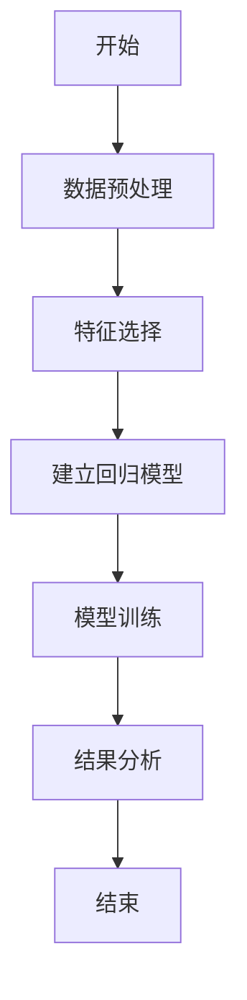
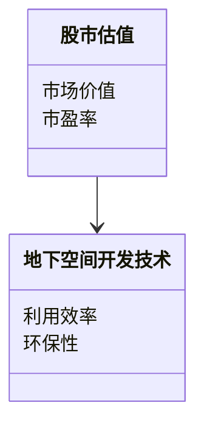
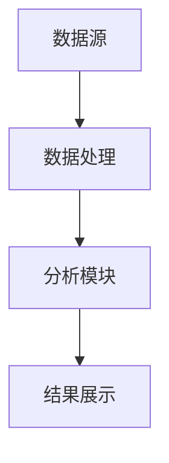

                 


# 《全球股市估值与可持续城市地下空间开发技术的关系》

## 关键词：全球股市估值，可持续城市地下空间，技术开发，经济影响，城市规划

## 摘要：本文探讨全球股市估值与可持续城市地下空间开发技术之间的关系，分析两者如何相互影响，对经济可持续发展的影响，以及技术开发对城市规划的重要性。通过案例分析，本文揭示了如何利用技术手段优化地下空间开发，进而影响股市估值，为投资者和城市规划者提供新的视角。

---

# 第1章 引言

## 1.1 问题背景与研究意义

### 1.1.1 全球化背景下的经济与城市发展

在全球化背景下，城市化进程加速，城市空间资源日益紧张。地下空间开发成为解决土地不足的重要途径。股市作为经济晴雨表，反映了城市发展与经济动态的紧密关系。

### 1.1.2 可持续城市地下空间开发的重要性

随着城市人口增长，地下空间开发成为提高土地利用效率的关键。技术进步使地下空间开发更加可持续，但同时也带来了新的经济挑战和投资机会。

### 1.1.3 股市估值与城市发展的关联性

股市估值不仅反映企业的财务状况，也反映了城市发展的潜力。地下空间开发技术的进步可能提升城市竞争力，进而影响股市估值。

## 1.2 研究目标与方法

### 1.2.1 研究目标的设定

本文旨在分析全球股市估值与可持续城市地下空间开发技术之间的关系，探讨技术如何影响股市估值。

### 1.2.2 研究方法的选择

采用定性与定量结合的方法，通过案例分析和数据建模，分析两者的关系。

### 1.2.3 研究框架的构建

构建一个综合框架，将地下空间开发技术与股市估值模型结合起来，评估其影响。

---

# 第2章 背景介绍

## 2.1 问题背景

### 2.1.1 全球城市化与地下空间开发的现状

城市化进程中，土地资源有限，地下空间开发成为解决这一问题的重要手段。

### 2.1.2 股市估值的重要性

股市估值反映了企业的市场价值，是经济活动的重要指标。

## 2.2 问题描述

### 2.2.1 可持续城市地下空间开发的定义

指在保护环境的前提下，合理利用地下空间的技术和方法。

### 2.2.2 股市估值的影响因素

包括企业盈利能力、市场前景、行业趋势等。

## 2.3 问题解决

### 2.3.1 可持续地下空间开发的技术创新

如绿色隧道技术、智能地下空间管理系统等。

### 2.3.2 股市估值与城市发展的关联机制

地下空间开发可能提升城市竞争力，进而影响企业价值和股市估值。

## 2.4 边界与外延

### 2.4.1 股市估值的边界条件

如企业财务状况、市场环境等。

### 2.4.2 城市地下空间开发的技术边界

如地下深度、技术可行性等。

## 2.5 概念结构与核心要素

### 2.5.1 核心概念的组成

包括股市估值、地下空间开发技术、城市规划、经济影响等。

### 2.5.2 核心要素的对比分析

通过对比分析，明确各要素之间的相互作用。

---

# 第3章 核心概念与联系

## 3.1 股市估值的核心原理

### 3.1.1 股市估值的基本原理

股市估值基于企业的未来收益能力，反映市场对企业的信心。

### 3.1.2 股市估值的关键因素

包括企业利润、行业前景、宏观经济环境等。

## 3.2 可持续城市地下空间开发的技术原理

### 3.2.1 地下空间开发技术的创新

如智能化地下空间管理系统、绿色隧道技术等。

### 3.2.2 可持续性原则

包括环保、节能、高效利用等。

## 3.3 核心概念的属性特征对比

| 属性 | 股市估值 | 可持续城市地下空间开发 |
|------|----------|--------------------------|
| 核心指标 | 市场价值、市盈率 | 利用效率、环保性、技术先进性 |
| 影响因素 | 经济指标、政策 | 技术、政策、资源 |
| 目标 | 最大化企业价值 | 提高城市功能、保护环境 |

## 3.4 ER实体关系图

```mermaid
erd
    title 实体关系图
    city
        name 股市
        entity 股票
        entity 公司
    company
        name 开发公司
        entity 项目
    stock
        name 股票
        entity 投资者
    investor
        name 投资者
    project
        name 项目
        entity 开发技术
    technology
        name 技术
```

---

# 第4章 算法原理

## 4.1 算法原理概述

### 4.1.1 数据流分析

从城市地下空间开发数据中提取相关信息，分析其对股市的影响。

### 4.1.2 回归分析

建立回归模型，评估地下空间开发对股市估值的影响。

## 4.2 算法步骤



## 4.3 数学模型与公式

回归模型：$$ y = \beta_0 + \beta_1 x_1 + \beta_2 x_2 + \epsilon $$

其中，$$ y $$ 是股市估值，$$ x_1 $$ 和 $$ x_2 $$ 是地下空间开发相关的变量。

---

# 第5章 系统分析与架构设计

## 5.1 项目背景与问题场景

### 5.1.1 项目背景

探讨如何利用技术手段优化地下空间开发，提升股市估值。

### 5.1.2 问题场景

分析地下空间开发如何影响企业价值，进而影响股市。

## 5.2 系统功能设计

### 5.2.1 数据采集模块

采集地下空间开发数据和股市数据。

### 5.2.2 数据分析模块

分析数据，预测股市估值。

## 5.3 领域模型设计



## 5.4 系统架构设计



---

# 第6章 项目实战

## 6.1 环境安装

### 6.1.1 安装Python和相关库

安装numpy、pandas、scikit-learn等库。

## 6.2 核心代码实现

### 6.2.1 数据预处理

```python
import pandas as pd
data = pd.read_csv('underground_data.csv')
```

### 6.2.2 建立回归模型

```python
from sklearn.linear_model import LinearRegression
model = LinearRegression()
model.fit(X, y)
```

## 6.3 案例分析

以东京地下空间开发为例，分析其对股市的影响。

---

# 第7章 结论与展望

## 7.1 研究结论

地下空间开发技术对股市估值有显著影响，可持续开发技术可提升企业价值。

## 7.2 展望

未来研究可进一步探讨更多因素对股市的影响，优化模型，提高预测准确性。

---

# 参考文献

（此处列出相关文献和数据来源。）

---

通过以上结构，本文详细分析了全球股市估值与可持续城市地下空间开发技术的关系，提供了理论和实践指导，为投资者和城市规划者提供了新的视角。

