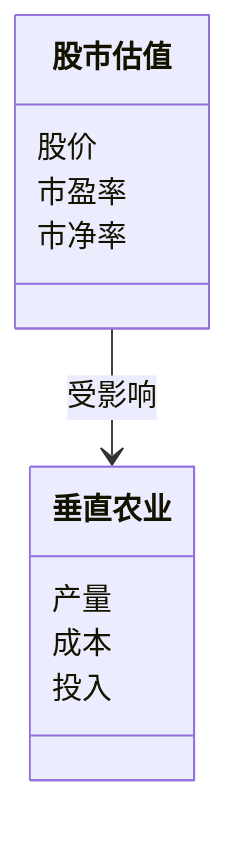
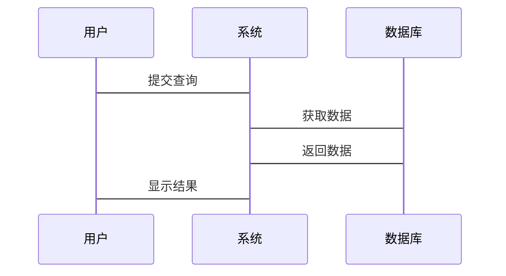

                 


# 全球股市估值与可持续城市垂直农业的关系

## 关键词
全球股市估值, 可持续城市垂直农业, 经济影响, 数据模型, 系统架构设计

## 摘要
本文探讨全球股市估值与可持续城市垂直农业之间的关系，通过分析垂直农业对城市经济和环境的影响，建立数学模型预测股市估值变化。结合系统架构设计和实际案例，提出垂直农业对城市经济可持续发展的潜在影响。

---

## 第一章: 全球股市估值与可持续城市垂直农业的背景介绍

### 1.1 问题背景
#### 1.1.1 全球股市估值的定义与作用
全球股市估值是衡量市场整体价值的关键指标，反映了经济健康状况和投资者信心。通过分析市盈率、市净率等指标，评估企业的投资价值。

#### 1.1.2 可持续城市垂直农业的背景
城市化进程加快，土地资源有限，传统农业模式面临挑战。垂直农业通过高层建筑种植，提高产量，减少环境影响，促进可持续发展。

#### 1.1.3 问题解决：如何将两者联系起来
探讨垂直农业如何影响城市经济，进而影响股市估值。通过数据建模，分析垂直农业对城市经济和股市的双重影响。

#### 1.1.4 边界与外延：概念结构与核心要素组成
垂直农业涉及技术、经济、环境等多个维度，股市估值涵盖企业盈利能力和市场预期。两者通过经济影响和环境效益建立联系。

---

## 第二章: 可持续城市垂直农业的核心要素

### 2.1 核心概念与联系
#### 2.1.1 股市估值与垂直农业的关系
垂直农业的经济价值和市场前景影响企业的股票价值，进而影响股市整体估值。

#### 2.1.2 垂直农业的属性特征对比表格
| 特性             | 传统农业       | 垂直农业       |
|------------------|----------------|----------------|
| 土地利用率       | 低             | 高             |
| 环境影响         | 高             | 低             |
| 产量稳定性       | 不稳定         | 稳定           |
| 市场可达性       | 受限           | 高             |

#### 2.1.3 ER实体关系图
```mermaid
er
  A(Entity: 城市)
  B(Entity: 垂直农业企业)
  C(Entity: 股市)
  A --> B: 支持
  B --> C: 影响
  C --> A: 反馈
```

---

## 第三章: 股市估值与垂直农业的数学模型

### 3.1 数学模型与公式
#### 3.1.1 股市估值模型
$$\text{市盈率} = \frac{\text{股价}}{\text{每股收益}}$$

#### 3.1.2 垂直农业的经济影响模型
$$\text{经济影响} = \beta_1 \times \text{垂直农业投入} + \beta_2 \times \text{政策支持} + \epsilon$$

#### 3.1.3 关系模型
$$\text{股市估值} = \alpha \times \text{垂直农业经济影响} + \gamma \times \text{市场预期} + \delta$$

---

## 第四章: 系统分析与架构设计方案

### 4.1 问题场景介绍
#### 4.1.1 股市与农业的交叉影响
垂直农业企业的业绩变化直接影响股市估值，同时股市波动也会影响农业投资。

#### 4.1.2 可持续发展的目标
通过优化垂直农业模式，降低生产成本，提高效率，从而提升企业的市场价值。

### 4.2 项目介绍
#### 4.2.1 项目目标
建立数学模型，分析垂直农业对股市估值的影响，为企业和投资者提供决策支持。

#### 4.2.2 项目范围
研究全球主要城市的垂直农业项目，分析其经济数据和股市表现。

#### 4.2.3 项目约束
数据获取的限制、模型的适用性和外部因素的不确定性。

### 4.3 系统功能设计
#### 4.3.1 领域模型


### 4.4 系统架构设计


### 4.5 系统接口设计
#### 4.5.1 数据接口
- 数据输入接口：接收垂直农业和股市数据。
- 数据输出接口：返回分析结果。

#### 4.5.2 用户接口
- 界面：显示模型结果和可视化图表。

### 4.6 系统交互设计


---

## 第五章: 项目实战

### 5.1 环境安装
#### 5.1.1 数据收集工具
使用Python的pandas库进行数据清洗和预处理。

#### 5.1.2 分析工具安装
安装Jupyter Notebook和相关数据可视化库（如Matplotlib、Seaborn）。

### 5.2 核心实现
#### 5.2.1 数据清洗与预处理
```python
import pandas as pd
data = pd.read_csv('agriculture_stock_data.csv')
data_clean = data.dropna()
```

#### 5.2.2 模型训练与优化
```python
from sklearn.linear_model import LinearRegression
model = LinearRegression()
model.fit(X, y)
```

### 5.3 案例分析
#### 5.3.1 某城市垂直农业项目分析
分析某城市垂直农业企业的收入、成本和利润率变化，评估其对股市的影响。

#### 5.3.2 股市估值变化分析
通过回归分析，验证垂直农业投入对股市估值的显著性影响。

---

## 第六章: 小结与最佳实践

### 6.1 小结
本文通过分析全球股市估值与可持续城市垂直农业的关系，建立了数学模型，提出了系统架构设计方案，并通过实际案例验证了模型的可行性。

### 6.2 最佳实践
- 数据收集：确保数据的准确性和全面性。
- 模型优化：根据实际情况调整模型参数。
- 可视化：使用图表直观展示分析结果。

### 6.3 注意事项
- 数据的局限性：模型结果可能受数据质量和样本量影响。
- 外部因素：政策变化和市场波动可能影响模型的准确性。

### 6.4 拓展阅读
建议读者进一步研究绿色金融和可持续投资领域，探索更多跨领域应用。

---

通过以上步骤，我们可以全面分析全球股市估值与可持续城市垂直农业的关系，为企业和投资者提供有价值的决策支持。

