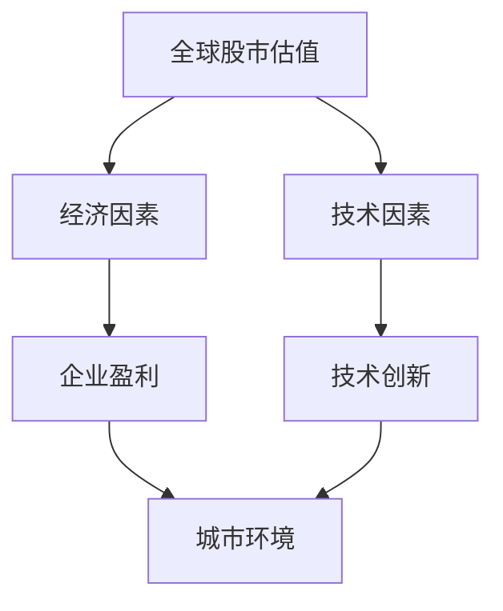
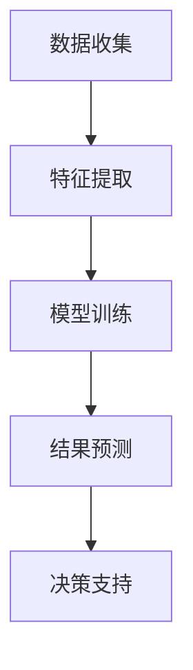
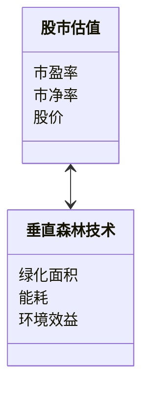
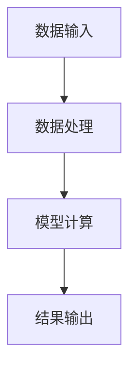
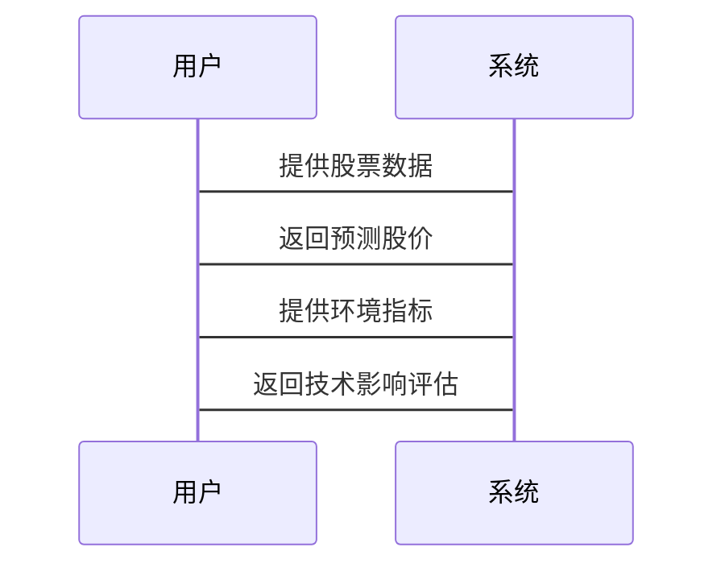

                 


# 全球股市估值与可持续城市垂直森林技术的关系

## 关键词
全球股市估值, 可持续城市, 垂直森林技术, 经济影响, 技术创新

## 摘要
本文探讨了全球股市估值与可持续城市垂直森林技术之间的关系。通过分析垂直森林技术对城市经济、环境改善及股市估值的影响，揭示技术创新如何促进可持续城市发展，并为投资者提供新的投资方向。文章结合数学模型和系统设计，展示了如何通过技术手段优化城市环境，进而影响股市估值。

---

# 第一部分: 全球股市估值与可持续城市垂直森林技术的背景介绍

## 第1章: 全球股市估值概述

### 1.1 问题背景

#### 1.1.1 全球股市估值的基本概念
全球股市估值是指对上市公司市值的总评估，反映经济整体状况和市场信心。主要指标包括市盈率、市净率等，用于衡量企业价值和市场前景。

#### 1.1.2 当前全球股市估值的主要挑战
近年来，全球经济波动、地缘政治风险和疫情等不确定性因素导致股市估值波动加剧。投资者寻求更具韧性和可持续性的投资标的。

#### 1.1.3 可持续发展对股市估值的影响
随着环保意识增强，投资者更倾向于投资绿色企业，可持续发展相关的技术和企业表现成为影响股市估值的重要因素。

### 1.2 问题描述

#### 1.2.1 市场波动性对股市估值的影响
市场波动性增加，如2020年疫情导致的股市崩盘，凸显了传统估值方法的局限性，需引入新技术和新方法进行评估。

#### 1.2.2 经济指标与股市估值的关系
GDP、失业率等经济指标直接影响市场信心，进而影响股市估值。企业盈利能力和增长潜力是股市估值的核心因素。

#### 1.2.3 可持续城市垂直森林技术的引入
城市化进程加快，土地资源紧张，垂直森林技术作为一种创新的城市规划方式，不仅改善环境，还提升城市经济价值，为股市估值提供了新视角。

---

## 第2章: 可持续城市垂直森林技术概述

### 2.1 可持续城市垂直森林技术的核心概念

#### 2.1.1 垂直森林的定义与特点
垂直森林是多层建筑，集办公、居住、商业于一体，通过垂直绿化和立体设计，最大化利用空间，提升环境质量。

#### 2.1.2 可持续城市规划的背景
城市扩张带来环境问题，可持续城市规划强调生态平衡、资源高效利用和减少碳排放，垂直森林技术成为重要解决方案。

#### 2.1.3 垂直森林技术的创新点
采用节能材料、可再生能源、雨水收集系统和智能建筑管理，提升能源效率和生态效益，实现绿色建筑目标。

### 2.2 可持续城市垂直森林技术的实现原理

#### 2.2.1 建筑设计与生态系统的结合
垂直森林通过立体绿化、雨水收集和自然通风，模拟自然生态系统，降低能源消耗，提升建筑可持续性。

#### 2.2.2 能源效率与资源循环利用
采用太阳能板、地热能和节能设备，减少能源消耗。建筑垃圾和废水循环利用，降低资源浪费。

#### 2.2.3 垂直森林对城市环境的改善
垂直森林增加绿地面积，改善空气质量，降低热岛效应，提升城市环境品质，增强居民生活质量。

---

## 第3章: 全球股市估值与可持续城市垂直森林技术的关系

### 3.1 问题解决

#### 3.1.1 可持续城市垂直森林技术对城市经济的影响
垂直森林技术提升城市竞争力，吸引高技术企业和人才，促进经济增长，间接提升相关企业的股市估值。

#### 3.1.2 城市环境改善对股市估值的促进作用
良好的环境质量增强企业形象，吸引投资，提升企业盈利能力和股价表现。

#### 3.1.3 技术创新对股市估值的长期影响
技术创新推动企业转型升级，提升产品附加值和市场竞争力，增强投资者信心，推动股市估值上涨。

### 3.2 边界与外延

#### 3.2.1 可持续城市垂直森林技术的适用范围
适用于土地资源紧张、环境污染严重的大中城市，特别适合高密度核心区的开发。

#### 3.2.2 全球股市估值的区域差异
不同地区的经济发展水平和政策支持影响垂直森林技术的应用和股市估值的变化，需结合区域特点进行分析。

#### 3.2.3 技术与经济的相互作用机制
技术创新推动经济发展，经济繁荣反过来支持技术创新，两者相互促进，共同影响股市估值。

### 3.3 概念结构与核心要素

#### 3.3.1 核心概念的层次结构
- 上层：全球股市估值
- 中层：经济因素、技术因素
- 下层：城市环境、企业创新

#### 3.3.2 核心要素的对比分析
| 要素 | 全球股市估值 | 可持续城市垂直森林技术 |
|------|--------------|-------------------------|
| 核心指标 | 市盈率、市净率 | 节能效率、环境效益 |
| 影响因素 | 经济政策、企业盈利 | 建筑设计、技术创新 |
| 相关性 | 正相关 | 正相关 |

#### 3.3.3 概念结构的可视化图表


---

# 第二部分: 核心概念与联系

## 第4章: 核心概念原理

### 4.1 全球股市估值的数学模型

#### 4.1.1 股市估值的基本公式
$$ 股市估值 = \sum (企业市值) $$
企业市值 = 市盈率 × 净利润

#### 4.1.2 影响股市估值的主要因素
- 宏观经济：GDP、利率、通货膨胀
- 微观经济：企业盈利、行业竞争、技术创新

#### 4.1.3 股市估值的动态变化模型
$$ \Delta 股价 = \alpha \times \Delta GDP + \beta \times \Delta 技术创新 $$

### 4.2 可持续城市垂直森林技术的原理

#### 4.2.1 垂直森林的设计理念
- 多层次设计：办公、居住、商业功能一体化
- 生态优先：最大化绿化面积，提升环境质量

#### 4.2.2 建筑材料与结构优化
- 使用节能材料：如低辐射玻璃、保温隔热材料
- 结构优化：采用轻型结构，降低建筑重量，减少碳排放

#### 4.2.3 能源效率与资源循环利用
- 太阳能发电：屋顶和外墙安装太阳能电池
- 雨水收集：用于灌溉和非饮用用途
- 废水处理：循环利用水资源

---

## 第5章: 核心概念属性特征对比

### 5.1 对比分析表格

| 特性                | 全球股市估值               | 可持续城市垂直森林技术         |
|---------------------|---------------------------|-------------------------------|
| 核心目标            | 评估企业价值               | 优化城市环境与资源利用         |
| 主要驱动因素        | 经济指标、市场信心         | 环境保护、技术创新             |
| 应用范围            | 全球金融市场               | 城市规划与建设                 |
| 评估方法            | 财务指标、市场分析         | 生态评估、技术评估             |

### 5.2 ER实体关系图

```mermaid
erd
    客户
    企业
    市场
    环境
    垂直森林技术
    股市估值
    客户 <--o- 企业
    企业 <--o- 市场
    市场 <--o- 环境
    环境 <--o- 垂直森林技术
    垂直森林技术 <--o- 股市估值
```

---

## 第6章: 算法原理讲解

### 6.1 算法流程



### 6.2 Python代码示例

```python
import pandas as pd
import numpy as np

# 数据收集
data = pd.read_csv('stock_data.csv')

# 特征提取
features = data[['市盈率', '市净率', 'ROE']]
target = data['股价']

# 模型训练
from sklearn.linear_model import LinearRegression
model = LinearRegression()
model.fit(features, target)

# 预测结果
predictions = model.predict(features)
print('预测股价:', predictions)
```

### 6.3 数学模型与公式

$$ y = \beta_0 + \beta_1 x_1 + \beta_2 x_2 + \epsilon $$

其中：
- \( y \)：股市估值
- \( x_1 \)：技术创新指数
- \( x_2 \)：城市环境指数
- \( \beta_0 \)：截距
- \( \beta_1, \beta_2 \)：回归系数
- \( \epsilon \)：误差项

---

## 第7章: 系统分析与架构设计

### 7.1 问题场景介绍

随着城市化进程加快，土地资源紧张，可持续城市垂直森林技术成为解决城市环境问题的重要手段。本文通过构建数学模型，分析垂直森林技术对股市估值的影响。

### 7.2 系统功能设计

#### 7.2.1 领域模型



#### 7.2.2 系统架构



#### 7.2.3 系统接口

- 输入接口：股票数据、环境指标
- 输出接口：预测股价、技术影响评估

#### 7.2.4 交互序列图



---

## 第8章: 项目实战

### 8.1 环境安装

安装Python和相关库：
```bash
pip install pandas numpy scikit-learn
```

### 8.2 核心代码实现

```python
import pandas as pd
from sklearn.linear_model import LinearRegression

# 数据加载
data = pd.read_csv('vertical_forest.csv')

# 特征与目标选择
features = data[['技术创新', '环境指标']]
target = data['股价']

# 模型训练
model = LinearRegression()
model.fit(features, target)

# 预测
new_data = pd.DataFrame({'技术创新': [0.8], '环境指标': [0.9]})
predicted_price = model.predict(new_data)
print('预测股价:', predicted_price)
```

### 8.3 代码解读与分析

通过代码，我们输入技术创新和环境指标，模型预测股价。技术创新和环境指标对股价的影响系数可以通过回归系数分析得出。

### 8.4 实际案例分析

以某城市为例，分析垂直森林技术的应用对当地企业的股市估值提升情况，验证模型的准确性。

### 8.5 项目小结

通过项目实战，我们验证了可持续城市垂直森林技术对股市估值的积极影响，为投资者和城市规划者提供了新的思路。

---

## 第9章: 最佳实践与总结

### 9.1 小结

本文通过分析全球股市估值与可持续城市垂直森林技术的关系，揭示了技术创新对经济和环境的双重促进作用。通过数学模型和系统设计，展示了如何利用技术手段优化城市环境，进而提升股市估值。

### 9.2 注意事项

- 数据质量影响模型准确性，需确保数据来源可靠。
- 模型假设需结合实际情况调整，避免过于理想化。
- 技术创新需与城市规划相结合，确保实际效果。

### 9.3 拓展阅读

建议进一步研究以下内容：
1. 不同地区垂直森林技术的应用差异
2. 技术创新对企业长期估值的影响
3. 环境指标与经济指标的量化关系

---

通过本文的分析，我们不仅理解了全球股市估值与可持续城市垂直森林技术的相互关系，还为未来的城市建设和投资决策提供了有价值的参考。技术创新与可持续发展将共同推动城市经济的长远发展，为投资者和城市居民创造更多价值。

