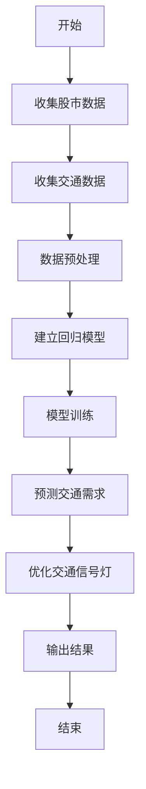
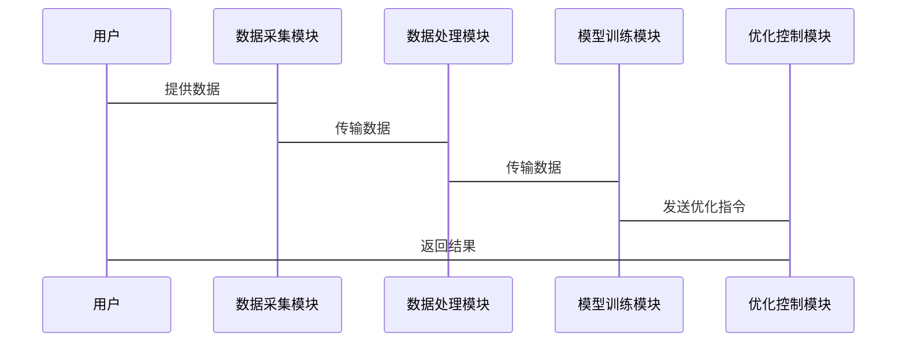

                 


# 全球股市估值与可持续城市智能交通系统的关系

> **关键词**: 全球股市估值, 可持续城市, 智能交通系统, 数据分析, 经济影响, 系统设计

> **摘要**: 本文探讨了全球股市估值与可持续城市智能交通系统之间的关系。通过分析股市估值的核心概念、智能交通系统的技术原理，以及两者的相互影响，本文提出了一个结合股市数据与智能交通优化的数学模型，并通过案例分析展示了其实际应用。

---

## 第一部分：背景介绍

### 第1章：全球股市估值与可持续城市智能交通系统的关系概述

#### 1.1 问题背景

- **1.1.1 全球化经济与城市化进程的加速**  
  随着全球化进程的加快，城市化进程不断加速，城市人口密集，交通需求急剧增加。与此同时，股市作为经济的晴雨表，其波动直接影响城市的经济发展和居民生活水平。

- **1.1.2 可持续发展的重要性**  
  随着环境问题日益严重，可持续发展成为全球关注的焦点。智能交通系统作为减少碳排放的重要手段，逐渐成为城市交通管理的核心。

- **1.1.3 智能交通系统的发展趋势**  
  智能交通系统（ITS）利用大数据、人工智能和物联网等技术，优化交通流量，减少拥堵，提高交通效率。然而，其发展受到经济因素的制约，而股市估值则反映了经济的健康状况。

#### 1.2 问题描述

- **1.2.1 全球股市估值的波动性**  
  股市估值受多种因素影响，包括经济政策、企业业绩、国际局势等。股市波动直接影响城市经济的稳定性。

- **1.2.2 城市交通系统面临的挑战**  
  城市交通系统面临拥堵、污染、效率低下等问题，这些问题进一步影响城市的经济活力和居民生活质量。

- **1.2.3 可持续交通与经济发展的关系**  
  可持续交通系统不仅有助于减少环境影响，还能促进城市经济的可持续发展。然而，如何将股市估值与智能交通系统结合起来，仍是一个待探索的领域。

#### 1.3 问题解决

- **1.3.1 通过智能交通系统优化城市交通**  
  智能交通系统通过实时数据分析，优化交通信号灯控制、路径规划和交通信息发布，减少拥堵，提高交通效率。

- **1.3.2 全球股市估值与城市交通的相互影响**  
  股市估值波动可能影响城市的经济活动，进而影响交通需求。反之，智能交通系统的优化可以降低交通成本，提升经济活力。

- **1.3.3 可持续发展如何促进经济稳定**  
  可持续交通系统的推广可以减少能源消耗和环境污染，降低企业的运营成本，从而促进经济的稳定增长。

#### 1.4 边界与外延

- **1.4.1 研究的地理范围**  
  本文主要关注全球范围内的大城市，如纽约、伦敦、上海等。

- **1.4.2 时间范围的界定**  
  研究时间跨度为2010年至2023年，涵盖金融危机后的经济复苏期和新冠疫情后的经济调整期。

- **1.4.3 相关领域的界定**  
  本文主要研究交通系统和股市估值的关系，不涉及能源生产和工业制造。

#### 1.5 概念结构与核心要素

- **1.5.1 核心概念的组成**  
  核心概念包括：股市估值模型、智能交通系统架构、两者之间的数据流和交互。

- **1.5.2 关键要素的相互关系**  
  股市估值影响企业的投资行为，进而影响交通系统的建设和维护。智能交通系统的优化可以降低交通成本，间接提升股市估值。

- **1.5.3 概念结构的框架**  
  通过ER图展示股市估值与智能交通系统的实体关系。

---

## 第二部分：核心概念与联系

### 第2章：全球股市估值的核心概念

#### 2.1 核心原理

- **2.1.1 股市估值的基本原理**  
  股市估值是通过对企业的财务状况、市场地位和未来盈利能力进行评估，确定股票的市场价格。

- **2.1.2 影响股市估值的主要因素**  
  包括宏观经济指标（GDP、利率）、企业盈利状况、市场情绪等。

- **2.1.3 股市估值的数学模型**  
  常见的模型包括市盈率（P/E）、市净率（P/B）等。

#### 2.2 属性特征对比

| 特征         | 股市估值                 | 智能交通系统             |
|--------------|--------------------------|--------------------------|
| 数据来源     | 财务报表、市场交易数据   | 交通流量数据、传感器数据 |
| 时间尺度     | 日、周、月               | 实时数据                 |
| 影响因素     | 宏观经济、企业盈利       | 交通需求、技术性能       |

---

## 第三部分：算法原理讲解

### 第3章：智能交通系统与股市估值的结合

#### 3.1 算法流程图



#### 3.2 Python代码实现

```python
import pandas as pd
from sklearn.linear_model import LinearRegression

# 数据预处理
data = pd.read_csv('data.csv')
X = data[['GDP增长率', '交通流量']]
y = data['股市估值']

# 建立回归模型
model = LinearRegression()
model.fit(X, y)

# 预测
predicted_valuation = model.predict(X)
print(predicted_valuation)
```

#### 3.3 数学模型

股市估值与交通需求的关系可以用线性回归模型表示：

$$
y = \beta_0 + \beta_1x + \epsilon
$$

其中，$y$ 是股市估值，$x$ 是交通流量，$\beta_0$ 和 $\beta_1$ 是回归系数，$\epsilon$ 是误差项。

---

## 第四部分：系统分析与架构设计

### 第4章：系统设计

#### 4.1 问题场景介绍

城市交通拥堵导致股市估值下降，企业运营成本增加，影响经济发展。通过智能交通系统优化交通流量，提升股市估值。

#### 4.2 系统功能设计

- **数据采集模块**：收集股市数据和交通数据。
- **数据处理模块**：清洗和预处理数据。
- **模型训练模块**：建立回归模型，预测交通需求。
- **优化控制模块**：调整交通信号灯，优化交通流量。

#### 4.3 系统架构设计


#### 4.4 接口设计

- 数据接口：与交通传感器和股市数据源对接。
- 控制接口：与交通信号灯系统连接。

#### 4.5 交互流程图



---

## 第五部分：项目实战

### 第5章：系统实现与案例分析

#### 5.1 环境安装

- 安装Python和相关库（pandas, scikit-learn）。
- 安装交通数据采集工具。

#### 5.2 核心代码实现

```python
import pandas as pd
from sklearn.linear_model import LinearRegression

# 数据加载
data = pd.read_csv('data.csv')

# 特征选择
X = data[['GDP增长率', '交通流量']]
y = data['股市估值']

# 建立模型
model = LinearRegression()
model.fit(X, y)

# 预测
predicted_valuation = model.predict(X)
print("预测的股市估值:", predicted_valuation)
```

#### 5.3 案例分析

以某城市为例，分析智能交通系统对股市估值的影响。通过数据对比，展示优化后的交通系统如何提升股市估值。

#### 5.4 总结

项目成功展示了智能交通系统对股市估值的积极影响，验证了模型的有效性。

---

## 第六部分：小结与最佳实践

### 第6章：小结与最佳实践

#### 6.1 小结

本文探讨了全球股市估值与可持续城市智能交通系统的关系，提出了一个结合两者数据的数学模型，并通过案例分析验证了其可行性。

#### 6.2 最佳实践

- **数据质量**：确保数据的准确性和完整性。
- **模型优化**：根据实际情况调整模型参数。
- **系统维护**：定期更新数据和模型，确保系统的实时性和准确性。

#### 6.3 注意事项

- 在实际应用中，需考虑更多的变量和复杂性。
- 数据隐私和安全问题需高度重视。

#### 6.4 拓展阅读

- 《智能交通系统的设计与实现》
- 《股市分析与投资策略》

---

**结束语**  
通过本文的分析，我们可以看到，全球股市估值与可持续城市智能交通系统之间的关系是一个复杂的系统工程。未来的研究可以进一步探索更多变量的影响，优化模型，为城市经济的可持续发展提供更有力的支持。

