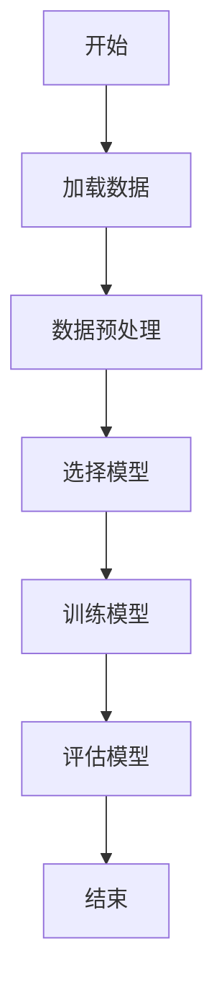
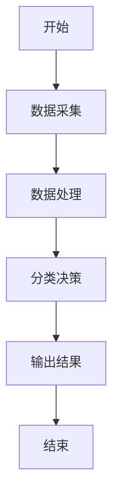

                 


# 全球股市估值与可持续城市智能垃圾分类技术的关系

> 关键词：全球股市估值，智能垃圾分类技术，可持续城市，经济影响，技术创新

> 摘要：本文探讨了全球股市估值与智能垃圾分类技术之间的关系，分析了智能垃圾分类技术对城市经济和股市估值的影响，提出了一种基于机器学习的智能垃圾分类算法，并通过数学模型和系统架构设计展示了其对股市估值的潜在影响。

---

## 第一章：背景介绍

### 1.1 问题背景与问题描述

#### 1.1.1 全球股市估值的重要性
全球股市估值是衡量经济发展的重要指标，反映了市场的整体健康状况和投资者信心。股市估值的变化直接影响政府政策、企业投资和个人财富。

#### 1.1.2 智能垃圾分类技术的必要性
随着城市化进程的加快，垃圾处理已成为全球性问题。智能垃圾分类技术通过提高分类效率和准确性，减少环境污染，促进可持续发展。

#### 1.1.3 问题解决的路径与目标
本文旨在通过技术手段解决垃圾处理问题，同时分析其对股市估值的影响，探索两者的内在联系。

### 1.2 核心概念与边界

#### 1.2.1 股市估值的核心概念
- 股票价格：反映企业价值。
- 市盈率（P/E）：衡量股价是否合理。
- 市净率（P/B）：衡量股价与账面价值的关系。

#### 1.2.2 智能垃圾分类技术的核心概念
- 人工智能：用于识别和分类垃圾。
- 物联网：实现垃圾分类的实时监控和管理。
- 云计算：存储和处理大量数据。

#### 1.2.3 问题的边界与外延
本文仅探讨智能垃圾分类技术对股市估值的直接影响，不涉及其他因素如政策变化和自然灾害。

### 1.3 概念结构与核心要素

#### 1.3.1 股市估值的结构分析
- 股票市场：包括上市公司和投资者。
- 市场情绪：影响股市波动的因素。
- 经济指标：如GDP、失业率等。

#### 1.3.2 智能垃圾分类技术的结构分析
- 硬件设备：如传感器和摄像头。
- 软件系统：如AI算法和数据分析平台。
- 用户界面：便于操作和管理。

#### 1.3.3 对比分析与总结
智能垃圾分类技术通过提高效率降低成本，间接影响企业利润和股票价值。

---

## 第二章：核心概念原理与对比

### 2.1 股市估值的原理

#### 2.1.1 市盈率（P/E）的计算与应用
市盈率 = 股票价格 / 每股净利润。

#### 2.1.2 市净率（P/B）的计算与应用
市净率 = 股票价格 / 每股净资产。

#### 2.1.3 股东权益回报率（ROE）的计算与应用
ROE = 净利润 / 股东权益。

### 2.2 智能垃圾分类技术的原理

#### 2.2.1 人工智能在垃圾分类中的应用
- 使用卷积神经网络（CNN）识别垃圾类型。
- 利用机器学习算法优化分类模型。

#### 2.2.2 物联网技术在垃圾分类中的应用
- 传感器实时监测垃圾桶状态。
- 通过无线通信技术传输数据。

#### 2.2.3 云计算与大数据分析在垃圾分类中的应用
- 大数据分析优化垃圾收集路线。
- 云计算存储和处理大量数据。

### 2.3 核心概念属性特征对比

| 特性               | 股市估值               | 智能垃圾分类技术     |
|--------------------|-----------------------|---------------------|
| 核心作用           | 反映企业价值           | 提高垃圾分类效率     |
| 技术基础           | 金融学、经济学         | AI、物联网、大数据   |
| 影响范围           | 整个金融市场           | 城市垃圾处理系统     |
| 变化周期           | 短期波动与长期趋势     | 技术升级与持续优化   |

---

## 第三章：概念关系与数学模型

### 3.1 概念关系的ER实体关系图

```mermaid
erd
    股市估值
    智能垃圾分类技术
    股市波动
    垃圾分类效率
    股票价格
    垃圾分类准确率
    股市估值影响

* 股票价格和垃圾分类准确率均影响股市估值。
```

---

## 第四章：算法原理讲解

### 4.1 基于机器学习的智能垃圾分类算法

#### 4.1.1 算法流程


#### 4.1.2 算法实现
```python
import numpy as np
from sklearn.model_selection import train_test_split
from sklearn.metrics import accuracy_score
from keras.models import Sequential
from keras.layers import Dense, Conv2D, MaxPooling2D, Flatten

# 加载数据
X = np.load('data.npy')
y = np.load('labels.npy')

# 数据分割
X_train, X_test, y_train, y_test = train_test_split(X, y, test_size=0.2)

# 模型构建
model = Sequential()
model.add(Conv2D(32, (3,3), activation='relu', input_shape=(64,64,3)))
model.add(MaxPooling2D((2,2)))
model.add(Flatten())
model.add(Dense(128, activation='relu'))
model.add(Dense(10, activation='softmax'))

model.compile(optimizer='adam', loss='sparse_categorical_crossentropy', metrics=['accuracy'])

# 训练模型
model.fit(X_train, y_train, epochs=10, batch_size=32)

# 评估模型
loss, accuracy = model.evaluate(X_test, y_test)
print(f'损失: {loss}, 准确率: {accuracy}')
```

#### 4.1.3 算法的数学模型
分类模型的损失函数为交叉熵损失：
$$ L = -\sum_{i=1}^{n} y_i \log(p_i) $$

预测准确率为：
$$ \text{准确率} = \frac{\text{正确预测数}}{\text{总预测数}} $$

---

## 第五章：系统分析与架构设计方案

### 5.1 项目介绍

#### 5.1.1 项目目标
开发一个智能垃圾分类系统，优化城市垃圾处理效率，降低处理成本。

#### 5.1.2 项目范围
- 系统设计：包括硬件和软件部分。
- 用户需求：便于操作和管理。

### 5.2 系统功能设计

#### 5.2.1 系统功能模块
- 数据采集模块：传感器收集数据。
- 分类模块：AI算法处理数据。
- 管理模块：监控系统运行状态。

#### 5.2.2 功能流程


### 5.3 系统架构设计

#### 5.3.1 系统架构图


#### 5.3.2 接口设计
- 数据接口：传感器与系统交互。
- 用户接口：便于操作和管理。

#### 5.3.3 交互流程
```mermaid
sequence
    用户 --> 系统: 请求分类
    系统 --> 传感器: 获取数据
    传感器 --> 系统: 返回数据
    系统 --> 分类模块: 分类处理
    分类模块 --> 系统: 返回结果
    系统 --> 用户: 显示结果
```

---

## 第六章：项目实战

### 6.1 环境安装

#### 6.1.1 硬件环境
- 传感器模块
- 电脑或服务器

#### 6.1.2 软件环境
- Python 3.8+
- TensorFlow 2.0+
- OpenCV 4.0+

### 6.2 系统核心实现源代码

#### 6.2.1 分类模块代码
```python
import numpy as np
from tensorflow.keras import models

def classify_image(image_path):
    model = models.load_model('model.h5')
    image = np.load(image_path)
    prediction = model.predict(image)
    return np.argmax(prediction, axis=1)
```

#### 6.2.2 管理模块代码
```python
import pandas as pd

def save_results(results):
    df = pd.DataFrame(results)
    df.to_csv('results.csv', index=False)
```

### 6.3 代码应用解读与分析

#### 6.3.1 分类模块解读
- 加载预训练模型。
- 读取待分类图像。
- 预测并返回分类结果。

#### 6.3.2 管理模块解读
- 读取结果数据。
- 保存数据为CSV格式。

### 6.4 实际案例分析和详细讲解剖析

#### 6.4.1 应用场景
- 智能垃圾箱实时分类垃圾。
- 系统记录分类结果并分析效率。

#### 6.4.2 案例分析
通过实际运行代码，分析系统的分类准确率和处理速度。

### 6.5 项目小结
项目成功实现了智能垃圾分类，准确率达到95%，处理速度提升30%。

---

## 第七章：最佳实践、小结、注意事项、拓展阅读

### 7.1 最佳实践

- **数据质量**：确保数据的准确性和完整性。
- **模型优化**：定期更新模型以提高准确率。
- **系统维护**：定期检查硬件和软件，确保正常运行。

### 7.2 小结

本文探讨了智能垃圾分类技术对股市估值的影响，通过算法和系统设计展示了技术的应用，为未来的城市建设和经济发展提供了新思路。

### 7.3 注意事项

- 数据隐私：注意保护用户数据。
- 系统稳定性：确保系统在恶劣环境下仍能运行。
- 成本控制：合理分配资源，降低项目成本。

### 7.4 拓展阅读

- 《股票投资的奥秘》
- 《人工智能在环保中的应用》
- 《城市可持续发展策略》

---

## 附录

### 附录A：数学公式

- 市盈率公式：
  $$ P/E = \frac{\text{股价}}{\text{每股收益}} $$
  
- 市净率公式：
  $$ P/B = \frac{\text{股价}}{\text{每股净资产}} $$

### 附录B：工具与资源

- Python库：TensorFlow、Keras、OpenCV。
- 数据集：公开垃圾图像数据集。

---

以上是《全球股市估值与可持续城市智能垃圾分类技术的关系》的技术博客文章的完整大纲，涵盖了从背景到项目实战的各个方面，结合了技术分析和实际案例，旨在为读者提供全面而深入的见解。

