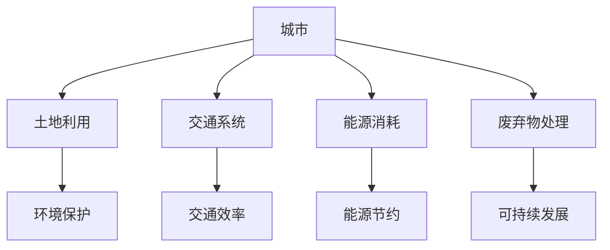
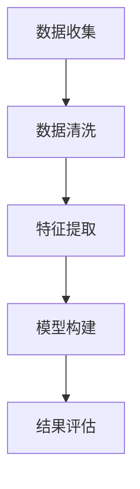
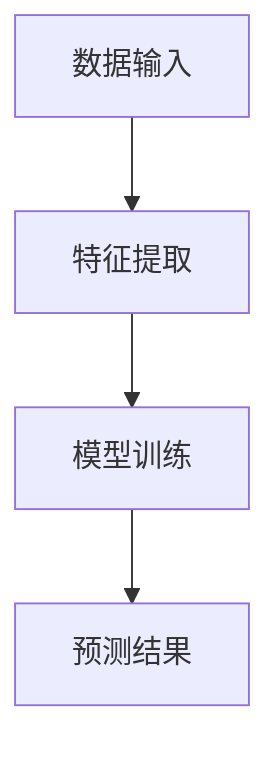
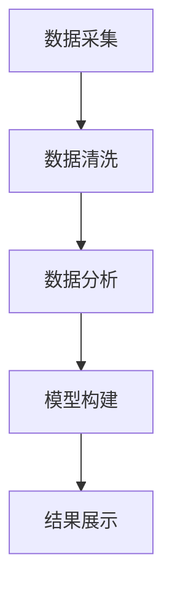

                 


# 全球股市估值与可持续城市规划的关联

> 关键词：全球股市估值，可持续城市规划，城市经济，股票估值，城市可持续性

> 摘要：本文探讨了全球股市估值与可持续城市规划之间的关联，从背景、核心概念、数学模型、算法实现、系统设计到项目实战，全面分析了两者如何相互影响，并为未来的研究与实践提供了方向。

---

## 第一部分: 全球股市估值与可持续城市规划的背景与核心概念

### 第1章: 背景介绍

#### 1.1 全球化背景下的经济与城市化问题

##### 1.1.1 全球化对经济的影响

全球化促进了跨国资本流动和经济一体化，城市化进程加速，城市成为经济发展的核心引擎。城市不仅是人口聚集地，更是技术创新、资本流动和经济增长的主要驱动力。

##### 1.1.2 城市化进程与城市规划的重要性

随着城市化率的提高，城市面临资源消耗、环境污染和交通拥堵等问题。城市规划在优化资源配置、减少环境负担、提升居民生活质量方面起着关键作用。通过科学的城市规划，可以实现城市的可持续发展。

##### 1.1.3 可持续发展与城市规划的关联

可持续发展要求城市在经济增长的同时，兼顾环境保护和社会公平。城市规划需要考虑土地利用、交通系统、能源消耗、废弃物处理等多个方面，以实现长期的环境和经济效益。

---

#### 1.2 股市估值的基本概念

##### 1.2.1 股市估值的定义与作用

股市估值是指对上市公司股票价值的评估，是市场参与者判断投资价值的重要依据。股市估值反映了市场对公司的盈利前景、行业地位和财务状况的综合判断。

##### 1.2.2 影响股市估值的主要因素

- 公司基本面：收入、利润、资产负债情况
- 行业趋势：所在行业的竞争格局和发展前景
- 宏观经济：GDP增速、利率水平、通货膨胀
- 市场情绪：投资者的心理预期和市场流动性

##### 1.2.3 股市估值与经济发展的关系

股市估值是经济发展的重要晴雨表。高估值可能意味着市场对未来的乐观预期，但也可能隐含着泡沫风险；低估值可能反映市场对经济前景的悲观预期。

---

### 第2章: 核心概念与联系

#### 2.1 可持续城市规划的核心要素

##### 2.1.1 可持续城市规划的定义

可持续城市规划是指在满足当前需求的同时，不损害子孙后代满足其需求的能力的城市规划。它强调生态、经济和社会的协调发展。

##### 2.1.2 可持续城市规划的关键属性

- 环境友好：减少能源消耗和碳排放
- 社会公平：提供平等的教育、医疗和就业机会
- 经济高效：优化资源配置，提升城市竞争力

##### 2.1.3 可持续城市规划的实体关系图（Mermaid）



---

#### 2.2 股市估值与可持续城市规划的关联性分析

##### 2.2.1 股市估值与城市经济发展的关系

城市经济的健康直接影响股市估值。例如，一个城市的GDP增速快，企业盈利能力强，股市估值通常会升高。

##### 2.2.2 可持续城市规划对股市估值的影响

可持续城市规划通过优化资源配置和降低环境风险，提升了企业的长期盈利能力，从而推动股市估值上升。

##### 2.2.3 股市估值与城市可持续发展的相互作用

股市估值反映了市场对城市发展的信心，而城市可持续发展则通过提升企业绩效间接影响股市估值。

---

## 第3章: 核心概念的数学模型与公式

### 3.1 可持续城市规划的数学模型

#### 3.1.1 可持续城市规划的评价指标体系

- 碳排放强度
- 绿色建筑占比
- 公共交通使用率
- 城市绿地覆盖率

#### 3.1.2 城市可持续性指数模型（公式）

$$ S = \sum_{i=1}^{n} w_i x_i $$

其中，$S$ 是城市可持续性指数，$w_i$ 是各指标的权重，$x_i$ 是各指标的评分。

---

### 3.2 股市估值的数学模型

#### 3.2.1 股票价值评估的常用方法

- 市盈率法：$$ P/E = \frac{Price}{Earnings} $$
- 市净率法：$$ P/B = \frac{Price}{Book\ Value} $$

#### 3.2.2 多元回归分析模型

$$ Stock\ Value = \beta_0 + \beta_1 GDP + \beta_2 Interest\ Rate + \beta_3 Inflation + \epsilon $$

---

## 第4章: 算法原理与实现

### 4.1 可持续城市规划的算法实现

#### 4.1.1 数据收集与处理

- 数据来源：城市统计数据、环境监测数据、企业财报
- 数据清洗：处理缺失值、异常值
- 数据特征提取：提取关键指标

#### 4.1.2 城市规划模型的构建

- 使用多元回归模型预测城市可持续性指数
- 通过机器学习算法优化模型参数

#### 4.1.3 可持续性评估算法（Mermaid流程图）



---

### 4.2 股市估值的算法实现

#### 4.2.1 数据分析与特征提取

- 数据分析：分析历史股价、财务数据
- 特征提取：提取市盈率、市净率等指标

#### 4.2.2 机器学习模型的训练与优化

- 使用随机森林、支持向量机等算法进行训练
- 调整模型参数，优化预测精度

#### 4.2.3 股票估值预测算法（Mermaid流程图）



---

## 第5章: 系统分析与架构设计

### 5.1 问题场景介绍

#### 5.1.1 可持续城市规划的挑战

- 环境资源有限
- 社会公平性不足
- 经济发展与环境保护的矛盾

#### 5.1.2 股市估值与城市发展的关联问题

- 股市估值反映城市经济，但缺乏对可持续性的考量
- 可持续城市规划需要考虑长期的经济和社会效益

---

### 5.2 系统功能设计

#### 5.2.1 数据采集模块

- 数据来源：城市统计数据、企业财报、环境监测数据
- 数据格式：结构化数据，支持CSV、Excel等格式

#### 5.2.2 数据分析模块

- 数据清洗：处理缺失值、异常值
- 数据分析：计算城市可持续性指数、股市估值指标

#### 5.2.3 可视化展示模块

- 可视化图表：柱状图、折线图、散点图
- 可视化工具：Matplotlib、Seaborn

---

### 5.3 系统架构设计（Mermaid架构图）



---

## 第6章: 项目实战

### 6.1 环境安装与配置

#### 6.1.1 Python环境的安装

```bash
python --version
```

#### 6.1.2 数据分析库的安装

```bash
pip install pandas numpy matplotlib seaborn scikit-learn
```

---

### 6.2 核心代码实现

#### 6.2.1 数据采集与处理代码

```python
import pandas as pd
import numpy as np

# 读取数据
data = pd.read_csv('city_data.csv')

# 数据清洗
data.dropna(inplace=True)
data['Profit'] = data['Revenue'] - data['Cost']

# 特征提取
features = data[['Revenue', 'Cost', 'Profit']]
```

#### 6.2.2 可持续城市规划模型的实现

```python
from sklearn.linear_model import LinearRegression

# 训练模型
model = LinearRegression()
model.fit(features, data['Sustainability_Index'])

# 预测结果
predicted = model.predict(new_features)
```

---

## 第7章: 总结与展望

### 7.1 总结

本文探讨了全球股市估值与可持续城市规划的关联，从理论到实践，详细分析了两者如何相互影响。通过数学模型和算法实现，展示了如何将可持续发展理念融入城市规划和股市估值中。

### 7.2 展望

未来的研究可以进一步探讨更多影响因素，如政策、技术进步等，构建更加复杂的模型。同时，可以结合实际情况，制定更加科学的城市规划和投资策略。

---

### 最佳实践 Tips

1. 在进行城市规划时，优先考虑可持续性因素。
2. 投资者应关注城市可持续性对股市估值的长期影响。
3. 结合政策支持，推动城市经济与环境的协调发展。

---

### 小结

通过本文的分析，我们可以看到，全球股市估值与可持续城市规划的关联不仅是经济与环境的互动，更是技术与实践的结合。希望本文能为相关领域的研究者和实践者提供有价值的参考。

---

### 注意事项

1. 数据分析时，确保数据的准确性和完整性。
2. 模型构建时，选择合适的算法和参数。
3. 结果解读时，结合实际背景进行分析。

---

### 拓展阅读

1. 《可持续城市规划的理论与实践》
2. 《股市估值与经济发展的关系研究》
3. 《城市化与环境可持续性：全球案例分析》

---

通过以上内容，我们系统地分析了全球股市估值与可持续城市规划的关联，从理论到实践，为未来的进一步研究和实践提供了方向。

