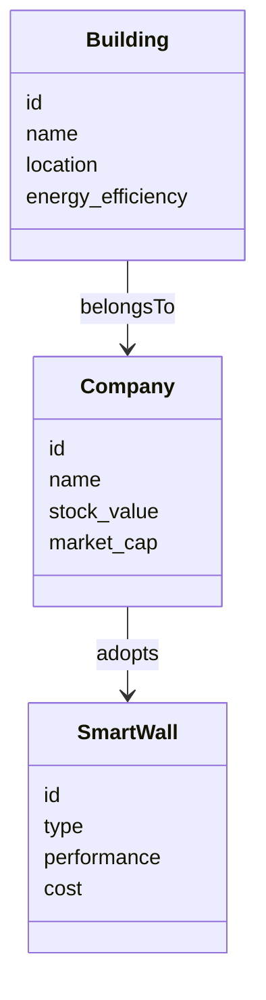
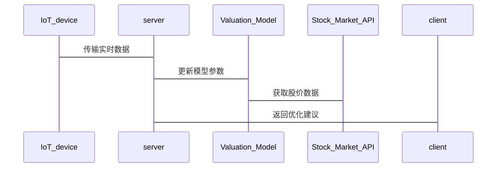

                 


# 全球股市估值与可持续建筑智能外墙技术的关系

> 关键词：全球股市估值、可持续建筑、智能外墙技术、技术关联、数据建模

> 摘要：本文探讨了全球股市估值与可持续建筑智能外墙技术之间的潜在联系。通过分析股市估值的核心原理、智能外墙技术的基本概念以及两者的关系，结合数据建模与算法分析，展示了如何利用智能外墙技术的数据优化股市估值模型，进而为投资决策提供新视角。文章还通过实际案例分析和系统架构设计，进一步阐述了这一技术关联的可行性和应用前景。

---

## 第一部分: 全球股市估值与可持续建筑智能外墙技术的背景与概念

### 第1章: 背景介绍

#### 1.1 全球股市估值的背景与现状

##### 1.1.1 股市估值的基本概念
股市估值是通过分析公司的财务状况、市场地位、行业前景等因素，对其股票价格进行合理评估的过程。常用的估值方法包括市盈率（P/E）、市净率（P/B）等。

##### 1.1.2 全球股市估值的现状与趋势
随着全球经济一体化，股市估值受到宏观经济、行业动态和企业绩效等多种因素的影响。近年来，技术进步和数据驱动的方法逐渐成为股市估值的重要工具。

##### 1.1.3 股市估值的核心要素与影响因素
- 财务数据：收入、利润、负债等。
- 行业环境：竞争格局、政策法规。
- 宏观经济：GDP增长率、利率、通货膨胀等。
- 市场情绪：投资者心理、市场流动性。

#### 1.2 可持续建筑智能外墙技术的背景与现状

##### 1.2.1 智能外墙技术的基本概念
智能外墙技术是指通过传感器、物联网（IoT）、人工智能（AI）等技术，实时监测和调节建筑外墙的热性能、能耗等参数，以提高建筑能效和舒适度的技术。

##### 1.2.2 可持续建筑的定义与目标
可持续建筑强调在全生命周期内减少能源消耗和环境影响，同时提供健康、舒适的生活和工作环境。

##### 1.2.3 智能外墙技术在建筑中的应用现状
智能外墙技术广泛应用于绿色建筑、节能建筑等领域，通过实时数据采集和分析，优化建筑能耗管理。

#### 1.3 两者的关联性与研究意义

##### 1.3.1 股市估值与智能外墙技术的潜在联系
智能外墙技术的应用可能影响建筑企业的运营成本和市场竞争力，从而影响其股票估值。

##### 1.3.2 研究这一关系的现实意义与价值
通过分析智能外墙技术对建筑企业的影响，投资者可以更准确地评估企业的长期发展潜力，从而优化投资决策。

---

### 第2章: 核心概念与联系

#### 2.1 核心概念原理

##### 2.1.1 股市估值的核心原理
股市估值通过分析企业的基本面和技术面，预测其股票的合理价格区间。

##### 2.1.2 智能外墙技术的核心原理
智能外墙技术通过实时数据采集和分析，优化建筑的能耗和性能。

##### 2.1.3 两者关系的理论基础
智能外墙技术的广泛应用可能影响建筑企业的财务表现，进而影响其股市估值。

#### 2.2 核心概念属性对比

| 属性       | 股市估值                   | 智能外墙技术               |
|------------|---------------------------|---------------------------|
| 核心目标   | 评估企业价值               | 优化建筑性能和能效         |
| 数据来源   | 财务报表、市场数据         | 物联网传感器、实时数据     |
| 应用场景   | 投资决策、风险管理         | 建筑设计、运营优化         |
| 技术基础   | 金融模型、大数据分析       | 物联网、人工智能           |

#### 2.3 ER实体关系图

```mermaid
erDiagram
    company {
        id
        name
        stock_value
        market_cap
    }
    smart_wall {
        id
        type
        performance
        cost
    }
    building {
        id
        name
        location
        energy_efficiency
    }
    company --> smart_wall: 采用
    company --> building: 所属
    smart_wall --> building: 安装
```

---

## 第三部分: 技术原理与算法分析

### 第3章: 数据采集与处理

#### 3.1 数据采集方法

##### 3.1.1 股市数据的采集
通过API接口获取历史股价、财务数据等。

##### 3.1.2 建筑数据的采集
使用传感器采集外墙温度、湿度、能耗等实时数据。

##### 3.1.3 数据清洗与预处理
去除异常值、填补缺失值、标准化数据。

#### 3.2 数据分析与建模

##### 3.2.1 数据分析方法
使用回归分析、时间序列分析等方法。

##### 3.2.2 数据建模的数学基础
回归模型：$y = \beta_0 + \beta_1x + \epsilon$
时间序列模型：ARIMA

##### 3.2.3 模型的选择与优化
通过交叉验证选择最优模型。

---

### 第4章: 算法原理与实现

#### 4.1 算法原理

##### 4.1.1 股市估值算法
使用机器学习算法预测股票价格。

##### 4.1.2 智能外墙技术数据处理
通过传感器数据优化建筑能耗模型。

#### 4.2 算法实现

##### 4.2.1 股市估值算法实现

```python
import pandas as pd
from sklearn.linear_model import LinearRegression

# 数据加载与预处理
data = pd.read_csv('stock_data.csv')
data['date'] = pd.to_datetime(data['date'])
data.set_index('date', inplace=True)

# 特征工程
features = data[['revenue', 'profit', 'market_cap']]
target = data['stock_price']

# 模型训练
model = LinearRegression()
model.fit(features, target)

# 预测与评估
predictions = model.predict(features)
print(model.score(features, target))
```

##### 4.2.2 智能外墙技术数据处理

```python
import pandas as pd
import numpy as np

# 数据加载与预处理
data = pd.read_csv('building_data.csv')
data['timestamp'] = pd.to_datetime(data['timestamp'])
data.set_index('timestamp', inplace=True)

# 特征工程
features = data[['temperature', 'humidity', 'energy_usage']]
target = data['performance']

# 模型训练
from sklearn.ensemble import RandomForestRegressor
model = RandomForestRegressor()
model.fit(features, target)

# 预测与评估
predictions = model.predict(features)
print(model.score(features, target))
```

---

## 第四部分: 系统分析与架构设计

### 第4章: 系统架构设计

#### 4.1 问题场景介绍
通过智能外墙技术优化建筑能耗，降低运营成本，提升企业竞争力，从而影响股市估值。

#### 4.2 项目介绍
设计一个智能外墙技术数据平台，采集、分析并优化建筑能耗，同时与股市估值模型结合，提供数据支持。

#### 4.3 系统功能设计

##### 4.3.1 领域模型设计



##### 4.3.2 系统架构设计


##### 4.3.3 系统接口设计
API接口用于数据传输和模型调用。

##### 4.3.4 系统交互设计



---

## 第五部分: 项目实战

### 第5章: 项目实战

#### 5.1 环境安装

##### 5.1.1 安装Python环境
安装Python 3.8及以上版本，安装必要的库（如pandas、scikit-learn）。

##### 5.1.2 数据集准备
获取建筑数据和股市数据，格式为CSV。

#### 5.2 核心实现

##### 5.2.1 数据处理

```python
import pandas as pd
import numpy as np

data = pd.read_csv('building_data.csv')
data['timestamp'] = pd.to_datetime(data['timestamp'])
data.set_index('timestamp', inplace=True)

features = data[['temperature', 'humidity', 'energy_usage']]
target = data['performance']
```

##### 5.2.2 模型实现

```python
from sklearn.ensemble import RandomForestRegressor
model = RandomForestRegressor()
model.fit(features, target)
```

##### 5.2.3 结果分析

```python
importances = model.feature_importances_
print(importances)
```

---

## 第六部分: 最佳实践与总结

### 第6章: 最佳实践 tips

#### 6.1 小结
通过智能外墙技术优化建筑能耗，可以降低企业运营成本，提升市场竞争力，进而影响股市估值。

#### 6.2 注意事项
数据质量和模型选择对结果影响重大，需谨慎处理。

#### 6.3 拓展阅读
建议阅读相关领域的最新研究，如绿色建筑技术、智能建筑系统等。

---

通过以上分析，我们展示了如何将智能外墙技术与股市估值相结合，为投资决策提供新的视角和工具。未来，随着技术的进一步发展，这种关联性将更加紧密，为建筑企业和投资者创造更大的价值。

